# MBA FIAP Inteligência Artificial & Machine Learning

## Visão Computacional: Análise de Imagens Médicas

## 1. Introdução

As tecnologias de imagens médicas estão cada vez mais integradas aos sitemas de visão computacional, incluindo as imagens de raio-x.

Modelos de equipamentos modernos geram imagens digitais deste tipo de exame, proporcionando análises mais completas e menos _ad-hoc_, com isso algumas pré-análises podem ser realizadas por aplicações baseadas em inteligência artificial para confirmar ou sugerir diagnósticos ao profissional responsável pelo exame.

No campo dos diagósticos por raios-x, a pnenumonia é uma das enfermidades onde seu uso é um dos mais aplicados para determinar o curso de tratamento.

<p align="center">
    
</p>

## 2. Instruções

Este projeto final tem como objetivo explorar os conhecimentos adquiridos nas aulas práticas.

Por meio de uma trilha guiada, iremos constuir um modelo que seja capaz de classificar imagens de raio-x para determinar se a determinada pessoa está com alguma condição que necessita maiores cuidados.

De acordo com as imagens disponíveis para o treinamento e validação, será de critério do grupo selecionar as quantidades ideais ou até mesmo pré-processar as imagens para obter o melhor resultado, nos principais indicadores de performance, como precisão, sensibilidade e pontuação F1.

Este projeto poderá ser feita por grupos de até 4 pessoas.
Caso este projeto seja substitutivo, deverá ser realizado por apenas uma pessoa.

| Nome dos Integrantes     | RM            | Turma |
| :----------------------- | :------------ | :---: |
| Paulo Sérgio M. Gabriel  | RM 334096     | `8IA` |
| Rubens Cabral da Rocha   | RM 333208     | `8IA` |
| Giordano R. Todeschini   | RM 334808     | `8IA` |
| Walter F. Pita Filho     | RM 334944     | `8IA` |

Por ser um projeto guiado, fique atento quando houver as marcações **Implementação** indica que é necessário realizar alguma implementação em Python no bloco a seguir onde há a inscrição ```##IMPLEMENTAR``` e **Resposta** indica que é esperado uma resposta objetiva relacionado a algum questionamento. 

**Cada grupo pode utilizar nas respostas objetivas quaisquer itens necessários que enriqueçam seu ponto vista, como gráficos, fotos e, até mesmo, trechos de código-fonte.**

Pode-se utilizar quantos blocos forem necessários para realizar determinadas implementações ou utilizá-las para justificar as respostas. Não é obrigatório utilizar somente o bloco indicado.

Ao final não se esqueça de subir os arquivos do projeto nas contas do GitHub de cada membro, ou subir na do representante do grupo e os membros realizarem o fork do projeto.

A avaliação terá mais ênfase nos seguintes tópicos de desenvolvimento do projeto:
 
1. __Pré-Processamento__
2. __Classificação__
3. __Performance__
4. __Conclusões Finais__

## 3.1 Detalhe do problema: a pneunomia

Fonte: [artigo](https://drauziovarella.uol.com.br/doencas-e-sintomas/pneumonia) do Dr. Drauzio Varella.

Pneumonias são infecções que se instalam nos pulmões, órgãos duplos localizados um de cada lado da caixa torácica. Podem acometer a região dos alvéolos pulmonares onde desembocam as ramificações terminais dos brônquios e, às vezes, os interstícios (espaço entre um alvéolo e outro).

Basicamente, pneumonia é provocada pela penetração de um agente infeccioso ou irritante (bactérias, vírus, fungos e por reações alérgicas) no espaço alveolar, onde ocorre a troca gasosa. Esse local deve estar sempre muito limpo, livre de substâncias que possam impedir o contato do ar com o sangue.

Exame clínico, auscultação dos pulmões e radiografias de tórax são recursos essenciais para o diagnóstico de pneumonia.

<p align="center">
    
</p>

## 3.2 Diagnóstico por raio-x

O exame de raio-x traz diferenças em cada tipo de diagnóstico, sendo considerado os seguintes grupos de análise: **normal** (ou controle) onde não há nenhuma condição de infeção, **bacterial pneumonia** (pneumonia bacteriana) que representa a condição de infecção bacteriana e **viral pneumonia** que indica a condição de infecção vira. 

<p align="center">

</p>

As imagens de controle não são mais brancas ao centro que é onde fica o coração. Já nas imagens com pneumonia é possível notar regiões brancas ao redor dos pulmões, que é como o exame identifica as secreções responsáveis pela infeçcão.

Quando mais regiões brancas ao redor do pulmão mais severa é a inflamação e menos se observa dos detalhes dos pulmões, ficando um pouco esmaecido diante desta condição.

## 4.1 Problema

Construir um classificador utilizando _transfer learning_ para identificar as seguintes classes: **controle**, **pneumonia bacteriana** e **pneumonia viral**.

Para construir este classificador, utilize o dataset do [Kaggle Chest Ray Pneumonia](https://www.kaggle.com/paultimothymooney/chest-xray-pneumonia) e organize os dados de forma a separar em cada uma das classes que já estão definidas no diretório ```raiox```, sendo ```controle``` para as imagens normais (sem inflamação), ```bacteria``` para as imagens de pneumonia bacteriana e ```viral``` para as imagens de pneumonia viral.

Determine a quantidade de imagens a serem treinadas e validadas. Utiliza pelo menos, 100 imagens para cada classe.

Compare os resultados com pelo menos 3 classificadores, obtendo os valores de **precisão (precision)**, **sensibilidade (recall)** e **pontuação F1 (F1 Score)**. No guia abaixo, foi indicado os seguintes modelos: ResNet50, VGG16 e VGG19. 

>Importante: a escolha do número de imagens devem ser o suficiente para alcançar o valor de **precisão** mínima de 70%.

A construção do modelo será utilizada o framework Keras.

**Pergunta**: Qual o número de imagens que foram selecionadas para cada classe?

**Resposta**: 1583 de controle (normal, ou seja, sem pneumonia), 1493 de pneumonia viral e 2780 de pneumonia bacteriana.
#Observação: fizemos outras tentativas com menos imagens, porém o resultado não foi satisfatório, por isso então fomos au-
#mentando até chegar nesta quantidade e obtermos mais de 70% de precisão.

## 4.2 Componentes obrigatórios

Este projeto requer a instalação dos seguintes componentes, via ```conda install```:

* Keras
* Tensorflow
* Pillow
* Matplotlib


```python
import os

import numpy as np
import matplotlib.pyplot as plt
from PIL import Image

%matplotlib inline

import keras
from keras.preprocessing.image import ImageDataGenerator
from keras.applications import ResNet50
from keras.applications import VGG16, VGG19
from keras.applications import Xception
from keras.applications.xception import preprocess_input
from keras.applications.resnet50 import preprocess_input
from keras.applications.vgg16 import preprocess_input
from keras import Model, layers
from keras.models import load_model, model_from_json

import keras.backend as K
```

    Using TensorFlow backend.
    C:\Users\Infotecno\anaconda3\lib\site-packages\tensorflow\python\framework\dtypes.py:516: FutureWarning: Passing (type, 1) or '1type' as a synonym of type is deprecated; in a future version of numpy, it will be understood as (type, (1,)) / '(1,)type'.
      _np_qint8 = np.dtype([("qint8", np.int8, 1)])
    C:\Users\Infotecno\anaconda3\lib\site-packages\tensorflow\python\framework\dtypes.py:517: FutureWarning: Passing (type, 1) or '1type' as a synonym of type is deprecated; in a future version of numpy, it will be understood as (type, (1,)) / '(1,)type'.
      _np_quint8 = np.dtype([("quint8", np.uint8, 1)])
    C:\Users\Infotecno\anaconda3\lib\site-packages\tensorflow\python\framework\dtypes.py:518: FutureWarning: Passing (type, 1) or '1type' as a synonym of type is deprecated; in a future version of numpy, it will be understood as (type, (1,)) / '(1,)type'.
      _np_qint16 = np.dtype([("qint16", np.int16, 1)])
    C:\Users\Infotecno\anaconda3\lib\site-packages\tensorflow\python\framework\dtypes.py:519: FutureWarning: Passing (type, 1) or '1type' as a synonym of type is deprecated; in a future version of numpy, it will be understood as (type, (1,)) / '(1,)type'.
      _np_quint16 = np.dtype([("quint16", np.uint16, 1)])
    C:\Users\Infotecno\anaconda3\lib\site-packages\tensorflow\python\framework\dtypes.py:520: FutureWarning: Passing (type, 1) or '1type' as a synonym of type is deprecated; in a future version of numpy, it will be understood as (type, (1,)) / '(1,)type'.
      _np_qint32 = np.dtype([("qint32", np.int32, 1)])
    C:\Users\Infotecno\anaconda3\lib\site-packages\tensorflow\python\framework\dtypes.py:525: FutureWarning: Passing (type, 1) or '1type' as a synonym of type is deprecated; in a future version of numpy, it will be understood as (type, (1,)) / '(1,)type'.
      np_resource = np.dtype([("resource", np.ubyte, 1)])
    C:\Users\Infotecno\anaconda3\lib\site-packages\tensorboard\compat\tensorflow_stub\dtypes.py:541: FutureWarning: Passing (type, 1) or '1type' as a synonym of type is deprecated; in a future version of numpy, it will be understood as (type, (1,)) / '(1,)type'.
      _np_qint8 = np.dtype([("qint8", np.int8, 1)])
    C:\Users\Infotecno\anaconda3\lib\site-packages\tensorboard\compat\tensorflow_stub\dtypes.py:542: FutureWarning: Passing (type, 1) or '1type' as a synonym of type is deprecated; in a future version of numpy, it will be understood as (type, (1,)) / '(1,)type'.
      _np_quint8 = np.dtype([("quint8", np.uint8, 1)])
    C:\Users\Infotecno\anaconda3\lib\site-packages\tensorboard\compat\tensorflow_stub\dtypes.py:543: FutureWarning: Passing (type, 1) or '1type' as a synonym of type is deprecated; in a future version of numpy, it will be understood as (type, (1,)) / '(1,)type'.
      _np_qint16 = np.dtype([("qint16", np.int16, 1)])
    C:\Users\Infotecno\anaconda3\lib\site-packages\tensorboard\compat\tensorflow_stub\dtypes.py:544: FutureWarning: Passing (type, 1) or '1type' as a synonym of type is deprecated; in a future version of numpy, it will be understood as (type, (1,)) / '(1,)type'.
      _np_quint16 = np.dtype([("quint16", np.uint16, 1)])
    C:\Users\Infotecno\anaconda3\lib\site-packages\tensorboard\compat\tensorflow_stub\dtypes.py:545: FutureWarning: Passing (type, 1) or '1type' as a synonym of type is deprecated; in a future version of numpy, it will be understood as (type, (1,)) / '(1,)type'.
      _np_qint32 = np.dtype([("qint32", np.int32, 1)])
    C:\Users\Infotecno\anaconda3\lib\site-packages\tensorboard\compat\tensorflow_stub\dtypes.py:550: FutureWarning: Passing (type, 1) or '1type' as a synonym of type is deprecated; in a future version of numpy, it will be understood as (type, (1,)) / '(1,)type'.
      np_resource = np.dtype([("resource", np.ubyte, 1)])
    

## 4.3 Carregando imagens de treinamento e validação

Selecione a melhor divisão entre dados de treinamento e validação. O número deverá ser representado em número fracionário, 5% equivale a 0.05, por exemplo.


```python
## IMPLEMENTE
divisao_treino_validacao = 0.30
```


```python
train_datagen = ImageDataGenerator(validation_split=divisao_treino_validacao)

train_generator = train_datagen.flow_from_directory(
    "raiox/",
    batch_size=32,
    class_mode="categorical",
    color_mode="rgb",
    target_size=(224,224),
    subset="training")
```

    Found 4101 images belonging to 3 classes.
    


```python
val_generator = train_datagen.flow_from_directory(
    "raiox/",
    batch_size=32,
    class_mode="categorical",
    color_mode="rgb",
    target_size=(224,224),
    subset="validation")
```

    Found 1755 images belonging to 3 classes.
    


```python
train_generator.class_indices, val_generator.class_indices
```


    ({'bacteria': 0, 'controle': 1, 'viral': 2},
     {'bacteria': 0, 'controle': 1, 'viral': 2})


## 4.4 Modelos de transfer learning

O Keras já possui classes especializadas para os seguintes modelos de deep-learning treinados com o conjunto de dados [ImageNet](http://www.image-net.org/):
  
* Xception
* VGG16
* VGG19
* ResNet50
* InceptionV3
* InceptionResNetV2
* MobileNet
* DenseNet
* NASNet
* MobileNetV2

Mais detalhes, veja na [documentação do Keras](https://keras.io/applications/).

Para este estudo, vamos utilizar para avaliação as seguintes arquiteturas: RestNet50, VGG15 e VGG19.

## 4.5 Indicadores de desempenho

O Keras não possui os indicadores de desempenho como precisão, sensibilidade e pontuação f1 por padrão, portanto precisamos implementar externamente.


```python
def recall_score(y_true, y_pred):
    true_positives = K.sum(K.round(K.clip(y_true * y_pred, 0, 1)))
    possible_positives = K.sum(K.round(K.clip(y_true, 0, 1)))
    recall = true_positives / (possible_positives + K.epsilon())
    return recall

def precision_score(y_true, y_pred):
    true_positives = K.sum(K.round(K.clip(y_true * y_pred, 0, 1)))
    predicted_positives = K.sum(K.round(K.clip(y_pred, 0, 1)))
    precision = true_positives / (predicted_positives + K.epsilon())
    return precision

def f1_score(y_true, y_pred):
    precision = precision_score(y_true, y_pred)
    recall = recall_score(y_true, y_pred)
    return 2*((precision*recall)/(precision+recall+K.epsilon()))
```

### 4.5.1 Arquitetura ResNet50

**Pergunta**: Explique como é constituída a arquitetura do ResNet50? *Utilize, se necessário, gráficos, projetos que utilizam essa arquitetura. Detalhe também sua topologia em camadas e mostre quais as situações essa arquitetura pode ter mais êxito e quais cenários não tem.*

**Resposta**: ResNet, abreviação de Residual Networks é uma rede neural criada pela Microsoft e usada como espinha dorsal para muitas tarefas de visão de computador. 
Antes da ResNet, redes neurais muito profundas eram difíceis devido ao problema dos gradientes de desaparecimento. 
As Redes profundas são difíceis de treinar por causa deste problema (gradiente de desaparecimento): o gradiente é propagado de volta para camadas anteriores e então a multiplicação repetida pode tornar o gradiente extremamente pequeno. Como resultado, à medida que a rede se aprofunda, seu desempenho fica saturado ou começa a degradar rapidamente.
A ResNet introduziu pela primeira vez o conceito de conexão skip. 
Na ResNet empilhamos camadas de convolução como antes, mas agora também adicionamos a entrada original à saída do bloco de convolução. Isso é chamado de conexão skip, onde a rede aprende a função "identidade" que permite passar pelas entradas dos blocos sem passar pelas outras camadas de peso.

Quanto aos cenários de êxito, são os cenários de redes mais profundas e também com imagens que não precisem de tanto pré-processamento.
Como a ResNet tem como principal característica o uso de uma conexão residual para resolver o
problema da degradação, acreditamos que nas redes menos profundas, a precisão de resposta acabe não sendo tão boa, principalmente se as imagens não passarem por um bom pré-processamento.

No documento "Deep Residual Learning for Image Recognition" dos autores "Kaiming He", "Xiangyu Zhang", "Shaoqing Ren", "Jian Sun" de 10 de dezembro de 2015, da "Microsoft Research", encontramos uma imagem que representa o bloco residual com a função "identidade":


A técnica de transfer learning consiste de utilizar o mesmo modelo e treiná-lo para outas imagens. Por tal motivo, excluímos a última camada para modelar com as classes que definimos, ou seja, **controle**, **bacteriana** e **viral**.

Informe a quantidade de classes a serem classificadas.


```python
## IMPLEMENTE

qtde_classes = 3
```


```python
conv_base = ResNet50(include_top=False)

for layer in conv_base.layers:
    layer.trainable = False
```

    WARNING:tensorflow:From C:\Users\Infotecno\anaconda3\lib\site-packages\keras\backend\tensorflow_backend.py:4070: The name tf.nn.max_pool is deprecated. Please use tf.nn.max_pool2d instead.
    
    

    C:\Users\Infotecno\anaconda3\lib\site-packages\keras_applications\resnet50.py:265: UserWarning: The output shape of `ResNet50(include_top=False)` has been changed since Keras 2.2.0.
      warnings.warn('The output shape of `ResNet50(include_top=False)` '
    


```python
x = conv_base.output
x = layers.GlobalAveragePooling2D()(x)
x = layers.Dense(128, activation='relu')(x) 

predictions = layers.Dense(qtde_classes, activation='softmax')(x)
model = Model(conv_base.input, predictions)

model.summary()
```

    Model: "model_1"
    __________________________________________________________________________________________________
    Layer (type)                    Output Shape         Param #     Connected to                     
    ==================================================================================================
    input_1 (InputLayer)            (None, None, None, 3 0                                            
    __________________________________________________________________________________________________
    conv1_pad (ZeroPadding2D)       (None, None, None, 3 0           input_1[0][0]                    
    __________________________________________________________________________________________________
    conv1 (Conv2D)                  (None, None, None, 6 9472        conv1_pad[0][0]                  
    __________________________________________________________________________________________________
    bn_conv1 (BatchNormalization)   (None, None, None, 6 256         conv1[0][0]                      
    __________________________________________________________________________________________________
    activation_1 (Activation)       (None, None, None, 6 0           bn_conv1[0][0]                   
    __________________________________________________________________________________________________
    pool1_pad (ZeroPadding2D)       (None, None, None, 6 0           activation_1[0][0]               
    __________________________________________________________________________________________________
    max_pooling2d_1 (MaxPooling2D)  (None, None, None, 6 0           pool1_pad[0][0]                  
    __________________________________________________________________________________________________
    res2a_branch2a (Conv2D)         (None, None, None, 6 4160        max_pooling2d_1[0][0]            
    __________________________________________________________________________________________________
    bn2a_branch2a (BatchNormalizati (None, None, None, 6 256         res2a_branch2a[0][0]             
    __________________________________________________________________________________________________
    activation_2 (Activation)       (None, None, None, 6 0           bn2a_branch2a[0][0]              
    __________________________________________________________________________________________________
    res2a_branch2b (Conv2D)         (None, None, None, 6 36928       activation_2[0][0]               
    __________________________________________________________________________________________________
    bn2a_branch2b (BatchNormalizati (None, None, None, 6 256         res2a_branch2b[0][0]             
    __________________________________________________________________________________________________
    activation_3 (Activation)       (None, None, None, 6 0           bn2a_branch2b[0][0]              
    __________________________________________________________________________________________________
    res2a_branch2c (Conv2D)         (None, None, None, 2 16640       activation_3[0][0]               
    __________________________________________________________________________________________________
    res2a_branch1 (Conv2D)          (None, None, None, 2 16640       max_pooling2d_1[0][0]            
    __________________________________________________________________________________________________
    bn2a_branch2c (BatchNormalizati (None, None, None, 2 1024        res2a_branch2c[0][0]             
    __________________________________________________________________________________________________
    bn2a_branch1 (BatchNormalizatio (None, None, None, 2 1024        res2a_branch1[0][0]              
    __________________________________________________________________________________________________
    add_1 (Add)                     (None, None, None, 2 0           bn2a_branch2c[0][0]              
                                                                     bn2a_branch1[0][0]               
    __________________________________________________________________________________________________
    activation_4 (Activation)       (None, None, None, 2 0           add_1[0][0]                      
    __________________________________________________________________________________________________
    res2b_branch2a (Conv2D)         (None, None, None, 6 16448       activation_4[0][0]               
    __________________________________________________________________________________________________
    bn2b_branch2a (BatchNormalizati (None, None, None, 6 256         res2b_branch2a[0][0]             
    __________________________________________________________________________________________________
    activation_5 (Activation)       (None, None, None, 6 0           bn2b_branch2a[0][0]              
    __________________________________________________________________________________________________
    res2b_branch2b (Conv2D)         (None, None, None, 6 36928       activation_5[0][0]               
    __________________________________________________________________________________________________
    bn2b_branch2b (BatchNormalizati (None, None, None, 6 256         res2b_branch2b[0][0]             
    __________________________________________________________________________________________________
    activation_6 (Activation)       (None, None, None, 6 0           bn2b_branch2b[0][0]              
    __________________________________________________________________________________________________
    res2b_branch2c (Conv2D)         (None, None, None, 2 16640       activation_6[0][0]               
    __________________________________________________________________________________________________
    bn2b_branch2c (BatchNormalizati (None, None, None, 2 1024        res2b_branch2c[0][0]             
    __________________________________________________________________________________________________
    add_2 (Add)                     (None, None, None, 2 0           bn2b_branch2c[0][0]              
                                                                     activation_4[0][0]               
    __________________________________________________________________________________________________
    activation_7 (Activation)       (None, None, None, 2 0           add_2[0][0]                      
    __________________________________________________________________________________________________
    res2c_branch2a (Conv2D)         (None, None, None, 6 16448       activation_7[0][0]               
    __________________________________________________________________________________________________
    bn2c_branch2a (BatchNormalizati (None, None, None, 6 256         res2c_branch2a[0][0]             
    __________________________________________________________________________________________________
    activation_8 (Activation)       (None, None, None, 6 0           bn2c_branch2a[0][0]              
    __________________________________________________________________________________________________
    res2c_branch2b (Conv2D)         (None, None, None, 6 36928       activation_8[0][0]               
    __________________________________________________________________________________________________
    bn2c_branch2b (BatchNormalizati (None, None, None, 6 256         res2c_branch2b[0][0]             
    __________________________________________________________________________________________________
    activation_9 (Activation)       (None, None, None, 6 0           bn2c_branch2b[0][0]              
    __________________________________________________________________________________________________
    res2c_branch2c (Conv2D)         (None, None, None, 2 16640       activation_9[0][0]               
    __________________________________________________________________________________________________
    bn2c_branch2c (BatchNormalizati (None, None, None, 2 1024        res2c_branch2c[0][0]             
    __________________________________________________________________________________________________
    add_3 (Add)                     (None, None, None, 2 0           bn2c_branch2c[0][0]              
                                                                     activation_7[0][0]               
    __________________________________________________________________________________________________
    activation_10 (Activation)      (None, None, None, 2 0           add_3[0][0]                      
    __________________________________________________________________________________________________
    res3a_branch2a (Conv2D)         (None, None, None, 1 32896       activation_10[0][0]              
    __________________________________________________________________________________________________
    bn3a_branch2a (BatchNormalizati (None, None, None, 1 512         res3a_branch2a[0][0]             
    __________________________________________________________________________________________________
    activation_11 (Activation)      (None, None, None, 1 0           bn3a_branch2a[0][0]              
    __________________________________________________________________________________________________
    res3a_branch2b (Conv2D)         (None, None, None, 1 147584      activation_11[0][0]              
    __________________________________________________________________________________________________
    bn3a_branch2b (BatchNormalizati (None, None, None, 1 512         res3a_branch2b[0][0]             
    __________________________________________________________________________________________________
    activation_12 (Activation)      (None, None, None, 1 0           bn3a_branch2b[0][0]              
    __________________________________________________________________________________________________
    res3a_branch2c (Conv2D)         (None, None, None, 5 66048       activation_12[0][0]              
    __________________________________________________________________________________________________
    res3a_branch1 (Conv2D)          (None, None, None, 5 131584      activation_10[0][0]              
    __________________________________________________________________________________________________
    bn3a_branch2c (BatchNormalizati (None, None, None, 5 2048        res3a_branch2c[0][0]             
    __________________________________________________________________________________________________
    bn3a_branch1 (BatchNormalizatio (None, None, None, 5 2048        res3a_branch1[0][0]              
    __________________________________________________________________________________________________
    add_4 (Add)                     (None, None, None, 5 0           bn3a_branch2c[0][0]              
                                                                     bn3a_branch1[0][0]               
    __________________________________________________________________________________________________
    activation_13 (Activation)      (None, None, None, 5 0           add_4[0][0]                      
    __________________________________________________________________________________________________
    res3b_branch2a (Conv2D)         (None, None, None, 1 65664       activation_13[0][0]              
    __________________________________________________________________________________________________
    bn3b_branch2a (BatchNormalizati (None, None, None, 1 512         res3b_branch2a[0][0]             
    __________________________________________________________________________________________________
    activation_14 (Activation)      (None, None, None, 1 0           bn3b_branch2a[0][0]              
    __________________________________________________________________________________________________
    res3b_branch2b (Conv2D)         (None, None, None, 1 147584      activation_14[0][0]              
    __________________________________________________________________________________________________
    bn3b_branch2b (BatchNormalizati (None, None, None, 1 512         res3b_branch2b[0][0]             
    __________________________________________________________________________________________________
    activation_15 (Activation)      (None, None, None, 1 0           bn3b_branch2b[0][0]              
    __________________________________________________________________________________________________
    res3b_branch2c (Conv2D)         (None, None, None, 5 66048       activation_15[0][0]              
    __________________________________________________________________________________________________
    bn3b_branch2c (BatchNormalizati (None, None, None, 5 2048        res3b_branch2c[0][0]             
    __________________________________________________________________________________________________
    add_5 (Add)                     (None, None, None, 5 0           bn3b_branch2c[0][0]              
                                                                     activation_13[0][0]              
    __________________________________________________________________________________________________
    activation_16 (Activation)      (None, None, None, 5 0           add_5[0][0]                      
    __________________________________________________________________________________________________
    res3c_branch2a (Conv2D)         (None, None, None, 1 65664       activation_16[0][0]              
    __________________________________________________________________________________________________
    bn3c_branch2a (BatchNormalizati (None, None, None, 1 512         res3c_branch2a[0][0]             
    __________________________________________________________________________________________________
    activation_17 (Activation)      (None, None, None, 1 0           bn3c_branch2a[0][0]              
    __________________________________________________________________________________________________
    res3c_branch2b (Conv2D)         (None, None, None, 1 147584      activation_17[0][0]              
    __________________________________________________________________________________________________
    bn3c_branch2b (BatchNormalizati (None, None, None, 1 512         res3c_branch2b[0][0]             
    __________________________________________________________________________________________________
    activation_18 (Activation)      (None, None, None, 1 0           bn3c_branch2b[0][0]              
    __________________________________________________________________________________________________
    res3c_branch2c (Conv2D)         (None, None, None, 5 66048       activation_18[0][0]              
    __________________________________________________________________________________________________
    bn3c_branch2c (BatchNormalizati (None, None, None, 5 2048        res3c_branch2c[0][0]             
    __________________________________________________________________________________________________
    add_6 (Add)                     (None, None, None, 5 0           bn3c_branch2c[0][0]              
                                                                     activation_16[0][0]              
    __________________________________________________________________________________________________
    activation_19 (Activation)      (None, None, None, 5 0           add_6[0][0]                      
    __________________________________________________________________________________________________
    res3d_branch2a (Conv2D)         (None, None, None, 1 65664       activation_19[0][0]              
    __________________________________________________________________________________________________
    bn3d_branch2a (BatchNormalizati (None, None, None, 1 512         res3d_branch2a[0][0]             
    __________________________________________________________________________________________________
    activation_20 (Activation)      (None, None, None, 1 0           bn3d_branch2a[0][0]              
    __________________________________________________________________________________________________
    res3d_branch2b (Conv2D)         (None, None, None, 1 147584      activation_20[0][0]              
    __________________________________________________________________________________________________
    bn3d_branch2b (BatchNormalizati (None, None, None, 1 512         res3d_branch2b[0][0]             
    __________________________________________________________________________________________________
    activation_21 (Activation)      (None, None, None, 1 0           bn3d_branch2b[0][0]              
    __________________________________________________________________________________________________
    res3d_branch2c (Conv2D)         (None, None, None, 5 66048       activation_21[0][0]              
    __________________________________________________________________________________________________
    bn3d_branch2c (BatchNormalizati (None, None, None, 5 2048        res3d_branch2c[0][0]             
    __________________________________________________________________________________________________
    add_7 (Add)                     (None, None, None, 5 0           bn3d_branch2c[0][0]              
                                                                     activation_19[0][0]              
    __________________________________________________________________________________________________
    activation_22 (Activation)      (None, None, None, 5 0           add_7[0][0]                      
    __________________________________________________________________________________________________
    res4a_branch2a (Conv2D)         (None, None, None, 2 131328      activation_22[0][0]              
    __________________________________________________________________________________________________
    bn4a_branch2a (BatchNormalizati (None, None, None, 2 1024        res4a_branch2a[0][0]             
    __________________________________________________________________________________________________
    activation_23 (Activation)      (None, None, None, 2 0           bn4a_branch2a[0][0]              
    __________________________________________________________________________________________________
    res4a_branch2b (Conv2D)         (None, None, None, 2 590080      activation_23[0][0]              
    __________________________________________________________________________________________________
    bn4a_branch2b (BatchNormalizati (None, None, None, 2 1024        res4a_branch2b[0][0]             
    __________________________________________________________________________________________________
    activation_24 (Activation)      (None, None, None, 2 0           bn4a_branch2b[0][0]              
    __________________________________________________________________________________________________
    res4a_branch2c (Conv2D)         (None, None, None, 1 263168      activation_24[0][0]              
    __________________________________________________________________________________________________
    res4a_branch1 (Conv2D)          (None, None, None, 1 525312      activation_22[0][0]              
    __________________________________________________________________________________________________
    bn4a_branch2c (BatchNormalizati (None, None, None, 1 4096        res4a_branch2c[0][0]             
    __________________________________________________________________________________________________
    bn4a_branch1 (BatchNormalizatio (None, None, None, 1 4096        res4a_branch1[0][0]              
    __________________________________________________________________________________________________
    add_8 (Add)                     (None, None, None, 1 0           bn4a_branch2c[0][0]              
                                                                     bn4a_branch1[0][0]               
    __________________________________________________________________________________________________
    activation_25 (Activation)      (None, None, None, 1 0           add_8[0][0]                      
    __________________________________________________________________________________________________
    res4b_branch2a (Conv2D)         (None, None, None, 2 262400      activation_25[0][0]              
    __________________________________________________________________________________________________
    bn4b_branch2a (BatchNormalizati (None, None, None, 2 1024        res4b_branch2a[0][0]             
    __________________________________________________________________________________________________
    activation_26 (Activation)      (None, None, None, 2 0           bn4b_branch2a[0][0]              
    __________________________________________________________________________________________________
    res4b_branch2b (Conv2D)         (None, None, None, 2 590080      activation_26[0][0]              
    __________________________________________________________________________________________________
    bn4b_branch2b (BatchNormalizati (None, None, None, 2 1024        res4b_branch2b[0][0]             
    __________________________________________________________________________________________________
    activation_27 (Activation)      (None, None, None, 2 0           bn4b_branch2b[0][0]              
    __________________________________________________________________________________________________
    res4b_branch2c (Conv2D)         (None, None, None, 1 263168      activation_27[0][0]              
    __________________________________________________________________________________________________
    bn4b_branch2c (BatchNormalizati (None, None, None, 1 4096        res4b_branch2c[0][0]             
    __________________________________________________________________________________________________
    add_9 (Add)                     (None, None, None, 1 0           bn4b_branch2c[0][0]              
                                                                     activation_25[0][0]              
    __________________________________________________________________________________________________
    activation_28 (Activation)      (None, None, None, 1 0           add_9[0][0]                      
    __________________________________________________________________________________________________
    res4c_branch2a (Conv2D)         (None, None, None, 2 262400      activation_28[0][0]              
    __________________________________________________________________________________________________
    bn4c_branch2a (BatchNormalizati (None, None, None, 2 1024        res4c_branch2a[0][0]             
    __________________________________________________________________________________________________
    activation_29 (Activation)      (None, None, None, 2 0           bn4c_branch2a[0][0]              
    __________________________________________________________________________________________________
    res4c_branch2b (Conv2D)         (None, None, None, 2 590080      activation_29[0][0]              
    __________________________________________________________________________________________________
    bn4c_branch2b (BatchNormalizati (None, None, None, 2 1024        res4c_branch2b[0][0]             
    __________________________________________________________________________________________________
    activation_30 (Activation)      (None, None, None, 2 0           bn4c_branch2b[0][0]              
    __________________________________________________________________________________________________
    res4c_branch2c (Conv2D)         (None, None, None, 1 263168      activation_30[0][0]              
    __________________________________________________________________________________________________
    bn4c_branch2c (BatchNormalizati (None, None, None, 1 4096        res4c_branch2c[0][0]             
    __________________________________________________________________________________________________
    add_10 (Add)                    (None, None, None, 1 0           bn4c_branch2c[0][0]              
                                                                     activation_28[0][0]              
    __________________________________________________________________________________________________
    activation_31 (Activation)      (None, None, None, 1 0           add_10[0][0]                     
    __________________________________________________________________________________________________
    res4d_branch2a (Conv2D)         (None, None, None, 2 262400      activation_31[0][0]              
    __________________________________________________________________________________________________
    bn4d_branch2a (BatchNormalizati (None, None, None, 2 1024        res4d_branch2a[0][0]             
    __________________________________________________________________________________________________
    activation_32 (Activation)      (None, None, None, 2 0           bn4d_branch2a[0][0]              
    __________________________________________________________________________________________________
    res4d_branch2b (Conv2D)         (None, None, None, 2 590080      activation_32[0][0]              
    __________________________________________________________________________________________________
    bn4d_branch2b (BatchNormalizati (None, None, None, 2 1024        res4d_branch2b[0][0]             
    __________________________________________________________________________________________________
    activation_33 (Activation)      (None, None, None, 2 0           bn4d_branch2b[0][0]              
    __________________________________________________________________________________________________
    res4d_branch2c (Conv2D)         (None, None, None, 1 263168      activation_33[0][0]              
    __________________________________________________________________________________________________
    bn4d_branch2c (BatchNormalizati (None, None, None, 1 4096        res4d_branch2c[0][0]             
    __________________________________________________________________________________________________
    add_11 (Add)                    (None, None, None, 1 0           bn4d_branch2c[0][0]              
                                                                     activation_31[0][0]              
    __________________________________________________________________________________________________
    activation_34 (Activation)      (None, None, None, 1 0           add_11[0][0]                     
    __________________________________________________________________________________________________
    res4e_branch2a (Conv2D)         (None, None, None, 2 262400      activation_34[0][0]              
    __________________________________________________________________________________________________
    bn4e_branch2a (BatchNormalizati (None, None, None, 2 1024        res4e_branch2a[0][0]             
    __________________________________________________________________________________________________
    activation_35 (Activation)      (None, None, None, 2 0           bn4e_branch2a[0][0]              
    __________________________________________________________________________________________________
    res4e_branch2b (Conv2D)         (None, None, None, 2 590080      activation_35[0][0]              
    __________________________________________________________________________________________________
    bn4e_branch2b (BatchNormalizati (None, None, None, 2 1024        res4e_branch2b[0][0]             
    __________________________________________________________________________________________________
    activation_36 (Activation)      (None, None, None, 2 0           bn4e_branch2b[0][0]              
    __________________________________________________________________________________________________
    res4e_branch2c (Conv2D)         (None, None, None, 1 263168      activation_36[0][0]              
    __________________________________________________________________________________________________
    bn4e_branch2c (BatchNormalizati (None, None, None, 1 4096        res4e_branch2c[0][0]             
    __________________________________________________________________________________________________
    add_12 (Add)                    (None, None, None, 1 0           bn4e_branch2c[0][0]              
                                                                     activation_34[0][0]              
    __________________________________________________________________________________________________
    activation_37 (Activation)      (None, None, None, 1 0           add_12[0][0]                     
    __________________________________________________________________________________________________
    res4f_branch2a (Conv2D)         (None, None, None, 2 262400      activation_37[0][0]              
    __________________________________________________________________________________________________
    bn4f_branch2a (BatchNormalizati (None, None, None, 2 1024        res4f_branch2a[0][0]             
    __________________________________________________________________________________________________
    activation_38 (Activation)      (None, None, None, 2 0           bn4f_branch2a[0][0]              
    __________________________________________________________________________________________________
    res4f_branch2b (Conv2D)         (None, None, None, 2 590080      activation_38[0][0]              
    __________________________________________________________________________________________________
    bn4f_branch2b (BatchNormalizati (None, None, None, 2 1024        res4f_branch2b[0][0]             
    __________________________________________________________________________________________________
    activation_39 (Activation)      (None, None, None, 2 0           bn4f_branch2b[0][0]              
    __________________________________________________________________________________________________
    res4f_branch2c (Conv2D)         (None, None, None, 1 263168      activation_39[0][0]              
    __________________________________________________________________________________________________
    bn4f_branch2c (BatchNormalizati (None, None, None, 1 4096        res4f_branch2c[0][0]             
    __________________________________________________________________________________________________
    add_13 (Add)                    (None, None, None, 1 0           bn4f_branch2c[0][0]              
                                                                     activation_37[0][0]              
    __________________________________________________________________________________________________
    activation_40 (Activation)      (None, None, None, 1 0           add_13[0][0]                     
    __________________________________________________________________________________________________
    res5a_branch2a (Conv2D)         (None, None, None, 5 524800      activation_40[0][0]              
    __________________________________________________________________________________________________
    bn5a_branch2a (BatchNormalizati (None, None, None, 5 2048        res5a_branch2a[0][0]             
    __________________________________________________________________________________________________
    activation_41 (Activation)      (None, None, None, 5 0           bn5a_branch2a[0][0]              
    __________________________________________________________________________________________________
    res5a_branch2b (Conv2D)         (None, None, None, 5 2359808     activation_41[0][0]              
    __________________________________________________________________________________________________
    bn5a_branch2b (BatchNormalizati (None, None, None, 5 2048        res5a_branch2b[0][0]             
    __________________________________________________________________________________________________
    activation_42 (Activation)      (None, None, None, 5 0           bn5a_branch2b[0][0]              
    __________________________________________________________________________________________________
    res5a_branch2c (Conv2D)         (None, None, None, 2 1050624     activation_42[0][0]              
    __________________________________________________________________________________________________
    res5a_branch1 (Conv2D)          (None, None, None, 2 2099200     activation_40[0][0]              
    __________________________________________________________________________________________________
    bn5a_branch2c (BatchNormalizati (None, None, None, 2 8192        res5a_branch2c[0][0]             
    __________________________________________________________________________________________________
    bn5a_branch1 (BatchNormalizatio (None, None, None, 2 8192        res5a_branch1[0][0]              
    __________________________________________________________________________________________________
    add_14 (Add)                    (None, None, None, 2 0           bn5a_branch2c[0][0]              
                                                                     bn5a_branch1[0][0]               
    __________________________________________________________________________________________________
    activation_43 (Activation)      (None, None, None, 2 0           add_14[0][0]                     
    __________________________________________________________________________________________________
    res5b_branch2a (Conv2D)         (None, None, None, 5 1049088     activation_43[0][0]              
    __________________________________________________________________________________________________
    bn5b_branch2a (BatchNormalizati (None, None, None, 5 2048        res5b_branch2a[0][0]             
    __________________________________________________________________________________________________
    activation_44 (Activation)      (None, None, None, 5 0           bn5b_branch2a[0][0]              
    __________________________________________________________________________________________________
    res5b_branch2b (Conv2D)         (None, None, None, 5 2359808     activation_44[0][0]              
    __________________________________________________________________________________________________
    bn5b_branch2b (BatchNormalizati (None, None, None, 5 2048        res5b_branch2b[0][0]             
    __________________________________________________________________________________________________
    activation_45 (Activation)      (None, None, None, 5 0           bn5b_branch2b[0][0]              
    __________________________________________________________________________________________________
    res5b_branch2c (Conv2D)         (None, None, None, 2 1050624     activation_45[0][0]              
    __________________________________________________________________________________________________
    bn5b_branch2c (BatchNormalizati (None, None, None, 2 8192        res5b_branch2c[0][0]             
    __________________________________________________________________________________________________
    add_15 (Add)                    (None, None, None, 2 0           bn5b_branch2c[0][0]              
                                                                     activation_43[0][0]              
    __________________________________________________________________________________________________
    activation_46 (Activation)      (None, None, None, 2 0           add_15[0][0]                     
    __________________________________________________________________________________________________
    res5c_branch2a (Conv2D)         (None, None, None, 5 1049088     activation_46[0][0]              
    __________________________________________________________________________________________________
    bn5c_branch2a (BatchNormalizati (None, None, None, 5 2048        res5c_branch2a[0][0]             
    __________________________________________________________________________________________________
    activation_47 (Activation)      (None, None, None, 5 0           bn5c_branch2a[0][0]              
    __________________________________________________________________________________________________
    res5c_branch2b (Conv2D)         (None, None, None, 5 2359808     activation_47[0][0]              
    __________________________________________________________________________________________________
    bn5c_branch2b (BatchNormalizati (None, None, None, 5 2048        res5c_branch2b[0][0]             
    __________________________________________________________________________________________________
    activation_48 (Activation)      (None, None, None, 5 0           bn5c_branch2b[0][0]              
    __________________________________________________________________________________________________
    res5c_branch2c (Conv2D)         (None, None, None, 2 1050624     activation_48[0][0]              
    __________________________________________________________________________________________________
    bn5c_branch2c (BatchNormalizati (None, None, None, 2 8192        res5c_branch2c[0][0]             
    __________________________________________________________________________________________________
    add_16 (Add)                    (None, None, None, 2 0           bn5c_branch2c[0][0]              
                                                                     activation_46[0][0]              
    __________________________________________________________________________________________________
    activation_49 (Activation)      (None, None, None, 2 0           add_16[0][0]                     
    __________________________________________________________________________________________________
    global_average_pooling2d_1 (Glo (None, 2048)         0           activation_49[0][0]              
    __________________________________________________________________________________________________
    dense_1 (Dense)                 (None, 128)          262272      global_average_pooling2d_1[0][0] 
    __________________________________________________________________________________________________
    dense_2 (Dense)                 (None, 3)            387         dense_1[0][0]                    
    ==================================================================================================
    Total params: 23,850,371
    Trainable params: 262,659
    Non-trainable params: 23,587,712
    __________________________________________________________________________________________________
    


```python
optimizer = keras.optimizers.Adam()
model.compile(loss='categorical_crossentropy', optimizer=optimizer, metrics=[precision_score, recall_score, f1_score])
```

O número de épocas define quantas vezes o modelo irá treinar e validar o erro, assim ajustando os pesos para melhor convergência.
Escolha o número adequado de épocas para alcançarmos pelo menos **70% de precisão de validação**.


```python
## IMPLEMENTE

qtde_epocas = 10
```


```python
history = model.fit_generator(generator=train_generator, 
                              epochs=qtde_epocas, 
                              validation_steps=5, 
                              steps_per_epoch=5, 
                              validation_data=val_generator)
```

    WARNING:tensorflow:From C:\Users\Infotecno\anaconda3\lib\site-packages\keras\backend\tensorflow_backend.py:422: The name tf.global_variables is deprecated. Please use tf.compat.v1.global_variables instead.
    
    Epoch 1/10
    5/5 [==============================] - 190s 38s/step - loss: 1.1215 - precision_score: 0.6122 - recall_score: 0.5312 - f1_score: 0.5655 - val_loss: 1.4171 - val_precision_score: 0.4001 - val_recall_score: 0.3000 - val_f1_score: 0.3405
    Epoch 2/10
    5/5 [==============================] - 179s 36s/step - loss: 0.7335 - precision_score: 0.7233 - recall_score: 0.6187 - f1_score: 0.6647 - val_loss: 1.0694 - val_precision_score: 0.5719 - val_recall_score: 0.4875 - val_f1_score: 0.5261
    Epoch 3/10
    5/5 [==============================] - 179s 36s/step - loss: 0.6876 - precision_score: 0.7123 - recall_score: 0.6625 - f1_score: 0.6859 - val_loss: 1.6060 - val_precision_score: 0.4352 - val_recall_score: 0.3938 - val_f1_score: 0.4133
    Epoch 4/10
    5/5 [==============================] - 180s 36s/step - loss: 0.7848 - precision_score: 0.7097 - recall_score: 0.6313 - f1_score: 0.6675 - val_loss: 0.9978 - val_precision_score: 0.5074 - val_recall_score: 0.3750 - val_f1_score: 0.4308
    Epoch 5/10
    5/5 [==============================] - 179s 36s/step - loss: 0.6298 - precision_score: 0.7608 - recall_score: 0.7125 - f1_score: 0.7356 - val_loss: 1.1866 - val_precision_score: 0.5106 - val_recall_score: 0.3750 - val_f1_score: 0.4321
    Epoch 6/10
    5/5 [==============================] - 181s 36s/step - loss: 0.5274 - precision_score: 0.8278 - recall_score: 0.7375 - f1_score: 0.7789 - val_loss: 0.7457 - val_precision_score: 0.6847 - val_recall_score: 0.4938 - val_f1_score: 0.5721
    Epoch 7/10
    5/5 [==============================] - 180s 36s/step - loss: 0.5824 - precision_score: 0.8033 - recall_score: 0.7625 - f1_score: 0.7821 - val_loss: 0.8751 - val_precision_score: 0.7183 - val_recall_score: 0.5125 - val_f1_score: 0.5958
    Epoch 8/10
    5/5 [==============================] - 180s 36s/step - loss: 0.5194 - precision_score: 0.8356 - recall_score: 0.7875 - f1_score: 0.8105 - val_loss: 0.7200 - val_precision_score: 0.6940 - val_recall_score: 0.5437 - val_f1_score: 0.6085
    Epoch 9/10
    5/5 [==============================] - 179s 36s/step - loss: 0.4553 - precision_score: 0.8277 - recall_score: 0.7750 - f1_score: 0.8001 - val_loss: 0.8297 - val_precision_score: 0.7388 - val_recall_score: 0.6000 - val_f1_score: 0.6619
    Epoch 10/10
    5/5 [==============================] - 178s 36s/step - loss: 0.5160 - precision_score: 0.7936 - recall_score: 0.7500 - f1_score: 0.7711 - val_loss: 0.5366 - val_precision_score: 0.7870 - val_recall_score: 0.6187 - val_f1_score: 0.6918
    

Um modelo que converge bem possui o gráfico de perda (*loss*) descendente e os gráfico de precisão (*precision*), sensibilidade (*recall*) e pontuação f1 (*f1 score*) em acendente.

Observação: testamos inicialmente com aproximadamente 200 imagens por classe, mas a precisão não ficou tão boa; resolvemos
então aumentar pra 500 imagens e depois, pra 1000 imagens por classe e fomos variando a quanidade de
épocas até chegarmos a conclusão de que teríamos que colocar mais imagens; no final resolvemos colocar todas as imagens disponíveis. 
No início, com 200 imagens, testamos com 6 épocas, variando até 10.
Com 500 imagens chegamos a testar com menos épocas e depois fomos até 20.
Com 1000 imagens, como não estávamos conseguindo bons resultados, testamos com 30 épocas.
Agora no final, após colocarmos todas as imagens disponíveis, com 10 épocas já foi suficiente pra alcançarmos um bom resultado.


```python
# Exibindo dados de Precisão
plt.plot(history.history['precision_score'])
plt.plot(history.history['val_precision_score'])
plt.title('model precision')
plt.ylabel('precision')
plt.xlabel('epoch')
plt.legend(['train', 'test'], loc='upper left')
plt.show()

# Exibindo dados de Sensibilidade
plt.plot(history.history['recall_score'])
plt.plot(history.history['val_recall_score'])
plt.title('model recall')
plt.ylabel('recall')
plt.xlabel('epoch')
plt.legend(['train', 'test'], loc='upper left')
plt.show()

# Exibindo dados de F1 Score
plt.plot(history.history['f1_score'])
plt.plot(history.history['val_f1_score'])
plt.title('model f1_score')
plt.ylabel('f1_score')
plt.xlabel('epoch')
plt.legend(['train', 'test'], loc='upper left')
plt.show()

# Exibindo dados de Perda
plt.plot(history.history['loss'])
plt.plot(history.history['val_loss'])
plt.title('model loss')
plt.ylabel('loss')
plt.xlabel('epoch')
plt.legend(['train', 'test'], loc='upper left')
plt.show()
```


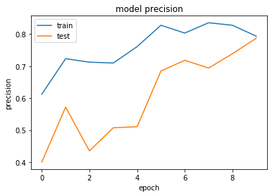


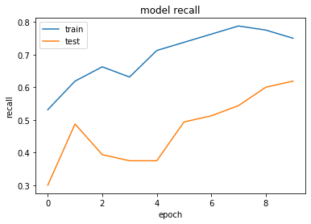


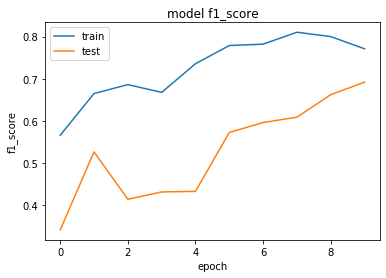


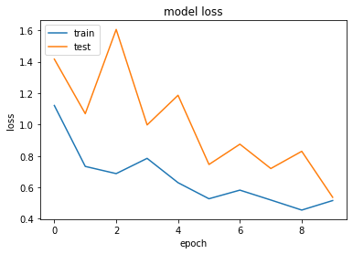


**Pergunta**: Avalie os gráficos de perda (*loss*), precisão (*precision*), sensibilidade (*recall*) e pontuação f1 (*f1 score*)  e explique o comportamento de ambos no que tange a convergência do modelo.

**Resposta**: Conforme íamos testando o modelo com menos imagens, o gráfico de "train" e "test" se mostravam um pouco divergentes entre si, o que nos obrigou a ir, aos poucos, aumentando a quantidade de imagens, até chegarmos nestes gráficos acima, onde, comparados aos anteriores gerados, estão bem mais convergentes. 
Reparamos que os dois gráficos ("train" e "test")assumem uma mesma direção [ascendente (precisão, sensibilidade e pontuação) e descendente (perda)] à medida que se aumentam o número de imagens.
Com relação à quantidade de épocas, pudemos reparar que mesmo aumentando, a precisão não subia pra mais de 70% quando a quantidade de imagens não era suficiente, pois chegamos a testar com 30 épocas e mesmo assim, não obtivemos a precisão que estamos tendo agora, nos gráficos acima.

**Pergunta**: Quais são os valores de **precisão (precision)**, **sensibilidade (recall)** de validação? 

*Estes valores são exibidos durante o treinamento, utilize a última saída, exemplo:*

```
Epoch 10/10 [==============================] - 45s 9s/step - loss: 0.1234 - precision_score: 0.9742 - recall_score: 0.9683 - f1_score: 0.9712 - val_loss: 0.8819 - val_precision_score: 0.6912 - val_recall_score: 0.5649 - val_f1_score: 0.6216```

No caso acima, o valor de precisão, sensibilidade e pontuação de validação são, respectivamente, 69,12%, 56,49% e 62,16%.

**Resposta**:Os valores correspondentes a época 10 são: precisão (78,70%), sensibilidade (61,87%) e pontuação (69,18%)

### 4.5.2 Arquitetura VGG16

**Pergunta**: Explique como é constituída a arquitetura do VGG16? *Utilize, se necessário, gráficos, projetos que utilizam essa arquitetura. Detalhe também sua topologia em camadas e mostre quais as situações essa arquitetura pode ter mais êxito e quais cenários não tem.*

**Resposta**: Foi a primeira arquitetura a substituir os filtros maiores, ou seja, os filtros que exigem maior custo  computacional, por grandes sequências de filtros com tamanhos 3×3. 

Esta figura, mostra a macro arquitetura da VGG16


A arquitetura funciona assim:
Na pilha de convoluções são aplicados filtros, bem pequenos, 3X3 (que é o menor tamanho para capturar a noção de esquerda/direita, centro, e acima/abaixo).
A convolução é fixada em 1 pixel, dessa forma, o preenchimento espacial da camada de entrada de convolução, é de tal modo,
que a resolução espacial é preservada após a convolução.
A cada final da execução de uma pilha de convolução, é realizado a chamada camada de max-pooling.
A camada de max-pooling não é executada a todo final de UMA max-pooling, e sim, de um conjunto de convolução.
Assim, a camada de max-pooling é realizada por cinco vezes.
Max-pooling é executada em uma janela de 2X2.
Ao final das execuções anteriores, são acionadas 3 camadas de Fully-Connected (FC).
Os dois primeiros tem exatamente 4096 canais cada uma, mas a terceira possui 1000 canais (uma para cada classe).
Todas as camadas de FC são equipadas com comadas ocultas ReLU.
A camada final é uma camada de soft-max.
A configuração das camadas FC são as mesmas em toda a rede.


```python
conv_base = VGG16(include_top=False)

for layer in conv_base.layers:
    layer.trainable = False
```

    Downloading data from https://github.com/fchollet/deep-learning-models/releases/download/v0.1/vgg16_weights_tf_dim_ordering_tf_kernels_notop.h5
    58892288/58889256 [==============================] - 64s 1us/step
    


```python
x = conv_base.output
x = layers.GlobalAveragePooling2D()(x)
x = layers.Dense(128, activation='relu')(x) 

predictions = layers.Dense(qtde_classes, activation='softmax')(x)
model = Model(conv_base.input, predictions)

model.summary()
```

    Model: "model_2"
    _________________________________________________________________
    Layer (type)                 Output Shape              Param #   
    =================================================================
    input_2 (InputLayer)         (None, None, None, 3)     0         
    _________________________________________________________________
    block1_conv1 (Conv2D)        (None, None, None, 64)    1792      
    _________________________________________________________________
    block1_conv2 (Conv2D)        (None, None, None, 64)    36928     
    _________________________________________________________________
    block1_pool (MaxPooling2D)   (None, None, None, 64)    0         
    _________________________________________________________________
    block2_conv1 (Conv2D)        (None, None, None, 128)   73856     
    _________________________________________________________________
    block2_conv2 (Conv2D)        (None, None, None, 128)   147584    
    _________________________________________________________________
    block2_pool (MaxPooling2D)   (None, None, None, 128)   0         
    _________________________________________________________________
    block3_conv1 (Conv2D)        (None, None, None, 256)   295168    
    _________________________________________________________________
    block3_conv2 (Conv2D)        (None, None, None, 256)   590080    
    _________________________________________________________________
    block3_conv3 (Conv2D)        (None, None, None, 256)   590080    
    _________________________________________________________________
    block3_pool (MaxPooling2D)   (None, None, None, 256)   0         
    _________________________________________________________________
    block4_conv1 (Conv2D)        (None, None, None, 512)   1180160   
    _________________________________________________________________
    block4_conv2 (Conv2D)        (None, None, None, 512)   2359808   
    _________________________________________________________________
    block4_conv3 (Conv2D)        (None, None, None, 512)   2359808   
    _________________________________________________________________
    block4_pool (MaxPooling2D)   (None, None, None, 512)   0         
    _________________________________________________________________
    block5_conv1 (Conv2D)        (None, None, None, 512)   2359808   
    _________________________________________________________________
    block5_conv2 (Conv2D)        (None, None, None, 512)   2359808   
    _________________________________________________________________
    block5_conv3 (Conv2D)        (None, None, None, 512)   2359808   
    _________________________________________________________________
    block5_pool (MaxPooling2D)   (None, None, None, 512)   0         
    _________________________________________________________________
    global_average_pooling2d_2 ( (None, 512)               0         
    _________________________________________________________________
    dense_3 (Dense)              (None, 128)               65664     
    _________________________________________________________________
    dense_4 (Dense)              (None, 3)                 387       
    =================================================================
    Total params: 14,780,739
    Trainable params: 66,051
    Non-trainable params: 14,714,688
    _________________________________________________________________
    


```python
optimizer = keras.optimizers.Adam()
model.compile(loss='categorical_crossentropy', optimizer=optimizer, metrics=[precision_score, recall_score, f1_score])
```


```python
#Implementamos uma nova célula aqui, pois alteramos a quantidade de épocas para 7, uma vez que com 10, 
#a precisão ficou abaixo dos 70%
qtde_epocas = 7 
```


```python
history = model.fit_generator(generator=train_generator, 
                              epochs=qtde_epocas, 
                              validation_steps=5, 
                              steps_per_epoch=5, 
                              validation_data=val_generator)
```

    Epoch 1/7
    5/5 [==============================] - 253s 51s/step - loss: 0.6449 - precision_score: 0.7663 - recall_score: 0.7563 - f1_score: 0.7611 - val_loss: 0.6477 - val_precision_score: 0.6704 - val_recall_score: 0.6625 - val_f1_score: 0.6663
    Epoch 2/7
    5/5 [==============================] - 246s 49s/step - loss: 0.7371 - precision_score: 0.7378 - recall_score: 0.7188 - f1_score: 0.7279 - val_loss: 0.9769 - val_precision_score: 0.7192 - val_recall_score: 0.7063 - val_f1_score: 0.7126
    Epoch 3/7
    5/5 [==============================] - 247s 49s/step - loss: 0.6774 - precision_score: 0.7302 - recall_score: 0.7125 - f1_score: 0.7212 - val_loss: 0.6784 - val_precision_score: 0.7138 - val_recall_score: 0.7000 - val_f1_score: 0.7067
    Epoch 4/7
    5/5 [==============================] - 246s 49s/step - loss: 0.8469 - precision_score: 0.7208 - recall_score: 0.7125 - f1_score: 0.7166 - val_loss: 1.1067 - val_precision_score: 0.7532 - val_recall_score: 0.7250 - val_f1_score: 0.7387
    Epoch 5/7
    5/5 [==============================] - 248s 50s/step - loss: 0.7470 - precision_score: 0.7228 - recall_score: 0.6875 - f1_score: 0.7045 - val_loss: 0.6041 - val_precision_score: 0.7215 - val_recall_score: 0.6938 - val_f1_score: 0.7072
    Epoch 6/7
    5/5 [==============================] - 245s 49s/step - loss: 0.6701 - precision_score: 0.7532 - recall_score: 0.7437 - f1_score: 0.7484 - val_loss: 0.8552 - val_precision_score: 0.6564 - val_recall_score: 0.6313 - val_f1_score: 0.6435
    Epoch 7/7
    5/5 [==============================] - 245s 49s/step - loss: 0.5991 - precision_score: 0.7375 - recall_score: 0.7375 - f1_score: 0.7375 - val_loss: 0.6843 - val_precision_score: 0.8296 - val_recall_score: 0.8062 - val_f1_score: 0.8176
    

Um modelo que converge bem possui o gráfico de perda (*loss*) descendente e os gráfico de precisão (*precision*), sensibilidade (*recall*) e pontuação f1 (*f1 score*) em acendente.


```python
# Exibindo dados de Precisão
plt.plot(history.history['precision_score'])
plt.plot(history.history['val_precision_score'])
plt.title('model precision')
plt.ylabel('precision')
plt.xlabel('epoch')
plt.legend(['train', 'test'], loc='upper left')
plt.show()

# Exibindo dados de Sensibilidade
plt.plot(history.history['recall_score'])
plt.plot(history.history['val_recall_score'])
plt.title('model recall')
plt.ylabel('recall')
plt.xlabel('epoch')
plt.legend(['train', 'test'], loc='upper left')
plt.show()

# Exibindo dados de F1 Score
plt.plot(history.history['f1_score'])
plt.plot(history.history['val_f1_score'])
plt.title('model f1_score')
plt.ylabel('f1_score')
plt.xlabel('epoch')
plt.legend(['train', 'test'], loc='upper left')
plt.show()

# Exibindo dados de Perda
plt.plot(history.history['loss'])
plt.plot(history.history['val_loss'])
plt.title('model loss')
plt.ylabel('loss')
plt.xlabel('epoch')
plt.legend(['train', 'test'], loc='upper left')
plt.show()
```


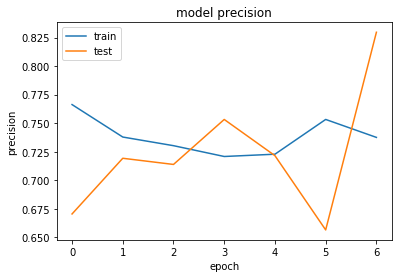


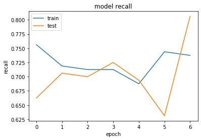


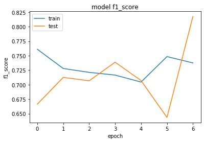


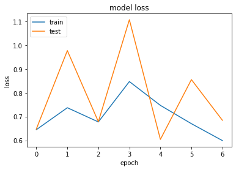


**Pergunta**: Avalie os gráficos de perda (*loss*), precisão (*precision*), sensibilidade (*recall*) e pontuação f1 (*f1 score*)  e explique o comportamento de ambos no que tange a convergência do modelo.

**Resposta**: Na primeira vez que rodamos o modelo com 10 camadas a convergência não foi tão boa e a precisão começou a cair a partir da sétima (7ª) camada, então resolvemos diminuir a quantidade de camadas para 7, o que resultou numa precisão muito boa e numa convergência um pouco melhor dos gráficos.

**Pergunta**: Quais são os valores de **precisão (precision)**, **sensibilidade (recall)** de validação? 

*Estes valores são exibidos durante o treinamento, utilize a última saída, exemplo:*

```
Epoch 10/10 [==============================] - 45s 9s/step - loss: 0.1234 - precision_score: 0.9742 - recall_score: 0.9683 - f1_score: 0.9712 - val_loss: 0.8819 - val_precision_score: 0.6912 - val_recall_score: 0.5649 - val_f1_score: 0.6216```

No caso acima, o valor de precisão, sensibilidade e pontuação de validação são, respectivamente, 69,12%, 56,49% e 62,16%.

**Resposta**: Os valores da 7ª camada são os seguintes: precisão: 82,96% - sensibilidade: 80,62% - pontuação: 81,76%

### 4.5.3 Arquitetura VGG19

**Pergunta**: Explique como é constituída a arquitetura do VGG19? *Utilize, se necessário, gráficos, projetos que utilizam essa arquitetura. Detalhe também sua topologia em camadas e mostre quais as situações essa arquitetura pode ter mais êxito e quais cenários não tem.*

**Resposta**: É uma CNN de 19 camadas (16 camadas convolucionais e 3 camadas fully-connected). 
Ela possui uma arquitetura considerada simples para os padrões do Deep Learning, mas contém um número mostruoso de parâmetros: 143 milhões.
A diferença entre as arquiteturas VGG16 e VGG19 se resume a três camadas adicionais existentes na VGG19, sendo uma camada a mais no quarto, uma no quinto e uma no sexto bloco.

Um exemplo da arquitetura da VGG19 é a figura abaixo:


```python
conv_base = VGG19(include_top=False)

for layer in conv_base.layers:
    layer.trainable = False
```

    Downloading data from https://github.com/fchollet/deep-learning-models/releases/download/v0.1/vgg19_weights_tf_dim_ordering_tf_kernels_notop.h5
    80142336/80134624 [==============================] - 152s 2us/step
    


```python
x = conv_base.output
x = layers.GlobalAveragePooling2D()(x)
x = layers.Dense(128, activation='relu')(x) 

predictions = layers.Dense(qtde_classes, activation='softmax')(x)
model = Model(conv_base.input, predictions)

model.summary()
```

    Model: "model_3"
    _________________________________________________________________
    Layer (type)                 Output Shape              Param #   
    =================================================================
    input_3 (InputLayer)         (None, None, None, 3)     0         
    _________________________________________________________________
    block1_conv1 (Conv2D)        (None, None, None, 64)    1792      
    _________________________________________________________________
    block1_conv2 (Conv2D)        (None, None, None, 64)    36928     
    _________________________________________________________________
    block1_pool (MaxPooling2D)   (None, None, None, 64)    0         
    _________________________________________________________________
    block2_conv1 (Conv2D)        (None, None, None, 128)   73856     
    _________________________________________________________________
    block2_conv2 (Conv2D)        (None, None, None, 128)   147584    
    _________________________________________________________________
    block2_pool (MaxPooling2D)   (None, None, None, 128)   0         
    _________________________________________________________________
    block3_conv1 (Conv2D)        (None, None, None, 256)   295168    
    _________________________________________________________________
    block3_conv2 (Conv2D)        (None, None, None, 256)   590080    
    _________________________________________________________________
    block3_conv3 (Conv2D)        (None, None, None, 256)   590080    
    _________________________________________________________________
    block3_conv4 (Conv2D)        (None, None, None, 256)   590080    
    _________________________________________________________________
    block3_pool (MaxPooling2D)   (None, None, None, 256)   0         
    _________________________________________________________________
    block4_conv1 (Conv2D)        (None, None, None, 512)   1180160   
    _________________________________________________________________
    block4_conv2 (Conv2D)        (None, None, None, 512)   2359808   
    _________________________________________________________________
    block4_conv3 (Conv2D)        (None, None, None, 512)   2359808   
    _________________________________________________________________
    block4_conv4 (Conv2D)        (None, None, None, 512)   2359808   
    _________________________________________________________________
    block4_pool (MaxPooling2D)   (None, None, None, 512)   0         
    _________________________________________________________________
    block5_conv1 (Conv2D)        (None, None, None, 512)   2359808   
    _________________________________________________________________
    block5_conv2 (Conv2D)        (None, None, None, 512)   2359808   
    _________________________________________________________________
    block5_conv3 (Conv2D)        (None, None, None, 512)   2359808   
    _________________________________________________________________
    block5_conv4 (Conv2D)        (None, None, None, 512)   2359808   
    _________________________________________________________________
    block5_pool (MaxPooling2D)   (None, None, None, 512)   0         
    _________________________________________________________________
    global_average_pooling2d_3 ( (None, 512)               0         
    _________________________________________________________________
    dense_5 (Dense)              (None, 128)               65664     
    _________________________________________________________________
    dense_6 (Dense)              (None, 3)                 387       
    =================================================================
    Total params: 20,090,435
    Trainable params: 66,051
    Non-trainable params: 20,024,384
    _________________________________________________________________
    


```python
optimizer = keras.optimizers.Adam()
model.compile(loss='categorical_crossentropy', optimizer=optimizer, metrics=[precision_score, recall_score, f1_score])
```


```python
history = model.fit_generator(generator=train_generator, 
                              epochs=qtde_epocas, 
                              validation_steps=5, 
                              steps_per_epoch=5, 
                              validation_data=val_generator)
```

    Epoch 1/10
    5/5 [==============================] - 264s 53s/step - loss: 3.3559 - precision_score: 0.4000 - recall_score: 0.3812 - f1_score: 0.3903 - val_loss: 1.6505 - val_precision_score: 0.4149 - val_recall_score: 0.4062 - val_f1_score: 0.4105
    Epoch 2/10
    5/5 [==============================] - 252s 50s/step - loss: 1.9515 - precision_score: 0.5071 - recall_score: 0.5000 - f1_score: 0.5034 - val_loss: 2.1807 - val_precision_score: 0.4239 - val_recall_score: 0.4000 - val_f1_score: 0.4116
    Epoch 3/10
    5/5 [==============================] - 252s 50s/step - loss: 1.3686 - precision_score: 0.5610 - recall_score: 0.5500 - f1_score: 0.5553 - val_loss: 1.5737 - val_precision_score: 0.5583 - val_recall_score: 0.5500 - val_f1_score: 0.5541
    Epoch 4/10
    5/5 [==============================] - 263s 53s/step - loss: 1.3936 - precision_score: 0.6264 - recall_score: 0.6187 - f1_score: 0.6225 - val_loss: 1.8147 - val_precision_score: 0.6585 - val_recall_score: 0.6375 - val_f1_score: 0.6478
    Epoch 5/10
    5/5 [==============================] - 256s 51s/step - loss: 1.1234 - precision_score: 0.6061 - recall_score: 0.5813 - f1_score: 0.5933 - val_loss: 1.1570 - val_precision_score: 0.5302 - val_recall_score: 0.5250 - val_f1_score: 0.5276
    Epoch 6/10
    5/5 [==============================] - 247s 49s/step - loss: 0.8724 - precision_score: 0.6917 - recall_score: 0.6750 - f1_score: 0.6832 - val_loss: 1.2739 - val_precision_score: 0.6567 - val_recall_score: 0.6500 - val_f1_score: 0.6532
    Epoch 7/10
    5/5 [==============================] - 249s 50s/step - loss: 0.6773 - precision_score: 0.7824 - recall_score: 0.7625 - f1_score: 0.7722 - val_loss: 1.1831 - val_precision_score: 0.7393 - val_recall_score: 0.7312 - val_f1_score: 0.7352
    Epoch 8/10
    5/5 [==============================] - 247s 49s/step - loss: 0.6562 - precision_score: 0.7788 - recall_score: 0.7688 - f1_score: 0.7737 - val_loss: 0.6672 - val_precision_score: 0.7296 - val_recall_score: 0.7250 - val_f1_score: 0.7273
    Epoch 9/10
    5/5 [==============================] - 246s 49s/step - loss: 0.8161 - precision_score: 0.7359 - recall_score: 0.7312 - f1_score: 0.7335 - val_loss: 0.8984 - val_precision_score: 0.7194 - val_recall_score: 0.7063 - val_f1_score: 0.7127
    Epoch 10/10
    5/5 [==============================] - 245s 49s/step - loss: 0.7713 - precision_score: 0.7427 - recall_score: 0.7250 - f1_score: 0.7337 - val_loss: 0.4257 - val_precision_score: 0.7952 - val_recall_score: 0.7812 - val_f1_score: 0.7881
    

Um modelo que converge bem possui o gráfico de perda (*loss*) descendente e os gráfico de precisão (*precision*), sensibilidade (*recall*) e pontuação f1 (*f1 score*) em acendente.


```python
# Exibindo dados de Precisão
plt.plot(history.history['precision_score'])
plt.plot(history.history['val_precision_score'])
plt.title('model precision')
plt.ylabel('precision')
plt.xlabel('epoch')
plt.legend(['train', 'test'], loc='upper left')
plt.show()

# Exibindo dados de Sensibilidade
plt.plot(history.history['recall_score'])
plt.plot(history.history['val_recall_score'])
plt.title('model recall')
plt.ylabel('recall')
plt.xlabel('epoch')
plt.legend(['train', 'test'], loc='upper left')
plt.show()

# Exibindo dados de F1 Score
plt.plot(history.history['f1_score'])
plt.plot(history.history['val_f1_score'])
plt.title('model f1_score')
plt.ylabel('f1_score')
plt.xlabel('epoch')
plt.legend(['train', 'test'], loc='upper left')
plt.show()

# Exibindo dados de Perda
plt.plot(history.history['loss'])
plt.plot(history.history['val_loss'])
plt.title('model loss')
plt.ylabel('loss')
plt.xlabel('epoch')
plt.legend(['train', 'test'], loc='upper left')
plt.show()
```


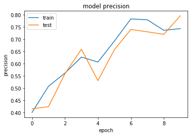


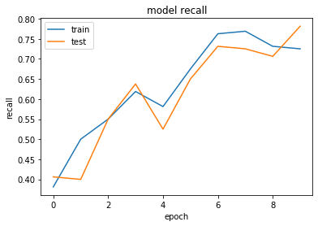


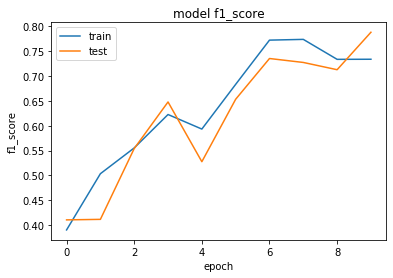


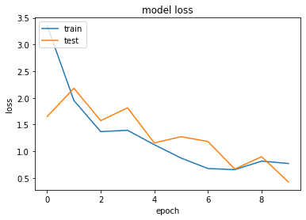


**Pergunta**: Avalie os gráficos de perda (*loss*), precisão (*precision*), sensibilidade (*recall*) e pontuação f1 (*f1 score*)  e explique o comportamento de ambos no que tange a convergência do modelo.

**Resposta**: A convergência destes gráficos talvez tenha sido a melhor dos 3 modelos e a pequena diferença nas "curvas" de "train" e "teste", mostram o quanto este modelo ficou ajustado para as imagens, suas quantidades e épocas processadas.

**Pergunta**: Quais são os valores de **precisão (precision)**, **sensibilidade (recall)** de validação? 

*Estes valores são exibidos durante o treinamento, utilize a última saída, exemplo:*

```
Epoch 10/10 [==============================] - 45s 9s/step - loss: 0.1234 - precision_score: 0.9742 - recall_score: 0.9683 - f1_score: 0.9712 - val_loss: 0.8819 - val_precision_score: 0.6912 - val_recall_score: 0.5649 - val_f1_score: 0.6216```

No caso acima, o valor de precisão, sensibilidade e pontuação de validação são, respectivamente, 69,12%, 56,49% e 62,16%.

**Resposta**: Para a camada 10, os valores foram os seguintes: precisão: 79,52% - sensibilidade: 78,12% - pontuação: 78,81%.

## 4.6 Compartivo de arquiteturas

Preencha a tabela abaixo com os valores dos indicadores de performance apresentados.

_O cálculo do F1-Score é dado por 2 * (Precisão * Sensibilidade) / (Precisão + Sensibilidade)._

| Modelo   | Precisão (*Precision*) | Sensibilidade (*Recall*) | F1-Score |
|----------|----------|---------------|----------|
| ResNet50 | 78,70 %  | 61,87 %       | 69,28 %  |
| VGG16    | 82,96 %  | 80,62 %       | 81,78 %  |
| VGG19    | 79,52 %  | 78,12 %       | 78,81 %  |

## 4.7 Conclusões

Analise os resultados da tabela de indicadores do comparativo de arquiteturas e explique os principais motivos pelos quais cada modelo obteve cada resultado.

**Respota**: Obtivemos resultados muito bons com as 3 arquiteturas e verificamos que a ResNet50 e a VGG19 comportaram-se melhores com mais épocas (10) do que a VGG16, que começou a degradar a perfomance com mais épocas, por isso ajustamos ela pra apenas 7 épocas. 
Com base neste resultado, podemos concluir que as arquiteuras ResNet50 e VGG19 tem melhores resultados com mais épocas, ao contrário da VGG16, que comportou-se melhor com menos épocas.
Nas 3 arquiteturas, observamos que a quantidade de imagens influenciou bastante para o resultado final da acurácia, pois com menos imagens não conseguíamos alcançar os 70% mínimos que o professor estipulou.
Quanto ao indicativo de F1-Score, se ele servir de parâmetro, podemos dizer que a VGG16 saiu-se melhor que as outras e a ResNet50, pior, porém, ainda somos iniciantes nesta área e então, não podemos dizer só com base nele, que realmente as nossas conclusões podem servir de base para outros trabalhos.

## 4.8 Abordagem Extra

Considerando os outros classificadores, escolha outro que ainda não foi utilizado, implemente abaixo. Ao final compare os resultados e explique os resultados.

_Não se esquece de utilizar as importações adequadas para cada modelo.
A forma de implementação deve respeitar as mesmas condições como valor de split e quantidade de imagens para poder comparar os modelos._


```python
#IMPLEMENTE
#Iremos testar inicialmente com a classe Xception

conv_base = Xception(include_top=False)

for layer in conv_base.layers:
    layer.trainable = False
```

    WARNING:tensorflow:From C:\Users\Infotecno\anaconda3\lib\site-packages\keras\backend\tensorflow_backend.py:4070: The name tf.nn.max_pool is deprecated. Please use tf.nn.max_pool2d instead.
    
    


```python
x = conv_base.output
x = layers.GlobalAveragePooling2D()(x)
x = layers.Dense(128, activation='relu')(x) 

predictions = layers.Dense(qtde_classes, activation='softmax')(x)
model = Model(conv_base.input, predictions)

model.summary()
```

    Model: "model_1"
    __________________________________________________________________________________________________
    Layer (type)                    Output Shape         Param #     Connected to                     
    ==================================================================================================
    input_1 (InputLayer)            (None, None, None, 3 0                                            
    __________________________________________________________________________________________________
    block1_conv1 (Conv2D)           (None, None, None, 3 864         input_1[0][0]                    
    __________________________________________________________________________________________________
    block1_conv1_bn (BatchNormaliza (None, None, None, 3 128         block1_conv1[0][0]               
    __________________________________________________________________________________________________
    block1_conv1_act (Activation)   (None, None, None, 3 0           block1_conv1_bn[0][0]            
    __________________________________________________________________________________________________
    block1_conv2 (Conv2D)           (None, None, None, 6 18432       block1_conv1_act[0][0]           
    __________________________________________________________________________________________________
    block1_conv2_bn (BatchNormaliza (None, None, None, 6 256         block1_conv2[0][0]               
    __________________________________________________________________________________________________
    block1_conv2_act (Activation)   (None, None, None, 6 0           block1_conv2_bn[0][0]            
    __________________________________________________________________________________________________
    block2_sepconv1 (SeparableConv2 (None, None, None, 1 8768        block1_conv2_act[0][0]           
    __________________________________________________________________________________________________
    block2_sepconv1_bn (BatchNormal (None, None, None, 1 512         block2_sepconv1[0][0]            
    __________________________________________________________________________________________________
    block2_sepconv2_act (Activation (None, None, None, 1 0           block2_sepconv1_bn[0][0]         
    __________________________________________________________________________________________________
    block2_sepconv2 (SeparableConv2 (None, None, None, 1 17536       block2_sepconv2_act[0][0]        
    __________________________________________________________________________________________________
    block2_sepconv2_bn (BatchNormal (None, None, None, 1 512         block2_sepconv2[0][0]            
    __________________________________________________________________________________________________
    conv2d_1 (Conv2D)               (None, None, None, 1 8192        block1_conv2_act[0][0]           
    __________________________________________________________________________________________________
    block2_pool (MaxPooling2D)      (None, None, None, 1 0           block2_sepconv2_bn[0][0]         
    __________________________________________________________________________________________________
    batch_normalization_1 (BatchNor (None, None, None, 1 512         conv2d_1[0][0]                   
    __________________________________________________________________________________________________
    add_1 (Add)                     (None, None, None, 1 0           block2_pool[0][0]                
                                                                     batch_normalization_1[0][0]      
    __________________________________________________________________________________________________
    block3_sepconv1_act (Activation (None, None, None, 1 0           add_1[0][0]                      
    __________________________________________________________________________________________________
    block3_sepconv1 (SeparableConv2 (None, None, None, 2 33920       block3_sepconv1_act[0][0]        
    __________________________________________________________________________________________________
    block3_sepconv1_bn (BatchNormal (None, None, None, 2 1024        block3_sepconv1[0][0]            
    __________________________________________________________________________________________________
    block3_sepconv2_act (Activation (None, None, None, 2 0           block3_sepconv1_bn[0][0]         
    __________________________________________________________________________________________________
    block3_sepconv2 (SeparableConv2 (None, None, None, 2 67840       block3_sepconv2_act[0][0]        
    __________________________________________________________________________________________________
    block3_sepconv2_bn (BatchNormal (None, None, None, 2 1024        block3_sepconv2[0][0]            
    __________________________________________________________________________________________________
    conv2d_2 (Conv2D)               (None, None, None, 2 32768       add_1[0][0]                      
    __________________________________________________________________________________________________
    block3_pool (MaxPooling2D)      (None, None, None, 2 0           block3_sepconv2_bn[0][0]         
    __________________________________________________________________________________________________
    batch_normalization_2 (BatchNor (None, None, None, 2 1024        conv2d_2[0][0]                   
    __________________________________________________________________________________________________
    add_2 (Add)                     (None, None, None, 2 0           block3_pool[0][0]                
                                                                     batch_normalization_2[0][0]      
    __________________________________________________________________________________________________
    block4_sepconv1_act (Activation (None, None, None, 2 0           add_2[0][0]                      
    __________________________________________________________________________________________________
    block4_sepconv1 (SeparableConv2 (None, None, None, 7 188672      block4_sepconv1_act[0][0]        
    __________________________________________________________________________________________________
    block4_sepconv1_bn (BatchNormal (None, None, None, 7 2912        block4_sepconv1[0][0]            
    __________________________________________________________________________________________________
    block4_sepconv2_act (Activation (None, None, None, 7 0           block4_sepconv1_bn[0][0]         
    __________________________________________________________________________________________________
    block4_sepconv2 (SeparableConv2 (None, None, None, 7 536536      block4_sepconv2_act[0][0]        
    __________________________________________________________________________________________________
    block4_sepconv2_bn (BatchNormal (None, None, None, 7 2912        block4_sepconv2[0][0]            
    __________________________________________________________________________________________________
    conv2d_3 (Conv2D)               (None, None, None, 7 186368      add_2[0][0]                      
    __________________________________________________________________________________________________
    block4_pool (MaxPooling2D)      (None, None, None, 7 0           block4_sepconv2_bn[0][0]         
    __________________________________________________________________________________________________
    batch_normalization_3 (BatchNor (None, None, None, 7 2912        conv2d_3[0][0]                   
    __________________________________________________________________________________________________
    add_3 (Add)                     (None, None, None, 7 0           block4_pool[0][0]                
                                                                     batch_normalization_3[0][0]      
    __________________________________________________________________________________________________
    block5_sepconv1_act (Activation (None, None, None, 7 0           add_3[0][0]                      
    __________________________________________________________________________________________________
    block5_sepconv1 (SeparableConv2 (None, None, None, 7 536536      block5_sepconv1_act[0][0]        
    __________________________________________________________________________________________________
    block5_sepconv1_bn (BatchNormal (None, None, None, 7 2912        block5_sepconv1[0][0]            
    __________________________________________________________________________________________________
    block5_sepconv2_act (Activation (None, None, None, 7 0           block5_sepconv1_bn[0][0]         
    __________________________________________________________________________________________________
    block5_sepconv2 (SeparableConv2 (None, None, None, 7 536536      block5_sepconv2_act[0][0]        
    __________________________________________________________________________________________________
    block5_sepconv2_bn (BatchNormal (None, None, None, 7 2912        block5_sepconv2[0][0]            
    __________________________________________________________________________________________________
    block5_sepconv3_act (Activation (None, None, None, 7 0           block5_sepconv2_bn[0][0]         
    __________________________________________________________________________________________________
    block5_sepconv3 (SeparableConv2 (None, None, None, 7 536536      block5_sepconv3_act[0][0]        
    __________________________________________________________________________________________________
    block5_sepconv3_bn (BatchNormal (None, None, None, 7 2912        block5_sepconv3[0][0]            
    __________________________________________________________________________________________________
    add_4 (Add)                     (None, None, None, 7 0           block5_sepconv3_bn[0][0]         
                                                                     add_3[0][0]                      
    __________________________________________________________________________________________________
    block6_sepconv1_act (Activation (None, None, None, 7 0           add_4[0][0]                      
    __________________________________________________________________________________________________
    block6_sepconv1 (SeparableConv2 (None, None, None, 7 536536      block6_sepconv1_act[0][0]        
    __________________________________________________________________________________________________
    block6_sepconv1_bn (BatchNormal (None, None, None, 7 2912        block6_sepconv1[0][0]            
    __________________________________________________________________________________________________
    block6_sepconv2_act (Activation (None, None, None, 7 0           block6_sepconv1_bn[0][0]         
    __________________________________________________________________________________________________
    block6_sepconv2 (SeparableConv2 (None, None, None, 7 536536      block6_sepconv2_act[0][0]        
    __________________________________________________________________________________________________
    block6_sepconv2_bn (BatchNormal (None, None, None, 7 2912        block6_sepconv2[0][0]            
    __________________________________________________________________________________________________
    block6_sepconv3_act (Activation (None, None, None, 7 0           block6_sepconv2_bn[0][0]         
    __________________________________________________________________________________________________
    block6_sepconv3 (SeparableConv2 (None, None, None, 7 536536      block6_sepconv3_act[0][0]        
    __________________________________________________________________________________________________
    block6_sepconv3_bn (BatchNormal (None, None, None, 7 2912        block6_sepconv3[0][0]            
    __________________________________________________________________________________________________
    add_5 (Add)                     (None, None, None, 7 0           block6_sepconv3_bn[0][0]         
                                                                     add_4[0][0]                      
    __________________________________________________________________________________________________
    block7_sepconv1_act (Activation (None, None, None, 7 0           add_5[0][0]                      
    __________________________________________________________________________________________________
    block7_sepconv1 (SeparableConv2 (None, None, None, 7 536536      block7_sepconv1_act[0][0]        
    __________________________________________________________________________________________________
    block7_sepconv1_bn (BatchNormal (None, None, None, 7 2912        block7_sepconv1[0][0]            
    __________________________________________________________________________________________________
    block7_sepconv2_act (Activation (None, None, None, 7 0           block7_sepconv1_bn[0][0]         
    __________________________________________________________________________________________________
    block7_sepconv2 (SeparableConv2 (None, None, None, 7 536536      block7_sepconv2_act[0][0]        
    __________________________________________________________________________________________________
    block7_sepconv2_bn (BatchNormal (None, None, None, 7 2912        block7_sepconv2[0][0]            
    __________________________________________________________________________________________________
    block7_sepconv3_act (Activation (None, None, None, 7 0           block7_sepconv2_bn[0][0]         
    __________________________________________________________________________________________________
    block7_sepconv3 (SeparableConv2 (None, None, None, 7 536536      block7_sepconv3_act[0][0]        
    __________________________________________________________________________________________________
    block7_sepconv3_bn (BatchNormal (None, None, None, 7 2912        block7_sepconv3[0][0]            
    __________________________________________________________________________________________________
    add_6 (Add)                     (None, None, None, 7 0           block7_sepconv3_bn[0][0]         
                                                                     add_5[0][0]                      
    __________________________________________________________________________________________________
    block8_sepconv1_act (Activation (None, None, None, 7 0           add_6[0][0]                      
    __________________________________________________________________________________________________
    block8_sepconv1 (SeparableConv2 (None, None, None, 7 536536      block8_sepconv1_act[0][0]        
    __________________________________________________________________________________________________
    block8_sepconv1_bn (BatchNormal (None, None, None, 7 2912        block8_sepconv1[0][0]            
    __________________________________________________________________________________________________
    block8_sepconv2_act (Activation (None, None, None, 7 0           block8_sepconv1_bn[0][0]         
    __________________________________________________________________________________________________
    block8_sepconv2 (SeparableConv2 (None, None, None, 7 536536      block8_sepconv2_act[0][0]        
    __________________________________________________________________________________________________
    block8_sepconv2_bn (BatchNormal (None, None, None, 7 2912        block8_sepconv2[0][0]            
    __________________________________________________________________________________________________
    block8_sepconv3_act (Activation (None, None, None, 7 0           block8_sepconv2_bn[0][0]         
    __________________________________________________________________________________________________
    block8_sepconv3 (SeparableConv2 (None, None, None, 7 536536      block8_sepconv3_act[0][0]        
    __________________________________________________________________________________________________
    block8_sepconv3_bn (BatchNormal (None, None, None, 7 2912        block8_sepconv3[0][0]            
    __________________________________________________________________________________________________
    add_7 (Add)                     (None, None, None, 7 0           block8_sepconv3_bn[0][0]         
                                                                     add_6[0][0]                      
    __________________________________________________________________________________________________
    block9_sepconv1_act (Activation (None, None, None, 7 0           add_7[0][0]                      
    __________________________________________________________________________________________________
    block9_sepconv1 (SeparableConv2 (None, None, None, 7 536536      block9_sepconv1_act[0][0]        
    __________________________________________________________________________________________________
    block9_sepconv1_bn (BatchNormal (None, None, None, 7 2912        block9_sepconv1[0][0]            
    __________________________________________________________________________________________________
    block9_sepconv2_act (Activation (None, None, None, 7 0           block9_sepconv1_bn[0][0]         
    __________________________________________________________________________________________________
    block9_sepconv2 (SeparableConv2 (None, None, None, 7 536536      block9_sepconv2_act[0][0]        
    __________________________________________________________________________________________________
    block9_sepconv2_bn (BatchNormal (None, None, None, 7 2912        block9_sepconv2[0][0]            
    __________________________________________________________________________________________________
    block9_sepconv3_act (Activation (None, None, None, 7 0           block9_sepconv2_bn[0][0]         
    __________________________________________________________________________________________________
    block9_sepconv3 (SeparableConv2 (None, None, None, 7 536536      block9_sepconv3_act[0][0]        
    __________________________________________________________________________________________________
    block9_sepconv3_bn (BatchNormal (None, None, None, 7 2912        block9_sepconv3[0][0]            
    __________________________________________________________________________________________________
    add_8 (Add)                     (None, None, None, 7 0           block9_sepconv3_bn[0][0]         
                                                                     add_7[0][0]                      
    __________________________________________________________________________________________________
    block10_sepconv1_act (Activatio (None, None, None, 7 0           add_8[0][0]                      
    __________________________________________________________________________________________________
    block10_sepconv1 (SeparableConv (None, None, None, 7 536536      block10_sepconv1_act[0][0]       
    __________________________________________________________________________________________________
    block10_sepconv1_bn (BatchNorma (None, None, None, 7 2912        block10_sepconv1[0][0]           
    __________________________________________________________________________________________________
    block10_sepconv2_act (Activatio (None, None, None, 7 0           block10_sepconv1_bn[0][0]        
    __________________________________________________________________________________________________
    block10_sepconv2 (SeparableConv (None, None, None, 7 536536      block10_sepconv2_act[0][0]       
    __________________________________________________________________________________________________
    block10_sepconv2_bn (BatchNorma (None, None, None, 7 2912        block10_sepconv2[0][0]           
    __________________________________________________________________________________________________
    block10_sepconv3_act (Activatio (None, None, None, 7 0           block10_sepconv2_bn[0][0]        
    __________________________________________________________________________________________________
    block10_sepconv3 (SeparableConv (None, None, None, 7 536536      block10_sepconv3_act[0][0]       
    __________________________________________________________________________________________________
    block10_sepconv3_bn (BatchNorma (None, None, None, 7 2912        block10_sepconv3[0][0]           
    __________________________________________________________________________________________________
    add_9 (Add)                     (None, None, None, 7 0           block10_sepconv3_bn[0][0]        
                                                                     add_8[0][0]                      
    __________________________________________________________________________________________________
    block11_sepconv1_act (Activatio (None, None, None, 7 0           add_9[0][0]                      
    __________________________________________________________________________________________________
    block11_sepconv1 (SeparableConv (None, None, None, 7 536536      block11_sepconv1_act[0][0]       
    __________________________________________________________________________________________________
    block11_sepconv1_bn (BatchNorma (None, None, None, 7 2912        block11_sepconv1[0][0]           
    __________________________________________________________________________________________________
    block11_sepconv2_act (Activatio (None, None, None, 7 0           block11_sepconv1_bn[0][0]        
    __________________________________________________________________________________________________
    block11_sepconv2 (SeparableConv (None, None, None, 7 536536      block11_sepconv2_act[0][0]       
    __________________________________________________________________________________________________
    block11_sepconv2_bn (BatchNorma (None, None, None, 7 2912        block11_sepconv2[0][0]           
    __________________________________________________________________________________________________
    block11_sepconv3_act (Activatio (None, None, None, 7 0           block11_sepconv2_bn[0][0]        
    __________________________________________________________________________________________________
    block11_sepconv3 (SeparableConv (None, None, None, 7 536536      block11_sepconv3_act[0][0]       
    __________________________________________________________________________________________________
    block11_sepconv3_bn (BatchNorma (None, None, None, 7 2912        block11_sepconv3[0][0]           
    __________________________________________________________________________________________________
    add_10 (Add)                    (None, None, None, 7 0           block11_sepconv3_bn[0][0]        
                                                                     add_9[0][0]                      
    __________________________________________________________________________________________________
    block12_sepconv1_act (Activatio (None, None, None, 7 0           add_10[0][0]                     
    __________________________________________________________________________________________________
    block12_sepconv1 (SeparableConv (None, None, None, 7 536536      block12_sepconv1_act[0][0]       
    __________________________________________________________________________________________________
    block12_sepconv1_bn (BatchNorma (None, None, None, 7 2912        block12_sepconv1[0][0]           
    __________________________________________________________________________________________________
    block12_sepconv2_act (Activatio (None, None, None, 7 0           block12_sepconv1_bn[0][0]        
    __________________________________________________________________________________________________
    block12_sepconv2 (SeparableConv (None, None, None, 7 536536      block12_sepconv2_act[0][0]       
    __________________________________________________________________________________________________
    block12_sepconv2_bn (BatchNorma (None, None, None, 7 2912        block12_sepconv2[0][0]           
    __________________________________________________________________________________________________
    block12_sepconv3_act (Activatio (None, None, None, 7 0           block12_sepconv2_bn[0][0]        
    __________________________________________________________________________________________________
    block12_sepconv3 (SeparableConv (None, None, None, 7 536536      block12_sepconv3_act[0][0]       
    __________________________________________________________________________________________________
    block12_sepconv3_bn (BatchNorma (None, None, None, 7 2912        block12_sepconv3[0][0]           
    __________________________________________________________________________________________________
    add_11 (Add)                    (None, None, None, 7 0           block12_sepconv3_bn[0][0]        
                                                                     add_10[0][0]                     
    __________________________________________________________________________________________________
    block13_sepconv1_act (Activatio (None, None, None, 7 0           add_11[0][0]                     
    __________________________________________________________________________________________________
    block13_sepconv1 (SeparableConv (None, None, None, 7 536536      block13_sepconv1_act[0][0]       
    __________________________________________________________________________________________________
    block13_sepconv1_bn (BatchNorma (None, None, None, 7 2912        block13_sepconv1[0][0]           
    __________________________________________________________________________________________________
    block13_sepconv2_act (Activatio (None, None, None, 7 0           block13_sepconv1_bn[0][0]        
    __________________________________________________________________________________________________
    block13_sepconv2 (SeparableConv (None, None, None, 1 752024      block13_sepconv2_act[0][0]       
    __________________________________________________________________________________________________
    block13_sepconv2_bn (BatchNorma (None, None, None, 1 4096        block13_sepconv2[0][0]           
    __________________________________________________________________________________________________
    conv2d_4 (Conv2D)               (None, None, None, 1 745472      add_11[0][0]                     
    __________________________________________________________________________________________________
    block13_pool (MaxPooling2D)     (None, None, None, 1 0           block13_sepconv2_bn[0][0]        
    __________________________________________________________________________________________________
    batch_normalization_4 (BatchNor (None, None, None, 1 4096        conv2d_4[0][0]                   
    __________________________________________________________________________________________________
    add_12 (Add)                    (None, None, None, 1 0           block13_pool[0][0]               
                                                                     batch_normalization_4[0][0]      
    __________________________________________________________________________________________________
    block14_sepconv1 (SeparableConv (None, None, None, 1 1582080     add_12[0][0]                     
    __________________________________________________________________________________________________
    block14_sepconv1_bn (BatchNorma (None, None, None, 1 6144        block14_sepconv1[0][0]           
    __________________________________________________________________________________________________
    block14_sepconv1_act (Activatio (None, None, None, 1 0           block14_sepconv1_bn[0][0]        
    __________________________________________________________________________________________________
    block14_sepconv2 (SeparableConv (None, None, None, 2 3159552     block14_sepconv1_act[0][0]       
    __________________________________________________________________________________________________
    block14_sepconv2_bn (BatchNorma (None, None, None, 2 8192        block14_sepconv2[0][0]           
    __________________________________________________________________________________________________
    block14_sepconv2_act (Activatio (None, None, None, 2 0           block14_sepconv2_bn[0][0]        
    __________________________________________________________________________________________________
    global_average_pooling2d_1 (Glo (None, 2048)         0           block14_sepconv2_act[0][0]       
    __________________________________________________________________________________________________
    dense_1 (Dense)                 (None, 128)          262272      global_average_pooling2d_1[0][0] 
    __________________________________________________________________________________________________
    dense_2 (Dense)                 (None, 3)            387         dense_1[0][0]                    
    ==================================================================================================
    Total params: 21,124,139
    Trainable params: 262,659
    Non-trainable params: 20,861,480
    __________________________________________________________________________________________________
    


```python
optimizer = keras.optimizers.Adam()
model.compile(loss='categorical_crossentropy', optimizer=optimizer, metrics=[precision_score, recall_score, f1_score])
```


```python
qtde_epocas = 7
```


```python
history = model.fit_generator(generator=train_generator, 
                              epochs=qtde_epocas, 
                              validation_steps=5, 
                              steps_per_epoch=5, 
                              validation_data=val_generator)
```

    WARNING:tensorflow:From C:\Users\Infotecno\anaconda3\lib\site-packages\keras\backend\tensorflow_backend.py:422: The name tf.global_variables is deprecated. Please use tf.compat.v1.global_variables instead.
    
    Epoch 1/7
    5/5 [==============================] - 214s 43s/step - loss: 1.0011 - precision_score: 0.5149 - recall_score: 0.3187 - f1_score: 0.3899 - val_loss: 19.3946 - val_precision_score: 0.2313 - val_recall_score: 0.2313 - val_f1_score: 0.2312
    Epoch 2/7
    5/5 [==============================] - 188s 38s/step - loss: 0.8580 - precision_score: 0.7203 - recall_score: 0.3875 - f1_score: 0.4800 - val_loss: 9.3603 - val_precision_score: 0.3712 - val_recall_score: 0.3688 - val_f1_score: 0.3699
    Epoch 3/7
    5/5 [==============================] - 187s 37s/step - loss: 0.7445 - precision_score: 0.8034 - recall_score: 0.5625 - f1_score: 0.6603 - val_loss: 11.3904 - val_precision_score: 0.3716 - val_recall_score: 0.3688 - val_f1_score: 0.3701
    Epoch 4/7
    5/5 [==============================] - 191s 38s/step - loss: 0.8239 - precision_score: 0.7100 - recall_score: 0.5875 - f1_score: 0.6428 - val_loss: 21.4838 - val_precision_score: 0.5063 - val_recall_score: 0.5063 - val_f1_score: 0.5062
    Epoch 5/7
    5/5 [==============================] - 213s 43s/step - loss: 0.6242 - precision_score: 0.8444 - recall_score: 0.6375 - f1_score: 0.7262 - val_loss: 19.9227 - val_precision_score: 0.2000 - val_recall_score: 0.2000 - val_f1_score: 0.2000
    Epoch 6/7
    5/5 [==============================] - 189s 38s/step - loss: 0.8205 - precision_score: 0.7021 - recall_score: 0.5750 - f1_score: 0.6318 - val_loss: 30.3442 - val_precision_score: 0.4437 - val_recall_score: 0.4437 - val_f1_score: 0.4437
    Epoch 7/7
    5/5 [==============================] - 193s 39s/step - loss: 0.8297 - precision_score: 0.6826 - recall_score: 0.6125 - f1_score: 0.6453 - val_loss: 17.1540 - val_precision_score: 0.4125 - val_recall_score: 0.4125 - val_f1_score: 0.4125
    


```python
# Exibindo dados de Precisão
plt.plot(history.history['precision_score'])
plt.plot(history.history['val_precision_score'])
plt.title('model precision')
plt.ylabel('precision')
plt.xlabel('epoch')
plt.legend(['train', 'test'], loc='upper left')
plt.show()

# Exibindo dados de Sensibilidade
plt.plot(history.history['recall_score'])
plt.plot(history.history['val_recall_score'])
plt.title('model recall')
plt.ylabel('recall')
plt.xlabel('epoch')
plt.legend(['train', 'test'], loc='upper left')
plt.show()

# Exibindo dados de F1 Score
plt.plot(history.history['f1_score'])
plt.plot(history.history['val_f1_score'])
plt.title('model f1_score')
plt.ylabel('f1_score')
plt.xlabel('epoch')
plt.legend(['train', 'test'], loc='upper left')
plt.show()

# Exibindo dados de Perda
plt.plot(history.history['loss'])
plt.plot(history.history['val_loss'])
plt.title('model loss')
plt.ylabel('loss')
plt.xlabel('epoch')
plt.legend(['train', 'test'], loc='upper left')
plt.show()
```


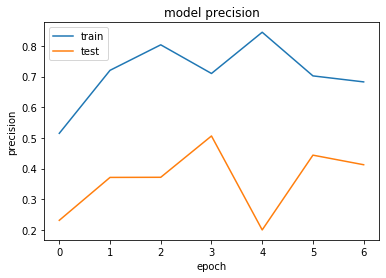


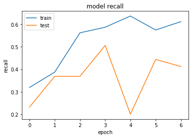


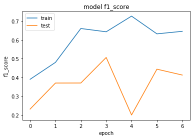


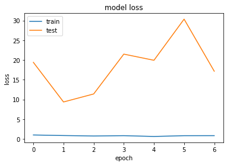


```python
#Testamos uma abordagem extra com o classificador Xception, mas os resultados foram bem abaixo do esperado.
#Iremos agora testar com outros classificadores, começando pelo InceptionV3.
```


```python
from keras.applications import InceptionV3

```


```python
conv_base = InceptionV3(include_top=False)

for layer in conv_base.layers:
    layer.trainable = False
```

    WARNING:tensorflow:From C:\Users\Infotecno\anaconda3\lib\site-packages\keras\backend\tensorflow_backend.py:4074: The name tf.nn.avg_pool is deprecated. Please use tf.nn.avg_pool2d instead.
    
    Downloading data from https://github.com/fchollet/deep-learning-models/releases/download/v0.5/inception_v3_weights_tf_dim_ordering_tf_kernels_notop.h5
    87916544/87910968 [==============================] - 204s 2us/step
    


```python
x = conv_base.output
x = layers.GlobalAveragePooling2D()(x)
x = layers.Dense(128, activation='relu')(x) 

predictions = layers.Dense(qtde_classes, activation='softmax')(x)
model = Model(conv_base.input, predictions)

model.summary()
```

    Model: "model_2"
    __________________________________________________________________________________________________
    Layer (type)                    Output Shape         Param #     Connected to                     
    ==================================================================================================
    input_2 (InputLayer)            (None, None, None, 3 0                                            
    __________________________________________________________________________________________________
    conv2d_5 (Conv2D)               (None, None, None, 3 864         input_2[0][0]                    
    __________________________________________________________________________________________________
    batch_normalization_5 (BatchNor (None, None, None, 3 96          conv2d_5[0][0]                   
    __________________________________________________________________________________________________
    activation_1 (Activation)       (None, None, None, 3 0           batch_normalization_5[0][0]      
    __________________________________________________________________________________________________
    conv2d_6 (Conv2D)               (None, None, None, 3 9216        activation_1[0][0]               
    __________________________________________________________________________________________________
    batch_normalization_6 (BatchNor (None, None, None, 3 96          conv2d_6[0][0]                   
    __________________________________________________________________________________________________
    activation_2 (Activation)       (None, None, None, 3 0           batch_normalization_6[0][0]      
    __________________________________________________________________________________________________
    conv2d_7 (Conv2D)               (None, None, None, 6 18432       activation_2[0][0]               
    __________________________________________________________________________________________________
    batch_normalization_7 (BatchNor (None, None, None, 6 192         conv2d_7[0][0]                   
    __________________________________________________________________________________________________
    activation_3 (Activation)       (None, None, None, 6 0           batch_normalization_7[0][0]      
    __________________________________________________________________________________________________
    max_pooling2d_1 (MaxPooling2D)  (None, None, None, 6 0           activation_3[0][0]               
    __________________________________________________________________________________________________
    conv2d_8 (Conv2D)               (None, None, None, 8 5120        max_pooling2d_1[0][0]            
    __________________________________________________________________________________________________
    batch_normalization_8 (BatchNor (None, None, None, 8 240         conv2d_8[0][0]                   
    __________________________________________________________________________________________________
    activation_4 (Activation)       (None, None, None, 8 0           batch_normalization_8[0][0]      
    __________________________________________________________________________________________________
    conv2d_9 (Conv2D)               (None, None, None, 1 138240      activation_4[0][0]               
    __________________________________________________________________________________________________
    batch_normalization_9 (BatchNor (None, None, None, 1 576         conv2d_9[0][0]                   
    __________________________________________________________________________________________________
    activation_5 (Activation)       (None, None, None, 1 0           batch_normalization_9[0][0]      
    __________________________________________________________________________________________________
    max_pooling2d_2 (MaxPooling2D)  (None, None, None, 1 0           activation_5[0][0]               
    __________________________________________________________________________________________________
    conv2d_13 (Conv2D)              (None, None, None, 6 12288       max_pooling2d_2[0][0]            
    __________________________________________________________________________________________________
    batch_normalization_13 (BatchNo (None, None, None, 6 192         conv2d_13[0][0]                  
    __________________________________________________________________________________________________
    activation_9 (Activation)       (None, None, None, 6 0           batch_normalization_13[0][0]     
    __________________________________________________________________________________________________
    conv2d_11 (Conv2D)              (None, None, None, 4 9216        max_pooling2d_2[0][0]            
    __________________________________________________________________________________________________
    conv2d_14 (Conv2D)              (None, None, None, 9 55296       activation_9[0][0]               
    __________________________________________________________________________________________________
    batch_normalization_11 (BatchNo (None, None, None, 4 144         conv2d_11[0][0]                  
    __________________________________________________________________________________________________
    batch_normalization_14 (BatchNo (None, None, None, 9 288         conv2d_14[0][0]                  
    __________________________________________________________________________________________________
    activation_7 (Activation)       (None, None, None, 4 0           batch_normalization_11[0][0]     
    __________________________________________________________________________________________________
    activation_10 (Activation)      (None, None, None, 9 0           batch_normalization_14[0][0]     
    __________________________________________________________________________________________________
    average_pooling2d_1 (AveragePoo (None, None, None, 1 0           max_pooling2d_2[0][0]            
    __________________________________________________________________________________________________
    conv2d_10 (Conv2D)              (None, None, None, 6 12288       max_pooling2d_2[0][0]            
    __________________________________________________________________________________________________
    conv2d_12 (Conv2D)              (None, None, None, 6 76800       activation_7[0][0]               
    __________________________________________________________________________________________________
    conv2d_15 (Conv2D)              (None, None, None, 9 82944       activation_10[0][0]              
    __________________________________________________________________________________________________
    conv2d_16 (Conv2D)              (None, None, None, 3 6144        average_pooling2d_1[0][0]        
    __________________________________________________________________________________________________
    batch_normalization_10 (BatchNo (None, None, None, 6 192         conv2d_10[0][0]                  
    __________________________________________________________________________________________________
    batch_normalization_12 (BatchNo (None, None, None, 6 192         conv2d_12[0][0]                  
    __________________________________________________________________________________________________
    batch_normalization_15 (BatchNo (None, None, None, 9 288         conv2d_15[0][0]                  
    __________________________________________________________________________________________________
    batch_normalization_16 (BatchNo (None, None, None, 3 96          conv2d_16[0][0]                  
    __________________________________________________________________________________________________
    activation_6 (Activation)       (None, None, None, 6 0           batch_normalization_10[0][0]     
    __________________________________________________________________________________________________
    activation_8 (Activation)       (None, None, None, 6 0           batch_normalization_12[0][0]     
    __________________________________________________________________________________________________
    activation_11 (Activation)      (None, None, None, 9 0           batch_normalization_15[0][0]     
    __________________________________________________________________________________________________
    activation_12 (Activation)      (None, None, None, 3 0           batch_normalization_16[0][0]     
    __________________________________________________________________________________________________
    mixed0 (Concatenate)            (None, None, None, 2 0           activation_6[0][0]               
                                                                     activation_8[0][0]               
                                                                     activation_11[0][0]              
                                                                     activation_12[0][0]              
    __________________________________________________________________________________________________
    conv2d_20 (Conv2D)              (None, None, None, 6 16384       mixed0[0][0]                     
    __________________________________________________________________________________________________
    batch_normalization_20 (BatchNo (None, None, None, 6 192         conv2d_20[0][0]                  
    __________________________________________________________________________________________________
    activation_16 (Activation)      (None, None, None, 6 0           batch_normalization_20[0][0]     
    __________________________________________________________________________________________________
    conv2d_18 (Conv2D)              (None, None, None, 4 12288       mixed0[0][0]                     
    __________________________________________________________________________________________________
    conv2d_21 (Conv2D)              (None, None, None, 9 55296       activation_16[0][0]              
    __________________________________________________________________________________________________
    batch_normalization_18 (BatchNo (None, None, None, 4 144         conv2d_18[0][0]                  
    __________________________________________________________________________________________________
    batch_normalization_21 (BatchNo (None, None, None, 9 288         conv2d_21[0][0]                  
    __________________________________________________________________________________________________
    activation_14 (Activation)      (None, None, None, 4 0           batch_normalization_18[0][0]     
    __________________________________________________________________________________________________
    activation_17 (Activation)      (None, None, None, 9 0           batch_normalization_21[0][0]     
    __________________________________________________________________________________________________
    average_pooling2d_2 (AveragePoo (None, None, None, 2 0           mixed0[0][0]                     
    __________________________________________________________________________________________________
    conv2d_17 (Conv2D)              (None, None, None, 6 16384       mixed0[0][0]                     
    __________________________________________________________________________________________________
    conv2d_19 (Conv2D)              (None, None, None, 6 76800       activation_14[0][0]              
    __________________________________________________________________________________________________
    conv2d_22 (Conv2D)              (None, None, None, 9 82944       activation_17[0][0]              
    __________________________________________________________________________________________________
    conv2d_23 (Conv2D)              (None, None, None, 6 16384       average_pooling2d_2[0][0]        
    __________________________________________________________________________________________________
    batch_normalization_17 (BatchNo (None, None, None, 6 192         conv2d_17[0][0]                  
    __________________________________________________________________________________________________
    batch_normalization_19 (BatchNo (None, None, None, 6 192         conv2d_19[0][0]                  
    __________________________________________________________________________________________________
    batch_normalization_22 (BatchNo (None, None, None, 9 288         conv2d_22[0][0]                  
    __________________________________________________________________________________________________
    batch_normalization_23 (BatchNo (None, None, None, 6 192         conv2d_23[0][0]                  
    __________________________________________________________________________________________________
    activation_13 (Activation)      (None, None, None, 6 0           batch_normalization_17[0][0]     
    __________________________________________________________________________________________________
    activation_15 (Activation)      (None, None, None, 6 0           batch_normalization_19[0][0]     
    __________________________________________________________________________________________________
    activation_18 (Activation)      (None, None, None, 9 0           batch_normalization_22[0][0]     
    __________________________________________________________________________________________________
    activation_19 (Activation)      (None, None, None, 6 0           batch_normalization_23[0][0]     
    __________________________________________________________________________________________________
    mixed1 (Concatenate)            (None, None, None, 2 0           activation_13[0][0]              
                                                                     activation_15[0][0]              
                                                                     activation_18[0][0]              
                                                                     activation_19[0][0]              
    __________________________________________________________________________________________________
    conv2d_27 (Conv2D)              (None, None, None, 6 18432       mixed1[0][0]                     
    __________________________________________________________________________________________________
    batch_normalization_27 (BatchNo (None, None, None, 6 192         conv2d_27[0][0]                  
    __________________________________________________________________________________________________
    activation_23 (Activation)      (None, None, None, 6 0           batch_normalization_27[0][0]     
    __________________________________________________________________________________________________
    conv2d_25 (Conv2D)              (None, None, None, 4 13824       mixed1[0][0]                     
    __________________________________________________________________________________________________
    conv2d_28 (Conv2D)              (None, None, None, 9 55296       activation_23[0][0]              
    __________________________________________________________________________________________________
    batch_normalization_25 (BatchNo (None, None, None, 4 144         conv2d_25[0][0]                  
    __________________________________________________________________________________________________
    batch_normalization_28 (BatchNo (None, None, None, 9 288         conv2d_28[0][0]                  
    __________________________________________________________________________________________________
    activation_21 (Activation)      (None, None, None, 4 0           batch_normalization_25[0][0]     
    __________________________________________________________________________________________________
    activation_24 (Activation)      (None, None, None, 9 0           batch_normalization_28[0][0]     
    __________________________________________________________________________________________________
    average_pooling2d_3 (AveragePoo (None, None, None, 2 0           mixed1[0][0]                     
    __________________________________________________________________________________________________
    conv2d_24 (Conv2D)              (None, None, None, 6 18432       mixed1[0][0]                     
    __________________________________________________________________________________________________
    conv2d_26 (Conv2D)              (None, None, None, 6 76800       activation_21[0][0]              
    __________________________________________________________________________________________________
    conv2d_29 (Conv2D)              (None, None, None, 9 82944       activation_24[0][0]              
    __________________________________________________________________________________________________
    conv2d_30 (Conv2D)              (None, None, None, 6 18432       average_pooling2d_3[0][0]        
    __________________________________________________________________________________________________
    batch_normalization_24 (BatchNo (None, None, None, 6 192         conv2d_24[0][0]                  
    __________________________________________________________________________________________________
    batch_normalization_26 (BatchNo (None, None, None, 6 192         conv2d_26[0][0]                  
    __________________________________________________________________________________________________
    batch_normalization_29 (BatchNo (None, None, None, 9 288         conv2d_29[0][0]                  
    __________________________________________________________________________________________________
    batch_normalization_30 (BatchNo (None, None, None, 6 192         conv2d_30[0][0]                  
    __________________________________________________________________________________________________
    activation_20 (Activation)      (None, None, None, 6 0           batch_normalization_24[0][0]     
    __________________________________________________________________________________________________
    activation_22 (Activation)      (None, None, None, 6 0           batch_normalization_26[0][0]     
    __________________________________________________________________________________________________
    activation_25 (Activation)      (None, None, None, 9 0           batch_normalization_29[0][0]     
    __________________________________________________________________________________________________
    activation_26 (Activation)      (None, None, None, 6 0           batch_normalization_30[0][0]     
    __________________________________________________________________________________________________
    mixed2 (Concatenate)            (None, None, None, 2 0           activation_20[0][0]              
                                                                     activation_22[0][0]              
                                                                     activation_25[0][0]              
                                                                     activation_26[0][0]              
    __________________________________________________________________________________________________
    conv2d_32 (Conv2D)              (None, None, None, 6 18432       mixed2[0][0]                     
    __________________________________________________________________________________________________
    batch_normalization_32 (BatchNo (None, None, None, 6 192         conv2d_32[0][0]                  
    __________________________________________________________________________________________________
    activation_28 (Activation)      (None, None, None, 6 0           batch_normalization_32[0][0]     
    __________________________________________________________________________________________________
    conv2d_33 (Conv2D)              (None, None, None, 9 55296       activation_28[0][0]              
    __________________________________________________________________________________________________
    batch_normalization_33 (BatchNo (None, None, None, 9 288         conv2d_33[0][0]                  
    __________________________________________________________________________________________________
    activation_29 (Activation)      (None, None, None, 9 0           batch_normalization_33[0][0]     
    __________________________________________________________________________________________________
    conv2d_31 (Conv2D)              (None, None, None, 3 995328      mixed2[0][0]                     
    __________________________________________________________________________________________________
    conv2d_34 (Conv2D)              (None, None, None, 9 82944       activation_29[0][0]              
    __________________________________________________________________________________________________
    batch_normalization_31 (BatchNo (None, None, None, 3 1152        conv2d_31[0][0]                  
    __________________________________________________________________________________________________
    batch_normalization_34 (BatchNo (None, None, None, 9 288         conv2d_34[0][0]                  
    __________________________________________________________________________________________________
    activation_27 (Activation)      (None, None, None, 3 0           batch_normalization_31[0][0]     
    __________________________________________________________________________________________________
    activation_30 (Activation)      (None, None, None, 9 0           batch_normalization_34[0][0]     
    __________________________________________________________________________________________________
    max_pooling2d_3 (MaxPooling2D)  (None, None, None, 2 0           mixed2[0][0]                     
    __________________________________________________________________________________________________
    mixed3 (Concatenate)            (None, None, None, 7 0           activation_27[0][0]              
                                                                     activation_30[0][0]              
                                                                     max_pooling2d_3[0][0]            
    __________________________________________________________________________________________________
    conv2d_39 (Conv2D)              (None, None, None, 1 98304       mixed3[0][0]                     
    __________________________________________________________________________________________________
    batch_normalization_39 (BatchNo (None, None, None, 1 384         conv2d_39[0][0]                  
    __________________________________________________________________________________________________
    activation_35 (Activation)      (None, None, None, 1 0           batch_normalization_39[0][0]     
    __________________________________________________________________________________________________
    conv2d_40 (Conv2D)              (None, None, None, 1 114688      activation_35[0][0]              
    __________________________________________________________________________________________________
    batch_normalization_40 (BatchNo (None, None, None, 1 384         conv2d_40[0][0]                  
    __________________________________________________________________________________________________
    activation_36 (Activation)      (None, None, None, 1 0           batch_normalization_40[0][0]     
    __________________________________________________________________________________________________
    conv2d_36 (Conv2D)              (None, None, None, 1 98304       mixed3[0][0]                     
    __________________________________________________________________________________________________
    conv2d_41 (Conv2D)              (None, None, None, 1 114688      activation_36[0][0]              
    __________________________________________________________________________________________________
    batch_normalization_36 (BatchNo (None, None, None, 1 384         conv2d_36[0][0]                  
    __________________________________________________________________________________________________
    batch_normalization_41 (BatchNo (None, None, None, 1 384         conv2d_41[0][0]                  
    __________________________________________________________________________________________________
    activation_32 (Activation)      (None, None, None, 1 0           batch_normalization_36[0][0]     
    __________________________________________________________________________________________________
    activation_37 (Activation)      (None, None, None, 1 0           batch_normalization_41[0][0]     
    __________________________________________________________________________________________________
    conv2d_37 (Conv2D)              (None, None, None, 1 114688      activation_32[0][0]              
    __________________________________________________________________________________________________
    conv2d_42 (Conv2D)              (None, None, None, 1 114688      activation_37[0][0]              
    __________________________________________________________________________________________________
    batch_normalization_37 (BatchNo (None, None, None, 1 384         conv2d_37[0][0]                  
    __________________________________________________________________________________________________
    batch_normalization_42 (BatchNo (None, None, None, 1 384         conv2d_42[0][0]                  
    __________________________________________________________________________________________________
    activation_33 (Activation)      (None, None, None, 1 0           batch_normalization_37[0][0]     
    __________________________________________________________________________________________________
    activation_38 (Activation)      (None, None, None, 1 0           batch_normalization_42[0][0]     
    __________________________________________________________________________________________________
    average_pooling2d_4 (AveragePoo (None, None, None, 7 0           mixed3[0][0]                     
    __________________________________________________________________________________________________
    conv2d_35 (Conv2D)              (None, None, None, 1 147456      mixed3[0][0]                     
    __________________________________________________________________________________________________
    conv2d_38 (Conv2D)              (None, None, None, 1 172032      activation_33[0][0]              
    __________________________________________________________________________________________________
    conv2d_43 (Conv2D)              (None, None, None, 1 172032      activation_38[0][0]              
    __________________________________________________________________________________________________
    conv2d_44 (Conv2D)              (None, None, None, 1 147456      average_pooling2d_4[0][0]        
    __________________________________________________________________________________________________
    batch_normalization_35 (BatchNo (None, None, None, 1 576         conv2d_35[0][0]                  
    __________________________________________________________________________________________________
    batch_normalization_38 (BatchNo (None, None, None, 1 576         conv2d_38[0][0]                  
    __________________________________________________________________________________________________
    batch_normalization_43 (BatchNo (None, None, None, 1 576         conv2d_43[0][0]                  
    __________________________________________________________________________________________________
    batch_normalization_44 (BatchNo (None, None, None, 1 576         conv2d_44[0][0]                  
    __________________________________________________________________________________________________
    activation_31 (Activation)      (None, None, None, 1 0           batch_normalization_35[0][0]     
    __________________________________________________________________________________________________
    activation_34 (Activation)      (None, None, None, 1 0           batch_normalization_38[0][0]     
    __________________________________________________________________________________________________
    activation_39 (Activation)      (None, None, None, 1 0           batch_normalization_43[0][0]     
    __________________________________________________________________________________________________
    activation_40 (Activation)      (None, None, None, 1 0           batch_normalization_44[0][0]     
    __________________________________________________________________________________________________
    mixed4 (Concatenate)            (None, None, None, 7 0           activation_31[0][0]              
                                                                     activation_34[0][0]              
                                                                     activation_39[0][0]              
                                                                     activation_40[0][0]              
    __________________________________________________________________________________________________
    conv2d_49 (Conv2D)              (None, None, None, 1 122880      mixed4[0][0]                     
    __________________________________________________________________________________________________
    batch_normalization_49 (BatchNo (None, None, None, 1 480         conv2d_49[0][0]                  
    __________________________________________________________________________________________________
    activation_45 (Activation)      (None, None, None, 1 0           batch_normalization_49[0][0]     
    __________________________________________________________________________________________________
    conv2d_50 (Conv2D)              (None, None, None, 1 179200      activation_45[0][0]              
    __________________________________________________________________________________________________
    batch_normalization_50 (BatchNo (None, None, None, 1 480         conv2d_50[0][0]                  
    __________________________________________________________________________________________________
    activation_46 (Activation)      (None, None, None, 1 0           batch_normalization_50[0][0]     
    __________________________________________________________________________________________________
    conv2d_46 (Conv2D)              (None, None, None, 1 122880      mixed4[0][0]                     
    __________________________________________________________________________________________________
    conv2d_51 (Conv2D)              (None, None, None, 1 179200      activation_46[0][0]              
    __________________________________________________________________________________________________
    batch_normalization_46 (BatchNo (None, None, None, 1 480         conv2d_46[0][0]                  
    __________________________________________________________________________________________________
    batch_normalization_51 (BatchNo (None, None, None, 1 480         conv2d_51[0][0]                  
    __________________________________________________________________________________________________
    activation_42 (Activation)      (None, None, None, 1 0           batch_normalization_46[0][0]     
    __________________________________________________________________________________________________
    activation_47 (Activation)      (None, None, None, 1 0           batch_normalization_51[0][0]     
    __________________________________________________________________________________________________
    conv2d_47 (Conv2D)              (None, None, None, 1 179200      activation_42[0][0]              
    __________________________________________________________________________________________________
    conv2d_52 (Conv2D)              (None, None, None, 1 179200      activation_47[0][0]              
    __________________________________________________________________________________________________
    batch_normalization_47 (BatchNo (None, None, None, 1 480         conv2d_47[0][0]                  
    __________________________________________________________________________________________________
    batch_normalization_52 (BatchNo (None, None, None, 1 480         conv2d_52[0][0]                  
    __________________________________________________________________________________________________
    activation_43 (Activation)      (None, None, None, 1 0           batch_normalization_47[0][0]     
    __________________________________________________________________________________________________
    activation_48 (Activation)      (None, None, None, 1 0           batch_normalization_52[0][0]     
    __________________________________________________________________________________________________
    average_pooling2d_5 (AveragePoo (None, None, None, 7 0           mixed4[0][0]                     
    __________________________________________________________________________________________________
    conv2d_45 (Conv2D)              (None, None, None, 1 147456      mixed4[0][0]                     
    __________________________________________________________________________________________________
    conv2d_48 (Conv2D)              (None, None, None, 1 215040      activation_43[0][0]              
    __________________________________________________________________________________________________
    conv2d_53 (Conv2D)              (None, None, None, 1 215040      activation_48[0][0]              
    __________________________________________________________________________________________________
    conv2d_54 (Conv2D)              (None, None, None, 1 147456      average_pooling2d_5[0][0]        
    __________________________________________________________________________________________________
    batch_normalization_45 (BatchNo (None, None, None, 1 576         conv2d_45[0][0]                  
    __________________________________________________________________________________________________
    batch_normalization_48 (BatchNo (None, None, None, 1 576         conv2d_48[0][0]                  
    __________________________________________________________________________________________________
    batch_normalization_53 (BatchNo (None, None, None, 1 576         conv2d_53[0][0]                  
    __________________________________________________________________________________________________
    batch_normalization_54 (BatchNo (None, None, None, 1 576         conv2d_54[0][0]                  
    __________________________________________________________________________________________________
    activation_41 (Activation)      (None, None, None, 1 0           batch_normalization_45[0][0]     
    __________________________________________________________________________________________________
    activation_44 (Activation)      (None, None, None, 1 0           batch_normalization_48[0][0]     
    __________________________________________________________________________________________________
    activation_49 (Activation)      (None, None, None, 1 0           batch_normalization_53[0][0]     
    __________________________________________________________________________________________________
    activation_50 (Activation)      (None, None, None, 1 0           batch_normalization_54[0][0]     
    __________________________________________________________________________________________________
    mixed5 (Concatenate)            (None, None, None, 7 0           activation_41[0][0]              
                                                                     activation_44[0][0]              
                                                                     activation_49[0][0]              
                                                                     activation_50[0][0]              
    __________________________________________________________________________________________________
    conv2d_59 (Conv2D)              (None, None, None, 1 122880      mixed5[0][0]                     
    __________________________________________________________________________________________________
    batch_normalization_59 (BatchNo (None, None, None, 1 480         conv2d_59[0][0]                  
    __________________________________________________________________________________________________
    activation_55 (Activation)      (None, None, None, 1 0           batch_normalization_59[0][0]     
    __________________________________________________________________________________________________
    conv2d_60 (Conv2D)              (None, None, None, 1 179200      activation_55[0][0]              
    __________________________________________________________________________________________________
    batch_normalization_60 (BatchNo (None, None, None, 1 480         conv2d_60[0][0]                  
    __________________________________________________________________________________________________
    activation_56 (Activation)      (None, None, None, 1 0           batch_normalization_60[0][0]     
    __________________________________________________________________________________________________
    conv2d_56 (Conv2D)              (None, None, None, 1 122880      mixed5[0][0]                     
    __________________________________________________________________________________________________
    conv2d_61 (Conv2D)              (None, None, None, 1 179200      activation_56[0][0]              
    __________________________________________________________________________________________________
    batch_normalization_56 (BatchNo (None, None, None, 1 480         conv2d_56[0][0]                  
    __________________________________________________________________________________________________
    batch_normalization_61 (BatchNo (None, None, None, 1 480         conv2d_61[0][0]                  
    __________________________________________________________________________________________________
    activation_52 (Activation)      (None, None, None, 1 0           batch_normalization_56[0][0]     
    __________________________________________________________________________________________________
    activation_57 (Activation)      (None, None, None, 1 0           batch_normalization_61[0][0]     
    __________________________________________________________________________________________________
    conv2d_57 (Conv2D)              (None, None, None, 1 179200      activation_52[0][0]              
    __________________________________________________________________________________________________
    conv2d_62 (Conv2D)              (None, None, None, 1 179200      activation_57[0][0]              
    __________________________________________________________________________________________________
    batch_normalization_57 (BatchNo (None, None, None, 1 480         conv2d_57[0][0]                  
    __________________________________________________________________________________________________
    batch_normalization_62 (BatchNo (None, None, None, 1 480         conv2d_62[0][0]                  
    __________________________________________________________________________________________________
    activation_53 (Activation)      (None, None, None, 1 0           batch_normalization_57[0][0]     
    __________________________________________________________________________________________________
    activation_58 (Activation)      (None, None, None, 1 0           batch_normalization_62[0][0]     
    __________________________________________________________________________________________________
    average_pooling2d_6 (AveragePoo (None, None, None, 7 0           mixed5[0][0]                     
    __________________________________________________________________________________________________
    conv2d_55 (Conv2D)              (None, None, None, 1 147456      mixed5[0][0]                     
    __________________________________________________________________________________________________
    conv2d_58 (Conv2D)              (None, None, None, 1 215040      activation_53[0][0]              
    __________________________________________________________________________________________________
    conv2d_63 (Conv2D)              (None, None, None, 1 215040      activation_58[0][0]              
    __________________________________________________________________________________________________
    conv2d_64 (Conv2D)              (None, None, None, 1 147456      average_pooling2d_6[0][0]        
    __________________________________________________________________________________________________
    batch_normalization_55 (BatchNo (None, None, None, 1 576         conv2d_55[0][0]                  
    __________________________________________________________________________________________________
    batch_normalization_58 (BatchNo (None, None, None, 1 576         conv2d_58[0][0]                  
    __________________________________________________________________________________________________
    batch_normalization_63 (BatchNo (None, None, None, 1 576         conv2d_63[0][0]                  
    __________________________________________________________________________________________________
    batch_normalization_64 (BatchNo (None, None, None, 1 576         conv2d_64[0][0]                  
    __________________________________________________________________________________________________
    activation_51 (Activation)      (None, None, None, 1 0           batch_normalization_55[0][0]     
    __________________________________________________________________________________________________
    activation_54 (Activation)      (None, None, None, 1 0           batch_normalization_58[0][0]     
    __________________________________________________________________________________________________
    activation_59 (Activation)      (None, None, None, 1 0           batch_normalization_63[0][0]     
    __________________________________________________________________________________________________
    activation_60 (Activation)      (None, None, None, 1 0           batch_normalization_64[0][0]     
    __________________________________________________________________________________________________
    mixed6 (Concatenate)            (None, None, None, 7 0           activation_51[0][0]              
                                                                     activation_54[0][0]              
                                                                     activation_59[0][0]              
                                                                     activation_60[0][0]              
    __________________________________________________________________________________________________
    conv2d_69 (Conv2D)              (None, None, None, 1 147456      mixed6[0][0]                     
    __________________________________________________________________________________________________
    batch_normalization_69 (BatchNo (None, None, None, 1 576         conv2d_69[0][0]                  
    __________________________________________________________________________________________________
    activation_65 (Activation)      (None, None, None, 1 0           batch_normalization_69[0][0]     
    __________________________________________________________________________________________________
    conv2d_70 (Conv2D)              (None, None, None, 1 258048      activation_65[0][0]              
    __________________________________________________________________________________________________
    batch_normalization_70 (BatchNo (None, None, None, 1 576         conv2d_70[0][0]                  
    __________________________________________________________________________________________________
    activation_66 (Activation)      (None, None, None, 1 0           batch_normalization_70[0][0]     
    __________________________________________________________________________________________________
    conv2d_66 (Conv2D)              (None, None, None, 1 147456      mixed6[0][0]                     
    __________________________________________________________________________________________________
    conv2d_71 (Conv2D)              (None, None, None, 1 258048      activation_66[0][0]              
    __________________________________________________________________________________________________
    batch_normalization_66 (BatchNo (None, None, None, 1 576         conv2d_66[0][0]                  
    __________________________________________________________________________________________________
    batch_normalization_71 (BatchNo (None, None, None, 1 576         conv2d_71[0][0]                  
    __________________________________________________________________________________________________
    activation_62 (Activation)      (None, None, None, 1 0           batch_normalization_66[0][0]     
    __________________________________________________________________________________________________
    activation_67 (Activation)      (None, None, None, 1 0           batch_normalization_71[0][0]     
    __________________________________________________________________________________________________
    conv2d_67 (Conv2D)              (None, None, None, 1 258048      activation_62[0][0]              
    __________________________________________________________________________________________________
    conv2d_72 (Conv2D)              (None, None, None, 1 258048      activation_67[0][0]              
    __________________________________________________________________________________________________
    batch_normalization_67 (BatchNo (None, None, None, 1 576         conv2d_67[0][0]                  
    __________________________________________________________________________________________________
    batch_normalization_72 (BatchNo (None, None, None, 1 576         conv2d_72[0][0]                  
    __________________________________________________________________________________________________
    activation_63 (Activation)      (None, None, None, 1 0           batch_normalization_67[0][0]     
    __________________________________________________________________________________________________
    activation_68 (Activation)      (None, None, None, 1 0           batch_normalization_72[0][0]     
    __________________________________________________________________________________________________
    average_pooling2d_7 (AveragePoo (None, None, None, 7 0           mixed6[0][0]                     
    __________________________________________________________________________________________________
    conv2d_65 (Conv2D)              (None, None, None, 1 147456      mixed6[0][0]                     
    __________________________________________________________________________________________________
    conv2d_68 (Conv2D)              (None, None, None, 1 258048      activation_63[0][0]              
    __________________________________________________________________________________________________
    conv2d_73 (Conv2D)              (None, None, None, 1 258048      activation_68[0][0]              
    __________________________________________________________________________________________________
    conv2d_74 (Conv2D)              (None, None, None, 1 147456      average_pooling2d_7[0][0]        
    __________________________________________________________________________________________________
    batch_normalization_65 (BatchNo (None, None, None, 1 576         conv2d_65[0][0]                  
    __________________________________________________________________________________________________
    batch_normalization_68 (BatchNo (None, None, None, 1 576         conv2d_68[0][0]                  
    __________________________________________________________________________________________________
    batch_normalization_73 (BatchNo (None, None, None, 1 576         conv2d_73[0][0]                  
    __________________________________________________________________________________________________
    batch_normalization_74 (BatchNo (None, None, None, 1 576         conv2d_74[0][0]                  
    __________________________________________________________________________________________________
    activation_61 (Activation)      (None, None, None, 1 0           batch_normalization_65[0][0]     
    __________________________________________________________________________________________________
    activation_64 (Activation)      (None, None, None, 1 0           batch_normalization_68[0][0]     
    __________________________________________________________________________________________________
    activation_69 (Activation)      (None, None, None, 1 0           batch_normalization_73[0][0]     
    __________________________________________________________________________________________________
    activation_70 (Activation)      (None, None, None, 1 0           batch_normalization_74[0][0]     
    __________________________________________________________________________________________________
    mixed7 (Concatenate)            (None, None, None, 7 0           activation_61[0][0]              
                                                                     activation_64[0][0]              
                                                                     activation_69[0][0]              
                                                                     activation_70[0][0]              
    __________________________________________________________________________________________________
    conv2d_77 (Conv2D)              (None, None, None, 1 147456      mixed7[0][0]                     
    __________________________________________________________________________________________________
    batch_normalization_77 (BatchNo (None, None, None, 1 576         conv2d_77[0][0]                  
    __________________________________________________________________________________________________
    activation_73 (Activation)      (None, None, None, 1 0           batch_normalization_77[0][0]     
    __________________________________________________________________________________________________
    conv2d_78 (Conv2D)              (None, None, None, 1 258048      activation_73[0][0]              
    __________________________________________________________________________________________________
    batch_normalization_78 (BatchNo (None, None, None, 1 576         conv2d_78[0][0]                  
    __________________________________________________________________________________________________
    activation_74 (Activation)      (None, None, None, 1 0           batch_normalization_78[0][0]     
    __________________________________________________________________________________________________
    conv2d_75 (Conv2D)              (None, None, None, 1 147456      mixed7[0][0]                     
    __________________________________________________________________________________________________
    conv2d_79 (Conv2D)              (None, None, None, 1 258048      activation_74[0][0]              
    __________________________________________________________________________________________________
    batch_normalization_75 (BatchNo (None, None, None, 1 576         conv2d_75[0][0]                  
    __________________________________________________________________________________________________
    batch_normalization_79 (BatchNo (None, None, None, 1 576         conv2d_79[0][0]                  
    __________________________________________________________________________________________________
    activation_71 (Activation)      (None, None, None, 1 0           batch_normalization_75[0][0]     
    __________________________________________________________________________________________________
    activation_75 (Activation)      (None, None, None, 1 0           batch_normalization_79[0][0]     
    __________________________________________________________________________________________________
    conv2d_76 (Conv2D)              (None, None, None, 3 552960      activation_71[0][0]              
    __________________________________________________________________________________________________
    conv2d_80 (Conv2D)              (None, None, None, 1 331776      activation_75[0][0]              
    __________________________________________________________________________________________________
    batch_normalization_76 (BatchNo (None, None, None, 3 960         conv2d_76[0][0]                  
    __________________________________________________________________________________________________
    batch_normalization_80 (BatchNo (None, None, None, 1 576         conv2d_80[0][0]                  
    __________________________________________________________________________________________________
    activation_72 (Activation)      (None, None, None, 3 0           batch_normalization_76[0][0]     
    __________________________________________________________________________________________________
    activation_76 (Activation)      (None, None, None, 1 0           batch_normalization_80[0][0]     
    __________________________________________________________________________________________________
    max_pooling2d_4 (MaxPooling2D)  (None, None, None, 7 0           mixed7[0][0]                     
    __________________________________________________________________________________________________
    mixed8 (Concatenate)            (None, None, None, 1 0           activation_72[0][0]              
                                                                     activation_76[0][0]              
                                                                     max_pooling2d_4[0][0]            
    __________________________________________________________________________________________________
    conv2d_85 (Conv2D)              (None, None, None, 4 573440      mixed8[0][0]                     
    __________________________________________________________________________________________________
    batch_normalization_85 (BatchNo (None, None, None, 4 1344        conv2d_85[0][0]                  
    __________________________________________________________________________________________________
    activation_81 (Activation)      (None, None, None, 4 0           batch_normalization_85[0][0]     
    __________________________________________________________________________________________________
    conv2d_82 (Conv2D)              (None, None, None, 3 491520      mixed8[0][0]                     
    __________________________________________________________________________________________________
    conv2d_86 (Conv2D)              (None, None, None, 3 1548288     activation_81[0][0]              
    __________________________________________________________________________________________________
    batch_normalization_82 (BatchNo (None, None, None, 3 1152        conv2d_82[0][0]                  
    __________________________________________________________________________________________________
    batch_normalization_86 (BatchNo (None, None, None, 3 1152        conv2d_86[0][0]                  
    __________________________________________________________________________________________________
    activation_78 (Activation)      (None, None, None, 3 0           batch_normalization_82[0][0]     
    __________________________________________________________________________________________________
    activation_82 (Activation)      (None, None, None, 3 0           batch_normalization_86[0][0]     
    __________________________________________________________________________________________________
    conv2d_83 (Conv2D)              (None, None, None, 3 442368      activation_78[0][0]              
    __________________________________________________________________________________________________
    conv2d_84 (Conv2D)              (None, None, None, 3 442368      activation_78[0][0]              
    __________________________________________________________________________________________________
    conv2d_87 (Conv2D)              (None, None, None, 3 442368      activation_82[0][0]              
    __________________________________________________________________________________________________
    conv2d_88 (Conv2D)              (None, None, None, 3 442368      activation_82[0][0]              
    __________________________________________________________________________________________________
    average_pooling2d_8 (AveragePoo (None, None, None, 1 0           mixed8[0][0]                     
    __________________________________________________________________________________________________
    conv2d_81 (Conv2D)              (None, None, None, 3 409600      mixed8[0][0]                     
    __________________________________________________________________________________________________
    batch_normalization_83 (BatchNo (None, None, None, 3 1152        conv2d_83[0][0]                  
    __________________________________________________________________________________________________
    batch_normalization_84 (BatchNo (None, None, None, 3 1152        conv2d_84[0][0]                  
    __________________________________________________________________________________________________
    batch_normalization_87 (BatchNo (None, None, None, 3 1152        conv2d_87[0][0]                  
    __________________________________________________________________________________________________
    batch_normalization_88 (BatchNo (None, None, None, 3 1152        conv2d_88[0][0]                  
    __________________________________________________________________________________________________
    conv2d_89 (Conv2D)              (None, None, None, 1 245760      average_pooling2d_8[0][0]        
    __________________________________________________________________________________________________
    batch_normalization_81 (BatchNo (None, None, None, 3 960         conv2d_81[0][0]                  
    __________________________________________________________________________________________________
    activation_79 (Activation)      (None, None, None, 3 0           batch_normalization_83[0][0]     
    __________________________________________________________________________________________________
    activation_80 (Activation)      (None, None, None, 3 0           batch_normalization_84[0][0]     
    __________________________________________________________________________________________________
    activation_83 (Activation)      (None, None, None, 3 0           batch_normalization_87[0][0]     
    __________________________________________________________________________________________________
    activation_84 (Activation)      (None, None, None, 3 0           batch_normalization_88[0][0]     
    __________________________________________________________________________________________________
    batch_normalization_89 (BatchNo (None, None, None, 1 576         conv2d_89[0][0]                  
    __________________________________________________________________________________________________
    activation_77 (Activation)      (None, None, None, 3 0           batch_normalization_81[0][0]     
    __________________________________________________________________________________________________
    mixed9_0 (Concatenate)          (None, None, None, 7 0           activation_79[0][0]              
                                                                     activation_80[0][0]              
    __________________________________________________________________________________________________
    concatenate_1 (Concatenate)     (None, None, None, 7 0           activation_83[0][0]              
                                                                     activation_84[0][0]              
    __________________________________________________________________________________________________
    activation_85 (Activation)      (None, None, None, 1 0           batch_normalization_89[0][0]     
    __________________________________________________________________________________________________
    mixed9 (Concatenate)            (None, None, None, 2 0           activation_77[0][0]              
                                                                     mixed9_0[0][0]                   
                                                                     concatenate_1[0][0]              
                                                                     activation_85[0][0]              
    __________________________________________________________________________________________________
    conv2d_94 (Conv2D)              (None, None, None, 4 917504      mixed9[0][0]                     
    __________________________________________________________________________________________________
    batch_normalization_94 (BatchNo (None, None, None, 4 1344        conv2d_94[0][0]                  
    __________________________________________________________________________________________________
    activation_90 (Activation)      (None, None, None, 4 0           batch_normalization_94[0][0]     
    __________________________________________________________________________________________________
    conv2d_91 (Conv2D)              (None, None, None, 3 786432      mixed9[0][0]                     
    __________________________________________________________________________________________________
    conv2d_95 (Conv2D)              (None, None, None, 3 1548288     activation_90[0][0]              
    __________________________________________________________________________________________________
    batch_normalization_91 (BatchNo (None, None, None, 3 1152        conv2d_91[0][0]                  
    __________________________________________________________________________________________________
    batch_normalization_95 (BatchNo (None, None, None, 3 1152        conv2d_95[0][0]                  
    __________________________________________________________________________________________________
    activation_87 (Activation)      (None, None, None, 3 0           batch_normalization_91[0][0]     
    __________________________________________________________________________________________________
    activation_91 (Activation)      (None, None, None, 3 0           batch_normalization_95[0][0]     
    __________________________________________________________________________________________________
    conv2d_92 (Conv2D)              (None, None, None, 3 442368      activation_87[0][0]              
    __________________________________________________________________________________________________
    conv2d_93 (Conv2D)              (None, None, None, 3 442368      activation_87[0][0]              
    __________________________________________________________________________________________________
    conv2d_96 (Conv2D)              (None, None, None, 3 442368      activation_91[0][0]              
    __________________________________________________________________________________________________
    conv2d_97 (Conv2D)              (None, None, None, 3 442368      activation_91[0][0]              
    __________________________________________________________________________________________________
    average_pooling2d_9 (AveragePoo (None, None, None, 2 0           mixed9[0][0]                     
    __________________________________________________________________________________________________
    conv2d_90 (Conv2D)              (None, None, None, 3 655360      mixed9[0][0]                     
    __________________________________________________________________________________________________
    batch_normalization_92 (BatchNo (None, None, None, 3 1152        conv2d_92[0][0]                  
    __________________________________________________________________________________________________
    batch_normalization_93 (BatchNo (None, None, None, 3 1152        conv2d_93[0][0]                  
    __________________________________________________________________________________________________
    batch_normalization_96 (BatchNo (None, None, None, 3 1152        conv2d_96[0][0]                  
    __________________________________________________________________________________________________
    batch_normalization_97 (BatchNo (None, None, None, 3 1152        conv2d_97[0][0]                  
    __________________________________________________________________________________________________
    conv2d_98 (Conv2D)              (None, None, None, 1 393216      average_pooling2d_9[0][0]        
    __________________________________________________________________________________________________
    batch_normalization_90 (BatchNo (None, None, None, 3 960         conv2d_90[0][0]                  
    __________________________________________________________________________________________________
    activation_88 (Activation)      (None, None, None, 3 0           batch_normalization_92[0][0]     
    __________________________________________________________________________________________________
    activation_89 (Activation)      (None, None, None, 3 0           batch_normalization_93[0][0]     
    __________________________________________________________________________________________________
    activation_92 (Activation)      (None, None, None, 3 0           batch_normalization_96[0][0]     
    __________________________________________________________________________________________________
    activation_93 (Activation)      (None, None, None, 3 0           batch_normalization_97[0][0]     
    __________________________________________________________________________________________________
    batch_normalization_98 (BatchNo (None, None, None, 1 576         conv2d_98[0][0]                  
    __________________________________________________________________________________________________
    activation_86 (Activation)      (None, None, None, 3 0           batch_normalization_90[0][0]     
    __________________________________________________________________________________________________
    mixed9_1 (Concatenate)          (None, None, None, 7 0           activation_88[0][0]              
                                                                     activation_89[0][0]              
    __________________________________________________________________________________________________
    concatenate_2 (Concatenate)     (None, None, None, 7 0           activation_92[0][0]              
                                                                     activation_93[0][0]              
    __________________________________________________________________________________________________
    activation_94 (Activation)      (None, None, None, 1 0           batch_normalization_98[0][0]     
    __________________________________________________________________________________________________
    mixed10 (Concatenate)           (None, None, None, 2 0           activation_86[0][0]              
                                                                     mixed9_1[0][0]                   
                                                                     concatenate_2[0][0]              
                                                                     activation_94[0][0]              
    __________________________________________________________________________________________________
    global_average_pooling2d_2 (Glo (None, 2048)         0           mixed10[0][0]                    
    __________________________________________________________________________________________________
    dense_3 (Dense)                 (None, 128)          262272      global_average_pooling2d_2[0][0] 
    __________________________________________________________________________________________________
    dense_4 (Dense)                 (None, 3)            387         dense_3[0][0]                    
    ==================================================================================================
    Total params: 22,065,443
    Trainable params: 262,659
    Non-trainable params: 21,802,784
    __________________________________________________________________________________________________
    


```python
optimizer = keras.optimizers.Adam()
model.compile(loss='categorical_crossentropy', optimizer=optimizer, metrics=[precision_score, recall_score, f1_score])
```


```python
qtde_epocas=7
```


```python
history = model.fit_generator(generator=train_generator, 
                              epochs=qtde_epocas, 
                              validation_steps=5, 
                              steps_per_epoch=5, 
                              validation_data=val_generator)
```

    Epoch 1/7
    5/5 [==============================] - 92s 18s/step - loss: 1.3376 - precision_score: 0.5172 - recall_score: 0.4125 - f1_score: 0.4522 - val_loss: 16.9661 - val_precision_score: 0.4062 - val_recall_score: 0.4062 - val_f1_score: 0.4062
    Epoch 2/7
    5/5 [==============================] - 89s 18s/step - loss: 1.0776 - precision_score: 0.5354 - recall_score: 0.1875 - f1_score: 0.2683 - val_loss: 19.9834 - val_precision_score: 0.4563 - val_recall_score: 0.4563 - val_f1_score: 0.4562
    Epoch 3/7
    5/5 [==============================] - 82s 16s/step - loss: 0.9462 - precision_score: 0.6403 - recall_score: 0.4875 - f1_score: 0.5474 - val_loss: 4.4507 - val_precision_score: 0.4125 - val_recall_score: 0.4125 - val_f1_score: 0.4125
    Epoch 4/7
    5/5 [==============================] - 81s 16s/step - loss: 0.9563 - precision_score: 0.6651 - recall_score: 0.4187 - f1_score: 0.5099 - val_loss: 18.4230 - val_precision_score: 0.4437 - val_recall_score: 0.4437 - val_f1_score: 0.4437
    Epoch 5/7
    5/5 [==============================] - 85s 17s/step - loss: 0.9807 - precision_score: 0.6606 - recall_score: 0.4250 - f1_score: 0.5167 - val_loss: 17.1622 - val_precision_score: 0.5375 - val_recall_score: 0.5375 - val_f1_score: 0.5375
    Epoch 6/7
    5/5 [==============================] - 84s 17s/step - loss: 0.7984 - precision_score: 0.8042 - recall_score: 0.4688 - f1_score: 0.5883 - val_loss: 22.2337 - val_precision_score: 0.5375 - val_recall_score: 0.5375 - val_f1_score: 0.5375
    Epoch 7/7
    5/5 [==============================] - 81s 16s/step - loss: 0.8018 - precision_score: 0.6959 - recall_score: 0.5688 - f1_score: 0.6243 - val_loss: 22.6045 - val_precision_score: 0.4062 - val_recall_score: 0.4062 - val_f1_score: 0.4062
    


```python
# Exibindo dados de Precisão
plt.plot(history.history['precision_score'])
plt.plot(history.history['val_precision_score'])
plt.title('model precision')
plt.ylabel('precision')
plt.xlabel('epoch')
plt.legend(['train', 'test'], loc='upper left')
plt.show()

# Exibindo dados de Sensibilidade
plt.plot(history.history['recall_score'])
plt.plot(history.history['val_recall_score'])
plt.title('model recall')
plt.ylabel('recall')
plt.xlabel('epoch')
plt.legend(['train', 'test'], loc='upper left')
plt.show()

# Exibindo dados de F1 Score
plt.plot(history.history['f1_score'])
plt.plot(history.history['val_f1_score'])
plt.title('model f1_score')
plt.ylabel('f1_score')
plt.xlabel('epoch')
plt.legend(['train', 'test'], loc='upper left')
plt.show()

# Exibindo dados de Perda
plt.plot(history.history['loss'])
plt.plot(history.history['val_loss'])
plt.title('model loss')
plt.ylabel('loss')
plt.xlabel('epoch')
plt.legend(['train', 'test'], loc='upper left')
plt.show()
```


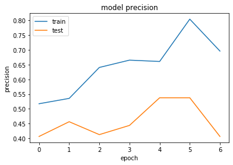


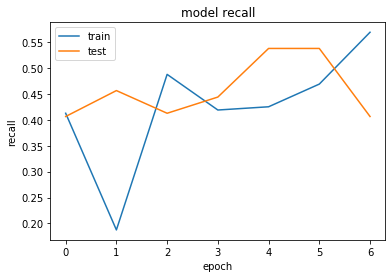


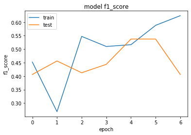


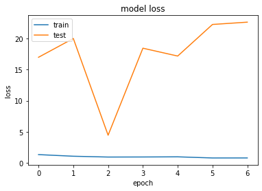


```python
#também não conseguimos uma boa precisão com o classificador InceptionV3
#iremos então testar com o InceptionResNetV2
```


```python
from keras.applications import InceptionResNetV2
```


```python
conv_base = InceptionResNetV2(include_top=False)
for layer in conv_base.layers:
    layer.trainable = False
```

    Downloading data from https://github.com/fchollet/deep-learning-models/releases/download/v0.7/inception_resnet_v2_weights_tf_dim_ordering_tf_kernels_notop.h5
    219062272/219055592 [==============================] - 268s 1us/step
    


```python
x = conv_base.output
x = layers.GlobalAveragePooling2D()(x)
x = layers.Dense(128, activation='relu')(x) 
predictions = layers.Dense(qtde_classes, activation='softmax')(x)
model = Model(conv_base.input, predictions)
model.summary()

```

    Model: "model_3"
    __________________________________________________________________________________________________
    Layer (type)                    Output Shape         Param #     Connected to                     
    ==================================================================================================
    input_3 (InputLayer)            (None, None, None, 3 0                                            
    __________________________________________________________________________________________________
    conv2d_99 (Conv2D)              (None, None, None, 3 864         input_3[0][0]                    
    __________________________________________________________________________________________________
    batch_normalization_99 (BatchNo (None, None, None, 3 96          conv2d_99[0][0]                  
    __________________________________________________________________________________________________
    activation_95 (Activation)      (None, None, None, 3 0           batch_normalization_99[0][0]     
    __________________________________________________________________________________________________
    conv2d_100 (Conv2D)             (None, None, None, 3 9216        activation_95[0][0]              
    __________________________________________________________________________________________________
    batch_normalization_100 (BatchN (None, None, None, 3 96          conv2d_100[0][0]                 
    __________________________________________________________________________________________________
    activation_96 (Activation)      (None, None, None, 3 0           batch_normalization_100[0][0]    
    __________________________________________________________________________________________________
    conv2d_101 (Conv2D)             (None, None, None, 6 18432       activation_96[0][0]              
    __________________________________________________________________________________________________
    batch_normalization_101 (BatchN (None, None, None, 6 192         conv2d_101[0][0]                 
    __________________________________________________________________________________________________
    activation_97 (Activation)      (None, None, None, 6 0           batch_normalization_101[0][0]    
    __________________________________________________________________________________________________
    max_pooling2d_5 (MaxPooling2D)  (None, None, None, 6 0           activation_97[0][0]              
    __________________________________________________________________________________________________
    conv2d_102 (Conv2D)             (None, None, None, 8 5120        max_pooling2d_5[0][0]            
    __________________________________________________________________________________________________
    batch_normalization_102 (BatchN (None, None, None, 8 240         conv2d_102[0][0]                 
    __________________________________________________________________________________________________
    activation_98 (Activation)      (None, None, None, 8 0           batch_normalization_102[0][0]    
    __________________________________________________________________________________________________
    conv2d_103 (Conv2D)             (None, None, None, 1 138240      activation_98[0][0]              
    __________________________________________________________________________________________________
    batch_normalization_103 (BatchN (None, None, None, 1 576         conv2d_103[0][0]                 
    __________________________________________________________________________________________________
    activation_99 (Activation)      (None, None, None, 1 0           batch_normalization_103[0][0]    
    __________________________________________________________________________________________________
    max_pooling2d_6 (MaxPooling2D)  (None, None, None, 1 0           activation_99[0][0]              
    __________________________________________________________________________________________________
    conv2d_107 (Conv2D)             (None, None, None, 6 12288       max_pooling2d_6[0][0]            
    __________________________________________________________________________________________________
    batch_normalization_107 (BatchN (None, None, None, 6 192         conv2d_107[0][0]                 
    __________________________________________________________________________________________________
    activation_103 (Activation)     (None, None, None, 6 0           batch_normalization_107[0][0]    
    __________________________________________________________________________________________________
    conv2d_105 (Conv2D)             (None, None, None, 4 9216        max_pooling2d_6[0][0]            
    __________________________________________________________________________________________________
    conv2d_108 (Conv2D)             (None, None, None, 9 55296       activation_103[0][0]             
    __________________________________________________________________________________________________
    batch_normalization_105 (BatchN (None, None, None, 4 144         conv2d_105[0][0]                 
    __________________________________________________________________________________________________
    batch_normalization_108 (BatchN (None, None, None, 9 288         conv2d_108[0][0]                 
    __________________________________________________________________________________________________
    activation_101 (Activation)     (None, None, None, 4 0           batch_normalization_105[0][0]    
    __________________________________________________________________________________________________
    activation_104 (Activation)     (None, None, None, 9 0           batch_normalization_108[0][0]    
    __________________________________________________________________________________________________
    average_pooling2d_10 (AveragePo (None, None, None, 1 0           max_pooling2d_6[0][0]            
    __________________________________________________________________________________________________
    conv2d_104 (Conv2D)             (None, None, None, 9 18432       max_pooling2d_6[0][0]            
    __________________________________________________________________________________________________
    conv2d_106 (Conv2D)             (None, None, None, 6 76800       activation_101[0][0]             
    __________________________________________________________________________________________________
    conv2d_109 (Conv2D)             (None, None, None, 9 82944       activation_104[0][0]             
    __________________________________________________________________________________________________
    conv2d_110 (Conv2D)             (None, None, None, 6 12288       average_pooling2d_10[0][0]       
    __________________________________________________________________________________________________
    batch_normalization_104 (BatchN (None, None, None, 9 288         conv2d_104[0][0]                 
    __________________________________________________________________________________________________
    batch_normalization_106 (BatchN (None, None, None, 6 192         conv2d_106[0][0]                 
    __________________________________________________________________________________________________
    batch_normalization_109 (BatchN (None, None, None, 9 288         conv2d_109[0][0]                 
    __________________________________________________________________________________________________
    batch_normalization_110 (BatchN (None, None, None, 6 192         conv2d_110[0][0]                 
    __________________________________________________________________________________________________
    activation_100 (Activation)     (None, None, None, 9 0           batch_normalization_104[0][0]    
    __________________________________________________________________________________________________
    activation_102 (Activation)     (None, None, None, 6 0           batch_normalization_106[0][0]    
    __________________________________________________________________________________________________
    activation_105 (Activation)     (None, None, None, 9 0           batch_normalization_109[0][0]    
    __________________________________________________________________________________________________
    activation_106 (Activation)     (None, None, None, 6 0           batch_normalization_110[0][0]    
    __________________________________________________________________________________________________
    mixed_5b (Concatenate)          (None, None, None, 3 0           activation_100[0][0]             
                                                                     activation_102[0][0]             
                                                                     activation_105[0][0]             
                                                                     activation_106[0][0]             
    __________________________________________________________________________________________________
    conv2d_114 (Conv2D)             (None, None, None, 3 10240       mixed_5b[0][0]                   
    __________________________________________________________________________________________________
    batch_normalization_114 (BatchN (None, None, None, 3 96          conv2d_114[0][0]                 
    __________________________________________________________________________________________________
    activation_110 (Activation)     (None, None, None, 3 0           batch_normalization_114[0][0]    
    __________________________________________________________________________________________________
    conv2d_112 (Conv2D)             (None, None, None, 3 10240       mixed_5b[0][0]                   
    __________________________________________________________________________________________________
    conv2d_115 (Conv2D)             (None, None, None, 4 13824       activation_110[0][0]             
    __________________________________________________________________________________________________
    batch_normalization_112 (BatchN (None, None, None, 3 96          conv2d_112[0][0]                 
    __________________________________________________________________________________________________
    batch_normalization_115 (BatchN (None, None, None, 4 144         conv2d_115[0][0]                 
    __________________________________________________________________________________________________
    activation_108 (Activation)     (None, None, None, 3 0           batch_normalization_112[0][0]    
    __________________________________________________________________________________________________
    activation_111 (Activation)     (None, None, None, 4 0           batch_normalization_115[0][0]    
    __________________________________________________________________________________________________
    conv2d_111 (Conv2D)             (None, None, None, 3 10240       mixed_5b[0][0]                   
    __________________________________________________________________________________________________
    conv2d_113 (Conv2D)             (None, None, None, 3 9216        activation_108[0][0]             
    __________________________________________________________________________________________________
    conv2d_116 (Conv2D)             (None, None, None, 6 27648       activation_111[0][0]             
    __________________________________________________________________________________________________
    batch_normalization_111 (BatchN (None, None, None, 3 96          conv2d_111[0][0]                 
    __________________________________________________________________________________________________
    batch_normalization_113 (BatchN (None, None, None, 3 96          conv2d_113[0][0]                 
    __________________________________________________________________________________________________
    batch_normalization_116 (BatchN (None, None, None, 6 192         conv2d_116[0][0]                 
    __________________________________________________________________________________________________
    activation_107 (Activation)     (None, None, None, 3 0           batch_normalization_111[0][0]    
    __________________________________________________________________________________________________
    activation_109 (Activation)     (None, None, None, 3 0           batch_normalization_113[0][0]    
    __________________________________________________________________________________________________
    activation_112 (Activation)     (None, None, None, 6 0           batch_normalization_116[0][0]    
    __________________________________________________________________________________________________
    block35_1_mixed (Concatenate)   (None, None, None, 1 0           activation_107[0][0]             
                                                                     activation_109[0][0]             
                                                                     activation_112[0][0]             
    __________________________________________________________________________________________________
    block35_1_conv (Conv2D)         (None, None, None, 3 41280       block35_1_mixed[0][0]            
    __________________________________________________________________________________________________
    block35_1 (Lambda)              (None, None, None, 3 0           mixed_5b[0][0]                   
                                                                     block35_1_conv[0][0]             
    __________________________________________________________________________________________________
    block35_1_ac (Activation)       (None, None, None, 3 0           block35_1[0][0]                  
    __________________________________________________________________________________________________
    conv2d_120 (Conv2D)             (None, None, None, 3 10240       block35_1_ac[0][0]               
    __________________________________________________________________________________________________
    batch_normalization_120 (BatchN (None, None, None, 3 96          conv2d_120[0][0]                 
    __________________________________________________________________________________________________
    activation_116 (Activation)     (None, None, None, 3 0           batch_normalization_120[0][0]    
    __________________________________________________________________________________________________
    conv2d_118 (Conv2D)             (None, None, None, 3 10240       block35_1_ac[0][0]               
    __________________________________________________________________________________________________
    conv2d_121 (Conv2D)             (None, None, None, 4 13824       activation_116[0][0]             
    __________________________________________________________________________________________________
    batch_normalization_118 (BatchN (None, None, None, 3 96          conv2d_118[0][0]                 
    __________________________________________________________________________________________________
    batch_normalization_121 (BatchN (None, None, None, 4 144         conv2d_121[0][0]                 
    __________________________________________________________________________________________________
    activation_114 (Activation)     (None, None, None, 3 0           batch_normalization_118[0][0]    
    __________________________________________________________________________________________________
    activation_117 (Activation)     (None, None, None, 4 0           batch_normalization_121[0][0]    
    __________________________________________________________________________________________________
    conv2d_117 (Conv2D)             (None, None, None, 3 10240       block35_1_ac[0][0]               
    __________________________________________________________________________________________________
    conv2d_119 (Conv2D)             (None, None, None, 3 9216        activation_114[0][0]             
    __________________________________________________________________________________________________
    conv2d_122 (Conv2D)             (None, None, None, 6 27648       activation_117[0][0]             
    __________________________________________________________________________________________________
    batch_normalization_117 (BatchN (None, None, None, 3 96          conv2d_117[0][0]                 
    __________________________________________________________________________________________________
    batch_normalization_119 (BatchN (None, None, None, 3 96          conv2d_119[0][0]                 
    __________________________________________________________________________________________________
    batch_normalization_122 (BatchN (None, None, None, 6 192         conv2d_122[0][0]                 
    __________________________________________________________________________________________________
    activation_113 (Activation)     (None, None, None, 3 0           batch_normalization_117[0][0]    
    __________________________________________________________________________________________________
    activation_115 (Activation)     (None, None, None, 3 0           batch_normalization_119[0][0]    
    __________________________________________________________________________________________________
    activation_118 (Activation)     (None, None, None, 6 0           batch_normalization_122[0][0]    
    __________________________________________________________________________________________________
    block35_2_mixed (Concatenate)   (None, None, None, 1 0           activation_113[0][0]             
                                                                     activation_115[0][0]             
                                                                     activation_118[0][0]             
    __________________________________________________________________________________________________
    block35_2_conv (Conv2D)         (None, None, None, 3 41280       block35_2_mixed[0][0]            
    __________________________________________________________________________________________________
    block35_2 (Lambda)              (None, None, None, 3 0           block35_1_ac[0][0]               
                                                                     block35_2_conv[0][0]             
    __________________________________________________________________________________________________
    block35_2_ac (Activation)       (None, None, None, 3 0           block35_2[0][0]                  
    __________________________________________________________________________________________________
    conv2d_126 (Conv2D)             (None, None, None, 3 10240       block35_2_ac[0][0]               
    __________________________________________________________________________________________________
    batch_normalization_126 (BatchN (None, None, None, 3 96          conv2d_126[0][0]                 
    __________________________________________________________________________________________________
    activation_122 (Activation)     (None, None, None, 3 0           batch_normalization_126[0][0]    
    __________________________________________________________________________________________________
    conv2d_124 (Conv2D)             (None, None, None, 3 10240       block35_2_ac[0][0]               
    __________________________________________________________________________________________________
    conv2d_127 (Conv2D)             (None, None, None, 4 13824       activation_122[0][0]             
    __________________________________________________________________________________________________
    batch_normalization_124 (BatchN (None, None, None, 3 96          conv2d_124[0][0]                 
    __________________________________________________________________________________________________
    batch_normalization_127 (BatchN (None, None, None, 4 144         conv2d_127[0][0]                 
    __________________________________________________________________________________________________
    activation_120 (Activation)     (None, None, None, 3 0           batch_normalization_124[0][0]    
    __________________________________________________________________________________________________
    activation_123 (Activation)     (None, None, None, 4 0           batch_normalization_127[0][0]    
    __________________________________________________________________________________________________
    conv2d_123 (Conv2D)             (None, None, None, 3 10240       block35_2_ac[0][0]               
    __________________________________________________________________________________________________
    conv2d_125 (Conv2D)             (None, None, None, 3 9216        activation_120[0][0]             
    __________________________________________________________________________________________________
    conv2d_128 (Conv2D)             (None, None, None, 6 27648       activation_123[0][0]             
    __________________________________________________________________________________________________
    batch_normalization_123 (BatchN (None, None, None, 3 96          conv2d_123[0][0]                 
    __________________________________________________________________________________________________
    batch_normalization_125 (BatchN (None, None, None, 3 96          conv2d_125[0][0]                 
    __________________________________________________________________________________________________
    batch_normalization_128 (BatchN (None, None, None, 6 192         conv2d_128[0][0]                 
    __________________________________________________________________________________________________
    activation_119 (Activation)     (None, None, None, 3 0           batch_normalization_123[0][0]    
    __________________________________________________________________________________________________
    activation_121 (Activation)     (None, None, None, 3 0           batch_normalization_125[0][0]    
    __________________________________________________________________________________________________
    activation_124 (Activation)     (None, None, None, 6 0           batch_normalization_128[0][0]    
    __________________________________________________________________________________________________
    block35_3_mixed (Concatenate)   (None, None, None, 1 0           activation_119[0][0]             
                                                                     activation_121[0][0]             
                                                                     activation_124[0][0]             
    __________________________________________________________________________________________________
    block35_3_conv (Conv2D)         (None, None, None, 3 41280       block35_3_mixed[0][0]            
    __________________________________________________________________________________________________
    block35_3 (Lambda)              (None, None, None, 3 0           block35_2_ac[0][0]               
                                                                     block35_3_conv[0][0]             
    __________________________________________________________________________________________________
    block35_3_ac (Activation)       (None, None, None, 3 0           block35_3[0][0]                  
    __________________________________________________________________________________________________
    conv2d_132 (Conv2D)             (None, None, None, 3 10240       block35_3_ac[0][0]               
    __________________________________________________________________________________________________
    batch_normalization_132 (BatchN (None, None, None, 3 96          conv2d_132[0][0]                 
    __________________________________________________________________________________________________
    activation_128 (Activation)     (None, None, None, 3 0           batch_normalization_132[0][0]    
    __________________________________________________________________________________________________
    conv2d_130 (Conv2D)             (None, None, None, 3 10240       block35_3_ac[0][0]               
    __________________________________________________________________________________________________
    conv2d_133 (Conv2D)             (None, None, None, 4 13824       activation_128[0][0]             
    __________________________________________________________________________________________________
    batch_normalization_130 (BatchN (None, None, None, 3 96          conv2d_130[0][0]                 
    __________________________________________________________________________________________________
    batch_normalization_133 (BatchN (None, None, None, 4 144         conv2d_133[0][0]                 
    __________________________________________________________________________________________________
    activation_126 (Activation)     (None, None, None, 3 0           batch_normalization_130[0][0]    
    __________________________________________________________________________________________________
    activation_129 (Activation)     (None, None, None, 4 0           batch_normalization_133[0][0]    
    __________________________________________________________________________________________________
    conv2d_129 (Conv2D)             (None, None, None, 3 10240       block35_3_ac[0][0]               
    __________________________________________________________________________________________________
    conv2d_131 (Conv2D)             (None, None, None, 3 9216        activation_126[0][0]             
    __________________________________________________________________________________________________
    conv2d_134 (Conv2D)             (None, None, None, 6 27648       activation_129[0][0]             
    __________________________________________________________________________________________________
    batch_normalization_129 (BatchN (None, None, None, 3 96          conv2d_129[0][0]                 
    __________________________________________________________________________________________________
    batch_normalization_131 (BatchN (None, None, None, 3 96          conv2d_131[0][0]                 
    __________________________________________________________________________________________________
    batch_normalization_134 (BatchN (None, None, None, 6 192         conv2d_134[0][0]                 
    __________________________________________________________________________________________________
    activation_125 (Activation)     (None, None, None, 3 0           batch_normalization_129[0][0]    
    __________________________________________________________________________________________________
    activation_127 (Activation)     (None, None, None, 3 0           batch_normalization_131[0][0]    
    __________________________________________________________________________________________________
    activation_130 (Activation)     (None, None, None, 6 0           batch_normalization_134[0][0]    
    __________________________________________________________________________________________________
    block35_4_mixed (Concatenate)   (None, None, None, 1 0           activation_125[0][0]             
                                                                     activation_127[0][0]             
                                                                     activation_130[0][0]             
    __________________________________________________________________________________________________
    block35_4_conv (Conv2D)         (None, None, None, 3 41280       block35_4_mixed[0][0]            
    __________________________________________________________________________________________________
    block35_4 (Lambda)              (None, None, None, 3 0           block35_3_ac[0][0]               
                                                                     block35_4_conv[0][0]             
    __________________________________________________________________________________________________
    block35_4_ac (Activation)       (None, None, None, 3 0           block35_4[0][0]                  
    __________________________________________________________________________________________________
    conv2d_138 (Conv2D)             (None, None, None, 3 10240       block35_4_ac[0][0]               
    __________________________________________________________________________________________________
    batch_normalization_138 (BatchN (None, None, None, 3 96          conv2d_138[0][0]                 
    __________________________________________________________________________________________________
    activation_134 (Activation)     (None, None, None, 3 0           batch_normalization_138[0][0]    
    __________________________________________________________________________________________________
    conv2d_136 (Conv2D)             (None, None, None, 3 10240       block35_4_ac[0][0]               
    __________________________________________________________________________________________________
    conv2d_139 (Conv2D)             (None, None, None, 4 13824       activation_134[0][0]             
    __________________________________________________________________________________________________
    batch_normalization_136 (BatchN (None, None, None, 3 96          conv2d_136[0][0]                 
    __________________________________________________________________________________________________
    batch_normalization_139 (BatchN (None, None, None, 4 144         conv2d_139[0][0]                 
    __________________________________________________________________________________________________
    activation_132 (Activation)     (None, None, None, 3 0           batch_normalization_136[0][0]    
    __________________________________________________________________________________________________
    activation_135 (Activation)     (None, None, None, 4 0           batch_normalization_139[0][0]    
    __________________________________________________________________________________________________
    conv2d_135 (Conv2D)             (None, None, None, 3 10240       block35_4_ac[0][0]               
    __________________________________________________________________________________________________
    conv2d_137 (Conv2D)             (None, None, None, 3 9216        activation_132[0][0]             
    __________________________________________________________________________________________________
    conv2d_140 (Conv2D)             (None, None, None, 6 27648       activation_135[0][0]             
    __________________________________________________________________________________________________
    batch_normalization_135 (BatchN (None, None, None, 3 96          conv2d_135[0][0]                 
    __________________________________________________________________________________________________
    batch_normalization_137 (BatchN (None, None, None, 3 96          conv2d_137[0][0]                 
    __________________________________________________________________________________________________
    batch_normalization_140 (BatchN (None, None, None, 6 192         conv2d_140[0][0]                 
    __________________________________________________________________________________________________
    activation_131 (Activation)     (None, None, None, 3 0           batch_normalization_135[0][0]    
    __________________________________________________________________________________________________
    activation_133 (Activation)     (None, None, None, 3 0           batch_normalization_137[0][0]    
    __________________________________________________________________________________________________
    activation_136 (Activation)     (None, None, None, 6 0           batch_normalization_140[0][0]    
    __________________________________________________________________________________________________
    block35_5_mixed (Concatenate)   (None, None, None, 1 0           activation_131[0][0]             
                                                                     activation_133[0][0]             
                                                                     activation_136[0][0]             
    __________________________________________________________________________________________________
    block35_5_conv (Conv2D)         (None, None, None, 3 41280       block35_5_mixed[0][0]            
    __________________________________________________________________________________________________
    block35_5 (Lambda)              (None, None, None, 3 0           block35_4_ac[0][0]               
                                                                     block35_5_conv[0][0]             
    __________________________________________________________________________________________________
    block35_5_ac (Activation)       (None, None, None, 3 0           block35_5[0][0]                  
    __________________________________________________________________________________________________
    conv2d_144 (Conv2D)             (None, None, None, 3 10240       block35_5_ac[0][0]               
    __________________________________________________________________________________________________
    batch_normalization_144 (BatchN (None, None, None, 3 96          conv2d_144[0][0]                 
    __________________________________________________________________________________________________
    activation_140 (Activation)     (None, None, None, 3 0           batch_normalization_144[0][0]    
    __________________________________________________________________________________________________
    conv2d_142 (Conv2D)             (None, None, None, 3 10240       block35_5_ac[0][0]               
    __________________________________________________________________________________________________
    conv2d_145 (Conv2D)             (None, None, None, 4 13824       activation_140[0][0]             
    __________________________________________________________________________________________________
    batch_normalization_142 (BatchN (None, None, None, 3 96          conv2d_142[0][0]                 
    __________________________________________________________________________________________________
    batch_normalization_145 (BatchN (None, None, None, 4 144         conv2d_145[0][0]                 
    __________________________________________________________________________________________________
    activation_138 (Activation)     (None, None, None, 3 0           batch_normalization_142[0][0]    
    __________________________________________________________________________________________________
    activation_141 (Activation)     (None, None, None, 4 0           batch_normalization_145[0][0]    
    __________________________________________________________________________________________________
    conv2d_141 (Conv2D)             (None, None, None, 3 10240       block35_5_ac[0][0]               
    __________________________________________________________________________________________________
    conv2d_143 (Conv2D)             (None, None, None, 3 9216        activation_138[0][0]             
    __________________________________________________________________________________________________
    conv2d_146 (Conv2D)             (None, None, None, 6 27648       activation_141[0][0]             
    __________________________________________________________________________________________________
    batch_normalization_141 (BatchN (None, None, None, 3 96          conv2d_141[0][0]                 
    __________________________________________________________________________________________________
    batch_normalization_143 (BatchN (None, None, None, 3 96          conv2d_143[0][0]                 
    __________________________________________________________________________________________________
    batch_normalization_146 (BatchN (None, None, None, 6 192         conv2d_146[0][0]                 
    __________________________________________________________________________________________________
    activation_137 (Activation)     (None, None, None, 3 0           batch_normalization_141[0][0]    
    __________________________________________________________________________________________________
    activation_139 (Activation)     (None, None, None, 3 0           batch_normalization_143[0][0]    
    __________________________________________________________________________________________________
    activation_142 (Activation)     (None, None, None, 6 0           batch_normalization_146[0][0]    
    __________________________________________________________________________________________________
    block35_6_mixed (Concatenate)   (None, None, None, 1 0           activation_137[0][0]             
                                                                     activation_139[0][0]             
                                                                     activation_142[0][0]             
    __________________________________________________________________________________________________
    block35_6_conv (Conv2D)         (None, None, None, 3 41280       block35_6_mixed[0][0]            
    __________________________________________________________________________________________________
    block35_6 (Lambda)              (None, None, None, 3 0           block35_5_ac[0][0]               
                                                                     block35_6_conv[0][0]             
    __________________________________________________________________________________________________
    block35_6_ac (Activation)       (None, None, None, 3 0           block35_6[0][0]                  
    __________________________________________________________________________________________________
    conv2d_150 (Conv2D)             (None, None, None, 3 10240       block35_6_ac[0][0]               
    __________________________________________________________________________________________________
    batch_normalization_150 (BatchN (None, None, None, 3 96          conv2d_150[0][0]                 
    __________________________________________________________________________________________________
    activation_146 (Activation)     (None, None, None, 3 0           batch_normalization_150[0][0]    
    __________________________________________________________________________________________________
    conv2d_148 (Conv2D)             (None, None, None, 3 10240       block35_6_ac[0][0]               
    __________________________________________________________________________________________________
    conv2d_151 (Conv2D)             (None, None, None, 4 13824       activation_146[0][0]             
    __________________________________________________________________________________________________
    batch_normalization_148 (BatchN (None, None, None, 3 96          conv2d_148[0][0]                 
    __________________________________________________________________________________________________
    batch_normalization_151 (BatchN (None, None, None, 4 144         conv2d_151[0][0]                 
    __________________________________________________________________________________________________
    activation_144 (Activation)     (None, None, None, 3 0           batch_normalization_148[0][0]    
    __________________________________________________________________________________________________
    activation_147 (Activation)     (None, None, None, 4 0           batch_normalization_151[0][0]    
    __________________________________________________________________________________________________
    conv2d_147 (Conv2D)             (None, None, None, 3 10240       block35_6_ac[0][0]               
    __________________________________________________________________________________________________
    conv2d_149 (Conv2D)             (None, None, None, 3 9216        activation_144[0][0]             
    __________________________________________________________________________________________________
    conv2d_152 (Conv2D)             (None, None, None, 6 27648       activation_147[0][0]             
    __________________________________________________________________________________________________
    batch_normalization_147 (BatchN (None, None, None, 3 96          conv2d_147[0][0]                 
    __________________________________________________________________________________________________
    batch_normalization_149 (BatchN (None, None, None, 3 96          conv2d_149[0][0]                 
    __________________________________________________________________________________________________
    batch_normalization_152 (BatchN (None, None, None, 6 192         conv2d_152[0][0]                 
    __________________________________________________________________________________________________
    activation_143 (Activation)     (None, None, None, 3 0           batch_normalization_147[0][0]    
    __________________________________________________________________________________________________
    activation_145 (Activation)     (None, None, None, 3 0           batch_normalization_149[0][0]    
    __________________________________________________________________________________________________
    activation_148 (Activation)     (None, None, None, 6 0           batch_normalization_152[0][0]    
    __________________________________________________________________________________________________
    block35_7_mixed (Concatenate)   (None, None, None, 1 0           activation_143[0][0]             
                                                                     activation_145[0][0]             
                                                                     activation_148[0][0]             
    __________________________________________________________________________________________________
    block35_7_conv (Conv2D)         (None, None, None, 3 41280       block35_7_mixed[0][0]            
    __________________________________________________________________________________________________
    block35_7 (Lambda)              (None, None, None, 3 0           block35_6_ac[0][0]               
                                                                     block35_7_conv[0][0]             
    __________________________________________________________________________________________________
    block35_7_ac (Activation)       (None, None, None, 3 0           block35_7[0][0]                  
    __________________________________________________________________________________________________
    conv2d_156 (Conv2D)             (None, None, None, 3 10240       block35_7_ac[0][0]               
    __________________________________________________________________________________________________
    batch_normalization_156 (BatchN (None, None, None, 3 96          conv2d_156[0][0]                 
    __________________________________________________________________________________________________
    activation_152 (Activation)     (None, None, None, 3 0           batch_normalization_156[0][0]    
    __________________________________________________________________________________________________
    conv2d_154 (Conv2D)             (None, None, None, 3 10240       block35_7_ac[0][0]               
    __________________________________________________________________________________________________
    conv2d_157 (Conv2D)             (None, None, None, 4 13824       activation_152[0][0]             
    __________________________________________________________________________________________________
    batch_normalization_154 (BatchN (None, None, None, 3 96          conv2d_154[0][0]                 
    __________________________________________________________________________________________________
    batch_normalization_157 (BatchN (None, None, None, 4 144         conv2d_157[0][0]                 
    __________________________________________________________________________________________________
    activation_150 (Activation)     (None, None, None, 3 0           batch_normalization_154[0][0]    
    __________________________________________________________________________________________________
    activation_153 (Activation)     (None, None, None, 4 0           batch_normalization_157[0][0]    
    __________________________________________________________________________________________________
    conv2d_153 (Conv2D)             (None, None, None, 3 10240       block35_7_ac[0][0]               
    __________________________________________________________________________________________________
    conv2d_155 (Conv2D)             (None, None, None, 3 9216        activation_150[0][0]             
    __________________________________________________________________________________________________
    conv2d_158 (Conv2D)             (None, None, None, 6 27648       activation_153[0][0]             
    __________________________________________________________________________________________________
    batch_normalization_153 (BatchN (None, None, None, 3 96          conv2d_153[0][0]                 
    __________________________________________________________________________________________________
    batch_normalization_155 (BatchN (None, None, None, 3 96          conv2d_155[0][0]                 
    __________________________________________________________________________________________________
    batch_normalization_158 (BatchN (None, None, None, 6 192         conv2d_158[0][0]                 
    __________________________________________________________________________________________________
    activation_149 (Activation)     (None, None, None, 3 0           batch_normalization_153[0][0]    
    __________________________________________________________________________________________________
    activation_151 (Activation)     (None, None, None, 3 0           batch_normalization_155[0][0]    
    __________________________________________________________________________________________________
    activation_154 (Activation)     (None, None, None, 6 0           batch_normalization_158[0][0]    
    __________________________________________________________________________________________________
    block35_8_mixed (Concatenate)   (None, None, None, 1 0           activation_149[0][0]             
                                                                     activation_151[0][0]             
                                                                     activation_154[0][0]             
    __________________________________________________________________________________________________
    block35_8_conv (Conv2D)         (None, None, None, 3 41280       block35_8_mixed[0][0]            
    __________________________________________________________________________________________________
    block35_8 (Lambda)              (None, None, None, 3 0           block35_7_ac[0][0]               
                                                                     block35_8_conv[0][0]             
    __________________________________________________________________________________________________
    block35_8_ac (Activation)       (None, None, None, 3 0           block35_8[0][0]                  
    __________________________________________________________________________________________________
    conv2d_162 (Conv2D)             (None, None, None, 3 10240       block35_8_ac[0][0]               
    __________________________________________________________________________________________________
    batch_normalization_162 (BatchN (None, None, None, 3 96          conv2d_162[0][0]                 
    __________________________________________________________________________________________________
    activation_158 (Activation)     (None, None, None, 3 0           batch_normalization_162[0][0]    
    __________________________________________________________________________________________________
    conv2d_160 (Conv2D)             (None, None, None, 3 10240       block35_8_ac[0][0]               
    __________________________________________________________________________________________________
    conv2d_163 (Conv2D)             (None, None, None, 4 13824       activation_158[0][0]             
    __________________________________________________________________________________________________
    batch_normalization_160 (BatchN (None, None, None, 3 96          conv2d_160[0][0]                 
    __________________________________________________________________________________________________
    batch_normalization_163 (BatchN (None, None, None, 4 144         conv2d_163[0][0]                 
    __________________________________________________________________________________________________
    activation_156 (Activation)     (None, None, None, 3 0           batch_normalization_160[0][0]    
    __________________________________________________________________________________________________
    activation_159 (Activation)     (None, None, None, 4 0           batch_normalization_163[0][0]    
    __________________________________________________________________________________________________
    conv2d_159 (Conv2D)             (None, None, None, 3 10240       block35_8_ac[0][0]               
    __________________________________________________________________________________________________
    conv2d_161 (Conv2D)             (None, None, None, 3 9216        activation_156[0][0]             
    __________________________________________________________________________________________________
    conv2d_164 (Conv2D)             (None, None, None, 6 27648       activation_159[0][0]             
    __________________________________________________________________________________________________
    batch_normalization_159 (BatchN (None, None, None, 3 96          conv2d_159[0][0]                 
    __________________________________________________________________________________________________
    batch_normalization_161 (BatchN (None, None, None, 3 96          conv2d_161[0][0]                 
    __________________________________________________________________________________________________
    batch_normalization_164 (BatchN (None, None, None, 6 192         conv2d_164[0][0]                 
    __________________________________________________________________________________________________
    activation_155 (Activation)     (None, None, None, 3 0           batch_normalization_159[0][0]    
    __________________________________________________________________________________________________
    activation_157 (Activation)     (None, None, None, 3 0           batch_normalization_161[0][0]    
    __________________________________________________________________________________________________
    activation_160 (Activation)     (None, None, None, 6 0           batch_normalization_164[0][0]    
    __________________________________________________________________________________________________
    block35_9_mixed (Concatenate)   (None, None, None, 1 0           activation_155[0][0]             
                                                                     activation_157[0][0]             
                                                                     activation_160[0][0]             
    __________________________________________________________________________________________________
    block35_9_conv (Conv2D)         (None, None, None, 3 41280       block35_9_mixed[0][0]            
    __________________________________________________________________________________________________
    block35_9 (Lambda)              (None, None, None, 3 0           block35_8_ac[0][0]               
                                                                     block35_9_conv[0][0]             
    __________________________________________________________________________________________________
    block35_9_ac (Activation)       (None, None, None, 3 0           block35_9[0][0]                  
    __________________________________________________________________________________________________
    conv2d_168 (Conv2D)             (None, None, None, 3 10240       block35_9_ac[0][0]               
    __________________________________________________________________________________________________
    batch_normalization_168 (BatchN (None, None, None, 3 96          conv2d_168[0][0]                 
    __________________________________________________________________________________________________
    activation_164 (Activation)     (None, None, None, 3 0           batch_normalization_168[0][0]    
    __________________________________________________________________________________________________
    conv2d_166 (Conv2D)             (None, None, None, 3 10240       block35_9_ac[0][0]               
    __________________________________________________________________________________________________
    conv2d_169 (Conv2D)             (None, None, None, 4 13824       activation_164[0][0]             
    __________________________________________________________________________________________________
    batch_normalization_166 (BatchN (None, None, None, 3 96          conv2d_166[0][0]                 
    __________________________________________________________________________________________________
    batch_normalization_169 (BatchN (None, None, None, 4 144         conv2d_169[0][0]                 
    __________________________________________________________________________________________________
    activation_162 (Activation)     (None, None, None, 3 0           batch_normalization_166[0][0]    
    __________________________________________________________________________________________________
    activation_165 (Activation)     (None, None, None, 4 0           batch_normalization_169[0][0]    
    __________________________________________________________________________________________________
    conv2d_165 (Conv2D)             (None, None, None, 3 10240       block35_9_ac[0][0]               
    __________________________________________________________________________________________________
    conv2d_167 (Conv2D)             (None, None, None, 3 9216        activation_162[0][0]             
    __________________________________________________________________________________________________
    conv2d_170 (Conv2D)             (None, None, None, 6 27648       activation_165[0][0]             
    __________________________________________________________________________________________________
    batch_normalization_165 (BatchN (None, None, None, 3 96          conv2d_165[0][0]                 
    __________________________________________________________________________________________________
    batch_normalization_167 (BatchN (None, None, None, 3 96          conv2d_167[0][0]                 
    __________________________________________________________________________________________________
    batch_normalization_170 (BatchN (None, None, None, 6 192         conv2d_170[0][0]                 
    __________________________________________________________________________________________________
    activation_161 (Activation)     (None, None, None, 3 0           batch_normalization_165[0][0]    
    __________________________________________________________________________________________________
    activation_163 (Activation)     (None, None, None, 3 0           batch_normalization_167[0][0]    
    __________________________________________________________________________________________________
    activation_166 (Activation)     (None, None, None, 6 0           batch_normalization_170[0][0]    
    __________________________________________________________________________________________________
    block35_10_mixed (Concatenate)  (None, None, None, 1 0           activation_161[0][0]             
                                                                     activation_163[0][0]             
                                                                     activation_166[0][0]             
    __________________________________________________________________________________________________
    block35_10_conv (Conv2D)        (None, None, None, 3 41280       block35_10_mixed[0][0]           
    __________________________________________________________________________________________________
    block35_10 (Lambda)             (None, None, None, 3 0           block35_9_ac[0][0]               
                                                                     block35_10_conv[0][0]            
    __________________________________________________________________________________________________
    block35_10_ac (Activation)      (None, None, None, 3 0           block35_10[0][0]                 
    __________________________________________________________________________________________________
    conv2d_172 (Conv2D)             (None, None, None, 2 81920       block35_10_ac[0][0]              
    __________________________________________________________________________________________________
    batch_normalization_172 (BatchN (None, None, None, 2 768         conv2d_172[0][0]                 
    __________________________________________________________________________________________________
    activation_168 (Activation)     (None, None, None, 2 0           batch_normalization_172[0][0]    
    __________________________________________________________________________________________________
    conv2d_173 (Conv2D)             (None, None, None, 2 589824      activation_168[0][0]             
    __________________________________________________________________________________________________
    batch_normalization_173 (BatchN (None, None, None, 2 768         conv2d_173[0][0]                 
    __________________________________________________________________________________________________
    activation_169 (Activation)     (None, None, None, 2 0           batch_normalization_173[0][0]    
    __________________________________________________________________________________________________
    conv2d_171 (Conv2D)             (None, None, None, 3 1105920     block35_10_ac[0][0]              
    __________________________________________________________________________________________________
    conv2d_174 (Conv2D)             (None, None, None, 3 884736      activation_169[0][0]             
    __________________________________________________________________________________________________
    batch_normalization_171 (BatchN (None, None, None, 3 1152        conv2d_171[0][0]                 
    __________________________________________________________________________________________________
    batch_normalization_174 (BatchN (None, None, None, 3 1152        conv2d_174[0][0]                 
    __________________________________________________________________________________________________
    activation_167 (Activation)     (None, None, None, 3 0           batch_normalization_171[0][0]    
    __________________________________________________________________________________________________
    activation_170 (Activation)     (None, None, None, 3 0           batch_normalization_174[0][0]    
    __________________________________________________________________________________________________
    max_pooling2d_7 (MaxPooling2D)  (None, None, None, 3 0           block35_10_ac[0][0]              
    __________________________________________________________________________________________________
    mixed_6a (Concatenate)          (None, None, None, 1 0           activation_167[0][0]             
                                                                     activation_170[0][0]             
                                                                     max_pooling2d_7[0][0]            
    __________________________________________________________________________________________________
    conv2d_176 (Conv2D)             (None, None, None, 1 139264      mixed_6a[0][0]                   
    __________________________________________________________________________________________________
    batch_normalization_176 (BatchN (None, None, None, 1 384         conv2d_176[0][0]                 
    __________________________________________________________________________________________________
    activation_172 (Activation)     (None, None, None, 1 0           batch_normalization_176[0][0]    
    __________________________________________________________________________________________________
    conv2d_177 (Conv2D)             (None, None, None, 1 143360      activation_172[0][0]             
    __________________________________________________________________________________________________
    batch_normalization_177 (BatchN (None, None, None, 1 480         conv2d_177[0][0]                 
    __________________________________________________________________________________________________
    activation_173 (Activation)     (None, None, None, 1 0           batch_normalization_177[0][0]    
    __________________________________________________________________________________________________
    conv2d_175 (Conv2D)             (None, None, None, 1 208896      mixed_6a[0][0]                   
    __________________________________________________________________________________________________
    conv2d_178 (Conv2D)             (None, None, None, 1 215040      activation_173[0][0]             
    __________________________________________________________________________________________________
    batch_normalization_175 (BatchN (None, None, None, 1 576         conv2d_175[0][0]                 
    __________________________________________________________________________________________________
    batch_normalization_178 (BatchN (None, None, None, 1 576         conv2d_178[0][0]                 
    __________________________________________________________________________________________________
    activation_171 (Activation)     (None, None, None, 1 0           batch_normalization_175[0][0]    
    __________________________________________________________________________________________________
    activation_174 (Activation)     (None, None, None, 1 0           batch_normalization_178[0][0]    
    __________________________________________________________________________________________________
    block17_1_mixed (Concatenate)   (None, None, None, 3 0           activation_171[0][0]             
                                                                     activation_174[0][0]             
    __________________________________________________________________________________________________
    block17_1_conv (Conv2D)         (None, None, None, 1 418880      block17_1_mixed[0][0]            
    __________________________________________________________________________________________________
    block17_1 (Lambda)              (None, None, None, 1 0           mixed_6a[0][0]                   
                                                                     block17_1_conv[0][0]             
    __________________________________________________________________________________________________
    block17_1_ac (Activation)       (None, None, None, 1 0           block17_1[0][0]                  
    __________________________________________________________________________________________________
    conv2d_180 (Conv2D)             (None, None, None, 1 139264      block17_1_ac[0][0]               
    __________________________________________________________________________________________________
    batch_normalization_180 (BatchN (None, None, None, 1 384         conv2d_180[0][0]                 
    __________________________________________________________________________________________________
    activation_176 (Activation)     (None, None, None, 1 0           batch_normalization_180[0][0]    
    __________________________________________________________________________________________________
    conv2d_181 (Conv2D)             (None, None, None, 1 143360      activation_176[0][0]             
    __________________________________________________________________________________________________
    batch_normalization_181 (BatchN (None, None, None, 1 480         conv2d_181[0][0]                 
    __________________________________________________________________________________________________
    activation_177 (Activation)     (None, None, None, 1 0           batch_normalization_181[0][0]    
    __________________________________________________________________________________________________
    conv2d_179 (Conv2D)             (None, None, None, 1 208896      block17_1_ac[0][0]               
    __________________________________________________________________________________________________
    conv2d_182 (Conv2D)             (None, None, None, 1 215040      activation_177[0][0]             
    __________________________________________________________________________________________________
    batch_normalization_179 (BatchN (None, None, None, 1 576         conv2d_179[0][0]                 
    __________________________________________________________________________________________________
    batch_normalization_182 (BatchN (None, None, None, 1 576         conv2d_182[0][0]                 
    __________________________________________________________________________________________________
    activation_175 (Activation)     (None, None, None, 1 0           batch_normalization_179[0][0]    
    __________________________________________________________________________________________________
    activation_178 (Activation)     (None, None, None, 1 0           batch_normalization_182[0][0]    
    __________________________________________________________________________________________________
    block17_2_mixed (Concatenate)   (None, None, None, 3 0           activation_175[0][0]             
                                                                     activation_178[0][0]             
    __________________________________________________________________________________________________
    block17_2_conv (Conv2D)         (None, None, None, 1 418880      block17_2_mixed[0][0]            
    __________________________________________________________________________________________________
    block17_2 (Lambda)              (None, None, None, 1 0           block17_1_ac[0][0]               
                                                                     block17_2_conv[0][0]             
    __________________________________________________________________________________________________
    block17_2_ac (Activation)       (None, None, None, 1 0           block17_2[0][0]                  
    __________________________________________________________________________________________________
    conv2d_184 (Conv2D)             (None, None, None, 1 139264      block17_2_ac[0][0]               
    __________________________________________________________________________________________________
    batch_normalization_184 (BatchN (None, None, None, 1 384         conv2d_184[0][0]                 
    __________________________________________________________________________________________________
    activation_180 (Activation)     (None, None, None, 1 0           batch_normalization_184[0][0]    
    __________________________________________________________________________________________________
    conv2d_185 (Conv2D)             (None, None, None, 1 143360      activation_180[0][0]             
    __________________________________________________________________________________________________
    batch_normalization_185 (BatchN (None, None, None, 1 480         conv2d_185[0][0]                 
    __________________________________________________________________________________________________
    activation_181 (Activation)     (None, None, None, 1 0           batch_normalization_185[0][0]    
    __________________________________________________________________________________________________
    conv2d_183 (Conv2D)             (None, None, None, 1 208896      block17_2_ac[0][0]               
    __________________________________________________________________________________________________
    conv2d_186 (Conv2D)             (None, None, None, 1 215040      activation_181[0][0]             
    __________________________________________________________________________________________________
    batch_normalization_183 (BatchN (None, None, None, 1 576         conv2d_183[0][0]                 
    __________________________________________________________________________________________________
    batch_normalization_186 (BatchN (None, None, None, 1 576         conv2d_186[0][0]                 
    __________________________________________________________________________________________________
    activation_179 (Activation)     (None, None, None, 1 0           batch_normalization_183[0][0]    
    __________________________________________________________________________________________________
    activation_182 (Activation)     (None, None, None, 1 0           batch_normalization_186[0][0]    
    __________________________________________________________________________________________________
    block17_3_mixed (Concatenate)   (None, None, None, 3 0           activation_179[0][0]             
                                                                     activation_182[0][0]             
    __________________________________________________________________________________________________
    block17_3_conv (Conv2D)         (None, None, None, 1 418880      block17_3_mixed[0][0]            
    __________________________________________________________________________________________________
    block17_3 (Lambda)              (None, None, None, 1 0           block17_2_ac[0][0]               
                                                                     block17_3_conv[0][0]             
    __________________________________________________________________________________________________
    block17_3_ac (Activation)       (None, None, None, 1 0           block17_3[0][0]                  
    __________________________________________________________________________________________________
    conv2d_188 (Conv2D)             (None, None, None, 1 139264      block17_3_ac[0][0]               
    __________________________________________________________________________________________________
    batch_normalization_188 (BatchN (None, None, None, 1 384         conv2d_188[0][0]                 
    __________________________________________________________________________________________________
    activation_184 (Activation)     (None, None, None, 1 0           batch_normalization_188[0][0]    
    __________________________________________________________________________________________________
    conv2d_189 (Conv2D)             (None, None, None, 1 143360      activation_184[0][0]             
    __________________________________________________________________________________________________
    batch_normalization_189 (BatchN (None, None, None, 1 480         conv2d_189[0][0]                 
    __________________________________________________________________________________________________
    activation_185 (Activation)     (None, None, None, 1 0           batch_normalization_189[0][0]    
    __________________________________________________________________________________________________
    conv2d_187 (Conv2D)             (None, None, None, 1 208896      block17_3_ac[0][0]               
    __________________________________________________________________________________________________
    conv2d_190 (Conv2D)             (None, None, None, 1 215040      activation_185[0][0]             
    __________________________________________________________________________________________________
    batch_normalization_187 (BatchN (None, None, None, 1 576         conv2d_187[0][0]                 
    __________________________________________________________________________________________________
    batch_normalization_190 (BatchN (None, None, None, 1 576         conv2d_190[0][0]                 
    __________________________________________________________________________________________________
    activation_183 (Activation)     (None, None, None, 1 0           batch_normalization_187[0][0]    
    __________________________________________________________________________________________________
    activation_186 (Activation)     (None, None, None, 1 0           batch_normalization_190[0][0]    
    __________________________________________________________________________________________________
    block17_4_mixed (Concatenate)   (None, None, None, 3 0           activation_183[0][0]             
                                                                     activation_186[0][0]             
    __________________________________________________________________________________________________
    block17_4_conv (Conv2D)         (None, None, None, 1 418880      block17_4_mixed[0][0]            
    __________________________________________________________________________________________________
    block17_4 (Lambda)              (None, None, None, 1 0           block17_3_ac[0][0]               
                                                                     block17_4_conv[0][0]             
    __________________________________________________________________________________________________
    block17_4_ac (Activation)       (None, None, None, 1 0           block17_4[0][0]                  
    __________________________________________________________________________________________________
    conv2d_192 (Conv2D)             (None, None, None, 1 139264      block17_4_ac[0][0]               
    __________________________________________________________________________________________________
    batch_normalization_192 (BatchN (None, None, None, 1 384         conv2d_192[0][0]                 
    __________________________________________________________________________________________________
    activation_188 (Activation)     (None, None, None, 1 0           batch_normalization_192[0][0]    
    __________________________________________________________________________________________________
    conv2d_193 (Conv2D)             (None, None, None, 1 143360      activation_188[0][0]             
    __________________________________________________________________________________________________
    batch_normalization_193 (BatchN (None, None, None, 1 480         conv2d_193[0][0]                 
    __________________________________________________________________________________________________
    activation_189 (Activation)     (None, None, None, 1 0           batch_normalization_193[0][0]    
    __________________________________________________________________________________________________
    conv2d_191 (Conv2D)             (None, None, None, 1 208896      block17_4_ac[0][0]               
    __________________________________________________________________________________________________
    conv2d_194 (Conv2D)             (None, None, None, 1 215040      activation_189[0][0]             
    __________________________________________________________________________________________________
    batch_normalization_191 (BatchN (None, None, None, 1 576         conv2d_191[0][0]                 
    __________________________________________________________________________________________________
    batch_normalization_194 (BatchN (None, None, None, 1 576         conv2d_194[0][0]                 
    __________________________________________________________________________________________________
    activation_187 (Activation)     (None, None, None, 1 0           batch_normalization_191[0][0]    
    __________________________________________________________________________________________________
    activation_190 (Activation)     (None, None, None, 1 0           batch_normalization_194[0][0]    
    __________________________________________________________________________________________________
    block17_5_mixed (Concatenate)   (None, None, None, 3 0           activation_187[0][0]             
                                                                     activation_190[0][0]             
    __________________________________________________________________________________________________
    block17_5_conv (Conv2D)         (None, None, None, 1 418880      block17_5_mixed[0][0]            
    __________________________________________________________________________________________________
    block17_5 (Lambda)              (None, None, None, 1 0           block17_4_ac[0][0]               
                                                                     block17_5_conv[0][0]             
    __________________________________________________________________________________________________
    block17_5_ac (Activation)       (None, None, None, 1 0           block17_5[0][0]                  
    __________________________________________________________________________________________________
    conv2d_196 (Conv2D)             (None, None, None, 1 139264      block17_5_ac[0][0]               
    __________________________________________________________________________________________________
    batch_normalization_196 (BatchN (None, None, None, 1 384         conv2d_196[0][0]                 
    __________________________________________________________________________________________________
    activation_192 (Activation)     (None, None, None, 1 0           batch_normalization_196[0][0]    
    __________________________________________________________________________________________________
    conv2d_197 (Conv2D)             (None, None, None, 1 143360      activation_192[0][0]             
    __________________________________________________________________________________________________
    batch_normalization_197 (BatchN (None, None, None, 1 480         conv2d_197[0][0]                 
    __________________________________________________________________________________________________
    activation_193 (Activation)     (None, None, None, 1 0           batch_normalization_197[0][0]    
    __________________________________________________________________________________________________
    conv2d_195 (Conv2D)             (None, None, None, 1 208896      block17_5_ac[0][0]               
    __________________________________________________________________________________________________
    conv2d_198 (Conv2D)             (None, None, None, 1 215040      activation_193[0][0]             
    __________________________________________________________________________________________________
    batch_normalization_195 (BatchN (None, None, None, 1 576         conv2d_195[0][0]                 
    __________________________________________________________________________________________________
    batch_normalization_198 (BatchN (None, None, None, 1 576         conv2d_198[0][0]                 
    __________________________________________________________________________________________________
    activation_191 (Activation)     (None, None, None, 1 0           batch_normalization_195[0][0]    
    __________________________________________________________________________________________________
    activation_194 (Activation)     (None, None, None, 1 0           batch_normalization_198[0][0]    
    __________________________________________________________________________________________________
    block17_6_mixed (Concatenate)   (None, None, None, 3 0           activation_191[0][0]             
                                                                     activation_194[0][0]             
    __________________________________________________________________________________________________
    block17_6_conv (Conv2D)         (None, None, None, 1 418880      block17_6_mixed[0][0]            
    __________________________________________________________________________________________________
    block17_6 (Lambda)              (None, None, None, 1 0           block17_5_ac[0][0]               
                                                                     block17_6_conv[0][0]             
    __________________________________________________________________________________________________
    block17_6_ac (Activation)       (None, None, None, 1 0           block17_6[0][0]                  
    __________________________________________________________________________________________________
    conv2d_200 (Conv2D)             (None, None, None, 1 139264      block17_6_ac[0][0]               
    __________________________________________________________________________________________________
    batch_normalization_200 (BatchN (None, None, None, 1 384         conv2d_200[0][0]                 
    __________________________________________________________________________________________________
    activation_196 (Activation)     (None, None, None, 1 0           batch_normalization_200[0][0]    
    __________________________________________________________________________________________________
    conv2d_201 (Conv2D)             (None, None, None, 1 143360      activation_196[0][0]             
    __________________________________________________________________________________________________
    batch_normalization_201 (BatchN (None, None, None, 1 480         conv2d_201[0][0]                 
    __________________________________________________________________________________________________
    activation_197 (Activation)     (None, None, None, 1 0           batch_normalization_201[0][0]    
    __________________________________________________________________________________________________
    conv2d_199 (Conv2D)             (None, None, None, 1 208896      block17_6_ac[0][0]               
    __________________________________________________________________________________________________
    conv2d_202 (Conv2D)             (None, None, None, 1 215040      activation_197[0][0]             
    __________________________________________________________________________________________________
    batch_normalization_199 (BatchN (None, None, None, 1 576         conv2d_199[0][0]                 
    __________________________________________________________________________________________________
    batch_normalization_202 (BatchN (None, None, None, 1 576         conv2d_202[0][0]                 
    __________________________________________________________________________________________________
    activation_195 (Activation)     (None, None, None, 1 0           batch_normalization_199[0][0]    
    __________________________________________________________________________________________________
    activation_198 (Activation)     (None, None, None, 1 0           batch_normalization_202[0][0]    
    __________________________________________________________________________________________________
    block17_7_mixed (Concatenate)   (None, None, None, 3 0           activation_195[0][0]             
                                                                     activation_198[0][0]             
    __________________________________________________________________________________________________
    block17_7_conv (Conv2D)         (None, None, None, 1 418880      block17_7_mixed[0][0]            
    __________________________________________________________________________________________________
    block17_7 (Lambda)              (None, None, None, 1 0           block17_6_ac[0][0]               
                                                                     block17_7_conv[0][0]             
    __________________________________________________________________________________________________
    block17_7_ac (Activation)       (None, None, None, 1 0           block17_7[0][0]                  
    __________________________________________________________________________________________________
    conv2d_204 (Conv2D)             (None, None, None, 1 139264      block17_7_ac[0][0]               
    __________________________________________________________________________________________________
    batch_normalization_204 (BatchN (None, None, None, 1 384         conv2d_204[0][0]                 
    __________________________________________________________________________________________________
    activation_200 (Activation)     (None, None, None, 1 0           batch_normalization_204[0][0]    
    __________________________________________________________________________________________________
    conv2d_205 (Conv2D)             (None, None, None, 1 143360      activation_200[0][0]             
    __________________________________________________________________________________________________
    batch_normalization_205 (BatchN (None, None, None, 1 480         conv2d_205[0][0]                 
    __________________________________________________________________________________________________
    activation_201 (Activation)     (None, None, None, 1 0           batch_normalization_205[0][0]    
    __________________________________________________________________________________________________
    conv2d_203 (Conv2D)             (None, None, None, 1 208896      block17_7_ac[0][0]               
    __________________________________________________________________________________________________
    conv2d_206 (Conv2D)             (None, None, None, 1 215040      activation_201[0][0]             
    __________________________________________________________________________________________________
    batch_normalization_203 (BatchN (None, None, None, 1 576         conv2d_203[0][0]                 
    __________________________________________________________________________________________________
    batch_normalization_206 (BatchN (None, None, None, 1 576         conv2d_206[0][0]                 
    __________________________________________________________________________________________________
    activation_199 (Activation)     (None, None, None, 1 0           batch_normalization_203[0][0]    
    __________________________________________________________________________________________________
    activation_202 (Activation)     (None, None, None, 1 0           batch_normalization_206[0][0]    
    __________________________________________________________________________________________________
    block17_8_mixed (Concatenate)   (None, None, None, 3 0           activation_199[0][0]             
                                                                     activation_202[0][0]             
    __________________________________________________________________________________________________
    block17_8_conv (Conv2D)         (None, None, None, 1 418880      block17_8_mixed[0][0]            
    __________________________________________________________________________________________________
    block17_8 (Lambda)              (None, None, None, 1 0           block17_7_ac[0][0]               
                                                                     block17_8_conv[0][0]             
    __________________________________________________________________________________________________
    block17_8_ac (Activation)       (None, None, None, 1 0           block17_8[0][0]                  
    __________________________________________________________________________________________________
    conv2d_208 (Conv2D)             (None, None, None, 1 139264      block17_8_ac[0][0]               
    __________________________________________________________________________________________________
    batch_normalization_208 (BatchN (None, None, None, 1 384         conv2d_208[0][0]                 
    __________________________________________________________________________________________________
    activation_204 (Activation)     (None, None, None, 1 0           batch_normalization_208[0][0]    
    __________________________________________________________________________________________________
    conv2d_209 (Conv2D)             (None, None, None, 1 143360      activation_204[0][0]             
    __________________________________________________________________________________________________
    batch_normalization_209 (BatchN (None, None, None, 1 480         conv2d_209[0][0]                 
    __________________________________________________________________________________________________
    activation_205 (Activation)     (None, None, None, 1 0           batch_normalization_209[0][0]    
    __________________________________________________________________________________________________
    conv2d_207 (Conv2D)             (None, None, None, 1 208896      block17_8_ac[0][0]               
    __________________________________________________________________________________________________
    conv2d_210 (Conv2D)             (None, None, None, 1 215040      activation_205[0][0]             
    __________________________________________________________________________________________________
    batch_normalization_207 (BatchN (None, None, None, 1 576         conv2d_207[0][0]                 
    __________________________________________________________________________________________________
    batch_normalization_210 (BatchN (None, None, None, 1 576         conv2d_210[0][0]                 
    __________________________________________________________________________________________________
    activation_203 (Activation)     (None, None, None, 1 0           batch_normalization_207[0][0]    
    __________________________________________________________________________________________________
    activation_206 (Activation)     (None, None, None, 1 0           batch_normalization_210[0][0]    
    __________________________________________________________________________________________________
    block17_9_mixed (Concatenate)   (None, None, None, 3 0           activation_203[0][0]             
                                                                     activation_206[0][0]             
    __________________________________________________________________________________________________
    block17_9_conv (Conv2D)         (None, None, None, 1 418880      block17_9_mixed[0][0]            
    __________________________________________________________________________________________________
    block17_9 (Lambda)              (None, None, None, 1 0           block17_8_ac[0][0]               
                                                                     block17_9_conv[0][0]             
    __________________________________________________________________________________________________
    block17_9_ac (Activation)       (None, None, None, 1 0           block17_9[0][0]                  
    __________________________________________________________________________________________________
    conv2d_212 (Conv2D)             (None, None, None, 1 139264      block17_9_ac[0][0]               
    __________________________________________________________________________________________________
    batch_normalization_212 (BatchN (None, None, None, 1 384         conv2d_212[0][0]                 
    __________________________________________________________________________________________________
    activation_208 (Activation)     (None, None, None, 1 0           batch_normalization_212[0][0]    
    __________________________________________________________________________________________________
    conv2d_213 (Conv2D)             (None, None, None, 1 143360      activation_208[0][0]             
    __________________________________________________________________________________________________
    batch_normalization_213 (BatchN (None, None, None, 1 480         conv2d_213[0][0]                 
    __________________________________________________________________________________________________
    activation_209 (Activation)     (None, None, None, 1 0           batch_normalization_213[0][0]    
    __________________________________________________________________________________________________
    conv2d_211 (Conv2D)             (None, None, None, 1 208896      block17_9_ac[0][0]               
    __________________________________________________________________________________________________
    conv2d_214 (Conv2D)             (None, None, None, 1 215040      activation_209[0][0]             
    __________________________________________________________________________________________________
    batch_normalization_211 (BatchN (None, None, None, 1 576         conv2d_211[0][0]                 
    __________________________________________________________________________________________________
    batch_normalization_214 (BatchN (None, None, None, 1 576         conv2d_214[0][0]                 
    __________________________________________________________________________________________________
    activation_207 (Activation)     (None, None, None, 1 0           batch_normalization_211[0][0]    
    __________________________________________________________________________________________________
    activation_210 (Activation)     (None, None, None, 1 0           batch_normalization_214[0][0]    
    __________________________________________________________________________________________________
    block17_10_mixed (Concatenate)  (None, None, None, 3 0           activation_207[0][0]             
                                                                     activation_210[0][0]             
    __________________________________________________________________________________________________
    block17_10_conv (Conv2D)        (None, None, None, 1 418880      block17_10_mixed[0][0]           
    __________________________________________________________________________________________________
    block17_10 (Lambda)             (None, None, None, 1 0           block17_9_ac[0][0]               
                                                                     block17_10_conv[0][0]            
    __________________________________________________________________________________________________
    block17_10_ac (Activation)      (None, None, None, 1 0           block17_10[0][0]                 
    __________________________________________________________________________________________________
    conv2d_216 (Conv2D)             (None, None, None, 1 139264      block17_10_ac[0][0]              
    __________________________________________________________________________________________________
    batch_normalization_216 (BatchN (None, None, None, 1 384         conv2d_216[0][0]                 
    __________________________________________________________________________________________________
    activation_212 (Activation)     (None, None, None, 1 0           batch_normalization_216[0][0]    
    __________________________________________________________________________________________________
    conv2d_217 (Conv2D)             (None, None, None, 1 143360      activation_212[0][0]             
    __________________________________________________________________________________________________
    batch_normalization_217 (BatchN (None, None, None, 1 480         conv2d_217[0][0]                 
    __________________________________________________________________________________________________
    activation_213 (Activation)     (None, None, None, 1 0           batch_normalization_217[0][0]    
    __________________________________________________________________________________________________
    conv2d_215 (Conv2D)             (None, None, None, 1 208896      block17_10_ac[0][0]              
    __________________________________________________________________________________________________
    conv2d_218 (Conv2D)             (None, None, None, 1 215040      activation_213[0][0]             
    __________________________________________________________________________________________________
    batch_normalization_215 (BatchN (None, None, None, 1 576         conv2d_215[0][0]                 
    __________________________________________________________________________________________________
    batch_normalization_218 (BatchN (None, None, None, 1 576         conv2d_218[0][0]                 
    __________________________________________________________________________________________________
    activation_211 (Activation)     (None, None, None, 1 0           batch_normalization_215[0][0]    
    __________________________________________________________________________________________________
    activation_214 (Activation)     (None, None, None, 1 0           batch_normalization_218[0][0]    
    __________________________________________________________________________________________________
    block17_11_mixed (Concatenate)  (None, None, None, 3 0           activation_211[0][0]             
                                                                     activation_214[0][0]             
    __________________________________________________________________________________________________
    block17_11_conv (Conv2D)        (None, None, None, 1 418880      block17_11_mixed[0][0]           
    __________________________________________________________________________________________________
    block17_11 (Lambda)             (None, None, None, 1 0           block17_10_ac[0][0]              
                                                                     block17_11_conv[0][0]            
    __________________________________________________________________________________________________
    block17_11_ac (Activation)      (None, None, None, 1 0           block17_11[0][0]                 
    __________________________________________________________________________________________________
    conv2d_220 (Conv2D)             (None, None, None, 1 139264      block17_11_ac[0][0]              
    __________________________________________________________________________________________________
    batch_normalization_220 (BatchN (None, None, None, 1 384         conv2d_220[0][0]                 
    __________________________________________________________________________________________________
    activation_216 (Activation)     (None, None, None, 1 0           batch_normalization_220[0][0]    
    __________________________________________________________________________________________________
    conv2d_221 (Conv2D)             (None, None, None, 1 143360      activation_216[0][0]             
    __________________________________________________________________________________________________
    batch_normalization_221 (BatchN (None, None, None, 1 480         conv2d_221[0][0]                 
    __________________________________________________________________________________________________
    activation_217 (Activation)     (None, None, None, 1 0           batch_normalization_221[0][0]    
    __________________________________________________________________________________________________
    conv2d_219 (Conv2D)             (None, None, None, 1 208896      block17_11_ac[0][0]              
    __________________________________________________________________________________________________
    conv2d_222 (Conv2D)             (None, None, None, 1 215040      activation_217[0][0]             
    __________________________________________________________________________________________________
    batch_normalization_219 (BatchN (None, None, None, 1 576         conv2d_219[0][0]                 
    __________________________________________________________________________________________________
    batch_normalization_222 (BatchN (None, None, None, 1 576         conv2d_222[0][0]                 
    __________________________________________________________________________________________________
    activation_215 (Activation)     (None, None, None, 1 0           batch_normalization_219[0][0]    
    __________________________________________________________________________________________________
    activation_218 (Activation)     (None, None, None, 1 0           batch_normalization_222[0][0]    
    __________________________________________________________________________________________________
    block17_12_mixed (Concatenate)  (None, None, None, 3 0           activation_215[0][0]             
                                                                     activation_218[0][0]             
    __________________________________________________________________________________________________
    block17_12_conv (Conv2D)        (None, None, None, 1 418880      block17_12_mixed[0][0]           
    __________________________________________________________________________________________________
    block17_12 (Lambda)             (None, None, None, 1 0           block17_11_ac[0][0]              
                                                                     block17_12_conv[0][0]            
    __________________________________________________________________________________________________
    block17_12_ac (Activation)      (None, None, None, 1 0           block17_12[0][0]                 
    __________________________________________________________________________________________________
    conv2d_224 (Conv2D)             (None, None, None, 1 139264      block17_12_ac[0][0]              
    __________________________________________________________________________________________________
    batch_normalization_224 (BatchN (None, None, None, 1 384         conv2d_224[0][0]                 
    __________________________________________________________________________________________________
    activation_220 (Activation)     (None, None, None, 1 0           batch_normalization_224[0][0]    
    __________________________________________________________________________________________________
    conv2d_225 (Conv2D)             (None, None, None, 1 143360      activation_220[0][0]             
    __________________________________________________________________________________________________
    batch_normalization_225 (BatchN (None, None, None, 1 480         conv2d_225[0][0]                 
    __________________________________________________________________________________________________
    activation_221 (Activation)     (None, None, None, 1 0           batch_normalization_225[0][0]    
    __________________________________________________________________________________________________
    conv2d_223 (Conv2D)             (None, None, None, 1 208896      block17_12_ac[0][0]              
    __________________________________________________________________________________________________
    conv2d_226 (Conv2D)             (None, None, None, 1 215040      activation_221[0][0]             
    __________________________________________________________________________________________________
    batch_normalization_223 (BatchN (None, None, None, 1 576         conv2d_223[0][0]                 
    __________________________________________________________________________________________________
    batch_normalization_226 (BatchN (None, None, None, 1 576         conv2d_226[0][0]                 
    __________________________________________________________________________________________________
    activation_219 (Activation)     (None, None, None, 1 0           batch_normalization_223[0][0]    
    __________________________________________________________________________________________________
    activation_222 (Activation)     (None, None, None, 1 0           batch_normalization_226[0][0]    
    __________________________________________________________________________________________________
    block17_13_mixed (Concatenate)  (None, None, None, 3 0           activation_219[0][0]             
                                                                     activation_222[0][0]             
    __________________________________________________________________________________________________
    block17_13_conv (Conv2D)        (None, None, None, 1 418880      block17_13_mixed[0][0]           
    __________________________________________________________________________________________________
    block17_13 (Lambda)             (None, None, None, 1 0           block17_12_ac[0][0]              
                                                                     block17_13_conv[0][0]            
    __________________________________________________________________________________________________
    block17_13_ac (Activation)      (None, None, None, 1 0           block17_13[0][0]                 
    __________________________________________________________________________________________________
    conv2d_228 (Conv2D)             (None, None, None, 1 139264      block17_13_ac[0][0]              
    __________________________________________________________________________________________________
    batch_normalization_228 (BatchN (None, None, None, 1 384         conv2d_228[0][0]                 
    __________________________________________________________________________________________________
    activation_224 (Activation)     (None, None, None, 1 0           batch_normalization_228[0][0]    
    __________________________________________________________________________________________________
    conv2d_229 (Conv2D)             (None, None, None, 1 143360      activation_224[0][0]             
    __________________________________________________________________________________________________
    batch_normalization_229 (BatchN (None, None, None, 1 480         conv2d_229[0][0]                 
    __________________________________________________________________________________________________
    activation_225 (Activation)     (None, None, None, 1 0           batch_normalization_229[0][0]    
    __________________________________________________________________________________________________
    conv2d_227 (Conv2D)             (None, None, None, 1 208896      block17_13_ac[0][0]              
    __________________________________________________________________________________________________
    conv2d_230 (Conv2D)             (None, None, None, 1 215040      activation_225[0][0]             
    __________________________________________________________________________________________________
    batch_normalization_227 (BatchN (None, None, None, 1 576         conv2d_227[0][0]                 
    __________________________________________________________________________________________________
    batch_normalization_230 (BatchN (None, None, None, 1 576         conv2d_230[0][0]                 
    __________________________________________________________________________________________________
    activation_223 (Activation)     (None, None, None, 1 0           batch_normalization_227[0][0]    
    __________________________________________________________________________________________________
    activation_226 (Activation)     (None, None, None, 1 0           batch_normalization_230[0][0]    
    __________________________________________________________________________________________________
    block17_14_mixed (Concatenate)  (None, None, None, 3 0           activation_223[0][0]             
                                                                     activation_226[0][0]             
    __________________________________________________________________________________________________
    block17_14_conv (Conv2D)        (None, None, None, 1 418880      block17_14_mixed[0][0]           
    __________________________________________________________________________________________________
    block17_14 (Lambda)             (None, None, None, 1 0           block17_13_ac[0][0]              
                                                                     block17_14_conv[0][0]            
    __________________________________________________________________________________________________
    block17_14_ac (Activation)      (None, None, None, 1 0           block17_14[0][0]                 
    __________________________________________________________________________________________________
    conv2d_232 (Conv2D)             (None, None, None, 1 139264      block17_14_ac[0][0]              
    __________________________________________________________________________________________________
    batch_normalization_232 (BatchN (None, None, None, 1 384         conv2d_232[0][0]                 
    __________________________________________________________________________________________________
    activation_228 (Activation)     (None, None, None, 1 0           batch_normalization_232[0][0]    
    __________________________________________________________________________________________________
    conv2d_233 (Conv2D)             (None, None, None, 1 143360      activation_228[0][0]             
    __________________________________________________________________________________________________
    batch_normalization_233 (BatchN (None, None, None, 1 480         conv2d_233[0][0]                 
    __________________________________________________________________________________________________
    activation_229 (Activation)     (None, None, None, 1 0           batch_normalization_233[0][0]    
    __________________________________________________________________________________________________
    conv2d_231 (Conv2D)             (None, None, None, 1 208896      block17_14_ac[0][0]              
    __________________________________________________________________________________________________
    conv2d_234 (Conv2D)             (None, None, None, 1 215040      activation_229[0][0]             
    __________________________________________________________________________________________________
    batch_normalization_231 (BatchN (None, None, None, 1 576         conv2d_231[0][0]                 
    __________________________________________________________________________________________________
    batch_normalization_234 (BatchN (None, None, None, 1 576         conv2d_234[0][0]                 
    __________________________________________________________________________________________________
    activation_227 (Activation)     (None, None, None, 1 0           batch_normalization_231[0][0]    
    __________________________________________________________________________________________________
    activation_230 (Activation)     (None, None, None, 1 0           batch_normalization_234[0][0]    
    __________________________________________________________________________________________________
    block17_15_mixed (Concatenate)  (None, None, None, 3 0           activation_227[0][0]             
                                                                     activation_230[0][0]             
    __________________________________________________________________________________________________
    block17_15_conv (Conv2D)        (None, None, None, 1 418880      block17_15_mixed[0][0]           
    __________________________________________________________________________________________________
    block17_15 (Lambda)             (None, None, None, 1 0           block17_14_ac[0][0]              
                                                                     block17_15_conv[0][0]            
    __________________________________________________________________________________________________
    block17_15_ac (Activation)      (None, None, None, 1 0           block17_15[0][0]                 
    __________________________________________________________________________________________________
    conv2d_236 (Conv2D)             (None, None, None, 1 139264      block17_15_ac[0][0]              
    __________________________________________________________________________________________________
    batch_normalization_236 (BatchN (None, None, None, 1 384         conv2d_236[0][0]                 
    __________________________________________________________________________________________________
    activation_232 (Activation)     (None, None, None, 1 0           batch_normalization_236[0][0]    
    __________________________________________________________________________________________________
    conv2d_237 (Conv2D)             (None, None, None, 1 143360      activation_232[0][0]             
    __________________________________________________________________________________________________
    batch_normalization_237 (BatchN (None, None, None, 1 480         conv2d_237[0][0]                 
    __________________________________________________________________________________________________
    activation_233 (Activation)     (None, None, None, 1 0           batch_normalization_237[0][0]    
    __________________________________________________________________________________________________
    conv2d_235 (Conv2D)             (None, None, None, 1 208896      block17_15_ac[0][0]              
    __________________________________________________________________________________________________
    conv2d_238 (Conv2D)             (None, None, None, 1 215040      activation_233[0][0]             
    __________________________________________________________________________________________________
    batch_normalization_235 (BatchN (None, None, None, 1 576         conv2d_235[0][0]                 
    __________________________________________________________________________________________________
    batch_normalization_238 (BatchN (None, None, None, 1 576         conv2d_238[0][0]                 
    __________________________________________________________________________________________________
    activation_231 (Activation)     (None, None, None, 1 0           batch_normalization_235[0][0]    
    __________________________________________________________________________________________________
    activation_234 (Activation)     (None, None, None, 1 0           batch_normalization_238[0][0]    
    __________________________________________________________________________________________________
    block17_16_mixed (Concatenate)  (None, None, None, 3 0           activation_231[0][0]             
                                                                     activation_234[0][0]             
    __________________________________________________________________________________________________
    block17_16_conv (Conv2D)        (None, None, None, 1 418880      block17_16_mixed[0][0]           
    __________________________________________________________________________________________________
    block17_16 (Lambda)             (None, None, None, 1 0           block17_15_ac[0][0]              
                                                                     block17_16_conv[0][0]            
    __________________________________________________________________________________________________
    block17_16_ac (Activation)      (None, None, None, 1 0           block17_16[0][0]                 
    __________________________________________________________________________________________________
    conv2d_240 (Conv2D)             (None, None, None, 1 139264      block17_16_ac[0][0]              
    __________________________________________________________________________________________________
    batch_normalization_240 (BatchN (None, None, None, 1 384         conv2d_240[0][0]                 
    __________________________________________________________________________________________________
    activation_236 (Activation)     (None, None, None, 1 0           batch_normalization_240[0][0]    
    __________________________________________________________________________________________________
    conv2d_241 (Conv2D)             (None, None, None, 1 143360      activation_236[0][0]             
    __________________________________________________________________________________________________
    batch_normalization_241 (BatchN (None, None, None, 1 480         conv2d_241[0][0]                 
    __________________________________________________________________________________________________
    activation_237 (Activation)     (None, None, None, 1 0           batch_normalization_241[0][0]    
    __________________________________________________________________________________________________
    conv2d_239 (Conv2D)             (None, None, None, 1 208896      block17_16_ac[0][0]              
    __________________________________________________________________________________________________
    conv2d_242 (Conv2D)             (None, None, None, 1 215040      activation_237[0][0]             
    __________________________________________________________________________________________________
    batch_normalization_239 (BatchN (None, None, None, 1 576         conv2d_239[0][0]                 
    __________________________________________________________________________________________________
    batch_normalization_242 (BatchN (None, None, None, 1 576         conv2d_242[0][0]                 
    __________________________________________________________________________________________________
    activation_235 (Activation)     (None, None, None, 1 0           batch_normalization_239[0][0]    
    __________________________________________________________________________________________________
    activation_238 (Activation)     (None, None, None, 1 0           batch_normalization_242[0][0]    
    __________________________________________________________________________________________________
    block17_17_mixed (Concatenate)  (None, None, None, 3 0           activation_235[0][0]             
                                                                     activation_238[0][0]             
    __________________________________________________________________________________________________
    block17_17_conv (Conv2D)        (None, None, None, 1 418880      block17_17_mixed[0][0]           
    __________________________________________________________________________________________________
    block17_17 (Lambda)             (None, None, None, 1 0           block17_16_ac[0][0]              
                                                                     block17_17_conv[0][0]            
    __________________________________________________________________________________________________
    block17_17_ac (Activation)      (None, None, None, 1 0           block17_17[0][0]                 
    __________________________________________________________________________________________________
    conv2d_244 (Conv2D)             (None, None, None, 1 139264      block17_17_ac[0][0]              
    __________________________________________________________________________________________________
    batch_normalization_244 (BatchN (None, None, None, 1 384         conv2d_244[0][0]                 
    __________________________________________________________________________________________________
    activation_240 (Activation)     (None, None, None, 1 0           batch_normalization_244[0][0]    
    __________________________________________________________________________________________________
    conv2d_245 (Conv2D)             (None, None, None, 1 143360      activation_240[0][0]             
    __________________________________________________________________________________________________
    batch_normalization_245 (BatchN (None, None, None, 1 480         conv2d_245[0][0]                 
    __________________________________________________________________________________________________
    activation_241 (Activation)     (None, None, None, 1 0           batch_normalization_245[0][0]    
    __________________________________________________________________________________________________
    conv2d_243 (Conv2D)             (None, None, None, 1 208896      block17_17_ac[0][0]              
    __________________________________________________________________________________________________
    conv2d_246 (Conv2D)             (None, None, None, 1 215040      activation_241[0][0]             
    __________________________________________________________________________________________________
    batch_normalization_243 (BatchN (None, None, None, 1 576         conv2d_243[0][0]                 
    __________________________________________________________________________________________________
    batch_normalization_246 (BatchN (None, None, None, 1 576         conv2d_246[0][0]                 
    __________________________________________________________________________________________________
    activation_239 (Activation)     (None, None, None, 1 0           batch_normalization_243[0][0]    
    __________________________________________________________________________________________________
    activation_242 (Activation)     (None, None, None, 1 0           batch_normalization_246[0][0]    
    __________________________________________________________________________________________________
    block17_18_mixed (Concatenate)  (None, None, None, 3 0           activation_239[0][0]             
                                                                     activation_242[0][0]             
    __________________________________________________________________________________________________
    block17_18_conv (Conv2D)        (None, None, None, 1 418880      block17_18_mixed[0][0]           
    __________________________________________________________________________________________________
    block17_18 (Lambda)             (None, None, None, 1 0           block17_17_ac[0][0]              
                                                                     block17_18_conv[0][0]            
    __________________________________________________________________________________________________
    block17_18_ac (Activation)      (None, None, None, 1 0           block17_18[0][0]                 
    __________________________________________________________________________________________________
    conv2d_248 (Conv2D)             (None, None, None, 1 139264      block17_18_ac[0][0]              
    __________________________________________________________________________________________________
    batch_normalization_248 (BatchN (None, None, None, 1 384         conv2d_248[0][0]                 
    __________________________________________________________________________________________________
    activation_244 (Activation)     (None, None, None, 1 0           batch_normalization_248[0][0]    
    __________________________________________________________________________________________________
    conv2d_249 (Conv2D)             (None, None, None, 1 143360      activation_244[0][0]             
    __________________________________________________________________________________________________
    batch_normalization_249 (BatchN (None, None, None, 1 480         conv2d_249[0][0]                 
    __________________________________________________________________________________________________
    activation_245 (Activation)     (None, None, None, 1 0           batch_normalization_249[0][0]    
    __________________________________________________________________________________________________
    conv2d_247 (Conv2D)             (None, None, None, 1 208896      block17_18_ac[0][0]              
    __________________________________________________________________________________________________
    conv2d_250 (Conv2D)             (None, None, None, 1 215040      activation_245[0][0]             
    __________________________________________________________________________________________________
    batch_normalization_247 (BatchN (None, None, None, 1 576         conv2d_247[0][0]                 
    __________________________________________________________________________________________________
    batch_normalization_250 (BatchN (None, None, None, 1 576         conv2d_250[0][0]                 
    __________________________________________________________________________________________________
    activation_243 (Activation)     (None, None, None, 1 0           batch_normalization_247[0][0]    
    __________________________________________________________________________________________________
    activation_246 (Activation)     (None, None, None, 1 0           batch_normalization_250[0][0]    
    __________________________________________________________________________________________________
    block17_19_mixed (Concatenate)  (None, None, None, 3 0           activation_243[0][0]             
                                                                     activation_246[0][0]             
    __________________________________________________________________________________________________
    block17_19_conv (Conv2D)        (None, None, None, 1 418880      block17_19_mixed[0][0]           
    __________________________________________________________________________________________________
    block17_19 (Lambda)             (None, None, None, 1 0           block17_18_ac[0][0]              
                                                                     block17_19_conv[0][0]            
    __________________________________________________________________________________________________
    block17_19_ac (Activation)      (None, None, None, 1 0           block17_19[0][0]                 
    __________________________________________________________________________________________________
    conv2d_252 (Conv2D)             (None, None, None, 1 139264      block17_19_ac[0][0]              
    __________________________________________________________________________________________________
    batch_normalization_252 (BatchN (None, None, None, 1 384         conv2d_252[0][0]                 
    __________________________________________________________________________________________________
    activation_248 (Activation)     (None, None, None, 1 0           batch_normalization_252[0][0]    
    __________________________________________________________________________________________________
    conv2d_253 (Conv2D)             (None, None, None, 1 143360      activation_248[0][0]             
    __________________________________________________________________________________________________
    batch_normalization_253 (BatchN (None, None, None, 1 480         conv2d_253[0][0]                 
    __________________________________________________________________________________________________
    activation_249 (Activation)     (None, None, None, 1 0           batch_normalization_253[0][0]    
    __________________________________________________________________________________________________
    conv2d_251 (Conv2D)             (None, None, None, 1 208896      block17_19_ac[0][0]              
    __________________________________________________________________________________________________
    conv2d_254 (Conv2D)             (None, None, None, 1 215040      activation_249[0][0]             
    __________________________________________________________________________________________________
    batch_normalization_251 (BatchN (None, None, None, 1 576         conv2d_251[0][0]                 
    __________________________________________________________________________________________________
    batch_normalization_254 (BatchN (None, None, None, 1 576         conv2d_254[0][0]                 
    __________________________________________________________________________________________________
    activation_247 (Activation)     (None, None, None, 1 0           batch_normalization_251[0][0]    
    __________________________________________________________________________________________________
    activation_250 (Activation)     (None, None, None, 1 0           batch_normalization_254[0][0]    
    __________________________________________________________________________________________________
    block17_20_mixed (Concatenate)  (None, None, None, 3 0           activation_247[0][0]             
                                                                     activation_250[0][0]             
    __________________________________________________________________________________________________
    block17_20_conv (Conv2D)        (None, None, None, 1 418880      block17_20_mixed[0][0]           
    __________________________________________________________________________________________________
    block17_20 (Lambda)             (None, None, None, 1 0           block17_19_ac[0][0]              
                                                                     block17_20_conv[0][0]            
    __________________________________________________________________________________________________
    block17_20_ac (Activation)      (None, None, None, 1 0           block17_20[0][0]                 
    __________________________________________________________________________________________________
    conv2d_259 (Conv2D)             (None, None, None, 2 278528      block17_20_ac[0][0]              
    __________________________________________________________________________________________________
    batch_normalization_259 (BatchN (None, None, None, 2 768         conv2d_259[0][0]                 
    __________________________________________________________________________________________________
    activation_255 (Activation)     (None, None, None, 2 0           batch_normalization_259[0][0]    
    __________________________________________________________________________________________________
    conv2d_255 (Conv2D)             (None, None, None, 2 278528      block17_20_ac[0][0]              
    __________________________________________________________________________________________________
    conv2d_257 (Conv2D)             (None, None, None, 2 278528      block17_20_ac[0][0]              
    __________________________________________________________________________________________________
    conv2d_260 (Conv2D)             (None, None, None, 2 663552      activation_255[0][0]             
    __________________________________________________________________________________________________
    batch_normalization_255 (BatchN (None, None, None, 2 768         conv2d_255[0][0]                 
    __________________________________________________________________________________________________
    batch_normalization_257 (BatchN (None, None, None, 2 768         conv2d_257[0][0]                 
    __________________________________________________________________________________________________
    batch_normalization_260 (BatchN (None, None, None, 2 864         conv2d_260[0][0]                 
    __________________________________________________________________________________________________
    activation_251 (Activation)     (None, None, None, 2 0           batch_normalization_255[0][0]    
    __________________________________________________________________________________________________
    activation_253 (Activation)     (None, None, None, 2 0           batch_normalization_257[0][0]    
    __________________________________________________________________________________________________
    activation_256 (Activation)     (None, None, None, 2 0           batch_normalization_260[0][0]    
    __________________________________________________________________________________________________
    conv2d_256 (Conv2D)             (None, None, None, 3 884736      activation_251[0][0]             
    __________________________________________________________________________________________________
    conv2d_258 (Conv2D)             (None, None, None, 2 663552      activation_253[0][0]             
    __________________________________________________________________________________________________
    conv2d_261 (Conv2D)             (None, None, None, 3 829440      activation_256[0][0]             
    __________________________________________________________________________________________________
    batch_normalization_256 (BatchN (None, None, None, 3 1152        conv2d_256[0][0]                 
    __________________________________________________________________________________________________
    batch_normalization_258 (BatchN (None, None, None, 2 864         conv2d_258[0][0]                 
    __________________________________________________________________________________________________
    batch_normalization_261 (BatchN (None, None, None, 3 960         conv2d_261[0][0]                 
    __________________________________________________________________________________________________
    activation_252 (Activation)     (None, None, None, 3 0           batch_normalization_256[0][0]    
    __________________________________________________________________________________________________
    activation_254 (Activation)     (None, None, None, 2 0           batch_normalization_258[0][0]    
    __________________________________________________________________________________________________
    activation_257 (Activation)     (None, None, None, 3 0           batch_normalization_261[0][0]    
    __________________________________________________________________________________________________
    max_pooling2d_8 (MaxPooling2D)  (None, None, None, 1 0           block17_20_ac[0][0]              
    __________________________________________________________________________________________________
    mixed_7a (Concatenate)          (None, None, None, 2 0           activation_252[0][0]             
                                                                     activation_254[0][0]             
                                                                     activation_257[0][0]             
                                                                     max_pooling2d_8[0][0]            
    __________________________________________________________________________________________________
    conv2d_263 (Conv2D)             (None, None, None, 1 399360      mixed_7a[0][0]                   
    __________________________________________________________________________________________________
    batch_normalization_263 (BatchN (None, None, None, 1 576         conv2d_263[0][0]                 
    __________________________________________________________________________________________________
    activation_259 (Activation)     (None, None, None, 1 0           batch_normalization_263[0][0]    
    __________________________________________________________________________________________________
    conv2d_264 (Conv2D)             (None, None, None, 2 129024      activation_259[0][0]             
    __________________________________________________________________________________________________
    batch_normalization_264 (BatchN (None, None, None, 2 672         conv2d_264[0][0]                 
    __________________________________________________________________________________________________
    activation_260 (Activation)     (None, None, None, 2 0           batch_normalization_264[0][0]    
    __________________________________________________________________________________________________
    conv2d_262 (Conv2D)             (None, None, None, 1 399360      mixed_7a[0][0]                   
    __________________________________________________________________________________________________
    conv2d_265 (Conv2D)             (None, None, None, 2 172032      activation_260[0][0]             
    __________________________________________________________________________________________________
    batch_normalization_262 (BatchN (None, None, None, 1 576         conv2d_262[0][0]                 
    __________________________________________________________________________________________________
    batch_normalization_265 (BatchN (None, None, None, 2 768         conv2d_265[0][0]                 
    __________________________________________________________________________________________________
    activation_258 (Activation)     (None, None, None, 1 0           batch_normalization_262[0][0]    
    __________________________________________________________________________________________________
    activation_261 (Activation)     (None, None, None, 2 0           batch_normalization_265[0][0]    
    __________________________________________________________________________________________________
    block8_1_mixed (Concatenate)    (None, None, None, 4 0           activation_258[0][0]             
                                                                     activation_261[0][0]             
    __________________________________________________________________________________________________
    block8_1_conv (Conv2D)          (None, None, None, 2 933920      block8_1_mixed[0][0]             
    __________________________________________________________________________________________________
    block8_1 (Lambda)               (None, None, None, 2 0           mixed_7a[0][0]                   
                                                                     block8_1_conv[0][0]              
    __________________________________________________________________________________________________
    block8_1_ac (Activation)        (None, None, None, 2 0           block8_1[0][0]                   
    __________________________________________________________________________________________________
    conv2d_267 (Conv2D)             (None, None, None, 1 399360      block8_1_ac[0][0]                
    __________________________________________________________________________________________________
    batch_normalization_267 (BatchN (None, None, None, 1 576         conv2d_267[0][0]                 
    __________________________________________________________________________________________________
    activation_263 (Activation)     (None, None, None, 1 0           batch_normalization_267[0][0]    
    __________________________________________________________________________________________________
    conv2d_268 (Conv2D)             (None, None, None, 2 129024      activation_263[0][0]             
    __________________________________________________________________________________________________
    batch_normalization_268 (BatchN (None, None, None, 2 672         conv2d_268[0][0]                 
    __________________________________________________________________________________________________
    activation_264 (Activation)     (None, None, None, 2 0           batch_normalization_268[0][0]    
    __________________________________________________________________________________________________
    conv2d_266 (Conv2D)             (None, None, None, 1 399360      block8_1_ac[0][0]                
    __________________________________________________________________________________________________
    conv2d_269 (Conv2D)             (None, None, None, 2 172032      activation_264[0][0]             
    __________________________________________________________________________________________________
    batch_normalization_266 (BatchN (None, None, None, 1 576         conv2d_266[0][0]                 
    __________________________________________________________________________________________________
    batch_normalization_269 (BatchN (None, None, None, 2 768         conv2d_269[0][0]                 
    __________________________________________________________________________________________________
    activation_262 (Activation)     (None, None, None, 1 0           batch_normalization_266[0][0]    
    __________________________________________________________________________________________________
    activation_265 (Activation)     (None, None, None, 2 0           batch_normalization_269[0][0]    
    __________________________________________________________________________________________________
    block8_2_mixed (Concatenate)    (None, None, None, 4 0           activation_262[0][0]             
                                                                     activation_265[0][0]             
    __________________________________________________________________________________________________
    block8_2_conv (Conv2D)          (None, None, None, 2 933920      block8_2_mixed[0][0]             
    __________________________________________________________________________________________________
    block8_2 (Lambda)               (None, None, None, 2 0           block8_1_ac[0][0]                
                                                                     block8_2_conv[0][0]              
    __________________________________________________________________________________________________
    block8_2_ac (Activation)        (None, None, None, 2 0           block8_2[0][0]                   
    __________________________________________________________________________________________________
    conv2d_271 (Conv2D)             (None, None, None, 1 399360      block8_2_ac[0][0]                
    __________________________________________________________________________________________________
    batch_normalization_271 (BatchN (None, None, None, 1 576         conv2d_271[0][0]                 
    __________________________________________________________________________________________________
    activation_267 (Activation)     (None, None, None, 1 0           batch_normalization_271[0][0]    
    __________________________________________________________________________________________________
    conv2d_272 (Conv2D)             (None, None, None, 2 129024      activation_267[0][0]             
    __________________________________________________________________________________________________
    batch_normalization_272 (BatchN (None, None, None, 2 672         conv2d_272[0][0]                 
    __________________________________________________________________________________________________
    activation_268 (Activation)     (None, None, None, 2 0           batch_normalization_272[0][0]    
    __________________________________________________________________________________________________
    conv2d_270 (Conv2D)             (None, None, None, 1 399360      block8_2_ac[0][0]                
    __________________________________________________________________________________________________
    conv2d_273 (Conv2D)             (None, None, None, 2 172032      activation_268[0][0]             
    __________________________________________________________________________________________________
    batch_normalization_270 (BatchN (None, None, None, 1 576         conv2d_270[0][0]                 
    __________________________________________________________________________________________________
    batch_normalization_273 (BatchN (None, None, None, 2 768         conv2d_273[0][0]                 
    __________________________________________________________________________________________________
    activation_266 (Activation)     (None, None, None, 1 0           batch_normalization_270[0][0]    
    __________________________________________________________________________________________________
    activation_269 (Activation)     (None, None, None, 2 0           batch_normalization_273[0][0]    
    __________________________________________________________________________________________________
    block8_3_mixed (Concatenate)    (None, None, None, 4 0           activation_266[0][0]             
                                                                     activation_269[0][0]             
    __________________________________________________________________________________________________
    block8_3_conv (Conv2D)          (None, None, None, 2 933920      block8_3_mixed[0][0]             
    __________________________________________________________________________________________________
    block8_3 (Lambda)               (None, None, None, 2 0           block8_2_ac[0][0]                
                                                                     block8_3_conv[0][0]              
    __________________________________________________________________________________________________
    block8_3_ac (Activation)        (None, None, None, 2 0           block8_3[0][0]                   
    __________________________________________________________________________________________________
    conv2d_275 (Conv2D)             (None, None, None, 1 399360      block8_3_ac[0][0]                
    __________________________________________________________________________________________________
    batch_normalization_275 (BatchN (None, None, None, 1 576         conv2d_275[0][0]                 
    __________________________________________________________________________________________________
    activation_271 (Activation)     (None, None, None, 1 0           batch_normalization_275[0][0]    
    __________________________________________________________________________________________________
    conv2d_276 (Conv2D)             (None, None, None, 2 129024      activation_271[0][0]             
    __________________________________________________________________________________________________
    batch_normalization_276 (BatchN (None, None, None, 2 672         conv2d_276[0][0]                 
    __________________________________________________________________________________________________
    activation_272 (Activation)     (None, None, None, 2 0           batch_normalization_276[0][0]    
    __________________________________________________________________________________________________
    conv2d_274 (Conv2D)             (None, None, None, 1 399360      block8_3_ac[0][0]                
    __________________________________________________________________________________________________
    conv2d_277 (Conv2D)             (None, None, None, 2 172032      activation_272[0][0]             
    __________________________________________________________________________________________________
    batch_normalization_274 (BatchN (None, None, None, 1 576         conv2d_274[0][0]                 
    __________________________________________________________________________________________________
    batch_normalization_277 (BatchN (None, None, None, 2 768         conv2d_277[0][0]                 
    __________________________________________________________________________________________________
    activation_270 (Activation)     (None, None, None, 1 0           batch_normalization_274[0][0]    
    __________________________________________________________________________________________________
    activation_273 (Activation)     (None, None, None, 2 0           batch_normalization_277[0][0]    
    __________________________________________________________________________________________________
    block8_4_mixed (Concatenate)    (None, None, None, 4 0           activation_270[0][0]             
                                                                     activation_273[0][0]             
    __________________________________________________________________________________________________
    block8_4_conv (Conv2D)          (None, None, None, 2 933920      block8_4_mixed[0][0]             
    __________________________________________________________________________________________________
    block8_4 (Lambda)               (None, None, None, 2 0           block8_3_ac[0][0]                
                                                                     block8_4_conv[0][0]              
    __________________________________________________________________________________________________
    block8_4_ac (Activation)        (None, None, None, 2 0           block8_4[0][0]                   
    __________________________________________________________________________________________________
    conv2d_279 (Conv2D)             (None, None, None, 1 399360      block8_4_ac[0][0]                
    __________________________________________________________________________________________________
    batch_normalization_279 (BatchN (None, None, None, 1 576         conv2d_279[0][0]                 
    __________________________________________________________________________________________________
    activation_275 (Activation)     (None, None, None, 1 0           batch_normalization_279[0][0]    
    __________________________________________________________________________________________________
    conv2d_280 (Conv2D)             (None, None, None, 2 129024      activation_275[0][0]             
    __________________________________________________________________________________________________
    batch_normalization_280 (BatchN (None, None, None, 2 672         conv2d_280[0][0]                 
    __________________________________________________________________________________________________
    activation_276 (Activation)     (None, None, None, 2 0           batch_normalization_280[0][0]    
    __________________________________________________________________________________________________
    conv2d_278 (Conv2D)             (None, None, None, 1 399360      block8_4_ac[0][0]                
    __________________________________________________________________________________________________
    conv2d_281 (Conv2D)             (None, None, None, 2 172032      activation_276[0][0]             
    __________________________________________________________________________________________________
    batch_normalization_278 (BatchN (None, None, None, 1 576         conv2d_278[0][0]                 
    __________________________________________________________________________________________________
    batch_normalization_281 (BatchN (None, None, None, 2 768         conv2d_281[0][0]                 
    __________________________________________________________________________________________________
    activation_274 (Activation)     (None, None, None, 1 0           batch_normalization_278[0][0]    
    __________________________________________________________________________________________________
    activation_277 (Activation)     (None, None, None, 2 0           batch_normalization_281[0][0]    
    __________________________________________________________________________________________________
    block8_5_mixed (Concatenate)    (None, None, None, 4 0           activation_274[0][0]             
                                                                     activation_277[0][0]             
    __________________________________________________________________________________________________
    block8_5_conv (Conv2D)          (None, None, None, 2 933920      block8_5_mixed[0][0]             
    __________________________________________________________________________________________________
    block8_5 (Lambda)               (None, None, None, 2 0           block8_4_ac[0][0]                
                                                                     block8_5_conv[0][0]              
    __________________________________________________________________________________________________
    block8_5_ac (Activation)        (None, None, None, 2 0           block8_5[0][0]                   
    __________________________________________________________________________________________________
    conv2d_283 (Conv2D)             (None, None, None, 1 399360      block8_5_ac[0][0]                
    __________________________________________________________________________________________________
    batch_normalization_283 (BatchN (None, None, None, 1 576         conv2d_283[0][0]                 
    __________________________________________________________________________________________________
    activation_279 (Activation)     (None, None, None, 1 0           batch_normalization_283[0][0]    
    __________________________________________________________________________________________________
    conv2d_284 (Conv2D)             (None, None, None, 2 129024      activation_279[0][0]             
    __________________________________________________________________________________________________
    batch_normalization_284 (BatchN (None, None, None, 2 672         conv2d_284[0][0]                 
    __________________________________________________________________________________________________
    activation_280 (Activation)     (None, None, None, 2 0           batch_normalization_284[0][0]    
    __________________________________________________________________________________________________
    conv2d_282 (Conv2D)             (None, None, None, 1 399360      block8_5_ac[0][0]                
    __________________________________________________________________________________________________
    conv2d_285 (Conv2D)             (None, None, None, 2 172032      activation_280[0][0]             
    __________________________________________________________________________________________________
    batch_normalization_282 (BatchN (None, None, None, 1 576         conv2d_282[0][0]                 
    __________________________________________________________________________________________________
    batch_normalization_285 (BatchN (None, None, None, 2 768         conv2d_285[0][0]                 
    __________________________________________________________________________________________________
    activation_278 (Activation)     (None, None, None, 1 0           batch_normalization_282[0][0]    
    __________________________________________________________________________________________________
    activation_281 (Activation)     (None, None, None, 2 0           batch_normalization_285[0][0]    
    __________________________________________________________________________________________________
    block8_6_mixed (Concatenate)    (None, None, None, 4 0           activation_278[0][0]             
                                                                     activation_281[0][0]             
    __________________________________________________________________________________________________
    block8_6_conv (Conv2D)          (None, None, None, 2 933920      block8_6_mixed[0][0]             
    __________________________________________________________________________________________________
    block8_6 (Lambda)               (None, None, None, 2 0           block8_5_ac[0][0]                
                                                                     block8_6_conv[0][0]              
    __________________________________________________________________________________________________
    block8_6_ac (Activation)        (None, None, None, 2 0           block8_6[0][0]                   
    __________________________________________________________________________________________________
    conv2d_287 (Conv2D)             (None, None, None, 1 399360      block8_6_ac[0][0]                
    __________________________________________________________________________________________________
    batch_normalization_287 (BatchN (None, None, None, 1 576         conv2d_287[0][0]                 
    __________________________________________________________________________________________________
    activation_283 (Activation)     (None, None, None, 1 0           batch_normalization_287[0][0]    
    __________________________________________________________________________________________________
    conv2d_288 (Conv2D)             (None, None, None, 2 129024      activation_283[0][0]             
    __________________________________________________________________________________________________
    batch_normalization_288 (BatchN (None, None, None, 2 672         conv2d_288[0][0]                 
    __________________________________________________________________________________________________
    activation_284 (Activation)     (None, None, None, 2 0           batch_normalization_288[0][0]    
    __________________________________________________________________________________________________
    conv2d_286 (Conv2D)             (None, None, None, 1 399360      block8_6_ac[0][0]                
    __________________________________________________________________________________________________
    conv2d_289 (Conv2D)             (None, None, None, 2 172032      activation_284[0][0]             
    __________________________________________________________________________________________________
    batch_normalization_286 (BatchN (None, None, None, 1 576         conv2d_286[0][0]                 
    __________________________________________________________________________________________________
    batch_normalization_289 (BatchN (None, None, None, 2 768         conv2d_289[0][0]                 
    __________________________________________________________________________________________________
    activation_282 (Activation)     (None, None, None, 1 0           batch_normalization_286[0][0]    
    __________________________________________________________________________________________________
    activation_285 (Activation)     (None, None, None, 2 0           batch_normalization_289[0][0]    
    __________________________________________________________________________________________________
    block8_7_mixed (Concatenate)    (None, None, None, 4 0           activation_282[0][0]             
                                                                     activation_285[0][0]             
    __________________________________________________________________________________________________
    block8_7_conv (Conv2D)          (None, None, None, 2 933920      block8_7_mixed[0][0]             
    __________________________________________________________________________________________________
    block8_7 (Lambda)               (None, None, None, 2 0           block8_6_ac[0][0]                
                                                                     block8_7_conv[0][0]              
    __________________________________________________________________________________________________
    block8_7_ac (Activation)        (None, None, None, 2 0           block8_7[0][0]                   
    __________________________________________________________________________________________________
    conv2d_291 (Conv2D)             (None, None, None, 1 399360      block8_7_ac[0][0]                
    __________________________________________________________________________________________________
    batch_normalization_291 (BatchN (None, None, None, 1 576         conv2d_291[0][0]                 
    __________________________________________________________________________________________________
    activation_287 (Activation)     (None, None, None, 1 0           batch_normalization_291[0][0]    
    __________________________________________________________________________________________________
    conv2d_292 (Conv2D)             (None, None, None, 2 129024      activation_287[0][0]             
    __________________________________________________________________________________________________
    batch_normalization_292 (BatchN (None, None, None, 2 672         conv2d_292[0][0]                 
    __________________________________________________________________________________________________
    activation_288 (Activation)     (None, None, None, 2 0           batch_normalization_292[0][0]    
    __________________________________________________________________________________________________
    conv2d_290 (Conv2D)             (None, None, None, 1 399360      block8_7_ac[0][0]                
    __________________________________________________________________________________________________
    conv2d_293 (Conv2D)             (None, None, None, 2 172032      activation_288[0][0]             
    __________________________________________________________________________________________________
    batch_normalization_290 (BatchN (None, None, None, 1 576         conv2d_290[0][0]                 
    __________________________________________________________________________________________________
    batch_normalization_293 (BatchN (None, None, None, 2 768         conv2d_293[0][0]                 
    __________________________________________________________________________________________________
    activation_286 (Activation)     (None, None, None, 1 0           batch_normalization_290[0][0]    
    __________________________________________________________________________________________________
    activation_289 (Activation)     (None, None, None, 2 0           batch_normalization_293[0][0]    
    __________________________________________________________________________________________________
    block8_8_mixed (Concatenate)    (None, None, None, 4 0           activation_286[0][0]             
                                                                     activation_289[0][0]             
    __________________________________________________________________________________________________
    block8_8_conv (Conv2D)          (None, None, None, 2 933920      block8_8_mixed[0][0]             
    __________________________________________________________________________________________________
    block8_8 (Lambda)               (None, None, None, 2 0           block8_7_ac[0][0]                
                                                                     block8_8_conv[0][0]              
    __________________________________________________________________________________________________
    block8_8_ac (Activation)        (None, None, None, 2 0           block8_8[0][0]                   
    __________________________________________________________________________________________________
    conv2d_295 (Conv2D)             (None, None, None, 1 399360      block8_8_ac[0][0]                
    __________________________________________________________________________________________________
    batch_normalization_295 (BatchN (None, None, None, 1 576         conv2d_295[0][0]                 
    __________________________________________________________________________________________________
    activation_291 (Activation)     (None, None, None, 1 0           batch_normalization_295[0][0]    
    __________________________________________________________________________________________________
    conv2d_296 (Conv2D)             (None, None, None, 2 129024      activation_291[0][0]             
    __________________________________________________________________________________________________
    batch_normalization_296 (BatchN (None, None, None, 2 672         conv2d_296[0][0]                 
    __________________________________________________________________________________________________
    activation_292 (Activation)     (None, None, None, 2 0           batch_normalization_296[0][0]    
    __________________________________________________________________________________________________
    conv2d_294 (Conv2D)             (None, None, None, 1 399360      block8_8_ac[0][0]                
    __________________________________________________________________________________________________
    conv2d_297 (Conv2D)             (None, None, None, 2 172032      activation_292[0][0]             
    __________________________________________________________________________________________________
    batch_normalization_294 (BatchN (None, None, None, 1 576         conv2d_294[0][0]                 
    __________________________________________________________________________________________________
    batch_normalization_297 (BatchN (None, None, None, 2 768         conv2d_297[0][0]                 
    __________________________________________________________________________________________________
    activation_290 (Activation)     (None, None, None, 1 0           batch_normalization_294[0][0]    
    __________________________________________________________________________________________________
    activation_293 (Activation)     (None, None, None, 2 0           batch_normalization_297[0][0]    
    __________________________________________________________________________________________________
    block8_9_mixed (Concatenate)    (None, None, None, 4 0           activation_290[0][0]             
                                                                     activation_293[0][0]             
    __________________________________________________________________________________________________
    block8_9_conv (Conv2D)          (None, None, None, 2 933920      block8_9_mixed[0][0]             
    __________________________________________________________________________________________________
    block8_9 (Lambda)               (None, None, None, 2 0           block8_8_ac[0][0]                
                                                                     block8_9_conv[0][0]              
    __________________________________________________________________________________________________
    block8_9_ac (Activation)        (None, None, None, 2 0           block8_9[0][0]                   
    __________________________________________________________________________________________________
    conv2d_299 (Conv2D)             (None, None, None, 1 399360      block8_9_ac[0][0]                
    __________________________________________________________________________________________________
    batch_normalization_299 (BatchN (None, None, None, 1 576         conv2d_299[0][0]                 
    __________________________________________________________________________________________________
    activation_295 (Activation)     (None, None, None, 1 0           batch_normalization_299[0][0]    
    __________________________________________________________________________________________________
    conv2d_300 (Conv2D)             (None, None, None, 2 129024      activation_295[0][0]             
    __________________________________________________________________________________________________
    batch_normalization_300 (BatchN (None, None, None, 2 672         conv2d_300[0][0]                 
    __________________________________________________________________________________________________
    activation_296 (Activation)     (None, None, None, 2 0           batch_normalization_300[0][0]    
    __________________________________________________________________________________________________
    conv2d_298 (Conv2D)             (None, None, None, 1 399360      block8_9_ac[0][0]                
    __________________________________________________________________________________________________
    conv2d_301 (Conv2D)             (None, None, None, 2 172032      activation_296[0][0]             
    __________________________________________________________________________________________________
    batch_normalization_298 (BatchN (None, None, None, 1 576         conv2d_298[0][0]                 
    __________________________________________________________________________________________________
    batch_normalization_301 (BatchN (None, None, None, 2 768         conv2d_301[0][0]                 
    __________________________________________________________________________________________________
    activation_294 (Activation)     (None, None, None, 1 0           batch_normalization_298[0][0]    
    __________________________________________________________________________________________________
    activation_297 (Activation)     (None, None, None, 2 0           batch_normalization_301[0][0]    
    __________________________________________________________________________________________________
    block8_10_mixed (Concatenate)   (None, None, None, 4 0           activation_294[0][0]             
                                                                     activation_297[0][0]             
    __________________________________________________________________________________________________
    block8_10_conv (Conv2D)         (None, None, None, 2 933920      block8_10_mixed[0][0]            
    __________________________________________________________________________________________________
    block8_10 (Lambda)              (None, None, None, 2 0           block8_9_ac[0][0]                
                                                                     block8_10_conv[0][0]             
    __________________________________________________________________________________________________
    conv_7b (Conv2D)                (None, None, None, 1 3194880     block8_10[0][0]                  
    __________________________________________________________________________________________________
    conv_7b_bn (BatchNormalization) (None, None, None, 1 4608        conv_7b[0][0]                    
    __________________________________________________________________________________________________
    conv_7b_ac (Activation)         (None, None, None, 1 0           conv_7b_bn[0][0]                 
    __________________________________________________________________________________________________
    global_average_pooling2d_3 (Glo (None, 1536)         0           conv_7b_ac[0][0]                 
    __________________________________________________________________________________________________
    dense_5 (Dense)                 (None, 128)          196736      global_average_pooling2d_3[0][0] 
    __________________________________________________________________________________________________
    dense_6 (Dense)                 (None, 3)            387         dense_5[0][0]                    
    ==================================================================================================
    Total params: 54,533,859
    Trainable params: 197,123
    Non-trainable params: 54,336,736
    __________________________________________________________________________________________________
    


```python
optimizer = keras.optimizers.Adam()
model.compile(loss='categorical_crossentropy', optimizer=optimizer, metrics=[precision_score, recall_score, f1_score])

history = model.fit_generator(generator=train_generator, 
                              epochs=qtde_epocas, 
                              validation_steps=5, 
                              steps_per_epoch=5, 
                              validation_data=val_generator)

```

    Epoch 1/7
    5/5 [==============================] - 172s 34s/step - loss: 1.2156 - precision_score: 0.5617 - recall_score: 0.1875 - f1_score: 0.2154 - val_loss: 306.6830 - val_precision_score: 0.3125 - val_recall_score: 0.3125 - val_f1_score: 0.3125
    Epoch 2/7
    5/5 [==============================] - 160s 32s/step - loss: 1.0752 - precision_score: 0.5379 - recall_score: 0.0938 - f1_score: 0.1582 - val_loss: 395.1146 - val_precision_score: 0.4563 - val_recall_score: 0.4563 - val_f1_score: 0.4562
    Epoch 3/7
    5/5 [==============================] - 153s 31s/step - loss: 0.9440 - precision_score: 0.6186 - recall_score: 0.4437 - f1_score: 0.5156 - val_loss: 144.1007 - val_precision_score: 0.5312 - val_recall_score: 0.5312 - val_f1_score: 0.5312
    Epoch 4/7
    5/5 [==============================] - 152s 30s/step - loss: 0.8184 - precision_score: 0.7200 - recall_score: 0.5500 - f1_score: 0.6232 - val_loss: 319.1246 - val_precision_score: 0.4437 - val_recall_score: 0.4437 - val_f1_score: 0.4437
    Epoch 5/7
    5/5 [==============================] - 154s 31s/step - loss: 0.7720 - precision_score: 0.7713 - recall_score: 0.5312 - f1_score: 0.6279 - val_loss: 286.7632 - val_precision_score: 0.5375 - val_recall_score: 0.5375 - val_f1_score: 0.5375
    Epoch 6/7
    5/5 [==============================] - 151s 30s/step - loss: 0.7980 - precision_score: 0.7385 - recall_score: 0.5938 - f1_score: 0.6579 - val_loss: 392.9631 - val_precision_score: 0.5375 - val_recall_score: 0.5375 - val_f1_score: 0.5375
    Epoch 7/7
    5/5 [==============================] - 153s 31s/step - loss: 0.7808 - precision_score: 0.6795 - recall_score: 0.5562 - f1_score: 0.6114 - val_loss: 493.3356 - val_precision_score: 0.4062 - val_recall_score: 0.4062 - val_f1_score: 0.4062
    


```python
# Exibindo dados de Precisão
plt.plot(history.history['precision_score'])
plt.plot(history.history['val_precision_score'])
plt.title('model precision')
plt.ylabel('precision')
plt.xlabel('epoch')
plt.legend(['train', 'test'], loc='upper left')
plt.show()

# Exibindo dados de Sensibilidade
plt.plot(history.history['recall_score'])
plt.plot(history.history['val_recall_score'])
plt.title('model recall')
plt.ylabel('recall')
plt.xlabel('epoch')
plt.legend(['train', 'test'], loc='upper left')
plt.show()

# Exibindo dados de F1 Score
plt.plot(history.history['f1_score'])
plt.plot(history.history['val_f1_score'])
plt.title('model f1_score')
plt.ylabel('f1_score')
plt.xlabel('epoch')
plt.legend(['train', 'test'], loc='upper left')
plt.show()

# Exibindo dados de Perda
plt.plot(history.history['loss'])
plt.plot(history.history['val_loss'])
plt.title('model loss')
plt.ylabel('loss')
plt.xlabel('epoch')
plt.legend(['train', 'test'], loc='upper left')
plt.show()

```


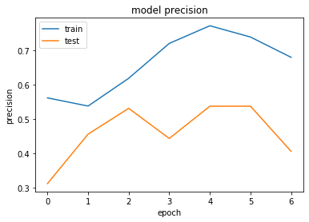


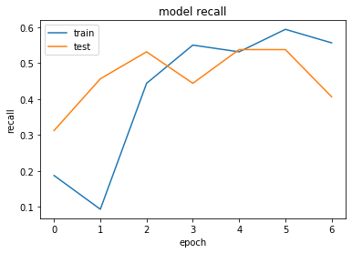


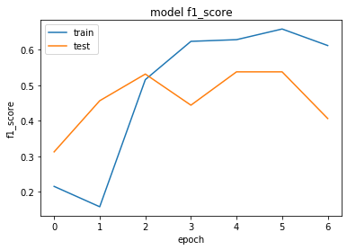


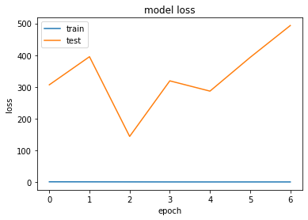


```python
#também não conseguimos uma boa precisão com o classificador InceptionResNetV2
#iremos então testar com o MobileNet
```


```python
from keras.applications import MobileNet
```


```python
conv_base = MobileNet(include_top=False)
for layer in conv_base.layers:
    layer.trainable = False
```

    C:\Users\Infotecno\anaconda3\lib\site-packages\keras_applications\mobilenet.py:207: UserWarning: `input_shape` is undefined or non-square, or `rows` is not in [128, 160, 192, 224]. Weights for input shape (224, 224) will be loaded as the default.
      warnings.warn('`input_shape` is undefined or non-square, '
    

    Downloading data from https://github.com/fchollet/deep-learning-models/releases/download/v0.6/mobilenet_1_0_224_tf_no_top.h5
    17227776/17225924 [==============================] - 72s 4us/step
    


```python
x = conv_base.output
x = layers.GlobalAveragePooling2D()(x)
x = layers.Dense(128, activation='relu')(x) 
predictions = layers.Dense(qtde_classes, activation='softmax')(x)
model = Model(conv_base.input, predictions)
model.summary()
```

    Model: "model_4"
    _________________________________________________________________
    Layer (type)                 Output Shape              Param #   
    =================================================================
    input_4 (InputLayer)         (None, None, None, 3)     0         
    _________________________________________________________________
    conv1_pad (ZeroPadding2D)    (None, None, None, 3)     0         
    _________________________________________________________________
    conv1 (Conv2D)               (None, None, None, 32)    864       
    _________________________________________________________________
    conv1_bn (BatchNormalization (None, None, None, 32)    128       
    _________________________________________________________________
    conv1_relu (ReLU)            (None, None, None, 32)    0         
    _________________________________________________________________
    conv_dw_1 (DepthwiseConv2D)  (None, None, None, 32)    288       
    _________________________________________________________________
    conv_dw_1_bn (BatchNormaliza (None, None, None, 32)    128       
    _________________________________________________________________
    conv_dw_1_relu (ReLU)        (None, None, None, 32)    0         
    _________________________________________________________________
    conv_pw_1 (Conv2D)           (None, None, None, 64)    2048      
    _________________________________________________________________
    conv_pw_1_bn (BatchNormaliza (None, None, None, 64)    256       
    _________________________________________________________________
    conv_pw_1_relu (ReLU)        (None, None, None, 64)    0         
    _________________________________________________________________
    conv_pad_2 (ZeroPadding2D)   (None, None, None, 64)    0         
    _________________________________________________________________
    conv_dw_2 (DepthwiseConv2D)  (None, None, None, 64)    576       
    _________________________________________________________________
    conv_dw_2_bn (BatchNormaliza (None, None, None, 64)    256       
    _________________________________________________________________
    conv_dw_2_relu (ReLU)        (None, None, None, 64)    0         
    _________________________________________________________________
    conv_pw_2 (Conv2D)           (None, None, None, 128)   8192      
    _________________________________________________________________
    conv_pw_2_bn (BatchNormaliza (None, None, None, 128)   512       
    _________________________________________________________________
    conv_pw_2_relu (ReLU)        (None, None, None, 128)   0         
    _________________________________________________________________
    conv_dw_3 (DepthwiseConv2D)  (None, None, None, 128)   1152      
    _________________________________________________________________
    conv_dw_3_bn (BatchNormaliza (None, None, None, 128)   512       
    _________________________________________________________________
    conv_dw_3_relu (ReLU)        (None, None, None, 128)   0         
    _________________________________________________________________
    conv_pw_3 (Conv2D)           (None, None, None, 128)   16384     
    _________________________________________________________________
    conv_pw_3_bn (BatchNormaliza (None, None, None, 128)   512       
    _________________________________________________________________
    conv_pw_3_relu (ReLU)        (None, None, None, 128)   0         
    _________________________________________________________________
    conv_pad_4 (ZeroPadding2D)   (None, None, None, 128)   0         
    _________________________________________________________________
    conv_dw_4 (DepthwiseConv2D)  (None, None, None, 128)   1152      
    _________________________________________________________________
    conv_dw_4_bn (BatchNormaliza (None, None, None, 128)   512       
    _________________________________________________________________
    conv_dw_4_relu (ReLU)        (None, None, None, 128)   0         
    _________________________________________________________________
    conv_pw_4 (Conv2D)           (None, None, None, 256)   32768     
    _________________________________________________________________
    conv_pw_4_bn (BatchNormaliza (None, None, None, 256)   1024      
    _________________________________________________________________
    conv_pw_4_relu (ReLU)        (None, None, None, 256)   0         
    _________________________________________________________________
    conv_dw_5 (DepthwiseConv2D)  (None, None, None, 256)   2304      
    _________________________________________________________________
    conv_dw_5_bn (BatchNormaliza (None, None, None, 256)   1024      
    _________________________________________________________________
    conv_dw_5_relu (ReLU)        (None, None, None, 256)   0         
    _________________________________________________________________
    conv_pw_5 (Conv2D)           (None, None, None, 256)   65536     
    _________________________________________________________________
    conv_pw_5_bn (BatchNormaliza (None, None, None, 256)   1024      
    _________________________________________________________________
    conv_pw_5_relu (ReLU)        (None, None, None, 256)   0         
    _________________________________________________________________
    conv_pad_6 (ZeroPadding2D)   (None, None, None, 256)   0         
    _________________________________________________________________
    conv_dw_6 (DepthwiseConv2D)  (None, None, None, 256)   2304      
    _________________________________________________________________
    conv_dw_6_bn (BatchNormaliza (None, None, None, 256)   1024      
    _________________________________________________________________
    conv_dw_6_relu (ReLU)        (None, None, None, 256)   0         
    _________________________________________________________________
    conv_pw_6 (Conv2D)           (None, None, None, 512)   131072    
    _________________________________________________________________
    conv_pw_6_bn (BatchNormaliza (None, None, None, 512)   2048      
    _________________________________________________________________
    conv_pw_6_relu (ReLU)        (None, None, None, 512)   0         
    _________________________________________________________________
    conv_dw_7 (DepthwiseConv2D)  (None, None, None, 512)   4608      
    _________________________________________________________________
    conv_dw_7_bn (BatchNormaliza (None, None, None, 512)   2048      
    _________________________________________________________________
    conv_dw_7_relu (ReLU)        (None, None, None, 512)   0         
    _________________________________________________________________
    conv_pw_7 (Conv2D)           (None, None, None, 512)   262144    
    _________________________________________________________________
    conv_pw_7_bn (BatchNormaliza (None, None, None, 512)   2048      
    _________________________________________________________________
    conv_pw_7_relu (ReLU)        (None, None, None, 512)   0         
    _________________________________________________________________
    conv_dw_8 (DepthwiseConv2D)  (None, None, None, 512)   4608      
    _________________________________________________________________
    conv_dw_8_bn (BatchNormaliza (None, None, None, 512)   2048      
    _________________________________________________________________
    conv_dw_8_relu (ReLU)        (None, None, None, 512)   0         
    _________________________________________________________________
    conv_pw_8 (Conv2D)           (None, None, None, 512)   262144    
    _________________________________________________________________
    conv_pw_8_bn (BatchNormaliza (None, None, None, 512)   2048      
    _________________________________________________________________
    conv_pw_8_relu (ReLU)        (None, None, None, 512)   0         
    _________________________________________________________________
    conv_dw_9 (DepthwiseConv2D)  (None, None, None, 512)   4608      
    _________________________________________________________________
    conv_dw_9_bn (BatchNormaliza (None, None, None, 512)   2048      
    _________________________________________________________________
    conv_dw_9_relu (ReLU)        (None, None, None, 512)   0         
    _________________________________________________________________
    conv_pw_9 (Conv2D)           (None, None, None, 512)   262144    
    _________________________________________________________________
    conv_pw_9_bn (BatchNormaliza (None, None, None, 512)   2048      
    _________________________________________________________________
    conv_pw_9_relu (ReLU)        (None, None, None, 512)   0         
    _________________________________________________________________
    conv_dw_10 (DepthwiseConv2D) (None, None, None, 512)   4608      
    _________________________________________________________________
    conv_dw_10_bn (BatchNormaliz (None, None, None, 512)   2048      
    _________________________________________________________________
    conv_dw_10_relu (ReLU)       (None, None, None, 512)   0         
    _________________________________________________________________
    conv_pw_10 (Conv2D)          (None, None, None, 512)   262144    
    _________________________________________________________________
    conv_pw_10_bn (BatchNormaliz (None, None, None, 512)   2048      
    _________________________________________________________________
    conv_pw_10_relu (ReLU)       (None, None, None, 512)   0         
    _________________________________________________________________
    conv_dw_11 (DepthwiseConv2D) (None, None, None, 512)   4608      
    _________________________________________________________________
    conv_dw_11_bn (BatchNormaliz (None, None, None, 512)   2048      
    _________________________________________________________________
    conv_dw_11_relu (ReLU)       (None, None, None, 512)   0         
    _________________________________________________________________
    conv_pw_11 (Conv2D)          (None, None, None, 512)   262144    
    _________________________________________________________________
    conv_pw_11_bn (BatchNormaliz (None, None, None, 512)   2048      
    _________________________________________________________________
    conv_pw_11_relu (ReLU)       (None, None, None, 512)   0         
    _________________________________________________________________
    conv_pad_12 (ZeroPadding2D)  (None, None, None, 512)   0         
    _________________________________________________________________
    conv_dw_12 (DepthwiseConv2D) (None, None, None, 512)   4608      
    _________________________________________________________________
    conv_dw_12_bn (BatchNormaliz (None, None, None, 512)   2048      
    _________________________________________________________________
    conv_dw_12_relu (ReLU)       (None, None, None, 512)   0         
    _________________________________________________________________
    conv_pw_12 (Conv2D)          (None, None, None, 1024)  524288    
    _________________________________________________________________
    conv_pw_12_bn (BatchNormaliz (None, None, None, 1024)  4096      
    _________________________________________________________________
    conv_pw_12_relu (ReLU)       (None, None, None, 1024)  0         
    _________________________________________________________________
    conv_dw_13 (DepthwiseConv2D) (None, None, None, 1024)  9216      
    _________________________________________________________________
    conv_dw_13_bn (BatchNormaliz (None, None, None, 1024)  4096      
    _________________________________________________________________
    conv_dw_13_relu (ReLU)       (None, None, None, 1024)  0         
    _________________________________________________________________
    conv_pw_13 (Conv2D)          (None, None, None, 1024)  1048576   
    _________________________________________________________________
    conv_pw_13_bn (BatchNormaliz (None, None, None, 1024)  4096      
    _________________________________________________________________
    conv_pw_13_relu (ReLU)       (None, None, None, 1024)  0         
    _________________________________________________________________
    global_average_pooling2d_4 ( (None, 1024)              0         
    _________________________________________________________________
    dense_7 (Dense)              (None, 128)               131200    
    _________________________________________________________________
    dense_8 (Dense)              (None, 3)                 387       
    =================================================================
    Total params: 3,360,451
    Trainable params: 131,587
    Non-trainable params: 3,228,864
    _________________________________________________________________
    


```python
optimizer = keras.optimizers.Adam()
model.compile(loss='categorical_crossentropy', optimizer=optimizer, metrics=[precision_score, recall_score, f1_score])

history = model.fit_generator(generator=train_generator, 
                              epochs=qtde_epocas, 
                              validation_steps=5, 
                              steps_per_epoch=5, 
                              validation_data=val_generator)
```

    Epoch 1/7
    5/5 [==============================] - 86s 17s/step - loss: 1.2989 - precision_score: 0.5127 - recall_score: 0.4000 - f1_score: 0.4468 - val_loss: 1.6535 - val_precision_score: 0.3244 - val_recall_score: 0.3187 - val_f1_score: 0.3215
    Epoch 2/7
    5/5 [==============================] - 72s 14s/step - loss: 0.7009 - precision_score: 0.7836 - recall_score: 0.6750 - f1_score: 0.7250 - val_loss: 1.2168 - val_precision_score: 0.5891 - val_recall_score: 0.3938 - val_f1_score: 0.4712
    Epoch 3/7
    5/5 [==============================] - 71s 14s/step - loss: 0.6835 - precision_score: 0.7401 - recall_score: 0.6562 - f1_score: 0.6951 - val_loss: 1.0278 - val_precision_score: 0.3828 - val_recall_score: 0.2000 - val_f1_score: 0.2616
    Epoch 4/7
    5/5 [==============================] - 71s 14s/step - loss: 0.7798 - precision_score: 0.7113 - recall_score: 0.6750 - f1_score: 0.6925 - val_loss: 1.1363 - val_precision_score: 0.3444 - val_recall_score: 0.1000 - val_f1_score: 0.1546
    Epoch 5/7
    5/5 [==============================] - 72s 14s/step - loss: 0.5713 - precision_score: 0.7658 - recall_score: 0.6938 - f1_score: 0.7273 - val_loss: 1.2393 - val_precision_score: 0.2537 - val_recall_score: 0.2250 - val_f1_score: 0.2383
    Epoch 6/7
    5/5 [==============================] - 76s 15s/step - loss: 0.6108 - precision_score: 0.7666 - recall_score: 0.7375 - f1_score: 0.7516 - val_loss: 1.3319 - val_precision_score: 0.4039 - val_recall_score: 0.3250 - val_f1_score: 0.3592
    Epoch 7/7
    5/5 [==============================] - 84s 17s/step - loss: 0.5572 - precision_score: 0.7767 - recall_score: 0.7188 - f1_score: 0.7465 - val_loss: 1.2402 - val_precision_score: 0.3771 - val_recall_score: 0.2438 - val_f1_score: 0.2958
    


```python
# Exibindo dados de Precisão
plt.plot(history.history['precision_score'])
plt.plot(history.history['val_precision_score'])
plt.title('model precision')
plt.ylabel('precision')
plt.xlabel('epoch')
plt.legend(['train', 'test'], loc='upper left')
plt.show()

# Exibindo dados de Sensibilidade
plt.plot(history.history['recall_score'])
plt.plot(history.history['val_recall_score'])
plt.title('model recall')
plt.ylabel('recall')
plt.xlabel('epoch')
plt.legend(['train', 'test'], loc='upper left')
plt.show()

# Exibindo dados de F1 Score
plt.plot(history.history['f1_score'])
plt.plot(history.history['val_f1_score'])
plt.title('model f1_score')
plt.ylabel('f1_score')
plt.xlabel('epoch')
plt.legend(['train', 'test'], loc='upper left')
plt.show()

# Exibindo dados de Perda
plt.plot(history.history['loss'])
plt.plot(history.history['val_loss'])
plt.title('model loss')
plt.ylabel('loss')
plt.xlabel('epoch')
plt.legend(['train', 'test'], loc='upper left')
plt.show()

```


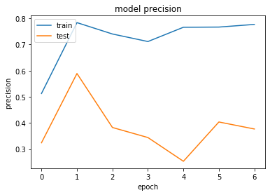


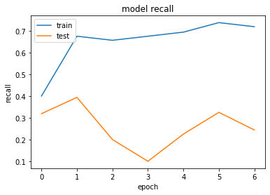


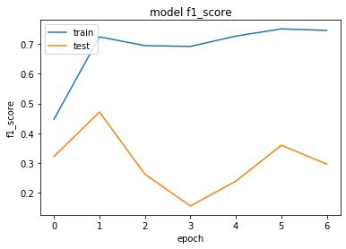


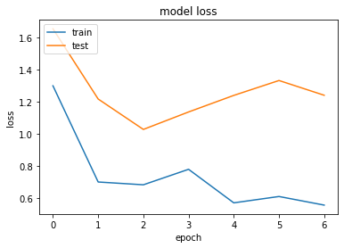


```python
#também não conseguimos uma boa precisão com o classificador MobileNet
#iremos então testar com o DenseNet121
```


```python
from keras.applications import DenseNet121
```


```python
conv_base = DenseNet121(include_top=False)
for layer in conv_base.layers:
    layer.trainable = False
```

    Downloading data from https://github.com/keras-team/keras-applications/releases/download/densenet/densenet121_weights_tf_dim_ordering_tf_kernels_notop.h5
    29089792/29084464 [==============================] - 47s 2us/step
    


```python
x = conv_base.output
x = layers.GlobalAveragePooling2D()(x)
x = layers.Dense(128, activation='relu')(x) 
predictions = layers.Dense(qtde_classes, activation='softmax')(x)
model = Model(conv_base.input, predictions)
model.summary()
```

    Model: "model_5"
    __________________________________________________________________________________________________
    Layer (type)                    Output Shape         Param #     Connected to                     
    ==================================================================================================
    input_5 (InputLayer)            (None, None, None, 3 0                                            
    __________________________________________________________________________________________________
    zero_padding2d_1 (ZeroPadding2D (None, None, None, 3 0           input_5[0][0]                    
    __________________________________________________________________________________________________
    conv1/conv (Conv2D)             (None, None, None, 6 9408        zero_padding2d_1[0][0]           
    __________________________________________________________________________________________________
    conv1/bn (BatchNormalization)   (None, None, None, 6 256         conv1/conv[0][0]                 
    __________________________________________________________________________________________________
    conv1/relu (Activation)         (None, None, None, 6 0           conv1/bn[0][0]                   
    __________________________________________________________________________________________________
    zero_padding2d_2 (ZeroPadding2D (None, None, None, 6 0           conv1/relu[0][0]                 
    __________________________________________________________________________________________________
    pool1 (MaxPooling2D)            (None, None, None, 6 0           zero_padding2d_2[0][0]           
    __________________________________________________________________________________________________
    conv2_block1_0_bn (BatchNormali (None, None, None, 6 256         pool1[0][0]                      
    __________________________________________________________________________________________________
    conv2_block1_0_relu (Activation (None, None, None, 6 0           conv2_block1_0_bn[0][0]          
    __________________________________________________________________________________________________
    conv2_block1_1_conv (Conv2D)    (None, None, None, 1 8192        conv2_block1_0_relu[0][0]        
    __________________________________________________________________________________________________
    conv2_block1_1_bn (BatchNormali (None, None, None, 1 512         conv2_block1_1_conv[0][0]        
    __________________________________________________________________________________________________
    conv2_block1_1_relu (Activation (None, None, None, 1 0           conv2_block1_1_bn[0][0]          
    __________________________________________________________________________________________________
    conv2_block1_2_conv (Conv2D)    (None, None, None, 3 36864       conv2_block1_1_relu[0][0]        
    __________________________________________________________________________________________________
    conv2_block1_concat (Concatenat (None, None, None, 9 0           pool1[0][0]                      
                                                                     conv2_block1_2_conv[0][0]        
    __________________________________________________________________________________________________
    conv2_block2_0_bn (BatchNormali (None, None, None, 9 384         conv2_block1_concat[0][0]        
    __________________________________________________________________________________________________
    conv2_block2_0_relu (Activation (None, None, None, 9 0           conv2_block2_0_bn[0][0]          
    __________________________________________________________________________________________________
    conv2_block2_1_conv (Conv2D)    (None, None, None, 1 12288       conv2_block2_0_relu[0][0]        
    __________________________________________________________________________________________________
    conv2_block2_1_bn (BatchNormali (None, None, None, 1 512         conv2_block2_1_conv[0][0]        
    __________________________________________________________________________________________________
    conv2_block2_1_relu (Activation (None, None, None, 1 0           conv2_block2_1_bn[0][0]          
    __________________________________________________________________________________________________
    conv2_block2_2_conv (Conv2D)    (None, None, None, 3 36864       conv2_block2_1_relu[0][0]        
    __________________________________________________________________________________________________
    conv2_block2_concat (Concatenat (None, None, None, 1 0           conv2_block1_concat[0][0]        
                                                                     conv2_block2_2_conv[0][0]        
    __________________________________________________________________________________________________
    conv2_block3_0_bn (BatchNormali (None, None, None, 1 512         conv2_block2_concat[0][0]        
    __________________________________________________________________________________________________
    conv2_block3_0_relu (Activation (None, None, None, 1 0           conv2_block3_0_bn[0][0]          
    __________________________________________________________________________________________________
    conv2_block3_1_conv (Conv2D)    (None, None, None, 1 16384       conv2_block3_0_relu[0][0]        
    __________________________________________________________________________________________________
    conv2_block3_1_bn (BatchNormali (None, None, None, 1 512         conv2_block3_1_conv[0][0]        
    __________________________________________________________________________________________________
    conv2_block3_1_relu (Activation (None, None, None, 1 0           conv2_block3_1_bn[0][0]          
    __________________________________________________________________________________________________
    conv2_block3_2_conv (Conv2D)    (None, None, None, 3 36864       conv2_block3_1_relu[0][0]        
    __________________________________________________________________________________________________
    conv2_block3_concat (Concatenat (None, None, None, 1 0           conv2_block2_concat[0][0]        
                                                                     conv2_block3_2_conv[0][0]        
    __________________________________________________________________________________________________
    conv2_block4_0_bn (BatchNormali (None, None, None, 1 640         conv2_block3_concat[0][0]        
    __________________________________________________________________________________________________
    conv2_block4_0_relu (Activation (None, None, None, 1 0           conv2_block4_0_bn[0][0]          
    __________________________________________________________________________________________________
    conv2_block4_1_conv (Conv2D)    (None, None, None, 1 20480       conv2_block4_0_relu[0][0]        
    __________________________________________________________________________________________________
    conv2_block4_1_bn (BatchNormali (None, None, None, 1 512         conv2_block4_1_conv[0][0]        
    __________________________________________________________________________________________________
    conv2_block4_1_relu (Activation (None, None, None, 1 0           conv2_block4_1_bn[0][0]          
    __________________________________________________________________________________________________
    conv2_block4_2_conv (Conv2D)    (None, None, None, 3 36864       conv2_block4_1_relu[0][0]        
    __________________________________________________________________________________________________
    conv2_block4_concat (Concatenat (None, None, None, 1 0           conv2_block3_concat[0][0]        
                                                                     conv2_block4_2_conv[0][0]        
    __________________________________________________________________________________________________
    conv2_block5_0_bn (BatchNormali (None, None, None, 1 768         conv2_block4_concat[0][0]        
    __________________________________________________________________________________________________
    conv2_block5_0_relu (Activation (None, None, None, 1 0           conv2_block5_0_bn[0][0]          
    __________________________________________________________________________________________________
    conv2_block5_1_conv (Conv2D)    (None, None, None, 1 24576       conv2_block5_0_relu[0][0]        
    __________________________________________________________________________________________________
    conv2_block5_1_bn (BatchNormali (None, None, None, 1 512         conv2_block5_1_conv[0][0]        
    __________________________________________________________________________________________________
    conv2_block5_1_relu (Activation (None, None, None, 1 0           conv2_block5_1_bn[0][0]          
    __________________________________________________________________________________________________
    conv2_block5_2_conv (Conv2D)    (None, None, None, 3 36864       conv2_block5_1_relu[0][0]        
    __________________________________________________________________________________________________
    conv2_block5_concat (Concatenat (None, None, None, 2 0           conv2_block4_concat[0][0]        
                                                                     conv2_block5_2_conv[0][0]        
    __________________________________________________________________________________________________
    conv2_block6_0_bn (BatchNormali (None, None, None, 2 896         conv2_block5_concat[0][0]        
    __________________________________________________________________________________________________
    conv2_block6_0_relu (Activation (None, None, None, 2 0           conv2_block6_0_bn[0][0]          
    __________________________________________________________________________________________________
    conv2_block6_1_conv (Conv2D)    (None, None, None, 1 28672       conv2_block6_0_relu[0][0]        
    __________________________________________________________________________________________________
    conv2_block6_1_bn (BatchNormali (None, None, None, 1 512         conv2_block6_1_conv[0][0]        
    __________________________________________________________________________________________________
    conv2_block6_1_relu (Activation (None, None, None, 1 0           conv2_block6_1_bn[0][0]          
    __________________________________________________________________________________________________
    conv2_block6_2_conv (Conv2D)    (None, None, None, 3 36864       conv2_block6_1_relu[0][0]        
    __________________________________________________________________________________________________
    conv2_block6_concat (Concatenat (None, None, None, 2 0           conv2_block5_concat[0][0]        
                                                                     conv2_block6_2_conv[0][0]        
    __________________________________________________________________________________________________
    pool2_bn (BatchNormalization)   (None, None, None, 2 1024        conv2_block6_concat[0][0]        
    __________________________________________________________________________________________________
    pool2_relu (Activation)         (None, None, None, 2 0           pool2_bn[0][0]                   
    __________________________________________________________________________________________________
    pool2_conv (Conv2D)             (None, None, None, 1 32768       pool2_relu[0][0]                 
    __________________________________________________________________________________________________
    pool2_pool (AveragePooling2D)   (None, None, None, 1 0           pool2_conv[0][0]                 
    __________________________________________________________________________________________________
    conv3_block1_0_bn (BatchNormali (None, None, None, 1 512         pool2_pool[0][0]                 
    __________________________________________________________________________________________________
    conv3_block1_0_relu (Activation (None, None, None, 1 0           conv3_block1_0_bn[0][0]          
    __________________________________________________________________________________________________
    conv3_block1_1_conv (Conv2D)    (None, None, None, 1 16384       conv3_block1_0_relu[0][0]        
    __________________________________________________________________________________________________
    conv3_block1_1_bn (BatchNormali (None, None, None, 1 512         conv3_block1_1_conv[0][0]        
    __________________________________________________________________________________________________
    conv3_block1_1_relu (Activation (None, None, None, 1 0           conv3_block1_1_bn[0][0]          
    __________________________________________________________________________________________________
    conv3_block1_2_conv (Conv2D)    (None, None, None, 3 36864       conv3_block1_1_relu[0][0]        
    __________________________________________________________________________________________________
    conv3_block1_concat (Concatenat (None, None, None, 1 0           pool2_pool[0][0]                 
                                                                     conv3_block1_2_conv[0][0]        
    __________________________________________________________________________________________________
    conv3_block2_0_bn (BatchNormali (None, None, None, 1 640         conv3_block1_concat[0][0]        
    __________________________________________________________________________________________________
    conv3_block2_0_relu (Activation (None, None, None, 1 0           conv3_block2_0_bn[0][0]          
    __________________________________________________________________________________________________
    conv3_block2_1_conv (Conv2D)    (None, None, None, 1 20480       conv3_block2_0_relu[0][0]        
    __________________________________________________________________________________________________
    conv3_block2_1_bn (BatchNormali (None, None, None, 1 512         conv3_block2_1_conv[0][0]        
    __________________________________________________________________________________________________
    conv3_block2_1_relu (Activation (None, None, None, 1 0           conv3_block2_1_bn[0][0]          
    __________________________________________________________________________________________________
    conv3_block2_2_conv (Conv2D)    (None, None, None, 3 36864       conv3_block2_1_relu[0][0]        
    __________________________________________________________________________________________________
    conv3_block2_concat (Concatenat (None, None, None, 1 0           conv3_block1_concat[0][0]        
                                                                     conv3_block2_2_conv[0][0]        
    __________________________________________________________________________________________________
    conv3_block3_0_bn (BatchNormali (None, None, None, 1 768         conv3_block2_concat[0][0]        
    __________________________________________________________________________________________________
    conv3_block3_0_relu (Activation (None, None, None, 1 0           conv3_block3_0_bn[0][0]          
    __________________________________________________________________________________________________
    conv3_block3_1_conv (Conv2D)    (None, None, None, 1 24576       conv3_block3_0_relu[0][0]        
    __________________________________________________________________________________________________
    conv3_block3_1_bn (BatchNormali (None, None, None, 1 512         conv3_block3_1_conv[0][0]        
    __________________________________________________________________________________________________
    conv3_block3_1_relu (Activation (None, None, None, 1 0           conv3_block3_1_bn[0][0]          
    __________________________________________________________________________________________________
    conv3_block3_2_conv (Conv2D)    (None, None, None, 3 36864       conv3_block3_1_relu[0][0]        
    __________________________________________________________________________________________________
    conv3_block3_concat (Concatenat (None, None, None, 2 0           conv3_block2_concat[0][0]        
                                                                     conv3_block3_2_conv[0][0]        
    __________________________________________________________________________________________________
    conv3_block4_0_bn (BatchNormali (None, None, None, 2 896         conv3_block3_concat[0][0]        
    __________________________________________________________________________________________________
    conv3_block4_0_relu (Activation (None, None, None, 2 0           conv3_block4_0_bn[0][0]          
    __________________________________________________________________________________________________
    conv3_block4_1_conv (Conv2D)    (None, None, None, 1 28672       conv3_block4_0_relu[0][0]        
    __________________________________________________________________________________________________
    conv3_block4_1_bn (BatchNormali (None, None, None, 1 512         conv3_block4_1_conv[0][0]        
    __________________________________________________________________________________________________
    conv3_block4_1_relu (Activation (None, None, None, 1 0           conv3_block4_1_bn[0][0]          
    __________________________________________________________________________________________________
    conv3_block4_2_conv (Conv2D)    (None, None, None, 3 36864       conv3_block4_1_relu[0][0]        
    __________________________________________________________________________________________________
    conv3_block4_concat (Concatenat (None, None, None, 2 0           conv3_block3_concat[0][0]        
                                                                     conv3_block4_2_conv[0][0]        
    __________________________________________________________________________________________________
    conv3_block5_0_bn (BatchNormali (None, None, None, 2 1024        conv3_block4_concat[0][0]        
    __________________________________________________________________________________________________
    conv3_block5_0_relu (Activation (None, None, None, 2 0           conv3_block5_0_bn[0][0]          
    __________________________________________________________________________________________________
    conv3_block5_1_conv (Conv2D)    (None, None, None, 1 32768       conv3_block5_0_relu[0][0]        
    __________________________________________________________________________________________________
    conv3_block5_1_bn (BatchNormali (None, None, None, 1 512         conv3_block5_1_conv[0][0]        
    __________________________________________________________________________________________________
    conv3_block5_1_relu (Activation (None, None, None, 1 0           conv3_block5_1_bn[0][0]          
    __________________________________________________________________________________________________
    conv3_block5_2_conv (Conv2D)    (None, None, None, 3 36864       conv3_block5_1_relu[0][0]        
    __________________________________________________________________________________________________
    conv3_block5_concat (Concatenat (None, None, None, 2 0           conv3_block4_concat[0][0]        
                                                                     conv3_block5_2_conv[0][0]        
    __________________________________________________________________________________________________
    conv3_block6_0_bn (BatchNormali (None, None, None, 2 1152        conv3_block5_concat[0][0]        
    __________________________________________________________________________________________________
    conv3_block6_0_relu (Activation (None, None, None, 2 0           conv3_block6_0_bn[0][0]          
    __________________________________________________________________________________________________
    conv3_block6_1_conv (Conv2D)    (None, None, None, 1 36864       conv3_block6_0_relu[0][0]        
    __________________________________________________________________________________________________
    conv3_block6_1_bn (BatchNormali (None, None, None, 1 512         conv3_block6_1_conv[0][0]        
    __________________________________________________________________________________________________
    conv3_block6_1_relu (Activation (None, None, None, 1 0           conv3_block6_1_bn[0][0]          
    __________________________________________________________________________________________________
    conv3_block6_2_conv (Conv2D)    (None, None, None, 3 36864       conv3_block6_1_relu[0][0]        
    __________________________________________________________________________________________________
    conv3_block6_concat (Concatenat (None, None, None, 3 0           conv3_block5_concat[0][0]        
                                                                     conv3_block6_2_conv[0][0]        
    __________________________________________________________________________________________________
    conv3_block7_0_bn (BatchNormali (None, None, None, 3 1280        conv3_block6_concat[0][0]        
    __________________________________________________________________________________________________
    conv3_block7_0_relu (Activation (None, None, None, 3 0           conv3_block7_0_bn[0][0]          
    __________________________________________________________________________________________________
    conv3_block7_1_conv (Conv2D)    (None, None, None, 1 40960       conv3_block7_0_relu[0][0]        
    __________________________________________________________________________________________________
    conv3_block7_1_bn (BatchNormali (None, None, None, 1 512         conv3_block7_1_conv[0][0]        
    __________________________________________________________________________________________________
    conv3_block7_1_relu (Activation (None, None, None, 1 0           conv3_block7_1_bn[0][0]          
    __________________________________________________________________________________________________
    conv3_block7_2_conv (Conv2D)    (None, None, None, 3 36864       conv3_block7_1_relu[0][0]        
    __________________________________________________________________________________________________
    conv3_block7_concat (Concatenat (None, None, None, 3 0           conv3_block6_concat[0][0]        
                                                                     conv3_block7_2_conv[0][0]        
    __________________________________________________________________________________________________
    conv3_block8_0_bn (BatchNormali (None, None, None, 3 1408        conv3_block7_concat[0][0]        
    __________________________________________________________________________________________________
    conv3_block8_0_relu (Activation (None, None, None, 3 0           conv3_block8_0_bn[0][0]          
    __________________________________________________________________________________________________
    conv3_block8_1_conv (Conv2D)    (None, None, None, 1 45056       conv3_block8_0_relu[0][0]        
    __________________________________________________________________________________________________
    conv3_block8_1_bn (BatchNormali (None, None, None, 1 512         conv3_block8_1_conv[0][0]        
    __________________________________________________________________________________________________
    conv3_block8_1_relu (Activation (None, None, None, 1 0           conv3_block8_1_bn[0][0]          
    __________________________________________________________________________________________________
    conv3_block8_2_conv (Conv2D)    (None, None, None, 3 36864       conv3_block8_1_relu[0][0]        
    __________________________________________________________________________________________________
    conv3_block8_concat (Concatenat (None, None, None, 3 0           conv3_block7_concat[0][0]        
                                                                     conv3_block8_2_conv[0][0]        
    __________________________________________________________________________________________________
    conv3_block9_0_bn (BatchNormali (None, None, None, 3 1536        conv3_block8_concat[0][0]        
    __________________________________________________________________________________________________
    conv3_block9_0_relu (Activation (None, None, None, 3 0           conv3_block9_0_bn[0][0]          
    __________________________________________________________________________________________________
    conv3_block9_1_conv (Conv2D)    (None, None, None, 1 49152       conv3_block9_0_relu[0][0]        
    __________________________________________________________________________________________________
    conv3_block9_1_bn (BatchNormali (None, None, None, 1 512         conv3_block9_1_conv[0][0]        
    __________________________________________________________________________________________________
    conv3_block9_1_relu (Activation (None, None, None, 1 0           conv3_block9_1_bn[0][0]          
    __________________________________________________________________________________________________
    conv3_block9_2_conv (Conv2D)    (None, None, None, 3 36864       conv3_block9_1_relu[0][0]        
    __________________________________________________________________________________________________
    conv3_block9_concat (Concatenat (None, None, None, 4 0           conv3_block8_concat[0][0]        
                                                                     conv3_block9_2_conv[0][0]        
    __________________________________________________________________________________________________
    conv3_block10_0_bn (BatchNormal (None, None, None, 4 1664        conv3_block9_concat[0][0]        
    __________________________________________________________________________________________________
    conv3_block10_0_relu (Activatio (None, None, None, 4 0           conv3_block10_0_bn[0][0]         
    __________________________________________________________________________________________________
    conv3_block10_1_conv (Conv2D)   (None, None, None, 1 53248       conv3_block10_0_relu[0][0]       
    __________________________________________________________________________________________________
    conv3_block10_1_bn (BatchNormal (None, None, None, 1 512         conv3_block10_1_conv[0][0]       
    __________________________________________________________________________________________________
    conv3_block10_1_relu (Activatio (None, None, None, 1 0           conv3_block10_1_bn[0][0]         
    __________________________________________________________________________________________________
    conv3_block10_2_conv (Conv2D)   (None, None, None, 3 36864       conv3_block10_1_relu[0][0]       
    __________________________________________________________________________________________________
    conv3_block10_concat (Concatena (None, None, None, 4 0           conv3_block9_concat[0][0]        
                                                                     conv3_block10_2_conv[0][0]       
    __________________________________________________________________________________________________
    conv3_block11_0_bn (BatchNormal (None, None, None, 4 1792        conv3_block10_concat[0][0]       
    __________________________________________________________________________________________________
    conv3_block11_0_relu (Activatio (None, None, None, 4 0           conv3_block11_0_bn[0][0]         
    __________________________________________________________________________________________________
    conv3_block11_1_conv (Conv2D)   (None, None, None, 1 57344       conv3_block11_0_relu[0][0]       
    __________________________________________________________________________________________________
    conv3_block11_1_bn (BatchNormal (None, None, None, 1 512         conv3_block11_1_conv[0][0]       
    __________________________________________________________________________________________________
    conv3_block11_1_relu (Activatio (None, None, None, 1 0           conv3_block11_1_bn[0][0]         
    __________________________________________________________________________________________________
    conv3_block11_2_conv (Conv2D)   (None, None, None, 3 36864       conv3_block11_1_relu[0][0]       
    __________________________________________________________________________________________________
    conv3_block11_concat (Concatena (None, None, None, 4 0           conv3_block10_concat[0][0]       
                                                                     conv3_block11_2_conv[0][0]       
    __________________________________________________________________________________________________
    conv3_block12_0_bn (BatchNormal (None, None, None, 4 1920        conv3_block11_concat[0][0]       
    __________________________________________________________________________________________________
    conv3_block12_0_relu (Activatio (None, None, None, 4 0           conv3_block12_0_bn[0][0]         
    __________________________________________________________________________________________________
    conv3_block12_1_conv (Conv2D)   (None, None, None, 1 61440       conv3_block12_0_relu[0][0]       
    __________________________________________________________________________________________________
    conv3_block12_1_bn (BatchNormal (None, None, None, 1 512         conv3_block12_1_conv[0][0]       
    __________________________________________________________________________________________________
    conv3_block12_1_relu (Activatio (None, None, None, 1 0           conv3_block12_1_bn[0][0]         
    __________________________________________________________________________________________________
    conv3_block12_2_conv (Conv2D)   (None, None, None, 3 36864       conv3_block12_1_relu[0][0]       
    __________________________________________________________________________________________________
    conv3_block12_concat (Concatena (None, None, None, 5 0           conv3_block11_concat[0][0]       
                                                                     conv3_block12_2_conv[0][0]       
    __________________________________________________________________________________________________
    pool3_bn (BatchNormalization)   (None, None, None, 5 2048        conv3_block12_concat[0][0]       
    __________________________________________________________________________________________________
    pool3_relu (Activation)         (None, None, None, 5 0           pool3_bn[0][0]                   
    __________________________________________________________________________________________________
    pool3_conv (Conv2D)             (None, None, None, 2 131072      pool3_relu[0][0]                 
    __________________________________________________________________________________________________
    pool3_pool (AveragePooling2D)   (None, None, None, 2 0           pool3_conv[0][0]                 
    __________________________________________________________________________________________________
    conv4_block1_0_bn (BatchNormali (None, None, None, 2 1024        pool3_pool[0][0]                 
    __________________________________________________________________________________________________
    conv4_block1_0_relu (Activation (None, None, None, 2 0           conv4_block1_0_bn[0][0]          
    __________________________________________________________________________________________________
    conv4_block1_1_conv (Conv2D)    (None, None, None, 1 32768       conv4_block1_0_relu[0][0]        
    __________________________________________________________________________________________________
    conv4_block1_1_bn (BatchNormali (None, None, None, 1 512         conv4_block1_1_conv[0][0]        
    __________________________________________________________________________________________________
    conv4_block1_1_relu (Activation (None, None, None, 1 0           conv4_block1_1_bn[0][0]          
    __________________________________________________________________________________________________
    conv4_block1_2_conv (Conv2D)    (None, None, None, 3 36864       conv4_block1_1_relu[0][0]        
    __________________________________________________________________________________________________
    conv4_block1_concat (Concatenat (None, None, None, 2 0           pool3_pool[0][0]                 
                                                                     conv4_block1_2_conv[0][0]        
    __________________________________________________________________________________________________
    conv4_block2_0_bn (BatchNormali (None, None, None, 2 1152        conv4_block1_concat[0][0]        
    __________________________________________________________________________________________________
    conv4_block2_0_relu (Activation (None, None, None, 2 0           conv4_block2_0_bn[0][0]          
    __________________________________________________________________________________________________
    conv4_block2_1_conv (Conv2D)    (None, None, None, 1 36864       conv4_block2_0_relu[0][0]        
    __________________________________________________________________________________________________
    conv4_block2_1_bn (BatchNormali (None, None, None, 1 512         conv4_block2_1_conv[0][0]        
    __________________________________________________________________________________________________
    conv4_block2_1_relu (Activation (None, None, None, 1 0           conv4_block2_1_bn[0][0]          
    __________________________________________________________________________________________________
    conv4_block2_2_conv (Conv2D)    (None, None, None, 3 36864       conv4_block2_1_relu[0][0]        
    __________________________________________________________________________________________________
    conv4_block2_concat (Concatenat (None, None, None, 3 0           conv4_block1_concat[0][0]        
                                                                     conv4_block2_2_conv[0][0]        
    __________________________________________________________________________________________________
    conv4_block3_0_bn (BatchNormali (None, None, None, 3 1280        conv4_block2_concat[0][0]        
    __________________________________________________________________________________________________
    conv4_block3_0_relu (Activation (None, None, None, 3 0           conv4_block3_0_bn[0][0]          
    __________________________________________________________________________________________________
    conv4_block3_1_conv (Conv2D)    (None, None, None, 1 40960       conv4_block3_0_relu[0][0]        
    __________________________________________________________________________________________________
    conv4_block3_1_bn (BatchNormali (None, None, None, 1 512         conv4_block3_1_conv[0][0]        
    __________________________________________________________________________________________________
    conv4_block3_1_relu (Activation (None, None, None, 1 0           conv4_block3_1_bn[0][0]          
    __________________________________________________________________________________________________
    conv4_block3_2_conv (Conv2D)    (None, None, None, 3 36864       conv4_block3_1_relu[0][0]        
    __________________________________________________________________________________________________
    conv4_block3_concat (Concatenat (None, None, None, 3 0           conv4_block2_concat[0][0]        
                                                                     conv4_block3_2_conv[0][0]        
    __________________________________________________________________________________________________
    conv4_block4_0_bn (BatchNormali (None, None, None, 3 1408        conv4_block3_concat[0][0]        
    __________________________________________________________________________________________________
    conv4_block4_0_relu (Activation (None, None, None, 3 0           conv4_block4_0_bn[0][0]          
    __________________________________________________________________________________________________
    conv4_block4_1_conv (Conv2D)    (None, None, None, 1 45056       conv4_block4_0_relu[0][0]        
    __________________________________________________________________________________________________
    conv4_block4_1_bn (BatchNormali (None, None, None, 1 512         conv4_block4_1_conv[0][0]        
    __________________________________________________________________________________________________
    conv4_block4_1_relu (Activation (None, None, None, 1 0           conv4_block4_1_bn[0][0]          
    __________________________________________________________________________________________________
    conv4_block4_2_conv (Conv2D)    (None, None, None, 3 36864       conv4_block4_1_relu[0][0]        
    __________________________________________________________________________________________________
    conv4_block4_concat (Concatenat (None, None, None, 3 0           conv4_block3_concat[0][0]        
                                                                     conv4_block4_2_conv[0][0]        
    __________________________________________________________________________________________________
    conv4_block5_0_bn (BatchNormali (None, None, None, 3 1536        conv4_block4_concat[0][0]        
    __________________________________________________________________________________________________
    conv4_block5_0_relu (Activation (None, None, None, 3 0           conv4_block5_0_bn[0][0]          
    __________________________________________________________________________________________________
    conv4_block5_1_conv (Conv2D)    (None, None, None, 1 49152       conv4_block5_0_relu[0][0]        
    __________________________________________________________________________________________________
    conv4_block5_1_bn (BatchNormali (None, None, None, 1 512         conv4_block5_1_conv[0][0]        
    __________________________________________________________________________________________________
    conv4_block5_1_relu (Activation (None, None, None, 1 0           conv4_block5_1_bn[0][0]          
    __________________________________________________________________________________________________
    conv4_block5_2_conv (Conv2D)    (None, None, None, 3 36864       conv4_block5_1_relu[0][0]        
    __________________________________________________________________________________________________
    conv4_block5_concat (Concatenat (None, None, None, 4 0           conv4_block4_concat[0][0]        
                                                                     conv4_block5_2_conv[0][0]        
    __________________________________________________________________________________________________
    conv4_block6_0_bn (BatchNormali (None, None, None, 4 1664        conv4_block5_concat[0][0]        
    __________________________________________________________________________________________________
    conv4_block6_0_relu (Activation (None, None, None, 4 0           conv4_block6_0_bn[0][0]          
    __________________________________________________________________________________________________
    conv4_block6_1_conv (Conv2D)    (None, None, None, 1 53248       conv4_block6_0_relu[0][0]        
    __________________________________________________________________________________________________
    conv4_block6_1_bn (BatchNormali (None, None, None, 1 512         conv4_block6_1_conv[0][0]        
    __________________________________________________________________________________________________
    conv4_block6_1_relu (Activation (None, None, None, 1 0           conv4_block6_1_bn[0][0]          
    __________________________________________________________________________________________________
    conv4_block6_2_conv (Conv2D)    (None, None, None, 3 36864       conv4_block6_1_relu[0][0]        
    __________________________________________________________________________________________________
    conv4_block6_concat (Concatenat (None, None, None, 4 0           conv4_block5_concat[0][0]        
                                                                     conv4_block6_2_conv[0][0]        
    __________________________________________________________________________________________________
    conv4_block7_0_bn (BatchNormali (None, None, None, 4 1792        conv4_block6_concat[0][0]        
    __________________________________________________________________________________________________
    conv4_block7_0_relu (Activation (None, None, None, 4 0           conv4_block7_0_bn[0][0]          
    __________________________________________________________________________________________________
    conv4_block7_1_conv (Conv2D)    (None, None, None, 1 57344       conv4_block7_0_relu[0][0]        
    __________________________________________________________________________________________________
    conv4_block7_1_bn (BatchNormali (None, None, None, 1 512         conv4_block7_1_conv[0][0]        
    __________________________________________________________________________________________________
    conv4_block7_1_relu (Activation (None, None, None, 1 0           conv4_block7_1_bn[0][0]          
    __________________________________________________________________________________________________
    conv4_block7_2_conv (Conv2D)    (None, None, None, 3 36864       conv4_block7_1_relu[0][0]        
    __________________________________________________________________________________________________
    conv4_block7_concat (Concatenat (None, None, None, 4 0           conv4_block6_concat[0][0]        
                                                                     conv4_block7_2_conv[0][0]        
    __________________________________________________________________________________________________
    conv4_block8_0_bn (BatchNormali (None, None, None, 4 1920        conv4_block7_concat[0][0]        
    __________________________________________________________________________________________________
    conv4_block8_0_relu (Activation (None, None, None, 4 0           conv4_block8_0_bn[0][0]          
    __________________________________________________________________________________________________
    conv4_block8_1_conv (Conv2D)    (None, None, None, 1 61440       conv4_block8_0_relu[0][0]        
    __________________________________________________________________________________________________
    conv4_block8_1_bn (BatchNormali (None, None, None, 1 512         conv4_block8_1_conv[0][0]        
    __________________________________________________________________________________________________
    conv4_block8_1_relu (Activation (None, None, None, 1 0           conv4_block8_1_bn[0][0]          
    __________________________________________________________________________________________________
    conv4_block8_2_conv (Conv2D)    (None, None, None, 3 36864       conv4_block8_1_relu[0][0]        
    __________________________________________________________________________________________________
    conv4_block8_concat (Concatenat (None, None, None, 5 0           conv4_block7_concat[0][0]        
                                                                     conv4_block8_2_conv[0][0]        
    __________________________________________________________________________________________________
    conv4_block9_0_bn (BatchNormali (None, None, None, 5 2048        conv4_block8_concat[0][0]        
    __________________________________________________________________________________________________
    conv4_block9_0_relu (Activation (None, None, None, 5 0           conv4_block9_0_bn[0][0]          
    __________________________________________________________________________________________________
    conv4_block9_1_conv (Conv2D)    (None, None, None, 1 65536       conv4_block9_0_relu[0][0]        
    __________________________________________________________________________________________________
    conv4_block9_1_bn (BatchNormali (None, None, None, 1 512         conv4_block9_1_conv[0][0]        
    __________________________________________________________________________________________________
    conv4_block9_1_relu (Activation (None, None, None, 1 0           conv4_block9_1_bn[0][0]          
    __________________________________________________________________________________________________
    conv4_block9_2_conv (Conv2D)    (None, None, None, 3 36864       conv4_block9_1_relu[0][0]        
    __________________________________________________________________________________________________
    conv4_block9_concat (Concatenat (None, None, None, 5 0           conv4_block8_concat[0][0]        
                                                                     conv4_block9_2_conv[0][0]        
    __________________________________________________________________________________________________
    conv4_block10_0_bn (BatchNormal (None, None, None, 5 2176        conv4_block9_concat[0][0]        
    __________________________________________________________________________________________________
    conv4_block10_0_relu (Activatio (None, None, None, 5 0           conv4_block10_0_bn[0][0]         
    __________________________________________________________________________________________________
    conv4_block10_1_conv (Conv2D)   (None, None, None, 1 69632       conv4_block10_0_relu[0][0]       
    __________________________________________________________________________________________________
    conv4_block10_1_bn (BatchNormal (None, None, None, 1 512         conv4_block10_1_conv[0][0]       
    __________________________________________________________________________________________________
    conv4_block10_1_relu (Activatio (None, None, None, 1 0           conv4_block10_1_bn[0][0]         
    __________________________________________________________________________________________________
    conv4_block10_2_conv (Conv2D)   (None, None, None, 3 36864       conv4_block10_1_relu[0][0]       
    __________________________________________________________________________________________________
    conv4_block10_concat (Concatena (None, None, None, 5 0           conv4_block9_concat[0][0]        
                                                                     conv4_block10_2_conv[0][0]       
    __________________________________________________________________________________________________
    conv4_block11_0_bn (BatchNormal (None, None, None, 5 2304        conv4_block10_concat[0][0]       
    __________________________________________________________________________________________________
    conv4_block11_0_relu (Activatio (None, None, None, 5 0           conv4_block11_0_bn[0][0]         
    __________________________________________________________________________________________________
    conv4_block11_1_conv (Conv2D)   (None, None, None, 1 73728       conv4_block11_0_relu[0][0]       
    __________________________________________________________________________________________________
    conv4_block11_1_bn (BatchNormal (None, None, None, 1 512         conv4_block11_1_conv[0][0]       
    __________________________________________________________________________________________________
    conv4_block11_1_relu (Activatio (None, None, None, 1 0           conv4_block11_1_bn[0][0]         
    __________________________________________________________________________________________________
    conv4_block11_2_conv (Conv2D)   (None, None, None, 3 36864       conv4_block11_1_relu[0][0]       
    __________________________________________________________________________________________________
    conv4_block11_concat (Concatena (None, None, None, 6 0           conv4_block10_concat[0][0]       
                                                                     conv4_block11_2_conv[0][0]       
    __________________________________________________________________________________________________
    conv4_block12_0_bn (BatchNormal (None, None, None, 6 2432        conv4_block11_concat[0][0]       
    __________________________________________________________________________________________________
    conv4_block12_0_relu (Activatio (None, None, None, 6 0           conv4_block12_0_bn[0][0]         
    __________________________________________________________________________________________________
    conv4_block12_1_conv (Conv2D)   (None, None, None, 1 77824       conv4_block12_0_relu[0][0]       
    __________________________________________________________________________________________________
    conv4_block12_1_bn (BatchNormal (None, None, None, 1 512         conv4_block12_1_conv[0][0]       
    __________________________________________________________________________________________________
    conv4_block12_1_relu (Activatio (None, None, None, 1 0           conv4_block12_1_bn[0][0]         
    __________________________________________________________________________________________________
    conv4_block12_2_conv (Conv2D)   (None, None, None, 3 36864       conv4_block12_1_relu[0][0]       
    __________________________________________________________________________________________________
    conv4_block12_concat (Concatena (None, None, None, 6 0           conv4_block11_concat[0][0]       
                                                                     conv4_block12_2_conv[0][0]       
    __________________________________________________________________________________________________
    conv4_block13_0_bn (BatchNormal (None, None, None, 6 2560        conv4_block12_concat[0][0]       
    __________________________________________________________________________________________________
    conv4_block13_0_relu (Activatio (None, None, None, 6 0           conv4_block13_0_bn[0][0]         
    __________________________________________________________________________________________________
    conv4_block13_1_conv (Conv2D)   (None, None, None, 1 81920       conv4_block13_0_relu[0][0]       
    __________________________________________________________________________________________________
    conv4_block13_1_bn (BatchNormal (None, None, None, 1 512         conv4_block13_1_conv[0][0]       
    __________________________________________________________________________________________________
    conv4_block13_1_relu (Activatio (None, None, None, 1 0           conv4_block13_1_bn[0][0]         
    __________________________________________________________________________________________________
    conv4_block13_2_conv (Conv2D)   (None, None, None, 3 36864       conv4_block13_1_relu[0][0]       
    __________________________________________________________________________________________________
    conv4_block13_concat (Concatena (None, None, None, 6 0           conv4_block12_concat[0][0]       
                                                                     conv4_block13_2_conv[0][0]       
    __________________________________________________________________________________________________
    conv4_block14_0_bn (BatchNormal (None, None, None, 6 2688        conv4_block13_concat[0][0]       
    __________________________________________________________________________________________________
    conv4_block14_0_relu (Activatio (None, None, None, 6 0           conv4_block14_0_bn[0][0]         
    __________________________________________________________________________________________________
    conv4_block14_1_conv (Conv2D)   (None, None, None, 1 86016       conv4_block14_0_relu[0][0]       
    __________________________________________________________________________________________________
    conv4_block14_1_bn (BatchNormal (None, None, None, 1 512         conv4_block14_1_conv[0][0]       
    __________________________________________________________________________________________________
    conv4_block14_1_relu (Activatio (None, None, None, 1 0           conv4_block14_1_bn[0][0]         
    __________________________________________________________________________________________________
    conv4_block14_2_conv (Conv2D)   (None, None, None, 3 36864       conv4_block14_1_relu[0][0]       
    __________________________________________________________________________________________________
    conv4_block14_concat (Concatena (None, None, None, 7 0           conv4_block13_concat[0][0]       
                                                                     conv4_block14_2_conv[0][0]       
    __________________________________________________________________________________________________
    conv4_block15_0_bn (BatchNormal (None, None, None, 7 2816        conv4_block14_concat[0][0]       
    __________________________________________________________________________________________________
    conv4_block15_0_relu (Activatio (None, None, None, 7 0           conv4_block15_0_bn[0][0]         
    __________________________________________________________________________________________________
    conv4_block15_1_conv (Conv2D)   (None, None, None, 1 90112       conv4_block15_0_relu[0][0]       
    __________________________________________________________________________________________________
    conv4_block15_1_bn (BatchNormal (None, None, None, 1 512         conv4_block15_1_conv[0][0]       
    __________________________________________________________________________________________________
    conv4_block15_1_relu (Activatio (None, None, None, 1 0           conv4_block15_1_bn[0][0]         
    __________________________________________________________________________________________________
    conv4_block15_2_conv (Conv2D)   (None, None, None, 3 36864       conv4_block15_1_relu[0][0]       
    __________________________________________________________________________________________________
    conv4_block15_concat (Concatena (None, None, None, 7 0           conv4_block14_concat[0][0]       
                                                                     conv4_block15_2_conv[0][0]       
    __________________________________________________________________________________________________
    conv4_block16_0_bn (BatchNormal (None, None, None, 7 2944        conv4_block15_concat[0][0]       
    __________________________________________________________________________________________________
    conv4_block16_0_relu (Activatio (None, None, None, 7 0           conv4_block16_0_bn[0][0]         
    __________________________________________________________________________________________________
    conv4_block16_1_conv (Conv2D)   (None, None, None, 1 94208       conv4_block16_0_relu[0][0]       
    __________________________________________________________________________________________________
    conv4_block16_1_bn (BatchNormal (None, None, None, 1 512         conv4_block16_1_conv[0][0]       
    __________________________________________________________________________________________________
    conv4_block16_1_relu (Activatio (None, None, None, 1 0           conv4_block16_1_bn[0][0]         
    __________________________________________________________________________________________________
    conv4_block16_2_conv (Conv2D)   (None, None, None, 3 36864       conv4_block16_1_relu[0][0]       
    __________________________________________________________________________________________________
    conv4_block16_concat (Concatena (None, None, None, 7 0           conv4_block15_concat[0][0]       
                                                                     conv4_block16_2_conv[0][0]       
    __________________________________________________________________________________________________
    conv4_block17_0_bn (BatchNormal (None, None, None, 7 3072        conv4_block16_concat[0][0]       
    __________________________________________________________________________________________________
    conv4_block17_0_relu (Activatio (None, None, None, 7 0           conv4_block17_0_bn[0][0]         
    __________________________________________________________________________________________________
    conv4_block17_1_conv (Conv2D)   (None, None, None, 1 98304       conv4_block17_0_relu[0][0]       
    __________________________________________________________________________________________________
    conv4_block17_1_bn (BatchNormal (None, None, None, 1 512         conv4_block17_1_conv[0][0]       
    __________________________________________________________________________________________________
    conv4_block17_1_relu (Activatio (None, None, None, 1 0           conv4_block17_1_bn[0][0]         
    __________________________________________________________________________________________________
    conv4_block17_2_conv (Conv2D)   (None, None, None, 3 36864       conv4_block17_1_relu[0][0]       
    __________________________________________________________________________________________________
    conv4_block17_concat (Concatena (None, None, None, 8 0           conv4_block16_concat[0][0]       
                                                                     conv4_block17_2_conv[0][0]       
    __________________________________________________________________________________________________
    conv4_block18_0_bn (BatchNormal (None, None, None, 8 3200        conv4_block17_concat[0][0]       
    __________________________________________________________________________________________________
    conv4_block18_0_relu (Activatio (None, None, None, 8 0           conv4_block18_0_bn[0][0]         
    __________________________________________________________________________________________________
    conv4_block18_1_conv (Conv2D)   (None, None, None, 1 102400      conv4_block18_0_relu[0][0]       
    __________________________________________________________________________________________________
    conv4_block18_1_bn (BatchNormal (None, None, None, 1 512         conv4_block18_1_conv[0][0]       
    __________________________________________________________________________________________________
    conv4_block18_1_relu (Activatio (None, None, None, 1 0           conv4_block18_1_bn[0][0]         
    __________________________________________________________________________________________________
    conv4_block18_2_conv (Conv2D)   (None, None, None, 3 36864       conv4_block18_1_relu[0][0]       
    __________________________________________________________________________________________________
    conv4_block18_concat (Concatena (None, None, None, 8 0           conv4_block17_concat[0][0]       
                                                                     conv4_block18_2_conv[0][0]       
    __________________________________________________________________________________________________
    conv4_block19_0_bn (BatchNormal (None, None, None, 8 3328        conv4_block18_concat[0][0]       
    __________________________________________________________________________________________________
    conv4_block19_0_relu (Activatio (None, None, None, 8 0           conv4_block19_0_bn[0][0]         
    __________________________________________________________________________________________________
    conv4_block19_1_conv (Conv2D)   (None, None, None, 1 106496      conv4_block19_0_relu[0][0]       
    __________________________________________________________________________________________________
    conv4_block19_1_bn (BatchNormal (None, None, None, 1 512         conv4_block19_1_conv[0][0]       
    __________________________________________________________________________________________________
    conv4_block19_1_relu (Activatio (None, None, None, 1 0           conv4_block19_1_bn[0][0]         
    __________________________________________________________________________________________________
    conv4_block19_2_conv (Conv2D)   (None, None, None, 3 36864       conv4_block19_1_relu[0][0]       
    __________________________________________________________________________________________________
    conv4_block19_concat (Concatena (None, None, None, 8 0           conv4_block18_concat[0][0]       
                                                                     conv4_block19_2_conv[0][0]       
    __________________________________________________________________________________________________
    conv4_block20_0_bn (BatchNormal (None, None, None, 8 3456        conv4_block19_concat[0][0]       
    __________________________________________________________________________________________________
    conv4_block20_0_relu (Activatio (None, None, None, 8 0           conv4_block20_0_bn[0][0]         
    __________________________________________________________________________________________________
    conv4_block20_1_conv (Conv2D)   (None, None, None, 1 110592      conv4_block20_0_relu[0][0]       
    __________________________________________________________________________________________________
    conv4_block20_1_bn (BatchNormal (None, None, None, 1 512         conv4_block20_1_conv[0][0]       
    __________________________________________________________________________________________________
    conv4_block20_1_relu (Activatio (None, None, None, 1 0           conv4_block20_1_bn[0][0]         
    __________________________________________________________________________________________________
    conv4_block20_2_conv (Conv2D)   (None, None, None, 3 36864       conv4_block20_1_relu[0][0]       
    __________________________________________________________________________________________________
    conv4_block20_concat (Concatena (None, None, None, 8 0           conv4_block19_concat[0][0]       
                                                                     conv4_block20_2_conv[0][0]       
    __________________________________________________________________________________________________
    conv4_block21_0_bn (BatchNormal (None, None, None, 8 3584        conv4_block20_concat[0][0]       
    __________________________________________________________________________________________________
    conv4_block21_0_relu (Activatio (None, None, None, 8 0           conv4_block21_0_bn[0][0]         
    __________________________________________________________________________________________________
    conv4_block21_1_conv (Conv2D)   (None, None, None, 1 114688      conv4_block21_0_relu[0][0]       
    __________________________________________________________________________________________________
    conv4_block21_1_bn (BatchNormal (None, None, None, 1 512         conv4_block21_1_conv[0][0]       
    __________________________________________________________________________________________________
    conv4_block21_1_relu (Activatio (None, None, None, 1 0           conv4_block21_1_bn[0][0]         
    __________________________________________________________________________________________________
    conv4_block21_2_conv (Conv2D)   (None, None, None, 3 36864       conv4_block21_1_relu[0][0]       
    __________________________________________________________________________________________________
    conv4_block21_concat (Concatena (None, None, None, 9 0           conv4_block20_concat[0][0]       
                                                                     conv4_block21_2_conv[0][0]       
    __________________________________________________________________________________________________
    conv4_block22_0_bn (BatchNormal (None, None, None, 9 3712        conv4_block21_concat[0][0]       
    __________________________________________________________________________________________________
    conv4_block22_0_relu (Activatio (None, None, None, 9 0           conv4_block22_0_bn[0][0]         
    __________________________________________________________________________________________________
    conv4_block22_1_conv (Conv2D)   (None, None, None, 1 118784      conv4_block22_0_relu[0][0]       
    __________________________________________________________________________________________________
    conv4_block22_1_bn (BatchNormal (None, None, None, 1 512         conv4_block22_1_conv[0][0]       
    __________________________________________________________________________________________________
    conv4_block22_1_relu (Activatio (None, None, None, 1 0           conv4_block22_1_bn[0][0]         
    __________________________________________________________________________________________________
    conv4_block22_2_conv (Conv2D)   (None, None, None, 3 36864       conv4_block22_1_relu[0][0]       
    __________________________________________________________________________________________________
    conv4_block22_concat (Concatena (None, None, None, 9 0           conv4_block21_concat[0][0]       
                                                                     conv4_block22_2_conv[0][0]       
    __________________________________________________________________________________________________
    conv4_block23_0_bn (BatchNormal (None, None, None, 9 3840        conv4_block22_concat[0][0]       
    __________________________________________________________________________________________________
    conv4_block23_0_relu (Activatio (None, None, None, 9 0           conv4_block23_0_bn[0][0]         
    __________________________________________________________________________________________________
    conv4_block23_1_conv (Conv2D)   (None, None, None, 1 122880      conv4_block23_0_relu[0][0]       
    __________________________________________________________________________________________________
    conv4_block23_1_bn (BatchNormal (None, None, None, 1 512         conv4_block23_1_conv[0][0]       
    __________________________________________________________________________________________________
    conv4_block23_1_relu (Activatio (None, None, None, 1 0           conv4_block23_1_bn[0][0]         
    __________________________________________________________________________________________________
    conv4_block23_2_conv (Conv2D)   (None, None, None, 3 36864       conv4_block23_1_relu[0][0]       
    __________________________________________________________________________________________________
    conv4_block23_concat (Concatena (None, None, None, 9 0           conv4_block22_concat[0][0]       
                                                                     conv4_block23_2_conv[0][0]       
    __________________________________________________________________________________________________
    conv4_block24_0_bn (BatchNormal (None, None, None, 9 3968        conv4_block23_concat[0][0]       
    __________________________________________________________________________________________________
    conv4_block24_0_relu (Activatio (None, None, None, 9 0           conv4_block24_0_bn[0][0]         
    __________________________________________________________________________________________________
    conv4_block24_1_conv (Conv2D)   (None, None, None, 1 126976      conv4_block24_0_relu[0][0]       
    __________________________________________________________________________________________________
    conv4_block24_1_bn (BatchNormal (None, None, None, 1 512         conv4_block24_1_conv[0][0]       
    __________________________________________________________________________________________________
    conv4_block24_1_relu (Activatio (None, None, None, 1 0           conv4_block24_1_bn[0][0]         
    __________________________________________________________________________________________________
    conv4_block24_2_conv (Conv2D)   (None, None, None, 3 36864       conv4_block24_1_relu[0][0]       
    __________________________________________________________________________________________________
    conv4_block24_concat (Concatena (None, None, None, 1 0           conv4_block23_concat[0][0]       
                                                                     conv4_block24_2_conv[0][0]       
    __________________________________________________________________________________________________
    pool4_bn (BatchNormalization)   (None, None, None, 1 4096        conv4_block24_concat[0][0]       
    __________________________________________________________________________________________________
    pool4_relu (Activation)         (None, None, None, 1 0           pool4_bn[0][0]                   
    __________________________________________________________________________________________________
    pool4_conv (Conv2D)             (None, None, None, 5 524288      pool4_relu[0][0]                 
    __________________________________________________________________________________________________
    pool4_pool (AveragePooling2D)   (None, None, None, 5 0           pool4_conv[0][0]                 
    __________________________________________________________________________________________________
    conv5_block1_0_bn (BatchNormali (None, None, None, 5 2048        pool4_pool[0][0]                 
    __________________________________________________________________________________________________
    conv5_block1_0_relu (Activation (None, None, None, 5 0           conv5_block1_0_bn[0][0]          
    __________________________________________________________________________________________________
    conv5_block1_1_conv (Conv2D)    (None, None, None, 1 65536       conv5_block1_0_relu[0][0]        
    __________________________________________________________________________________________________
    conv5_block1_1_bn (BatchNormali (None, None, None, 1 512         conv5_block1_1_conv[0][0]        
    __________________________________________________________________________________________________
    conv5_block1_1_relu (Activation (None, None, None, 1 0           conv5_block1_1_bn[0][0]          
    __________________________________________________________________________________________________
    conv5_block1_2_conv (Conv2D)    (None, None, None, 3 36864       conv5_block1_1_relu[0][0]        
    __________________________________________________________________________________________________
    conv5_block1_concat (Concatenat (None, None, None, 5 0           pool4_pool[0][0]                 
                                                                     conv5_block1_2_conv[0][0]        
    __________________________________________________________________________________________________
    conv5_block2_0_bn (BatchNormali (None, None, None, 5 2176        conv5_block1_concat[0][0]        
    __________________________________________________________________________________________________
    conv5_block2_0_relu (Activation (None, None, None, 5 0           conv5_block2_0_bn[0][0]          
    __________________________________________________________________________________________________
    conv5_block2_1_conv (Conv2D)    (None, None, None, 1 69632       conv5_block2_0_relu[0][0]        
    __________________________________________________________________________________________________
    conv5_block2_1_bn (BatchNormali (None, None, None, 1 512         conv5_block2_1_conv[0][0]        
    __________________________________________________________________________________________________
    conv5_block2_1_relu (Activation (None, None, None, 1 0           conv5_block2_1_bn[0][0]          
    __________________________________________________________________________________________________
    conv5_block2_2_conv (Conv2D)    (None, None, None, 3 36864       conv5_block2_1_relu[0][0]        
    __________________________________________________________________________________________________
    conv5_block2_concat (Concatenat (None, None, None, 5 0           conv5_block1_concat[0][0]        
                                                                     conv5_block2_2_conv[0][0]        
    __________________________________________________________________________________________________
    conv5_block3_0_bn (BatchNormali (None, None, None, 5 2304        conv5_block2_concat[0][0]        
    __________________________________________________________________________________________________
    conv5_block3_0_relu (Activation (None, None, None, 5 0           conv5_block3_0_bn[0][0]          
    __________________________________________________________________________________________________
    conv5_block3_1_conv (Conv2D)    (None, None, None, 1 73728       conv5_block3_0_relu[0][0]        
    __________________________________________________________________________________________________
    conv5_block3_1_bn (BatchNormali (None, None, None, 1 512         conv5_block3_1_conv[0][0]        
    __________________________________________________________________________________________________
    conv5_block3_1_relu (Activation (None, None, None, 1 0           conv5_block3_1_bn[0][0]          
    __________________________________________________________________________________________________
    conv5_block3_2_conv (Conv2D)    (None, None, None, 3 36864       conv5_block3_1_relu[0][0]        
    __________________________________________________________________________________________________
    conv5_block3_concat (Concatenat (None, None, None, 6 0           conv5_block2_concat[0][0]        
                                                                     conv5_block3_2_conv[0][0]        
    __________________________________________________________________________________________________
    conv5_block4_0_bn (BatchNormali (None, None, None, 6 2432        conv5_block3_concat[0][0]        
    __________________________________________________________________________________________________
    conv5_block4_0_relu (Activation (None, None, None, 6 0           conv5_block4_0_bn[0][0]          
    __________________________________________________________________________________________________
    conv5_block4_1_conv (Conv2D)    (None, None, None, 1 77824       conv5_block4_0_relu[0][0]        
    __________________________________________________________________________________________________
    conv5_block4_1_bn (BatchNormali (None, None, None, 1 512         conv5_block4_1_conv[0][0]        
    __________________________________________________________________________________________________
    conv5_block4_1_relu (Activation (None, None, None, 1 0           conv5_block4_1_bn[0][0]          
    __________________________________________________________________________________________________
    conv5_block4_2_conv (Conv2D)    (None, None, None, 3 36864       conv5_block4_1_relu[0][0]        
    __________________________________________________________________________________________________
    conv5_block4_concat (Concatenat (None, None, None, 6 0           conv5_block3_concat[0][0]        
                                                                     conv5_block4_2_conv[0][0]        
    __________________________________________________________________________________________________
    conv5_block5_0_bn (BatchNormali (None, None, None, 6 2560        conv5_block4_concat[0][0]        
    __________________________________________________________________________________________________
    conv5_block5_0_relu (Activation (None, None, None, 6 0           conv5_block5_0_bn[0][0]          
    __________________________________________________________________________________________________
    conv5_block5_1_conv (Conv2D)    (None, None, None, 1 81920       conv5_block5_0_relu[0][0]        
    __________________________________________________________________________________________________
    conv5_block5_1_bn (BatchNormali (None, None, None, 1 512         conv5_block5_1_conv[0][0]        
    __________________________________________________________________________________________________
    conv5_block5_1_relu (Activation (None, None, None, 1 0           conv5_block5_1_bn[0][0]          
    __________________________________________________________________________________________________
    conv5_block5_2_conv (Conv2D)    (None, None, None, 3 36864       conv5_block5_1_relu[0][0]        
    __________________________________________________________________________________________________
    conv5_block5_concat (Concatenat (None, None, None, 6 0           conv5_block4_concat[0][0]        
                                                                     conv5_block5_2_conv[0][0]        
    __________________________________________________________________________________________________
    conv5_block6_0_bn (BatchNormali (None, None, None, 6 2688        conv5_block5_concat[0][0]        
    __________________________________________________________________________________________________
    conv5_block6_0_relu (Activation (None, None, None, 6 0           conv5_block6_0_bn[0][0]          
    __________________________________________________________________________________________________
    conv5_block6_1_conv (Conv2D)    (None, None, None, 1 86016       conv5_block6_0_relu[0][0]        
    __________________________________________________________________________________________________
    conv5_block6_1_bn (BatchNormali (None, None, None, 1 512         conv5_block6_1_conv[0][0]        
    __________________________________________________________________________________________________
    conv5_block6_1_relu (Activation (None, None, None, 1 0           conv5_block6_1_bn[0][0]          
    __________________________________________________________________________________________________
    conv5_block6_2_conv (Conv2D)    (None, None, None, 3 36864       conv5_block6_1_relu[0][0]        
    __________________________________________________________________________________________________
    conv5_block6_concat (Concatenat (None, None, None, 7 0           conv5_block5_concat[0][0]        
                                                                     conv5_block6_2_conv[0][0]        
    __________________________________________________________________________________________________
    conv5_block7_0_bn (BatchNormali (None, None, None, 7 2816        conv5_block6_concat[0][0]        
    __________________________________________________________________________________________________
    conv5_block7_0_relu (Activation (None, None, None, 7 0           conv5_block7_0_bn[0][0]          
    __________________________________________________________________________________________________
    conv5_block7_1_conv (Conv2D)    (None, None, None, 1 90112       conv5_block7_0_relu[0][0]        
    __________________________________________________________________________________________________
    conv5_block7_1_bn (BatchNormali (None, None, None, 1 512         conv5_block7_1_conv[0][0]        
    __________________________________________________________________________________________________
    conv5_block7_1_relu (Activation (None, None, None, 1 0           conv5_block7_1_bn[0][0]          
    __________________________________________________________________________________________________
    conv5_block7_2_conv (Conv2D)    (None, None, None, 3 36864       conv5_block7_1_relu[0][0]        
    __________________________________________________________________________________________________
    conv5_block7_concat (Concatenat (None, None, None, 7 0           conv5_block6_concat[0][0]        
                                                                     conv5_block7_2_conv[0][0]        
    __________________________________________________________________________________________________
    conv5_block8_0_bn (BatchNormali (None, None, None, 7 2944        conv5_block7_concat[0][0]        
    __________________________________________________________________________________________________
    conv5_block8_0_relu (Activation (None, None, None, 7 0           conv5_block8_0_bn[0][0]          
    __________________________________________________________________________________________________
    conv5_block8_1_conv (Conv2D)    (None, None, None, 1 94208       conv5_block8_0_relu[0][0]        
    __________________________________________________________________________________________________
    conv5_block8_1_bn (BatchNormali (None, None, None, 1 512         conv5_block8_1_conv[0][0]        
    __________________________________________________________________________________________________
    conv5_block8_1_relu (Activation (None, None, None, 1 0           conv5_block8_1_bn[0][0]          
    __________________________________________________________________________________________________
    conv5_block8_2_conv (Conv2D)    (None, None, None, 3 36864       conv5_block8_1_relu[0][0]        
    __________________________________________________________________________________________________
    conv5_block8_concat (Concatenat (None, None, None, 7 0           conv5_block7_concat[0][0]        
                                                                     conv5_block8_2_conv[0][0]        
    __________________________________________________________________________________________________
    conv5_block9_0_bn (BatchNormali (None, None, None, 7 3072        conv5_block8_concat[0][0]        
    __________________________________________________________________________________________________
    conv5_block9_0_relu (Activation (None, None, None, 7 0           conv5_block9_0_bn[0][0]          
    __________________________________________________________________________________________________
    conv5_block9_1_conv (Conv2D)    (None, None, None, 1 98304       conv5_block9_0_relu[0][0]        
    __________________________________________________________________________________________________
    conv5_block9_1_bn (BatchNormali (None, None, None, 1 512         conv5_block9_1_conv[0][0]        
    __________________________________________________________________________________________________
    conv5_block9_1_relu (Activation (None, None, None, 1 0           conv5_block9_1_bn[0][0]          
    __________________________________________________________________________________________________
    conv5_block9_2_conv (Conv2D)    (None, None, None, 3 36864       conv5_block9_1_relu[0][0]        
    __________________________________________________________________________________________________
    conv5_block9_concat (Concatenat (None, None, None, 8 0           conv5_block8_concat[0][0]        
                                                                     conv5_block9_2_conv[0][0]        
    __________________________________________________________________________________________________
    conv5_block10_0_bn (BatchNormal (None, None, None, 8 3200        conv5_block9_concat[0][0]        
    __________________________________________________________________________________________________
    conv5_block10_0_relu (Activatio (None, None, None, 8 0           conv5_block10_0_bn[0][0]         
    __________________________________________________________________________________________________
    conv5_block10_1_conv (Conv2D)   (None, None, None, 1 102400      conv5_block10_0_relu[0][0]       
    __________________________________________________________________________________________________
    conv5_block10_1_bn (BatchNormal (None, None, None, 1 512         conv5_block10_1_conv[0][0]       
    __________________________________________________________________________________________________
    conv5_block10_1_relu (Activatio (None, None, None, 1 0           conv5_block10_1_bn[0][0]         
    __________________________________________________________________________________________________
    conv5_block10_2_conv (Conv2D)   (None, None, None, 3 36864       conv5_block10_1_relu[0][0]       
    __________________________________________________________________________________________________
    conv5_block10_concat (Concatena (None, None, None, 8 0           conv5_block9_concat[0][0]        
                                                                     conv5_block10_2_conv[0][0]       
    __________________________________________________________________________________________________
    conv5_block11_0_bn (BatchNormal (None, None, None, 8 3328        conv5_block10_concat[0][0]       
    __________________________________________________________________________________________________
    conv5_block11_0_relu (Activatio (None, None, None, 8 0           conv5_block11_0_bn[0][0]         
    __________________________________________________________________________________________________
    conv5_block11_1_conv (Conv2D)   (None, None, None, 1 106496      conv5_block11_0_relu[0][0]       
    __________________________________________________________________________________________________
    conv5_block11_1_bn (BatchNormal (None, None, None, 1 512         conv5_block11_1_conv[0][0]       
    __________________________________________________________________________________________________
    conv5_block11_1_relu (Activatio (None, None, None, 1 0           conv5_block11_1_bn[0][0]         
    __________________________________________________________________________________________________
    conv5_block11_2_conv (Conv2D)   (None, None, None, 3 36864       conv5_block11_1_relu[0][0]       
    __________________________________________________________________________________________________
    conv5_block11_concat (Concatena (None, None, None, 8 0           conv5_block10_concat[0][0]       
                                                                     conv5_block11_2_conv[0][0]       
    __________________________________________________________________________________________________
    conv5_block12_0_bn (BatchNormal (None, None, None, 8 3456        conv5_block11_concat[0][0]       
    __________________________________________________________________________________________________
    conv5_block12_0_relu (Activatio (None, None, None, 8 0           conv5_block12_0_bn[0][0]         
    __________________________________________________________________________________________________
    conv5_block12_1_conv (Conv2D)   (None, None, None, 1 110592      conv5_block12_0_relu[0][0]       
    __________________________________________________________________________________________________
    conv5_block12_1_bn (BatchNormal (None, None, None, 1 512         conv5_block12_1_conv[0][0]       
    __________________________________________________________________________________________________
    conv5_block12_1_relu (Activatio (None, None, None, 1 0           conv5_block12_1_bn[0][0]         
    __________________________________________________________________________________________________
    conv5_block12_2_conv (Conv2D)   (None, None, None, 3 36864       conv5_block12_1_relu[0][0]       
    __________________________________________________________________________________________________
    conv5_block12_concat (Concatena (None, None, None, 8 0           conv5_block11_concat[0][0]       
                                                                     conv5_block12_2_conv[0][0]       
    __________________________________________________________________________________________________
    conv5_block13_0_bn (BatchNormal (None, None, None, 8 3584        conv5_block12_concat[0][0]       
    __________________________________________________________________________________________________
    conv5_block13_0_relu (Activatio (None, None, None, 8 0           conv5_block13_0_bn[0][0]         
    __________________________________________________________________________________________________
    conv5_block13_1_conv (Conv2D)   (None, None, None, 1 114688      conv5_block13_0_relu[0][0]       
    __________________________________________________________________________________________________
    conv5_block13_1_bn (BatchNormal (None, None, None, 1 512         conv5_block13_1_conv[0][0]       
    __________________________________________________________________________________________________
    conv5_block13_1_relu (Activatio (None, None, None, 1 0           conv5_block13_1_bn[0][0]         
    __________________________________________________________________________________________________
    conv5_block13_2_conv (Conv2D)   (None, None, None, 3 36864       conv5_block13_1_relu[0][0]       
    __________________________________________________________________________________________________
    conv5_block13_concat (Concatena (None, None, None, 9 0           conv5_block12_concat[0][0]       
                                                                     conv5_block13_2_conv[0][0]       
    __________________________________________________________________________________________________
    conv5_block14_0_bn (BatchNormal (None, None, None, 9 3712        conv5_block13_concat[0][0]       
    __________________________________________________________________________________________________
    conv5_block14_0_relu (Activatio (None, None, None, 9 0           conv5_block14_0_bn[0][0]         
    __________________________________________________________________________________________________
    conv5_block14_1_conv (Conv2D)   (None, None, None, 1 118784      conv5_block14_0_relu[0][0]       
    __________________________________________________________________________________________________
    conv5_block14_1_bn (BatchNormal (None, None, None, 1 512         conv5_block14_1_conv[0][0]       
    __________________________________________________________________________________________________
    conv5_block14_1_relu (Activatio (None, None, None, 1 0           conv5_block14_1_bn[0][0]         
    __________________________________________________________________________________________________
    conv5_block14_2_conv (Conv2D)   (None, None, None, 3 36864       conv5_block14_1_relu[0][0]       
    __________________________________________________________________________________________________
    conv5_block14_concat (Concatena (None, None, None, 9 0           conv5_block13_concat[0][0]       
                                                                     conv5_block14_2_conv[0][0]       
    __________________________________________________________________________________________________
    conv5_block15_0_bn (BatchNormal (None, None, None, 9 3840        conv5_block14_concat[0][0]       
    __________________________________________________________________________________________________
    conv5_block15_0_relu (Activatio (None, None, None, 9 0           conv5_block15_0_bn[0][0]         
    __________________________________________________________________________________________________
    conv5_block15_1_conv (Conv2D)   (None, None, None, 1 122880      conv5_block15_0_relu[0][0]       
    __________________________________________________________________________________________________
    conv5_block15_1_bn (BatchNormal (None, None, None, 1 512         conv5_block15_1_conv[0][0]       
    __________________________________________________________________________________________________
    conv5_block15_1_relu (Activatio (None, None, None, 1 0           conv5_block15_1_bn[0][0]         
    __________________________________________________________________________________________________
    conv5_block15_2_conv (Conv2D)   (None, None, None, 3 36864       conv5_block15_1_relu[0][0]       
    __________________________________________________________________________________________________
    conv5_block15_concat (Concatena (None, None, None, 9 0           conv5_block14_concat[0][0]       
                                                                     conv5_block15_2_conv[0][0]       
    __________________________________________________________________________________________________
    conv5_block16_0_bn (BatchNormal (None, None, None, 9 3968        conv5_block15_concat[0][0]       
    __________________________________________________________________________________________________
    conv5_block16_0_relu (Activatio (None, None, None, 9 0           conv5_block16_0_bn[0][0]         
    __________________________________________________________________________________________________
    conv5_block16_1_conv (Conv2D)   (None, None, None, 1 126976      conv5_block16_0_relu[0][0]       
    __________________________________________________________________________________________________
    conv5_block16_1_bn (BatchNormal (None, None, None, 1 512         conv5_block16_1_conv[0][0]       
    __________________________________________________________________________________________________
    conv5_block16_1_relu (Activatio (None, None, None, 1 0           conv5_block16_1_bn[0][0]         
    __________________________________________________________________________________________________
    conv5_block16_2_conv (Conv2D)   (None, None, None, 3 36864       conv5_block16_1_relu[0][0]       
    __________________________________________________________________________________________________
    conv5_block16_concat (Concatena (None, None, None, 1 0           conv5_block15_concat[0][0]       
                                                                     conv5_block16_2_conv[0][0]       
    __________________________________________________________________________________________________
    bn (BatchNormalization)         (None, None, None, 1 4096        conv5_block16_concat[0][0]       
    __________________________________________________________________________________________________
    relu (Activation)               (None, None, None, 1 0           bn[0][0]                         
    __________________________________________________________________________________________________
    global_average_pooling2d_5 (Glo (None, 1024)         0           relu[0][0]                       
    __________________________________________________________________________________________________
    dense_9 (Dense)                 (None, 128)          131200      global_average_pooling2d_5[0][0] 
    __________________________________________________________________________________________________
    dense_10 (Dense)                (None, 3)            387         dense_9[0][0]                    
    ==================================================================================================
    Total params: 7,169,091
    Trainable params: 131,587
    Non-trainable params: 7,037,504
    __________________________________________________________________________________________________
    


```python
optimizer = keras.optimizers.Adam()
model.compile(loss='categorical_crossentropy', optimizer=optimizer, metrics=[precision_score, recall_score, f1_score])

history = model.fit_generator(generator=train_generator, 
                              epochs=qtde_epocas, 
                              validation_steps=5, 
                              steps_per_epoch=5, 
                              validation_data=val_generator)
```

    Epoch 1/7
    5/5 [==============================] - 263s 53s/step - loss: 1.1079 - precision_score: 0.5168 - recall_score: 0.3688 - f1_score: 0.4213 - val_loss: 1.7331 - val_precision_score: 0.3553 - val_recall_score: 0.3187 - val_f1_score: 0.3356
    Epoch 2/7
    5/5 [==============================] - 211s 42s/step - loss: 0.8460 - precision_score: 0.7461 - recall_score: 0.5562 - f1_score: 0.6365 - val_loss: 2.4838 - val_precision_score: 0.3294 - val_recall_score: 0.3250 - val_f1_score: 0.3272
    Epoch 3/7
    5/5 [==============================] - 210s 42s/step - loss: 0.6995 - precision_score: 0.7439 - recall_score: 0.5813 - f1_score: 0.6517 - val_loss: 2.2119 - val_precision_score: 0.2315 - val_recall_score: 0.2188 - val_f1_score: 0.2249
    Epoch 4/7
    5/5 [==============================] - 209s 42s/step - loss: 0.6116 - precision_score: 0.8211 - recall_score: 0.7000 - f1_score: 0.7552 - val_loss: 3.9192 - val_precision_score: 0.2750 - val_recall_score: 0.2750 - val_f1_score: 0.2750
    Epoch 5/7
    5/5 [==============================] - 209s 42s/step - loss: 0.7201 - precision_score: 0.7612 - recall_score: 0.6687 - f1_score: 0.7111 - val_loss: 2.1300 - val_precision_score: 0.2297 - val_recall_score: 0.2000 - val_f1_score: 0.2135
    Epoch 6/7
    5/5 [==============================] - 196s 39s/step - loss: 0.7535 - precision_score: 0.7237 - recall_score: 0.6350 - f1_score: 0.6740 - val_loss: 3.3373 - val_precision_score: 0.2625 - val_recall_score: 0.2625 - val_f1_score: 0.2625
    Epoch 7/7
    5/5 [==============================] - 209s 42s/step - loss: 0.6051 - precision_score: 0.7433 - recall_score: 0.6625 - f1_score: 0.7002 - val_loss: 3.2170 - val_precision_score: 0.2151 - val_recall_score: 0.2125 - val_f1_score: 0.2138
    


```python
# Exibindo dados de Precisão
plt.plot(history.history['precision_score'])
plt.plot(history.history['val_precision_score'])
plt.title('model precision')
plt.ylabel('precision')
plt.xlabel('epoch')
plt.legend(['train', 'test'], loc='upper left')
plt.show()

# Exibindo dados de Sensibilidade
plt.plot(history.history['recall_score'])
plt.plot(history.history['val_recall_score'])
plt.title('model recall')
plt.ylabel('recall')
plt.xlabel('epoch')
plt.legend(['train', 'test'], loc='upper left')
plt.show()

# Exibindo dados de F1 Score
plt.plot(history.history['f1_score'])
plt.plot(history.history['val_f1_score'])
plt.title('model f1_score')
plt.ylabel('f1_score')
plt.xlabel('epoch')
plt.legend(['train', 'test'], loc='upper left')
plt.show()

# Exibindo dados de Perda
plt.plot(history.history['loss'])
plt.plot(history.history['val_loss'])
plt.title('model loss')
plt.ylabel('loss')
plt.xlabel('epoch')
plt.legend(['train', 'test'], loc='upper left')
plt.show()

```


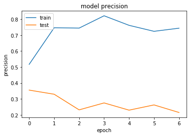


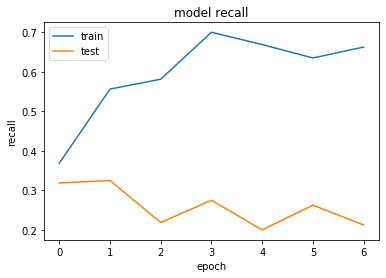


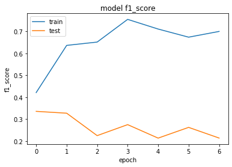


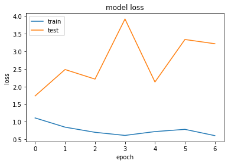


```python
#também não conseguimos uma boa precisão com o classificador DenseNet121
#iremos então testar com o NASNetMobile
```


```python
from keras.applications import NASNetMobile
```


```python
conv_base = NASNetMobile(include_top=False)
for layer in conv_base.layers:
    layer.trainable = False
```

    WARNING:tensorflow:From C:\Users\Infotecno\anaconda3\lib\site-packages\keras\backend\tensorflow_backend.py:4074: The name tf.nn.avg_pool is deprecated. Please use tf.nn.avg_pool2d instead.
    
    Downloading data from https://github.com/titu1994/Keras-NASNet/releases/download/v1.2/NASNet-mobile-no-top.h5
    19996672/19993432 [==============================] - 26s 1us/step
    


```python
x = conv_base.output
x = layers.GlobalAveragePooling2D()(x)
x = layers.Dense(128, activation='relu')(x) 
predictions = layers.Dense(qtde_classes, activation='softmax')(x)
model = Model(conv_base.input, predictions)
model.summary()
```

    Model: "model_2"
    __________________________________________________________________________________________________
    Layer (type)                    Output Shape         Param #     Connected to                     
    ==================================================================================================
    input_2 (InputLayer)            (None, 224, 224, 3)  0                                            
    __________________________________________________________________________________________________
    stem_conv1 (Conv2D)             (None, 111, 111, 32) 864         input_2[0][0]                    
    __________________________________________________________________________________________________
    stem_bn1 (BatchNormalization)   (None, 111, 111, 32) 128         stem_conv1[0][0]                 
    __________________________________________________________________________________________________
    activation_1 (Activation)       (None, 111, 111, 32) 0           stem_bn1[0][0]                   
    __________________________________________________________________________________________________
    reduction_conv_1_stem_1 (Conv2D (None, 111, 111, 11) 352         activation_1[0][0]               
    __________________________________________________________________________________________________
    reduction_bn_1_stem_1 (BatchNor (None, 111, 111, 11) 44          reduction_conv_1_stem_1[0][0]    
    __________________________________________________________________________________________________
    activation_2 (Activation)       (None, 111, 111, 11) 0           reduction_bn_1_stem_1[0][0]      
    __________________________________________________________________________________________________
    activation_4 (Activation)       (None, 111, 111, 32) 0           stem_bn1[0][0]                   
    __________________________________________________________________________________________________
    separable_conv_1_pad_reduction_ (None, 115, 115, 11) 0           activation_2[0][0]               
    __________________________________________________________________________________________________
    separable_conv_1_pad_reduction_ (None, 117, 117, 32) 0           activation_4[0][0]               
    __________________________________________________________________________________________________
    separable_conv_1_reduction_left (None, 56, 56, 11)   396         separable_conv_1_pad_reduction_le
    __________________________________________________________________________________________________
    separable_conv_1_reduction_righ (None, 56, 56, 11)   1920        separable_conv_1_pad_reduction_ri
    __________________________________________________________________________________________________
    separable_conv_1_bn_reduction_l (None, 56, 56, 11)   44          separable_conv_1_reduction_left1_
    __________________________________________________________________________________________________
    separable_conv_1_bn_reduction_r (None, 56, 56, 11)   44          separable_conv_1_reduction_right1
    __________________________________________________________________________________________________
    activation_3 (Activation)       (None, 56, 56, 11)   0           separable_conv_1_bn_reduction_lef
    __________________________________________________________________________________________________
    activation_5 (Activation)       (None, 56, 56, 11)   0           separable_conv_1_bn_reduction_rig
    __________________________________________________________________________________________________
    separable_conv_2_reduction_left (None, 56, 56, 11)   396         activation_3[0][0]               
    __________________________________________________________________________________________________
    separable_conv_2_reduction_righ (None, 56, 56, 11)   660         activation_5[0][0]               
    __________________________________________________________________________________________________
    activation_6 (Activation)       (None, 111, 111, 32) 0           stem_bn1[0][0]                   
    __________________________________________________________________________________________________
    separable_conv_2_bn_reduction_l (None, 56, 56, 11)   44          separable_conv_2_reduction_left1_
    __________________________________________________________________________________________________
    separable_conv_2_bn_reduction_r (None, 56, 56, 11)   44          separable_conv_2_reduction_right1
    __________________________________________________________________________________________________
    separable_conv_1_pad_reduction_ (None, 117, 117, 32) 0           activation_6[0][0]               
    __________________________________________________________________________________________________
    activation_8 (Activation)       (None, 111, 111, 32) 0           stem_bn1[0][0]                   
    __________________________________________________________________________________________________
    reduction_add_1_stem_1 (Add)    (None, 56, 56, 11)   0           separable_conv_2_bn_reduction_lef
                                                                     separable_conv_2_bn_reduction_rig
    __________________________________________________________________________________________________
    separable_conv_1_reduction_righ (None, 56, 56, 11)   1920        separable_conv_1_pad_reduction_ri
    __________________________________________________________________________________________________
    separable_conv_1_pad_reduction_ (None, 115, 115, 32) 0           activation_8[0][0]               
    __________________________________________________________________________________________________
    activation_10 (Activation)      (None, 56, 56, 11)   0           reduction_add_1_stem_1[0][0]     
    __________________________________________________________________________________________________
    separable_conv_1_bn_reduction_r (None, 56, 56, 11)   44          separable_conv_1_reduction_right2
    __________________________________________________________________________________________________
    separable_conv_1_reduction_righ (None, 56, 56, 11)   1152        separable_conv_1_pad_reduction_ri
    __________________________________________________________________________________________________
    separable_conv_1_reduction_left (None, 56, 56, 11)   220         activation_10[0][0]              
    __________________________________________________________________________________________________
    activation_7 (Activation)       (None, 56, 56, 11)   0           separable_conv_1_bn_reduction_rig
    __________________________________________________________________________________________________
    separable_conv_1_bn_reduction_r (None, 56, 56, 11)   44          separable_conv_1_reduction_right3
    __________________________________________________________________________________________________
    separable_conv_1_bn_reduction_l (None, 56, 56, 11)   44          separable_conv_1_reduction_left4_
    __________________________________________________________________________________________________
    reduction_pad_1_stem_1 (ZeroPad (None, 113, 113, 11) 0           reduction_bn_1_stem_1[0][0]      
    __________________________________________________________________________________________________
    separable_conv_2_reduction_righ (None, 56, 56, 11)   660         activation_7[0][0]               
    __________________________________________________________________________________________________
    activation_9 (Activation)       (None, 56, 56, 11)   0           separable_conv_1_bn_reduction_rig
    __________________________________________________________________________________________________
    activation_11 (Activation)      (None, 56, 56, 11)   0           separable_conv_1_bn_reduction_lef
    __________________________________________________________________________________________________
    reduction_left2_stem_1 (MaxPool (None, 56, 56, 11)   0           reduction_pad_1_stem_1[0][0]     
    __________________________________________________________________________________________________
    separable_conv_2_bn_reduction_r (None, 56, 56, 11)   44          separable_conv_2_reduction_right2
    __________________________________________________________________________________________________
    separable_conv_2_reduction_righ (None, 56, 56, 11)   396         activation_9[0][0]               
    __________________________________________________________________________________________________
    separable_conv_2_reduction_left (None, 56, 56, 11)   220         activation_11[0][0]              
    __________________________________________________________________________________________________
    adjust_relu_1_stem_2 (Activatio (None, 111, 111, 32) 0           stem_bn1[0][0]                   
    __________________________________________________________________________________________________
    reduction_add_2_stem_1 (Add)    (None, 56, 56, 11)   0           reduction_left2_stem_1[0][0]     
                                                                     separable_conv_2_bn_reduction_rig
    __________________________________________________________________________________________________
    reduction_left3_stem_1 (Average (None, 56, 56, 11)   0           reduction_pad_1_stem_1[0][0]     
    __________________________________________________________________________________________________
    separable_conv_2_bn_reduction_r (None, 56, 56, 11)   44          separable_conv_2_reduction_right3
    __________________________________________________________________________________________________
    reduction_left4_stem_1 (Average (None, 56, 56, 11)   0           reduction_add_1_stem_1[0][0]     
    __________________________________________________________________________________________________
    separable_conv_2_bn_reduction_l (None, 56, 56, 11)   44          separable_conv_2_reduction_left4_
    __________________________________________________________________________________________________
    reduction_right5_stem_1 (MaxPoo (None, 56, 56, 11)   0           reduction_pad_1_stem_1[0][0]     
    __________________________________________________________________________________________________
    zero_padding2d_1 (ZeroPadding2D (None, 112, 112, 32) 0           adjust_relu_1_stem_2[0][0]       
    __________________________________________________________________________________________________
    reduction_add3_stem_1 (Add)     (None, 56, 56, 11)   0           reduction_left3_stem_1[0][0]     
                                                                     separable_conv_2_bn_reduction_rig
    __________________________________________________________________________________________________
    add_13 (Add)                    (None, 56, 56, 11)   0           reduction_add_2_stem_1[0][0]     
                                                                     reduction_left4_stem_1[0][0]     
    __________________________________________________________________________________________________
    reduction_add4_stem_1 (Add)     (None, 56, 56, 11)   0           separable_conv_2_bn_reduction_lef
                                                                     reduction_right5_stem_1[0][0]    
    __________________________________________________________________________________________________
    cropping2d_1 (Cropping2D)       (None, 111, 111, 32) 0           zero_padding2d_1[0][0]           
    __________________________________________________________________________________________________
    reduction_concat_stem_1 (Concat (None, 56, 56, 44)   0           reduction_add_2_stem_1[0][0]     
                                                                     reduction_add3_stem_1[0][0]      
                                                                     add_13[0][0]                     
                                                                     reduction_add4_stem_1[0][0]      
    __________________________________________________________________________________________________
    adjust_avg_pool_1_stem_2 (Avera (None, 56, 56, 32)   0           adjust_relu_1_stem_2[0][0]       
    __________________________________________________________________________________________________
    adjust_avg_pool_2_stem_2 (Avera (None, 56, 56, 32)   0           cropping2d_1[0][0]               
    __________________________________________________________________________________________________
    activation_12 (Activation)      (None, 56, 56, 44)   0           reduction_concat_stem_1[0][0]    
    __________________________________________________________________________________________________
    adjust_conv_1_stem_2 (Conv2D)   (None, 56, 56, 11)   352         adjust_avg_pool_1_stem_2[0][0]   
    __________________________________________________________________________________________________
    adjust_conv_2_stem_2 (Conv2D)   (None, 56, 56, 11)   352         adjust_avg_pool_2_stem_2[0][0]   
    __________________________________________________________________________________________________
    reduction_conv_1_stem_2 (Conv2D (None, 56, 56, 22)   968         activation_12[0][0]              
    __________________________________________________________________________________________________
    concatenate_1 (Concatenate)     (None, 56, 56, 22)   0           adjust_conv_1_stem_2[0][0]       
                                                                     adjust_conv_2_stem_2[0][0]       
    __________________________________________________________________________________________________
    reduction_bn_1_stem_2 (BatchNor (None, 56, 56, 22)   88          reduction_conv_1_stem_2[0][0]    
    __________________________________________________________________________________________________
    adjust_bn_stem_2 (BatchNormaliz (None, 56, 56, 22)   88          concatenate_1[0][0]              
    __________________________________________________________________________________________________
    activation_13 (Activation)      (None, 56, 56, 22)   0           reduction_bn_1_stem_2[0][0]      
    __________________________________________________________________________________________________
    activation_15 (Activation)      (None, 56, 56, 22)   0           adjust_bn_stem_2[0][0]           
    __________________________________________________________________________________________________
    separable_conv_1_pad_reduction_ (None, 59, 59, 22)   0           activation_13[0][0]              
    __________________________________________________________________________________________________
    separable_conv_1_pad_reduction_ (None, 61, 61, 22)   0           activation_15[0][0]              
    __________________________________________________________________________________________________
    separable_conv_1_reduction_left (None, 28, 28, 22)   1034        separable_conv_1_pad_reduction_le
    __________________________________________________________________________________________________
    separable_conv_1_reduction_righ (None, 28, 28, 22)   1562        separable_conv_1_pad_reduction_ri
    __________________________________________________________________________________________________
    separable_conv_1_bn_reduction_l (None, 28, 28, 22)   88          separable_conv_1_reduction_left1_
    __________________________________________________________________________________________________
    separable_conv_1_bn_reduction_r (None, 28, 28, 22)   88          separable_conv_1_reduction_right1
    __________________________________________________________________________________________________
    activation_14 (Activation)      (None, 28, 28, 22)   0           separable_conv_1_bn_reduction_lef
    __________________________________________________________________________________________________
    activation_16 (Activation)      (None, 28, 28, 22)   0           separable_conv_1_bn_reduction_rig
    __________________________________________________________________________________________________
    separable_conv_2_reduction_left (None, 28, 28, 22)   1034        activation_14[0][0]              
    __________________________________________________________________________________________________
    separable_conv_2_reduction_righ (None, 28, 28, 22)   1562        activation_16[0][0]              
    __________________________________________________________________________________________________
    activation_17 (Activation)      (None, 56, 56, 22)   0           adjust_bn_stem_2[0][0]           
    __________________________________________________________________________________________________
    separable_conv_2_bn_reduction_l (None, 28, 28, 22)   88          separable_conv_2_reduction_left1_
    __________________________________________________________________________________________________
    separable_conv_2_bn_reduction_r (None, 28, 28, 22)   88          separable_conv_2_reduction_right1
    __________________________________________________________________________________________________
    separable_conv_1_pad_reduction_ (None, 61, 61, 22)   0           activation_17[0][0]              
    __________________________________________________________________________________________________
    activation_19 (Activation)      (None, 56, 56, 22)   0           adjust_bn_stem_2[0][0]           
    __________________________________________________________________________________________________
    reduction_add_1_stem_2 (Add)    (None, 28, 28, 22)   0           separable_conv_2_bn_reduction_lef
                                                                     separable_conv_2_bn_reduction_rig
    __________________________________________________________________________________________________
    separable_conv_1_reduction_righ (None, 28, 28, 22)   1562        separable_conv_1_pad_reduction_ri
    __________________________________________________________________________________________________
    separable_conv_1_pad_reduction_ (None, 59, 59, 22)   0           activation_19[0][0]              
    __________________________________________________________________________________________________
    activation_21 (Activation)      (None, 28, 28, 22)   0           reduction_add_1_stem_2[0][0]     
    __________________________________________________________________________________________________
    separable_conv_1_bn_reduction_r (None, 28, 28, 22)   88          separable_conv_1_reduction_right2
    __________________________________________________________________________________________________
    separable_conv_1_reduction_righ (None, 28, 28, 22)   1034        separable_conv_1_pad_reduction_ri
    __________________________________________________________________________________________________
    separable_conv_1_reduction_left (None, 28, 28, 22)   682         activation_21[0][0]              
    __________________________________________________________________________________________________
    activation_18 (Activation)      (None, 28, 28, 22)   0           separable_conv_1_bn_reduction_rig
    __________________________________________________________________________________________________
    separable_conv_1_bn_reduction_r (None, 28, 28, 22)   88          separable_conv_1_reduction_right3
    __________________________________________________________________________________________________
    separable_conv_1_bn_reduction_l (None, 28, 28, 22)   88          separable_conv_1_reduction_left4_
    __________________________________________________________________________________________________
    reduction_pad_1_stem_2 (ZeroPad (None, 57, 57, 22)   0           reduction_bn_1_stem_2[0][0]      
    __________________________________________________________________________________________________
    separable_conv_2_reduction_righ (None, 28, 28, 22)   1562        activation_18[0][0]              
    __________________________________________________________________________________________________
    activation_20 (Activation)      (None, 28, 28, 22)   0           separable_conv_1_bn_reduction_rig
    __________________________________________________________________________________________________
    activation_22 (Activation)      (None, 28, 28, 22)   0           separable_conv_1_bn_reduction_lef
    __________________________________________________________________________________________________
    reduction_left2_stem_2 (MaxPool (None, 28, 28, 22)   0           reduction_pad_1_stem_2[0][0]     
    __________________________________________________________________________________________________
    separable_conv_2_bn_reduction_r (None, 28, 28, 22)   88          separable_conv_2_reduction_right2
    __________________________________________________________________________________________________
    separable_conv_2_reduction_righ (None, 28, 28, 22)   1034        activation_20[0][0]              
    __________________________________________________________________________________________________
    separable_conv_2_reduction_left (None, 28, 28, 22)   682         activation_22[0][0]              
    __________________________________________________________________________________________________
    adjust_relu_1_0 (Activation)    (None, 56, 56, 44)   0           reduction_concat_stem_1[0][0]    
    __________________________________________________________________________________________________
    reduction_add_2_stem_2 (Add)    (None, 28, 28, 22)   0           reduction_left2_stem_2[0][0]     
                                                                     separable_conv_2_bn_reduction_rig
    __________________________________________________________________________________________________
    reduction_left3_stem_2 (Average (None, 28, 28, 22)   0           reduction_pad_1_stem_2[0][0]     
    __________________________________________________________________________________________________
    separable_conv_2_bn_reduction_r (None, 28, 28, 22)   88          separable_conv_2_reduction_right3
    __________________________________________________________________________________________________
    reduction_left4_stem_2 (Average (None, 28, 28, 22)   0           reduction_add_1_stem_2[0][0]     
    __________________________________________________________________________________________________
    separable_conv_2_bn_reduction_l (None, 28, 28, 22)   88          separable_conv_2_reduction_left4_
    __________________________________________________________________________________________________
    reduction_right5_stem_2 (MaxPoo (None, 28, 28, 22)   0           reduction_pad_1_stem_2[0][0]     
    __________________________________________________________________________________________________
    zero_padding2d_2 (ZeroPadding2D (None, 57, 57, 44)   0           adjust_relu_1_0[0][0]            
    __________________________________________________________________________________________________
    reduction_add3_stem_2 (Add)     (None, 28, 28, 22)   0           reduction_left3_stem_2[0][0]     
                                                                     separable_conv_2_bn_reduction_rig
    __________________________________________________________________________________________________
    add_14 (Add)                    (None, 28, 28, 22)   0           reduction_add_2_stem_2[0][0]     
                                                                     reduction_left4_stem_2[0][0]     
    __________________________________________________________________________________________________
    reduction_add4_stem_2 (Add)     (None, 28, 28, 22)   0           separable_conv_2_bn_reduction_lef
                                                                     reduction_right5_stem_2[0][0]    
    __________________________________________________________________________________________________
    cropping2d_2 (Cropping2D)       (None, 56, 56, 44)   0           zero_padding2d_2[0][0]           
    __________________________________________________________________________________________________
    reduction_concat_stem_2 (Concat (None, 28, 28, 88)   0           reduction_add_2_stem_2[0][0]     
                                                                     reduction_add3_stem_2[0][0]      
                                                                     add_14[0][0]                     
                                                                     reduction_add4_stem_2[0][0]      
    __________________________________________________________________________________________________
    adjust_avg_pool_1_0 (AveragePoo (None, 28, 28, 44)   0           adjust_relu_1_0[0][0]            
    __________________________________________________________________________________________________
    adjust_avg_pool_2_0 (AveragePoo (None, 28, 28, 44)   0           cropping2d_2[0][0]               
    __________________________________________________________________________________________________
    adjust_conv_1_0 (Conv2D)        (None, 28, 28, 22)   968         adjust_avg_pool_1_0[0][0]        
    __________________________________________________________________________________________________
    adjust_conv_2_0 (Conv2D)        (None, 28, 28, 22)   968         adjust_avg_pool_2_0[0][0]        
    __________________________________________________________________________________________________
    activation_23 (Activation)      (None, 28, 28, 88)   0           reduction_concat_stem_2[0][0]    
    __________________________________________________________________________________________________
    concatenate_2 (Concatenate)     (None, 28, 28, 44)   0           adjust_conv_1_0[0][0]            
                                                                     adjust_conv_2_0[0][0]            
    __________________________________________________________________________________________________
    normal_conv_1_0 (Conv2D)        (None, 28, 28, 44)   3872        activation_23[0][0]              
    __________________________________________________________________________________________________
    adjust_bn_0 (BatchNormalization (None, 28, 28, 44)   176         concatenate_2[0][0]              
    __________________________________________________________________________________________________
    normal_bn_1_0 (BatchNormalizati (None, 28, 28, 44)   176         normal_conv_1_0[0][0]            
    __________________________________________________________________________________________________
    activation_24 (Activation)      (None, 28, 28, 44)   0           normal_bn_1_0[0][0]              
    __________________________________________________________________________________________________
    activation_26 (Activation)      (None, 28, 28, 44)   0           adjust_bn_0[0][0]                
    __________________________________________________________________________________________________
    activation_28 (Activation)      (None, 28, 28, 44)   0           adjust_bn_0[0][0]                
    __________________________________________________________________________________________________
    activation_30 (Activation)      (None, 28, 28, 44)   0           adjust_bn_0[0][0]                
    __________________________________________________________________________________________________
    activation_32 (Activation)      (None, 28, 28, 44)   0           normal_bn_1_0[0][0]              
    __________________________________________________________________________________________________
    separable_conv_1_normal_left1_0 (None, 28, 28, 44)   3036        activation_24[0][0]              
    __________________________________________________________________________________________________
    separable_conv_1_normal_right1_ (None, 28, 28, 44)   2332        activation_26[0][0]              
    __________________________________________________________________________________________________
    separable_conv_1_normal_left2_0 (None, 28, 28, 44)   3036        activation_28[0][0]              
    __________________________________________________________________________________________________
    separable_conv_1_normal_right2_ (None, 28, 28, 44)   2332        activation_30[0][0]              
    __________________________________________________________________________________________________
    separable_conv_1_normal_left5_0 (None, 28, 28, 44)   2332        activation_32[0][0]              
    __________________________________________________________________________________________________
    separable_conv_1_bn_normal_left (None, 28, 28, 44)   176         separable_conv_1_normal_left1_0[0
    __________________________________________________________________________________________________
    separable_conv_1_bn_normal_righ (None, 28, 28, 44)   176         separable_conv_1_normal_right1_0[
    __________________________________________________________________________________________________
    separable_conv_1_bn_normal_left (None, 28, 28, 44)   176         separable_conv_1_normal_left2_0[0
    __________________________________________________________________________________________________
    separable_conv_1_bn_normal_righ (None, 28, 28, 44)   176         separable_conv_1_normal_right2_0[
    __________________________________________________________________________________________________
    separable_conv_1_bn_normal_left (None, 28, 28, 44)   176         separable_conv_1_normal_left5_0[0
    __________________________________________________________________________________________________
    activation_25 (Activation)      (None, 28, 28, 44)   0           separable_conv_1_bn_normal_left1_
    __________________________________________________________________________________________________
    activation_27 (Activation)      (None, 28, 28, 44)   0           separable_conv_1_bn_normal_right1
    __________________________________________________________________________________________________
    activation_29 (Activation)      (None, 28, 28, 44)   0           separable_conv_1_bn_normal_left2_
    __________________________________________________________________________________________________
    activation_31 (Activation)      (None, 28, 28, 44)   0           separable_conv_1_bn_normal_right2
    __________________________________________________________________________________________________
    activation_33 (Activation)      (None, 28, 28, 44)   0           separable_conv_1_bn_normal_left5_
    __________________________________________________________________________________________________
    separable_conv_2_normal_left1_0 (None, 28, 28, 44)   3036        activation_25[0][0]              
    __________________________________________________________________________________________________
    separable_conv_2_normal_right1_ (None, 28, 28, 44)   2332        activation_27[0][0]              
    __________________________________________________________________________________________________
    separable_conv_2_normal_left2_0 (None, 28, 28, 44)   3036        activation_29[0][0]              
    __________________________________________________________________________________________________
    separable_conv_2_normal_right2_ (None, 28, 28, 44)   2332        activation_31[0][0]              
    __________________________________________________________________________________________________
    separable_conv_2_normal_left5_0 (None, 28, 28, 44)   2332        activation_33[0][0]              
    __________________________________________________________________________________________________
    separable_conv_2_bn_normal_left (None, 28, 28, 44)   176         separable_conv_2_normal_left1_0[0
    __________________________________________________________________________________________________
    separable_conv_2_bn_normal_righ (None, 28, 28, 44)   176         separable_conv_2_normal_right1_0[
    __________________________________________________________________________________________________
    separable_conv_2_bn_normal_left (None, 28, 28, 44)   176         separable_conv_2_normal_left2_0[0
    __________________________________________________________________________________________________
    separable_conv_2_bn_normal_righ (None, 28, 28, 44)   176         separable_conv_2_normal_right2_0[
    __________________________________________________________________________________________________
    normal_left3_0 (AveragePooling2 (None, 28, 28, 44)   0           normal_bn_1_0[0][0]              
    __________________________________________________________________________________________________
    normal_left4_0 (AveragePooling2 (None, 28, 28, 44)   0           adjust_bn_0[0][0]                
    __________________________________________________________________________________________________
    normal_right4_0 (AveragePooling (None, 28, 28, 44)   0           adjust_bn_0[0][0]                
    __________________________________________________________________________________________________
    separable_conv_2_bn_normal_left (None, 28, 28, 44)   176         separable_conv_2_normal_left5_0[0
    __________________________________________________________________________________________________
    normal_add_1_0 (Add)            (None, 28, 28, 44)   0           separable_conv_2_bn_normal_left1_
                                                                     separable_conv_2_bn_normal_right1
    __________________________________________________________________________________________________
    normal_add_2_0 (Add)            (None, 28, 28, 44)   0           separable_conv_2_bn_normal_left2_
                                                                     separable_conv_2_bn_normal_right2
    __________________________________________________________________________________________________
    normal_add_3_0 (Add)            (None, 28, 28, 44)   0           normal_left3_0[0][0]             
                                                                     adjust_bn_0[0][0]                
    __________________________________________________________________________________________________
    normal_add_4_0 (Add)            (None, 28, 28, 44)   0           normal_left4_0[0][0]             
                                                                     normal_right4_0[0][0]            
    __________________________________________________________________________________________________
    normal_add_5_0 (Add)            (None, 28, 28, 44)   0           separable_conv_2_bn_normal_left5_
                                                                     normal_bn_1_0[0][0]              
    __________________________________________________________________________________________________
    normal_concat_0 (Concatenate)   (None, 28, 28, 264)  0           adjust_bn_0[0][0]                
                                                                     normal_add_1_0[0][0]             
                                                                     normal_add_2_0[0][0]             
                                                                     normal_add_3_0[0][0]             
                                                                     normal_add_4_0[0][0]             
                                                                     normal_add_5_0[0][0]             
    __________________________________________________________________________________________________
    activation_34 (Activation)      (None, 28, 28, 88)   0           reduction_concat_stem_2[0][0]    
    __________________________________________________________________________________________________
    activation_35 (Activation)      (None, 28, 28, 264)  0           normal_concat_0[0][0]            
    __________________________________________________________________________________________________
    adjust_conv_projection_1 (Conv2 (None, 28, 28, 44)   3872        activation_34[0][0]              
    __________________________________________________________________________________________________
    normal_conv_1_1 (Conv2D)        (None, 28, 28, 44)   11616       activation_35[0][0]              
    __________________________________________________________________________________________________
    adjust_bn_1 (BatchNormalization (None, 28, 28, 44)   176         adjust_conv_projection_1[0][0]   
    __________________________________________________________________________________________________
    normal_bn_1_1 (BatchNormalizati (None, 28, 28, 44)   176         normal_conv_1_1[0][0]            
    __________________________________________________________________________________________________
    activation_36 (Activation)      (None, 28, 28, 44)   0           normal_bn_1_1[0][0]              
    __________________________________________________________________________________________________
    activation_38 (Activation)      (None, 28, 28, 44)   0           adjust_bn_1[0][0]                
    __________________________________________________________________________________________________
    activation_40 (Activation)      (None, 28, 28, 44)   0           adjust_bn_1[0][0]                
    __________________________________________________________________________________________________
    activation_42 (Activation)      (None, 28, 28, 44)   0           adjust_bn_1[0][0]                
    __________________________________________________________________________________________________
    activation_44 (Activation)      (None, 28, 28, 44)   0           normal_bn_1_1[0][0]              
    __________________________________________________________________________________________________
    separable_conv_1_normal_left1_1 (None, 28, 28, 44)   3036        activation_36[0][0]              
    __________________________________________________________________________________________________
    separable_conv_1_normal_right1_ (None, 28, 28, 44)   2332        activation_38[0][0]              
    __________________________________________________________________________________________________
    separable_conv_1_normal_left2_1 (None, 28, 28, 44)   3036        activation_40[0][0]              
    __________________________________________________________________________________________________
    separable_conv_1_normal_right2_ (None, 28, 28, 44)   2332        activation_42[0][0]              
    __________________________________________________________________________________________________
    separable_conv_1_normal_left5_1 (None, 28, 28, 44)   2332        activation_44[0][0]              
    __________________________________________________________________________________________________
    separable_conv_1_bn_normal_left (None, 28, 28, 44)   176         separable_conv_1_normal_left1_1[0
    __________________________________________________________________________________________________
    separable_conv_1_bn_normal_righ (None, 28, 28, 44)   176         separable_conv_1_normal_right1_1[
    __________________________________________________________________________________________________
    separable_conv_1_bn_normal_left (None, 28, 28, 44)   176         separable_conv_1_normal_left2_1[0
    __________________________________________________________________________________________________
    separable_conv_1_bn_normal_righ (None, 28, 28, 44)   176         separable_conv_1_normal_right2_1[
    __________________________________________________________________________________________________
    separable_conv_1_bn_normal_left (None, 28, 28, 44)   176         separable_conv_1_normal_left5_1[0
    __________________________________________________________________________________________________
    activation_37 (Activation)      (None, 28, 28, 44)   0           separable_conv_1_bn_normal_left1_
    __________________________________________________________________________________________________
    activation_39 (Activation)      (None, 28, 28, 44)   0           separable_conv_1_bn_normal_right1
    __________________________________________________________________________________________________
    activation_41 (Activation)      (None, 28, 28, 44)   0           separable_conv_1_bn_normal_left2_
    __________________________________________________________________________________________________
    activation_43 (Activation)      (None, 28, 28, 44)   0           separable_conv_1_bn_normal_right2
    __________________________________________________________________________________________________
    activation_45 (Activation)      (None, 28, 28, 44)   0           separable_conv_1_bn_normal_left5_
    __________________________________________________________________________________________________
    separable_conv_2_normal_left1_1 (None, 28, 28, 44)   3036        activation_37[0][0]              
    __________________________________________________________________________________________________
    separable_conv_2_normal_right1_ (None, 28, 28, 44)   2332        activation_39[0][0]              
    __________________________________________________________________________________________________
    separable_conv_2_normal_left2_1 (None, 28, 28, 44)   3036        activation_41[0][0]              
    __________________________________________________________________________________________________
    separable_conv_2_normal_right2_ (None, 28, 28, 44)   2332        activation_43[0][0]              
    __________________________________________________________________________________________________
    separable_conv_2_normal_left5_1 (None, 28, 28, 44)   2332        activation_45[0][0]              
    __________________________________________________________________________________________________
    separable_conv_2_bn_normal_left (None, 28, 28, 44)   176         separable_conv_2_normal_left1_1[0
    __________________________________________________________________________________________________
    separable_conv_2_bn_normal_righ (None, 28, 28, 44)   176         separable_conv_2_normal_right1_1[
    __________________________________________________________________________________________________
    separable_conv_2_bn_normal_left (None, 28, 28, 44)   176         separable_conv_2_normal_left2_1[0
    __________________________________________________________________________________________________
    separable_conv_2_bn_normal_righ (None, 28, 28, 44)   176         separable_conv_2_normal_right2_1[
    __________________________________________________________________________________________________
    normal_left3_1 (AveragePooling2 (None, 28, 28, 44)   0           normal_bn_1_1[0][0]              
    __________________________________________________________________________________________________
    normal_left4_1 (AveragePooling2 (None, 28, 28, 44)   0           adjust_bn_1[0][0]                
    __________________________________________________________________________________________________
    normal_right4_1 (AveragePooling (None, 28, 28, 44)   0           adjust_bn_1[0][0]                
    __________________________________________________________________________________________________
    separable_conv_2_bn_normal_left (None, 28, 28, 44)   176         separable_conv_2_normal_left5_1[0
    __________________________________________________________________________________________________
    normal_add_1_1 (Add)            (None, 28, 28, 44)   0           separable_conv_2_bn_normal_left1_
                                                                     separable_conv_2_bn_normal_right1
    __________________________________________________________________________________________________
    normal_add_2_1 (Add)            (None, 28, 28, 44)   0           separable_conv_2_bn_normal_left2_
                                                                     separable_conv_2_bn_normal_right2
    __________________________________________________________________________________________________
    normal_add_3_1 (Add)            (None, 28, 28, 44)   0           normal_left3_1[0][0]             
                                                                     adjust_bn_1[0][0]                
    __________________________________________________________________________________________________
    normal_add_4_1 (Add)            (None, 28, 28, 44)   0           normal_left4_1[0][0]             
                                                                     normal_right4_1[0][0]            
    __________________________________________________________________________________________________
    normal_add_5_1 (Add)            (None, 28, 28, 44)   0           separable_conv_2_bn_normal_left5_
                                                                     normal_bn_1_1[0][0]              
    __________________________________________________________________________________________________
    normal_concat_1 (Concatenate)   (None, 28, 28, 264)  0           adjust_bn_1[0][0]                
                                                                     normal_add_1_1[0][0]             
                                                                     normal_add_2_1[0][0]             
                                                                     normal_add_3_1[0][0]             
                                                                     normal_add_4_1[0][0]             
                                                                     normal_add_5_1[0][0]             
    __________________________________________________________________________________________________
    activation_46 (Activation)      (None, 28, 28, 264)  0           normal_concat_0[0][0]            
    __________________________________________________________________________________________________
    activation_47 (Activation)      (None, 28, 28, 264)  0           normal_concat_1[0][0]            
    __________________________________________________________________________________________________
    adjust_conv_projection_2 (Conv2 (None, 28, 28, 44)   11616       activation_46[0][0]              
    __________________________________________________________________________________________________
    normal_conv_1_2 (Conv2D)        (None, 28, 28, 44)   11616       activation_47[0][0]              
    __________________________________________________________________________________________________
    adjust_bn_2 (BatchNormalization (None, 28, 28, 44)   176         adjust_conv_projection_2[0][0]   
    __________________________________________________________________________________________________
    normal_bn_1_2 (BatchNormalizati (None, 28, 28, 44)   176         normal_conv_1_2[0][0]            
    __________________________________________________________________________________________________
    activation_48 (Activation)      (None, 28, 28, 44)   0           normal_bn_1_2[0][0]              
    __________________________________________________________________________________________________
    activation_50 (Activation)      (None, 28, 28, 44)   0           adjust_bn_2[0][0]                
    __________________________________________________________________________________________________
    activation_52 (Activation)      (None, 28, 28, 44)   0           adjust_bn_2[0][0]                
    __________________________________________________________________________________________________
    activation_54 (Activation)      (None, 28, 28, 44)   0           adjust_bn_2[0][0]                
    __________________________________________________________________________________________________
    activation_56 (Activation)      (None, 28, 28, 44)   0           normal_bn_1_2[0][0]              
    __________________________________________________________________________________________________
    separable_conv_1_normal_left1_2 (None, 28, 28, 44)   3036        activation_48[0][0]              
    __________________________________________________________________________________________________
    separable_conv_1_normal_right1_ (None, 28, 28, 44)   2332        activation_50[0][0]              
    __________________________________________________________________________________________________
    separable_conv_1_normal_left2_2 (None, 28, 28, 44)   3036        activation_52[0][0]              
    __________________________________________________________________________________________________
    separable_conv_1_normal_right2_ (None, 28, 28, 44)   2332        activation_54[0][0]              
    __________________________________________________________________________________________________
    separable_conv_1_normal_left5_2 (None, 28, 28, 44)   2332        activation_56[0][0]              
    __________________________________________________________________________________________________
    separable_conv_1_bn_normal_left (None, 28, 28, 44)   176         separable_conv_1_normal_left1_2[0
    __________________________________________________________________________________________________
    separable_conv_1_bn_normal_righ (None, 28, 28, 44)   176         separable_conv_1_normal_right1_2[
    __________________________________________________________________________________________________
    separable_conv_1_bn_normal_left (None, 28, 28, 44)   176         separable_conv_1_normal_left2_2[0
    __________________________________________________________________________________________________
    separable_conv_1_bn_normal_righ (None, 28, 28, 44)   176         separable_conv_1_normal_right2_2[
    __________________________________________________________________________________________________
    separable_conv_1_bn_normal_left (None, 28, 28, 44)   176         separable_conv_1_normal_left5_2[0
    __________________________________________________________________________________________________
    activation_49 (Activation)      (None, 28, 28, 44)   0           separable_conv_1_bn_normal_left1_
    __________________________________________________________________________________________________
    activation_51 (Activation)      (None, 28, 28, 44)   0           separable_conv_1_bn_normal_right1
    __________________________________________________________________________________________________
    activation_53 (Activation)      (None, 28, 28, 44)   0           separable_conv_1_bn_normal_left2_
    __________________________________________________________________________________________________
    activation_55 (Activation)      (None, 28, 28, 44)   0           separable_conv_1_bn_normal_right2
    __________________________________________________________________________________________________
    activation_57 (Activation)      (None, 28, 28, 44)   0           separable_conv_1_bn_normal_left5_
    __________________________________________________________________________________________________
    separable_conv_2_normal_left1_2 (None, 28, 28, 44)   3036        activation_49[0][0]              
    __________________________________________________________________________________________________
    separable_conv_2_normal_right1_ (None, 28, 28, 44)   2332        activation_51[0][0]              
    __________________________________________________________________________________________________
    separable_conv_2_normal_left2_2 (None, 28, 28, 44)   3036        activation_53[0][0]              
    __________________________________________________________________________________________________
    separable_conv_2_normal_right2_ (None, 28, 28, 44)   2332        activation_55[0][0]              
    __________________________________________________________________________________________________
    separable_conv_2_normal_left5_2 (None, 28, 28, 44)   2332        activation_57[0][0]              
    __________________________________________________________________________________________________
    separable_conv_2_bn_normal_left (None, 28, 28, 44)   176         separable_conv_2_normal_left1_2[0
    __________________________________________________________________________________________________
    separable_conv_2_bn_normal_righ (None, 28, 28, 44)   176         separable_conv_2_normal_right1_2[
    __________________________________________________________________________________________________
    separable_conv_2_bn_normal_left (None, 28, 28, 44)   176         separable_conv_2_normal_left2_2[0
    __________________________________________________________________________________________________
    separable_conv_2_bn_normal_righ (None, 28, 28, 44)   176         separable_conv_2_normal_right2_2[
    __________________________________________________________________________________________________
    normal_left3_2 (AveragePooling2 (None, 28, 28, 44)   0           normal_bn_1_2[0][0]              
    __________________________________________________________________________________________________
    normal_left4_2 (AveragePooling2 (None, 28, 28, 44)   0           adjust_bn_2[0][0]                
    __________________________________________________________________________________________________
    normal_right4_2 (AveragePooling (None, 28, 28, 44)   0           adjust_bn_2[0][0]                
    __________________________________________________________________________________________________
    separable_conv_2_bn_normal_left (None, 28, 28, 44)   176         separable_conv_2_normal_left5_2[0
    __________________________________________________________________________________________________
    normal_add_1_2 (Add)            (None, 28, 28, 44)   0           separable_conv_2_bn_normal_left1_
                                                                     separable_conv_2_bn_normal_right1
    __________________________________________________________________________________________________
    normal_add_2_2 (Add)            (None, 28, 28, 44)   0           separable_conv_2_bn_normal_left2_
                                                                     separable_conv_2_bn_normal_right2
    __________________________________________________________________________________________________
    normal_add_3_2 (Add)            (None, 28, 28, 44)   0           normal_left3_2[0][0]             
                                                                     adjust_bn_2[0][0]                
    __________________________________________________________________________________________________
    normal_add_4_2 (Add)            (None, 28, 28, 44)   0           normal_left4_2[0][0]             
                                                                     normal_right4_2[0][0]            
    __________________________________________________________________________________________________
    normal_add_5_2 (Add)            (None, 28, 28, 44)   0           separable_conv_2_bn_normal_left5_
                                                                     normal_bn_1_2[0][0]              
    __________________________________________________________________________________________________
    normal_concat_2 (Concatenate)   (None, 28, 28, 264)  0           adjust_bn_2[0][0]                
                                                                     normal_add_1_2[0][0]             
                                                                     normal_add_2_2[0][0]             
                                                                     normal_add_3_2[0][0]             
                                                                     normal_add_4_2[0][0]             
                                                                     normal_add_5_2[0][0]             
    __________________________________________________________________________________________________
    activation_58 (Activation)      (None, 28, 28, 264)  0           normal_concat_1[0][0]            
    __________________________________________________________________________________________________
    activation_59 (Activation)      (None, 28, 28, 264)  0           normal_concat_2[0][0]            
    __________________________________________________________________________________________________
    adjust_conv_projection_3 (Conv2 (None, 28, 28, 44)   11616       activation_58[0][0]              
    __________________________________________________________________________________________________
    normal_conv_1_3 (Conv2D)        (None, 28, 28, 44)   11616       activation_59[0][0]              
    __________________________________________________________________________________________________
    adjust_bn_3 (BatchNormalization (None, 28, 28, 44)   176         adjust_conv_projection_3[0][0]   
    __________________________________________________________________________________________________
    normal_bn_1_3 (BatchNormalizati (None, 28, 28, 44)   176         normal_conv_1_3[0][0]            
    __________________________________________________________________________________________________
    activation_60 (Activation)      (None, 28, 28, 44)   0           normal_bn_1_3[0][0]              
    __________________________________________________________________________________________________
    activation_62 (Activation)      (None, 28, 28, 44)   0           adjust_bn_3[0][0]                
    __________________________________________________________________________________________________
    activation_64 (Activation)      (None, 28, 28, 44)   0           adjust_bn_3[0][0]                
    __________________________________________________________________________________________________
    activation_66 (Activation)      (None, 28, 28, 44)   0           adjust_bn_3[0][0]                
    __________________________________________________________________________________________________
    activation_68 (Activation)      (None, 28, 28, 44)   0           normal_bn_1_3[0][0]              
    __________________________________________________________________________________________________
    separable_conv_1_normal_left1_3 (None, 28, 28, 44)   3036        activation_60[0][0]              
    __________________________________________________________________________________________________
    separable_conv_1_normal_right1_ (None, 28, 28, 44)   2332        activation_62[0][0]              
    __________________________________________________________________________________________________
    separable_conv_1_normal_left2_3 (None, 28, 28, 44)   3036        activation_64[0][0]              
    __________________________________________________________________________________________________
    separable_conv_1_normal_right2_ (None, 28, 28, 44)   2332        activation_66[0][0]              
    __________________________________________________________________________________________________
    separable_conv_1_normal_left5_3 (None, 28, 28, 44)   2332        activation_68[0][0]              
    __________________________________________________________________________________________________
    separable_conv_1_bn_normal_left (None, 28, 28, 44)   176         separable_conv_1_normal_left1_3[0
    __________________________________________________________________________________________________
    separable_conv_1_bn_normal_righ (None, 28, 28, 44)   176         separable_conv_1_normal_right1_3[
    __________________________________________________________________________________________________
    separable_conv_1_bn_normal_left (None, 28, 28, 44)   176         separable_conv_1_normal_left2_3[0
    __________________________________________________________________________________________________
    separable_conv_1_bn_normal_righ (None, 28, 28, 44)   176         separable_conv_1_normal_right2_3[
    __________________________________________________________________________________________________
    separable_conv_1_bn_normal_left (None, 28, 28, 44)   176         separable_conv_1_normal_left5_3[0
    __________________________________________________________________________________________________
    activation_61 (Activation)      (None, 28, 28, 44)   0           separable_conv_1_bn_normal_left1_
    __________________________________________________________________________________________________
    activation_63 (Activation)      (None, 28, 28, 44)   0           separable_conv_1_bn_normal_right1
    __________________________________________________________________________________________________
    activation_65 (Activation)      (None, 28, 28, 44)   0           separable_conv_1_bn_normal_left2_
    __________________________________________________________________________________________________
    activation_67 (Activation)      (None, 28, 28, 44)   0           separable_conv_1_bn_normal_right2
    __________________________________________________________________________________________________
    activation_69 (Activation)      (None, 28, 28, 44)   0           separable_conv_1_bn_normal_left5_
    __________________________________________________________________________________________________
    separable_conv_2_normal_left1_3 (None, 28, 28, 44)   3036        activation_61[0][0]              
    __________________________________________________________________________________________________
    separable_conv_2_normal_right1_ (None, 28, 28, 44)   2332        activation_63[0][0]              
    __________________________________________________________________________________________________
    separable_conv_2_normal_left2_3 (None, 28, 28, 44)   3036        activation_65[0][0]              
    __________________________________________________________________________________________________
    separable_conv_2_normal_right2_ (None, 28, 28, 44)   2332        activation_67[0][0]              
    __________________________________________________________________________________________________
    separable_conv_2_normal_left5_3 (None, 28, 28, 44)   2332        activation_69[0][0]              
    __________________________________________________________________________________________________
    separable_conv_2_bn_normal_left (None, 28, 28, 44)   176         separable_conv_2_normal_left1_3[0
    __________________________________________________________________________________________________
    separable_conv_2_bn_normal_righ (None, 28, 28, 44)   176         separable_conv_2_normal_right1_3[
    __________________________________________________________________________________________________
    separable_conv_2_bn_normal_left (None, 28, 28, 44)   176         separable_conv_2_normal_left2_3[0
    __________________________________________________________________________________________________
    separable_conv_2_bn_normal_righ (None, 28, 28, 44)   176         separable_conv_2_normal_right2_3[
    __________________________________________________________________________________________________
    normal_left3_3 (AveragePooling2 (None, 28, 28, 44)   0           normal_bn_1_3[0][0]              
    __________________________________________________________________________________________________
    normal_left4_3 (AveragePooling2 (None, 28, 28, 44)   0           adjust_bn_3[0][0]                
    __________________________________________________________________________________________________
    normal_right4_3 (AveragePooling (None, 28, 28, 44)   0           adjust_bn_3[0][0]                
    __________________________________________________________________________________________________
    separable_conv_2_bn_normal_left (None, 28, 28, 44)   176         separable_conv_2_normal_left5_3[0
    __________________________________________________________________________________________________
    normal_add_1_3 (Add)            (None, 28, 28, 44)   0           separable_conv_2_bn_normal_left1_
                                                                     separable_conv_2_bn_normal_right1
    __________________________________________________________________________________________________
    normal_add_2_3 (Add)            (None, 28, 28, 44)   0           separable_conv_2_bn_normal_left2_
                                                                     separable_conv_2_bn_normal_right2
    __________________________________________________________________________________________________
    normal_add_3_3 (Add)            (None, 28, 28, 44)   0           normal_left3_3[0][0]             
                                                                     adjust_bn_3[0][0]                
    __________________________________________________________________________________________________
    normal_add_4_3 (Add)            (None, 28, 28, 44)   0           normal_left4_3[0][0]             
                                                                     normal_right4_3[0][0]            
    __________________________________________________________________________________________________
    normal_add_5_3 (Add)            (None, 28, 28, 44)   0           separable_conv_2_bn_normal_left5_
                                                                     normal_bn_1_3[0][0]              
    __________________________________________________________________________________________________
    normal_concat_3 (Concatenate)   (None, 28, 28, 264)  0           adjust_bn_3[0][0]                
                                                                     normal_add_1_3[0][0]             
                                                                     normal_add_2_3[0][0]             
                                                                     normal_add_3_3[0][0]             
                                                                     normal_add_4_3[0][0]             
                                                                     normal_add_5_3[0][0]             
    __________________________________________________________________________________________________
    activation_71 (Activation)      (None, 28, 28, 264)  0           normal_concat_3[0][0]            
    __________________________________________________________________________________________________
    activation_70 (Activation)      (None, 28, 28, 264)  0           normal_concat_2[0][0]            
    __________________________________________________________________________________________________
    reduction_conv_1_reduce_4 (Conv (None, 28, 28, 88)   23232       activation_71[0][0]              
    __________________________________________________________________________________________________
    adjust_conv_projection_reduce_4 (None, 28, 28, 88)   23232       activation_70[0][0]              
    __________________________________________________________________________________________________
    reduction_bn_1_reduce_4 (BatchN (None, 28, 28, 88)   352         reduction_conv_1_reduce_4[0][0]  
    __________________________________________________________________________________________________
    adjust_bn_reduce_4 (BatchNormal (None, 28, 28, 88)   352         adjust_conv_projection_reduce_4[0
    __________________________________________________________________________________________________
    activation_72 (Activation)      (None, 28, 28, 88)   0           reduction_bn_1_reduce_4[0][0]    
    __________________________________________________________________________________________________
    activation_74 (Activation)      (None, 28, 28, 88)   0           adjust_bn_reduce_4[0][0]         
    __________________________________________________________________________________________________
    separable_conv_1_pad_reduction_ (None, 31, 31, 88)   0           activation_72[0][0]              
    __________________________________________________________________________________________________
    separable_conv_1_pad_reduction_ (None, 33, 33, 88)   0           activation_74[0][0]              
    __________________________________________________________________________________________________
    separable_conv_1_reduction_left (None, 14, 14, 88)   9944        separable_conv_1_pad_reduction_le
    __________________________________________________________________________________________________
    separable_conv_1_reduction_righ (None, 14, 14, 88)   12056       separable_conv_1_pad_reduction_ri
    __________________________________________________________________________________________________
    separable_conv_1_bn_reduction_l (None, 14, 14, 88)   352         separable_conv_1_reduction_left1_
    __________________________________________________________________________________________________
    separable_conv_1_bn_reduction_r (None, 14, 14, 88)   352         separable_conv_1_reduction_right1
    __________________________________________________________________________________________________
    activation_73 (Activation)      (None, 14, 14, 88)   0           separable_conv_1_bn_reduction_lef
    __________________________________________________________________________________________________
    activation_75 (Activation)      (None, 14, 14, 88)   0           separable_conv_1_bn_reduction_rig
    __________________________________________________________________________________________________
    separable_conv_2_reduction_left (None, 14, 14, 88)   9944        activation_73[0][0]              
    __________________________________________________________________________________________________
    separable_conv_2_reduction_righ (None, 14, 14, 88)   12056       activation_75[0][0]              
    __________________________________________________________________________________________________
    activation_76 (Activation)      (None, 28, 28, 88)   0           adjust_bn_reduce_4[0][0]         
    __________________________________________________________________________________________________
    separable_conv_2_bn_reduction_l (None, 14, 14, 88)   352         separable_conv_2_reduction_left1_
    __________________________________________________________________________________________________
    separable_conv_2_bn_reduction_r (None, 14, 14, 88)   352         separable_conv_2_reduction_right1
    __________________________________________________________________________________________________
    separable_conv_1_pad_reduction_ (None, 33, 33, 88)   0           activation_76[0][0]              
    __________________________________________________________________________________________________
    activation_78 (Activation)      (None, 28, 28, 88)   0           adjust_bn_reduce_4[0][0]         
    __________________________________________________________________________________________________
    reduction_add_1_reduce_4 (Add)  (None, 14, 14, 88)   0           separable_conv_2_bn_reduction_lef
                                                                     separable_conv_2_bn_reduction_rig
    __________________________________________________________________________________________________
    separable_conv_1_reduction_righ (None, 14, 14, 88)   12056       separable_conv_1_pad_reduction_ri
    __________________________________________________________________________________________________
    separable_conv_1_pad_reduction_ (None, 31, 31, 88)   0           activation_78[0][0]              
    __________________________________________________________________________________________________
    activation_80 (Activation)      (None, 14, 14, 88)   0           reduction_add_1_reduce_4[0][0]   
    __________________________________________________________________________________________________
    separable_conv_1_bn_reduction_r (None, 14, 14, 88)   352         separable_conv_1_reduction_right2
    __________________________________________________________________________________________________
    separable_conv_1_reduction_righ (None, 14, 14, 88)   9944        separable_conv_1_pad_reduction_ri
    __________________________________________________________________________________________________
    separable_conv_1_reduction_left (None, 14, 14, 88)   8536        activation_80[0][0]              
    __________________________________________________________________________________________________
    activation_77 (Activation)      (None, 14, 14, 88)   0           separable_conv_1_bn_reduction_rig
    __________________________________________________________________________________________________
    separable_conv_1_bn_reduction_r (None, 14, 14, 88)   352         separable_conv_1_reduction_right3
    __________________________________________________________________________________________________
    separable_conv_1_bn_reduction_l (None, 14, 14, 88)   352         separable_conv_1_reduction_left4_
    __________________________________________________________________________________________________
    reduction_pad_1_reduce_4 (ZeroP (None, 29, 29, 88)   0           reduction_bn_1_reduce_4[0][0]    
    __________________________________________________________________________________________________
    separable_conv_2_reduction_righ (None, 14, 14, 88)   12056       activation_77[0][0]              
    __________________________________________________________________________________________________
    activation_79 (Activation)      (None, 14, 14, 88)   0           separable_conv_1_bn_reduction_rig
    __________________________________________________________________________________________________
    activation_81 (Activation)      (None, 14, 14, 88)   0           separable_conv_1_bn_reduction_lef
    __________________________________________________________________________________________________
    reduction_left2_reduce_4 (MaxPo (None, 14, 14, 88)   0           reduction_pad_1_reduce_4[0][0]   
    __________________________________________________________________________________________________
    separable_conv_2_bn_reduction_r (None, 14, 14, 88)   352         separable_conv_2_reduction_right2
    __________________________________________________________________________________________________
    separable_conv_2_reduction_righ (None, 14, 14, 88)   9944        activation_79[0][0]              
    __________________________________________________________________________________________________
    separable_conv_2_reduction_left (None, 14, 14, 88)   8536        activation_81[0][0]              
    __________________________________________________________________________________________________
    adjust_relu_1_5 (Activation)    (None, 28, 28, 264)  0           normal_concat_3[0][0]            
    __________________________________________________________________________________________________
    reduction_add_2_reduce_4 (Add)  (None, 14, 14, 88)   0           reduction_left2_reduce_4[0][0]   
                                                                     separable_conv_2_bn_reduction_rig
    __________________________________________________________________________________________________
    reduction_left3_reduce_4 (Avera (None, 14, 14, 88)   0           reduction_pad_1_reduce_4[0][0]   
    __________________________________________________________________________________________________
    separable_conv_2_bn_reduction_r (None, 14, 14, 88)   352         separable_conv_2_reduction_right3
    __________________________________________________________________________________________________
    reduction_left4_reduce_4 (Avera (None, 14, 14, 88)   0           reduction_add_1_reduce_4[0][0]   
    __________________________________________________________________________________________________
    separable_conv_2_bn_reduction_l (None, 14, 14, 88)   352         separable_conv_2_reduction_left4_
    __________________________________________________________________________________________________
    reduction_right5_reduce_4 (MaxP (None, 14, 14, 88)   0           reduction_pad_1_reduce_4[0][0]   
    __________________________________________________________________________________________________
    zero_padding2d_3 (ZeroPadding2D (None, 29, 29, 264)  0           adjust_relu_1_5[0][0]            
    __________________________________________________________________________________________________
    reduction_add3_reduce_4 (Add)   (None, 14, 14, 88)   0           reduction_left3_reduce_4[0][0]   
                                                                     separable_conv_2_bn_reduction_rig
    __________________________________________________________________________________________________
    add_15 (Add)                    (None, 14, 14, 88)   0           reduction_add_2_reduce_4[0][0]   
                                                                     reduction_left4_reduce_4[0][0]   
    __________________________________________________________________________________________________
    reduction_add4_reduce_4 (Add)   (None, 14, 14, 88)   0           separable_conv_2_bn_reduction_lef
                                                                     reduction_right5_reduce_4[0][0]  
    __________________________________________________________________________________________________
    cropping2d_3 (Cropping2D)       (None, 28, 28, 264)  0           zero_padding2d_3[0][0]           
    __________________________________________________________________________________________________
    reduction_concat_reduce_4 (Conc (None, 14, 14, 352)  0           reduction_add_2_reduce_4[0][0]   
                                                                     reduction_add3_reduce_4[0][0]    
                                                                     add_15[0][0]                     
                                                                     reduction_add4_reduce_4[0][0]    
    __________________________________________________________________________________________________
    adjust_avg_pool_1_5 (AveragePoo (None, 14, 14, 264)  0           adjust_relu_1_5[0][0]            
    __________________________________________________________________________________________________
    adjust_avg_pool_2_5 (AveragePoo (None, 14, 14, 264)  0           cropping2d_3[0][0]               
    __________________________________________________________________________________________________
    adjust_conv_1_5 (Conv2D)        (None, 14, 14, 44)   11616       adjust_avg_pool_1_5[0][0]        
    __________________________________________________________________________________________________
    adjust_conv_2_5 (Conv2D)        (None, 14, 14, 44)   11616       adjust_avg_pool_2_5[0][0]        
    __________________________________________________________________________________________________
    activation_82 (Activation)      (None, 14, 14, 352)  0           reduction_concat_reduce_4[0][0]  
    __________________________________________________________________________________________________
    concatenate_3 (Concatenate)     (None, 14, 14, 88)   0           adjust_conv_1_5[0][0]            
                                                                     adjust_conv_2_5[0][0]            
    __________________________________________________________________________________________________
    normal_conv_1_5 (Conv2D)        (None, 14, 14, 88)   30976       activation_82[0][0]              
    __________________________________________________________________________________________________
    adjust_bn_5 (BatchNormalization (None, 14, 14, 88)   352         concatenate_3[0][0]              
    __________________________________________________________________________________________________
    normal_bn_1_5 (BatchNormalizati (None, 14, 14, 88)   352         normal_conv_1_5[0][0]            
    __________________________________________________________________________________________________
    activation_83 (Activation)      (None, 14, 14, 88)   0           normal_bn_1_5[0][0]              
    __________________________________________________________________________________________________
    activation_85 (Activation)      (None, 14, 14, 88)   0           adjust_bn_5[0][0]                
    __________________________________________________________________________________________________
    activation_87 (Activation)      (None, 14, 14, 88)   0           adjust_bn_5[0][0]                
    __________________________________________________________________________________________________
    activation_89 (Activation)      (None, 14, 14, 88)   0           adjust_bn_5[0][0]                
    __________________________________________________________________________________________________
    activation_91 (Activation)      (None, 14, 14, 88)   0           normal_bn_1_5[0][0]              
    __________________________________________________________________________________________________
    separable_conv_1_normal_left1_5 (None, 14, 14, 88)   9944        activation_83[0][0]              
    __________________________________________________________________________________________________
    separable_conv_1_normal_right1_ (None, 14, 14, 88)   8536        activation_85[0][0]              
    __________________________________________________________________________________________________
    separable_conv_1_normal_left2_5 (None, 14, 14, 88)   9944        activation_87[0][0]              
    __________________________________________________________________________________________________
    separable_conv_1_normal_right2_ (None, 14, 14, 88)   8536        activation_89[0][0]              
    __________________________________________________________________________________________________
    separable_conv_1_normal_left5_5 (None, 14, 14, 88)   8536        activation_91[0][0]              
    __________________________________________________________________________________________________
    separable_conv_1_bn_normal_left (None, 14, 14, 88)   352         separable_conv_1_normal_left1_5[0
    __________________________________________________________________________________________________
    separable_conv_1_bn_normal_righ (None, 14, 14, 88)   352         separable_conv_1_normal_right1_5[
    __________________________________________________________________________________________________
    separable_conv_1_bn_normal_left (None, 14, 14, 88)   352         separable_conv_1_normal_left2_5[0
    __________________________________________________________________________________________________
    separable_conv_1_bn_normal_righ (None, 14, 14, 88)   352         separable_conv_1_normal_right2_5[
    __________________________________________________________________________________________________
    separable_conv_1_bn_normal_left (None, 14, 14, 88)   352         separable_conv_1_normal_left5_5[0
    __________________________________________________________________________________________________
    activation_84 (Activation)      (None, 14, 14, 88)   0           separable_conv_1_bn_normal_left1_
    __________________________________________________________________________________________________
    activation_86 (Activation)      (None, 14, 14, 88)   0           separable_conv_1_bn_normal_right1
    __________________________________________________________________________________________________
    activation_88 (Activation)      (None, 14, 14, 88)   0           separable_conv_1_bn_normal_left2_
    __________________________________________________________________________________________________
    activation_90 (Activation)      (None, 14, 14, 88)   0           separable_conv_1_bn_normal_right2
    __________________________________________________________________________________________________
    activation_92 (Activation)      (None, 14, 14, 88)   0           separable_conv_1_bn_normal_left5_
    __________________________________________________________________________________________________
    separable_conv_2_normal_left1_5 (None, 14, 14, 88)   9944        activation_84[0][0]              
    __________________________________________________________________________________________________
    separable_conv_2_normal_right1_ (None, 14, 14, 88)   8536        activation_86[0][0]              
    __________________________________________________________________________________________________
    separable_conv_2_normal_left2_5 (None, 14, 14, 88)   9944        activation_88[0][0]              
    __________________________________________________________________________________________________
    separable_conv_2_normal_right2_ (None, 14, 14, 88)   8536        activation_90[0][0]              
    __________________________________________________________________________________________________
    separable_conv_2_normal_left5_5 (None, 14, 14, 88)   8536        activation_92[0][0]              
    __________________________________________________________________________________________________
    separable_conv_2_bn_normal_left (None, 14, 14, 88)   352         separable_conv_2_normal_left1_5[0
    __________________________________________________________________________________________________
    separable_conv_2_bn_normal_righ (None, 14, 14, 88)   352         separable_conv_2_normal_right1_5[
    __________________________________________________________________________________________________
    separable_conv_2_bn_normal_left (None, 14, 14, 88)   352         separable_conv_2_normal_left2_5[0
    __________________________________________________________________________________________________
    separable_conv_2_bn_normal_righ (None, 14, 14, 88)   352         separable_conv_2_normal_right2_5[
    __________________________________________________________________________________________________
    normal_left3_5 (AveragePooling2 (None, 14, 14, 88)   0           normal_bn_1_5[0][0]              
    __________________________________________________________________________________________________
    normal_left4_5 (AveragePooling2 (None, 14, 14, 88)   0           adjust_bn_5[0][0]                
    __________________________________________________________________________________________________
    normal_right4_5 (AveragePooling (None, 14, 14, 88)   0           adjust_bn_5[0][0]                
    __________________________________________________________________________________________________
    separable_conv_2_bn_normal_left (None, 14, 14, 88)   352         separable_conv_2_normal_left5_5[0
    __________________________________________________________________________________________________
    normal_add_1_5 (Add)            (None, 14, 14, 88)   0           separable_conv_2_bn_normal_left1_
                                                                     separable_conv_2_bn_normal_right1
    __________________________________________________________________________________________________
    normal_add_2_5 (Add)            (None, 14, 14, 88)   0           separable_conv_2_bn_normal_left2_
                                                                     separable_conv_2_bn_normal_right2
    __________________________________________________________________________________________________
    normal_add_3_5 (Add)            (None, 14, 14, 88)   0           normal_left3_5[0][0]             
                                                                     adjust_bn_5[0][0]                
    __________________________________________________________________________________________________
    normal_add_4_5 (Add)            (None, 14, 14, 88)   0           normal_left4_5[0][0]             
                                                                     normal_right4_5[0][0]            
    __________________________________________________________________________________________________
    normal_add_5_5 (Add)            (None, 14, 14, 88)   0           separable_conv_2_bn_normal_left5_
                                                                     normal_bn_1_5[0][0]              
    __________________________________________________________________________________________________
    normal_concat_5 (Concatenate)   (None, 14, 14, 528)  0           adjust_bn_5[0][0]                
                                                                     normal_add_1_5[0][0]             
                                                                     normal_add_2_5[0][0]             
                                                                     normal_add_3_5[0][0]             
                                                                     normal_add_4_5[0][0]             
                                                                     normal_add_5_5[0][0]             
    __________________________________________________________________________________________________
    activation_93 (Activation)      (None, 14, 14, 352)  0           reduction_concat_reduce_4[0][0]  
    __________________________________________________________________________________________________
    activation_94 (Activation)      (None, 14, 14, 528)  0           normal_concat_5[0][0]            
    __________________________________________________________________________________________________
    adjust_conv_projection_6 (Conv2 (None, 14, 14, 88)   30976       activation_93[0][0]              
    __________________________________________________________________________________________________
    normal_conv_1_6 (Conv2D)        (None, 14, 14, 88)   46464       activation_94[0][0]              
    __________________________________________________________________________________________________
    adjust_bn_6 (BatchNormalization (None, 14, 14, 88)   352         adjust_conv_projection_6[0][0]   
    __________________________________________________________________________________________________
    normal_bn_1_6 (BatchNormalizati (None, 14, 14, 88)   352         normal_conv_1_6[0][0]            
    __________________________________________________________________________________________________
    activation_95 (Activation)      (None, 14, 14, 88)   0           normal_bn_1_6[0][0]              
    __________________________________________________________________________________________________
    activation_97 (Activation)      (None, 14, 14, 88)   0           adjust_bn_6[0][0]                
    __________________________________________________________________________________________________
    activation_99 (Activation)      (None, 14, 14, 88)   0           adjust_bn_6[0][0]                
    __________________________________________________________________________________________________
    activation_101 (Activation)     (None, 14, 14, 88)   0           adjust_bn_6[0][0]                
    __________________________________________________________________________________________________
    activation_103 (Activation)     (None, 14, 14, 88)   0           normal_bn_1_6[0][0]              
    __________________________________________________________________________________________________
    separable_conv_1_normal_left1_6 (None, 14, 14, 88)   9944        activation_95[0][0]              
    __________________________________________________________________________________________________
    separable_conv_1_normal_right1_ (None, 14, 14, 88)   8536        activation_97[0][0]              
    __________________________________________________________________________________________________
    separable_conv_1_normal_left2_6 (None, 14, 14, 88)   9944        activation_99[0][0]              
    __________________________________________________________________________________________________
    separable_conv_1_normal_right2_ (None, 14, 14, 88)   8536        activation_101[0][0]             
    __________________________________________________________________________________________________
    separable_conv_1_normal_left5_6 (None, 14, 14, 88)   8536        activation_103[0][0]             
    __________________________________________________________________________________________________
    separable_conv_1_bn_normal_left (None, 14, 14, 88)   352         separable_conv_1_normal_left1_6[0
    __________________________________________________________________________________________________
    separable_conv_1_bn_normal_righ (None, 14, 14, 88)   352         separable_conv_1_normal_right1_6[
    __________________________________________________________________________________________________
    separable_conv_1_bn_normal_left (None, 14, 14, 88)   352         separable_conv_1_normal_left2_6[0
    __________________________________________________________________________________________________
    separable_conv_1_bn_normal_righ (None, 14, 14, 88)   352         separable_conv_1_normal_right2_6[
    __________________________________________________________________________________________________
    separable_conv_1_bn_normal_left (None, 14, 14, 88)   352         separable_conv_1_normal_left5_6[0
    __________________________________________________________________________________________________
    activation_96 (Activation)      (None, 14, 14, 88)   0           separable_conv_1_bn_normal_left1_
    __________________________________________________________________________________________________
    activation_98 (Activation)      (None, 14, 14, 88)   0           separable_conv_1_bn_normal_right1
    __________________________________________________________________________________________________
    activation_100 (Activation)     (None, 14, 14, 88)   0           separable_conv_1_bn_normal_left2_
    __________________________________________________________________________________________________
    activation_102 (Activation)     (None, 14, 14, 88)   0           separable_conv_1_bn_normal_right2
    __________________________________________________________________________________________________
    activation_104 (Activation)     (None, 14, 14, 88)   0           separable_conv_1_bn_normal_left5_
    __________________________________________________________________________________________________
    separable_conv_2_normal_left1_6 (None, 14, 14, 88)   9944        activation_96[0][0]              
    __________________________________________________________________________________________________
    separable_conv_2_normal_right1_ (None, 14, 14, 88)   8536        activation_98[0][0]              
    __________________________________________________________________________________________________
    separable_conv_2_normal_left2_6 (None, 14, 14, 88)   9944        activation_100[0][0]             
    __________________________________________________________________________________________________
    separable_conv_2_normal_right2_ (None, 14, 14, 88)   8536        activation_102[0][0]             
    __________________________________________________________________________________________________
    separable_conv_2_normal_left5_6 (None, 14, 14, 88)   8536        activation_104[0][0]             
    __________________________________________________________________________________________________
    separable_conv_2_bn_normal_left (None, 14, 14, 88)   352         separable_conv_2_normal_left1_6[0
    __________________________________________________________________________________________________
    separable_conv_2_bn_normal_righ (None, 14, 14, 88)   352         separable_conv_2_normal_right1_6[
    __________________________________________________________________________________________________
    separable_conv_2_bn_normal_left (None, 14, 14, 88)   352         separable_conv_2_normal_left2_6[0
    __________________________________________________________________________________________________
    separable_conv_2_bn_normal_righ (None, 14, 14, 88)   352         separable_conv_2_normal_right2_6[
    __________________________________________________________________________________________________
    normal_left3_6 (AveragePooling2 (None, 14, 14, 88)   0           normal_bn_1_6[0][0]              
    __________________________________________________________________________________________________
    normal_left4_6 (AveragePooling2 (None, 14, 14, 88)   0           adjust_bn_6[0][0]                
    __________________________________________________________________________________________________
    normal_right4_6 (AveragePooling (None, 14, 14, 88)   0           adjust_bn_6[0][0]                
    __________________________________________________________________________________________________
    separable_conv_2_bn_normal_left (None, 14, 14, 88)   352         separable_conv_2_normal_left5_6[0
    __________________________________________________________________________________________________
    normal_add_1_6 (Add)            (None, 14, 14, 88)   0           separable_conv_2_bn_normal_left1_
                                                                     separable_conv_2_bn_normal_right1
    __________________________________________________________________________________________________
    normal_add_2_6 (Add)            (None, 14, 14, 88)   0           separable_conv_2_bn_normal_left2_
                                                                     separable_conv_2_bn_normal_right2
    __________________________________________________________________________________________________
    normal_add_3_6 (Add)            (None, 14, 14, 88)   0           normal_left3_6[0][0]             
                                                                     adjust_bn_6[0][0]                
    __________________________________________________________________________________________________
    normal_add_4_6 (Add)            (None, 14, 14, 88)   0           normal_left4_6[0][0]             
                                                                     normal_right4_6[0][0]            
    __________________________________________________________________________________________________
    normal_add_5_6 (Add)            (None, 14, 14, 88)   0           separable_conv_2_bn_normal_left5_
                                                                     normal_bn_1_6[0][0]              
    __________________________________________________________________________________________________
    normal_concat_6 (Concatenate)   (None, 14, 14, 528)  0           adjust_bn_6[0][0]                
                                                                     normal_add_1_6[0][0]             
                                                                     normal_add_2_6[0][0]             
                                                                     normal_add_3_6[0][0]             
                                                                     normal_add_4_6[0][0]             
                                                                     normal_add_5_6[0][0]             
    __________________________________________________________________________________________________
    activation_105 (Activation)     (None, 14, 14, 528)  0           normal_concat_5[0][0]            
    __________________________________________________________________________________________________
    activation_106 (Activation)     (None, 14, 14, 528)  0           normal_concat_6[0][0]            
    __________________________________________________________________________________________________
    adjust_conv_projection_7 (Conv2 (None, 14, 14, 88)   46464       activation_105[0][0]             
    __________________________________________________________________________________________________
    normal_conv_1_7 (Conv2D)        (None, 14, 14, 88)   46464       activation_106[0][0]             
    __________________________________________________________________________________________________
    adjust_bn_7 (BatchNormalization (None, 14, 14, 88)   352         adjust_conv_projection_7[0][0]   
    __________________________________________________________________________________________________
    normal_bn_1_7 (BatchNormalizati (None, 14, 14, 88)   352         normal_conv_1_7[0][0]            
    __________________________________________________________________________________________________
    activation_107 (Activation)     (None, 14, 14, 88)   0           normal_bn_1_7[0][0]              
    __________________________________________________________________________________________________
    activation_109 (Activation)     (None, 14, 14, 88)   0           adjust_bn_7[0][0]                
    __________________________________________________________________________________________________
    activation_111 (Activation)     (None, 14, 14, 88)   0           adjust_bn_7[0][0]                
    __________________________________________________________________________________________________
    activation_113 (Activation)     (None, 14, 14, 88)   0           adjust_bn_7[0][0]                
    __________________________________________________________________________________________________
    activation_115 (Activation)     (None, 14, 14, 88)   0           normal_bn_1_7[0][0]              
    __________________________________________________________________________________________________
    separable_conv_1_normal_left1_7 (None, 14, 14, 88)   9944        activation_107[0][0]             
    __________________________________________________________________________________________________
    separable_conv_1_normal_right1_ (None, 14, 14, 88)   8536        activation_109[0][0]             
    __________________________________________________________________________________________________
    separable_conv_1_normal_left2_7 (None, 14, 14, 88)   9944        activation_111[0][0]             
    __________________________________________________________________________________________________
    separable_conv_1_normal_right2_ (None, 14, 14, 88)   8536        activation_113[0][0]             
    __________________________________________________________________________________________________
    separable_conv_1_normal_left5_7 (None, 14, 14, 88)   8536        activation_115[0][0]             
    __________________________________________________________________________________________________
    separable_conv_1_bn_normal_left (None, 14, 14, 88)   352         separable_conv_1_normal_left1_7[0
    __________________________________________________________________________________________________
    separable_conv_1_bn_normal_righ (None, 14, 14, 88)   352         separable_conv_1_normal_right1_7[
    __________________________________________________________________________________________________
    separable_conv_1_bn_normal_left (None, 14, 14, 88)   352         separable_conv_1_normal_left2_7[0
    __________________________________________________________________________________________________
    separable_conv_1_bn_normal_righ (None, 14, 14, 88)   352         separable_conv_1_normal_right2_7[
    __________________________________________________________________________________________________
    separable_conv_1_bn_normal_left (None, 14, 14, 88)   352         separable_conv_1_normal_left5_7[0
    __________________________________________________________________________________________________
    activation_108 (Activation)     (None, 14, 14, 88)   0           separable_conv_1_bn_normal_left1_
    __________________________________________________________________________________________________
    activation_110 (Activation)     (None, 14, 14, 88)   0           separable_conv_1_bn_normal_right1
    __________________________________________________________________________________________________
    activation_112 (Activation)     (None, 14, 14, 88)   0           separable_conv_1_bn_normal_left2_
    __________________________________________________________________________________________________
    activation_114 (Activation)     (None, 14, 14, 88)   0           separable_conv_1_bn_normal_right2
    __________________________________________________________________________________________________
    activation_116 (Activation)     (None, 14, 14, 88)   0           separable_conv_1_bn_normal_left5_
    __________________________________________________________________________________________________
    separable_conv_2_normal_left1_7 (None, 14, 14, 88)   9944        activation_108[0][0]             
    __________________________________________________________________________________________________
    separable_conv_2_normal_right1_ (None, 14, 14, 88)   8536        activation_110[0][0]             
    __________________________________________________________________________________________________
    separable_conv_2_normal_left2_7 (None, 14, 14, 88)   9944        activation_112[0][0]             
    __________________________________________________________________________________________________
    separable_conv_2_normal_right2_ (None, 14, 14, 88)   8536        activation_114[0][0]             
    __________________________________________________________________________________________________
    separable_conv_2_normal_left5_7 (None, 14, 14, 88)   8536        activation_116[0][0]             
    __________________________________________________________________________________________________
    separable_conv_2_bn_normal_left (None, 14, 14, 88)   352         separable_conv_2_normal_left1_7[0
    __________________________________________________________________________________________________
    separable_conv_2_bn_normal_righ (None, 14, 14, 88)   352         separable_conv_2_normal_right1_7[
    __________________________________________________________________________________________________
    separable_conv_2_bn_normal_left (None, 14, 14, 88)   352         separable_conv_2_normal_left2_7[0
    __________________________________________________________________________________________________
    separable_conv_2_bn_normal_righ (None, 14, 14, 88)   352         separable_conv_2_normal_right2_7[
    __________________________________________________________________________________________________
    normal_left3_7 (AveragePooling2 (None, 14, 14, 88)   0           normal_bn_1_7[0][0]              
    __________________________________________________________________________________________________
    normal_left4_7 (AveragePooling2 (None, 14, 14, 88)   0           adjust_bn_7[0][0]                
    __________________________________________________________________________________________________
    normal_right4_7 (AveragePooling (None, 14, 14, 88)   0           adjust_bn_7[0][0]                
    __________________________________________________________________________________________________
    separable_conv_2_bn_normal_left (None, 14, 14, 88)   352         separable_conv_2_normal_left5_7[0
    __________________________________________________________________________________________________
    normal_add_1_7 (Add)            (None, 14, 14, 88)   0           separable_conv_2_bn_normal_left1_
                                                                     separable_conv_2_bn_normal_right1
    __________________________________________________________________________________________________
    normal_add_2_7 (Add)            (None, 14, 14, 88)   0           separable_conv_2_bn_normal_left2_
                                                                     separable_conv_2_bn_normal_right2
    __________________________________________________________________________________________________
    normal_add_3_7 (Add)            (None, 14, 14, 88)   0           normal_left3_7[0][0]             
                                                                     adjust_bn_7[0][0]                
    __________________________________________________________________________________________________
    normal_add_4_7 (Add)            (None, 14, 14, 88)   0           normal_left4_7[0][0]             
                                                                     normal_right4_7[0][0]            
    __________________________________________________________________________________________________
    normal_add_5_7 (Add)            (None, 14, 14, 88)   0           separable_conv_2_bn_normal_left5_
                                                                     normal_bn_1_7[0][0]              
    __________________________________________________________________________________________________
    normal_concat_7 (Concatenate)   (None, 14, 14, 528)  0           adjust_bn_7[0][0]                
                                                                     normal_add_1_7[0][0]             
                                                                     normal_add_2_7[0][0]             
                                                                     normal_add_3_7[0][0]             
                                                                     normal_add_4_7[0][0]             
                                                                     normal_add_5_7[0][0]             
    __________________________________________________________________________________________________
    activation_117 (Activation)     (None, 14, 14, 528)  0           normal_concat_6[0][0]            
    __________________________________________________________________________________________________
    activation_118 (Activation)     (None, 14, 14, 528)  0           normal_concat_7[0][0]            
    __________________________________________________________________________________________________
    adjust_conv_projection_8 (Conv2 (None, 14, 14, 88)   46464       activation_117[0][0]             
    __________________________________________________________________________________________________
    normal_conv_1_8 (Conv2D)        (None, 14, 14, 88)   46464       activation_118[0][0]             
    __________________________________________________________________________________________________
    adjust_bn_8 (BatchNormalization (None, 14, 14, 88)   352         adjust_conv_projection_8[0][0]   
    __________________________________________________________________________________________________
    normal_bn_1_8 (BatchNormalizati (None, 14, 14, 88)   352         normal_conv_1_8[0][0]            
    __________________________________________________________________________________________________
    activation_119 (Activation)     (None, 14, 14, 88)   0           normal_bn_1_8[0][0]              
    __________________________________________________________________________________________________
    activation_121 (Activation)     (None, 14, 14, 88)   0           adjust_bn_8[0][0]                
    __________________________________________________________________________________________________
    activation_123 (Activation)     (None, 14, 14, 88)   0           adjust_bn_8[0][0]                
    __________________________________________________________________________________________________
    activation_125 (Activation)     (None, 14, 14, 88)   0           adjust_bn_8[0][0]                
    __________________________________________________________________________________________________
    activation_127 (Activation)     (None, 14, 14, 88)   0           normal_bn_1_8[0][0]              
    __________________________________________________________________________________________________
    separable_conv_1_normal_left1_8 (None, 14, 14, 88)   9944        activation_119[0][0]             
    __________________________________________________________________________________________________
    separable_conv_1_normal_right1_ (None, 14, 14, 88)   8536        activation_121[0][0]             
    __________________________________________________________________________________________________
    separable_conv_1_normal_left2_8 (None, 14, 14, 88)   9944        activation_123[0][0]             
    __________________________________________________________________________________________________
    separable_conv_1_normal_right2_ (None, 14, 14, 88)   8536        activation_125[0][0]             
    __________________________________________________________________________________________________
    separable_conv_1_normal_left5_8 (None, 14, 14, 88)   8536        activation_127[0][0]             
    __________________________________________________________________________________________________
    separable_conv_1_bn_normal_left (None, 14, 14, 88)   352         separable_conv_1_normal_left1_8[0
    __________________________________________________________________________________________________
    separable_conv_1_bn_normal_righ (None, 14, 14, 88)   352         separable_conv_1_normal_right1_8[
    __________________________________________________________________________________________________
    separable_conv_1_bn_normal_left (None, 14, 14, 88)   352         separable_conv_1_normal_left2_8[0
    __________________________________________________________________________________________________
    separable_conv_1_bn_normal_righ (None, 14, 14, 88)   352         separable_conv_1_normal_right2_8[
    __________________________________________________________________________________________________
    separable_conv_1_bn_normal_left (None, 14, 14, 88)   352         separable_conv_1_normal_left5_8[0
    __________________________________________________________________________________________________
    activation_120 (Activation)     (None, 14, 14, 88)   0           separable_conv_1_bn_normal_left1_
    __________________________________________________________________________________________________
    activation_122 (Activation)     (None, 14, 14, 88)   0           separable_conv_1_bn_normal_right1
    __________________________________________________________________________________________________
    activation_124 (Activation)     (None, 14, 14, 88)   0           separable_conv_1_bn_normal_left2_
    __________________________________________________________________________________________________
    activation_126 (Activation)     (None, 14, 14, 88)   0           separable_conv_1_bn_normal_right2
    __________________________________________________________________________________________________
    activation_128 (Activation)     (None, 14, 14, 88)   0           separable_conv_1_bn_normal_left5_
    __________________________________________________________________________________________________
    separable_conv_2_normal_left1_8 (None, 14, 14, 88)   9944        activation_120[0][0]             
    __________________________________________________________________________________________________
    separable_conv_2_normal_right1_ (None, 14, 14, 88)   8536        activation_122[0][0]             
    __________________________________________________________________________________________________
    separable_conv_2_normal_left2_8 (None, 14, 14, 88)   9944        activation_124[0][0]             
    __________________________________________________________________________________________________
    separable_conv_2_normal_right2_ (None, 14, 14, 88)   8536        activation_126[0][0]             
    __________________________________________________________________________________________________
    separable_conv_2_normal_left5_8 (None, 14, 14, 88)   8536        activation_128[0][0]             
    __________________________________________________________________________________________________
    separable_conv_2_bn_normal_left (None, 14, 14, 88)   352         separable_conv_2_normal_left1_8[0
    __________________________________________________________________________________________________
    separable_conv_2_bn_normal_righ (None, 14, 14, 88)   352         separable_conv_2_normal_right1_8[
    __________________________________________________________________________________________________
    separable_conv_2_bn_normal_left (None, 14, 14, 88)   352         separable_conv_2_normal_left2_8[0
    __________________________________________________________________________________________________
    separable_conv_2_bn_normal_righ (None, 14, 14, 88)   352         separable_conv_2_normal_right2_8[
    __________________________________________________________________________________________________
    normal_left3_8 (AveragePooling2 (None, 14, 14, 88)   0           normal_bn_1_8[0][0]              
    __________________________________________________________________________________________________
    normal_left4_8 (AveragePooling2 (None, 14, 14, 88)   0           adjust_bn_8[0][0]                
    __________________________________________________________________________________________________
    normal_right4_8 (AveragePooling (None, 14, 14, 88)   0           adjust_bn_8[0][0]                
    __________________________________________________________________________________________________
    separable_conv_2_bn_normal_left (None, 14, 14, 88)   352         separable_conv_2_normal_left5_8[0
    __________________________________________________________________________________________________
    normal_add_1_8 (Add)            (None, 14, 14, 88)   0           separable_conv_2_bn_normal_left1_
                                                                     separable_conv_2_bn_normal_right1
    __________________________________________________________________________________________________
    normal_add_2_8 (Add)            (None, 14, 14, 88)   0           separable_conv_2_bn_normal_left2_
                                                                     separable_conv_2_bn_normal_right2
    __________________________________________________________________________________________________
    normal_add_3_8 (Add)            (None, 14, 14, 88)   0           normal_left3_8[0][0]             
                                                                     adjust_bn_8[0][0]                
    __________________________________________________________________________________________________
    normal_add_4_8 (Add)            (None, 14, 14, 88)   0           normal_left4_8[0][0]             
                                                                     normal_right4_8[0][0]            
    __________________________________________________________________________________________________
    normal_add_5_8 (Add)            (None, 14, 14, 88)   0           separable_conv_2_bn_normal_left5_
                                                                     normal_bn_1_8[0][0]              
    __________________________________________________________________________________________________
    normal_concat_8 (Concatenate)   (None, 14, 14, 528)  0           adjust_bn_8[0][0]                
                                                                     normal_add_1_8[0][0]             
                                                                     normal_add_2_8[0][0]             
                                                                     normal_add_3_8[0][0]             
                                                                     normal_add_4_8[0][0]             
                                                                     normal_add_5_8[0][0]             
    __________________________________________________________________________________________________
    activation_130 (Activation)     (None, 14, 14, 528)  0           normal_concat_8[0][0]            
    __________________________________________________________________________________________________
    activation_129 (Activation)     (None, 14, 14, 528)  0           normal_concat_7[0][0]            
    __________________________________________________________________________________________________
    reduction_conv_1_reduce_8 (Conv (None, 14, 14, 176)  92928       activation_130[0][0]             
    __________________________________________________________________________________________________
    adjust_conv_projection_reduce_8 (None, 14, 14, 176)  92928       activation_129[0][0]             
    __________________________________________________________________________________________________
    reduction_bn_1_reduce_8 (BatchN (None, 14, 14, 176)  704         reduction_conv_1_reduce_8[0][0]  
    __________________________________________________________________________________________________
    adjust_bn_reduce_8 (BatchNormal (None, 14, 14, 176)  704         adjust_conv_projection_reduce_8[0
    __________________________________________________________________________________________________
    activation_131 (Activation)     (None, 14, 14, 176)  0           reduction_bn_1_reduce_8[0][0]    
    __________________________________________________________________________________________________
    activation_133 (Activation)     (None, 14, 14, 176)  0           adjust_bn_reduce_8[0][0]         
    __________________________________________________________________________________________________
    separable_conv_1_pad_reduction_ (None, 17, 17, 176)  0           activation_131[0][0]             
    __________________________________________________________________________________________________
    separable_conv_1_pad_reduction_ (None, 19, 19, 176)  0           activation_133[0][0]             
    __________________________________________________________________________________________________
    separable_conv_1_reduction_left (None, 7, 7, 176)    35376       separable_conv_1_pad_reduction_le
    __________________________________________________________________________________________________
    separable_conv_1_reduction_righ (None, 7, 7, 176)    39600       separable_conv_1_pad_reduction_ri
    __________________________________________________________________________________________________
    separable_conv_1_bn_reduction_l (None, 7, 7, 176)    704         separable_conv_1_reduction_left1_
    __________________________________________________________________________________________________
    separable_conv_1_bn_reduction_r (None, 7, 7, 176)    704         separable_conv_1_reduction_right1
    __________________________________________________________________________________________________
    activation_132 (Activation)     (None, 7, 7, 176)    0           separable_conv_1_bn_reduction_lef
    __________________________________________________________________________________________________
    activation_134 (Activation)     (None, 7, 7, 176)    0           separable_conv_1_bn_reduction_rig
    __________________________________________________________________________________________________
    separable_conv_2_reduction_left (None, 7, 7, 176)    35376       activation_132[0][0]             
    __________________________________________________________________________________________________
    separable_conv_2_reduction_righ (None, 7, 7, 176)    39600       activation_134[0][0]             
    __________________________________________________________________________________________________
    activation_135 (Activation)     (None, 14, 14, 176)  0           adjust_bn_reduce_8[0][0]         
    __________________________________________________________________________________________________
    separable_conv_2_bn_reduction_l (None, 7, 7, 176)    704         separable_conv_2_reduction_left1_
    __________________________________________________________________________________________________
    separable_conv_2_bn_reduction_r (None, 7, 7, 176)    704         separable_conv_2_reduction_right1
    __________________________________________________________________________________________________
    separable_conv_1_pad_reduction_ (None, 19, 19, 176)  0           activation_135[0][0]             
    __________________________________________________________________________________________________
    activation_137 (Activation)     (None, 14, 14, 176)  0           adjust_bn_reduce_8[0][0]         
    __________________________________________________________________________________________________
    reduction_add_1_reduce_8 (Add)  (None, 7, 7, 176)    0           separable_conv_2_bn_reduction_lef
                                                                     separable_conv_2_bn_reduction_rig
    __________________________________________________________________________________________________
    separable_conv_1_reduction_righ (None, 7, 7, 176)    39600       separable_conv_1_pad_reduction_ri
    __________________________________________________________________________________________________
    separable_conv_1_pad_reduction_ (None, 17, 17, 176)  0           activation_137[0][0]             
    __________________________________________________________________________________________________
    activation_139 (Activation)     (None, 7, 7, 176)    0           reduction_add_1_reduce_8[0][0]   
    __________________________________________________________________________________________________
    separable_conv_1_bn_reduction_r (None, 7, 7, 176)    704         separable_conv_1_reduction_right2
    __________________________________________________________________________________________________
    separable_conv_1_reduction_righ (None, 7, 7, 176)    35376       separable_conv_1_pad_reduction_ri
    __________________________________________________________________________________________________
    separable_conv_1_reduction_left (None, 7, 7, 176)    32560       activation_139[0][0]             
    __________________________________________________________________________________________________
    activation_136 (Activation)     (None, 7, 7, 176)    0           separable_conv_1_bn_reduction_rig
    __________________________________________________________________________________________________
    separable_conv_1_bn_reduction_r (None, 7, 7, 176)    704         separable_conv_1_reduction_right3
    __________________________________________________________________________________________________
    separable_conv_1_bn_reduction_l (None, 7, 7, 176)    704         separable_conv_1_reduction_left4_
    __________________________________________________________________________________________________
    reduction_pad_1_reduce_8 (ZeroP (None, 15, 15, 176)  0           reduction_bn_1_reduce_8[0][0]    
    __________________________________________________________________________________________________
    separable_conv_2_reduction_righ (None, 7, 7, 176)    39600       activation_136[0][0]             
    __________________________________________________________________________________________________
    activation_138 (Activation)     (None, 7, 7, 176)    0           separable_conv_1_bn_reduction_rig
    __________________________________________________________________________________________________
    activation_140 (Activation)     (None, 7, 7, 176)    0           separable_conv_1_bn_reduction_lef
    __________________________________________________________________________________________________
    reduction_left2_reduce_8 (MaxPo (None, 7, 7, 176)    0           reduction_pad_1_reduce_8[0][0]   
    __________________________________________________________________________________________________
    separable_conv_2_bn_reduction_r (None, 7, 7, 176)    704         separable_conv_2_reduction_right2
    __________________________________________________________________________________________________
    separable_conv_2_reduction_righ (None, 7, 7, 176)    35376       activation_138[0][0]             
    __________________________________________________________________________________________________
    separable_conv_2_reduction_left (None, 7, 7, 176)    32560       activation_140[0][0]             
    __________________________________________________________________________________________________
    adjust_relu_1_9 (Activation)    (None, 14, 14, 528)  0           normal_concat_8[0][0]            
    __________________________________________________________________________________________________
    reduction_add_2_reduce_8 (Add)  (None, 7, 7, 176)    0           reduction_left2_reduce_8[0][0]   
                                                                     separable_conv_2_bn_reduction_rig
    __________________________________________________________________________________________________
    reduction_left3_reduce_8 (Avera (None, 7, 7, 176)    0           reduction_pad_1_reduce_8[0][0]   
    __________________________________________________________________________________________________
    separable_conv_2_bn_reduction_r (None, 7, 7, 176)    704         separable_conv_2_reduction_right3
    __________________________________________________________________________________________________
    reduction_left4_reduce_8 (Avera (None, 7, 7, 176)    0           reduction_add_1_reduce_8[0][0]   
    __________________________________________________________________________________________________
    separable_conv_2_bn_reduction_l (None, 7, 7, 176)    704         separable_conv_2_reduction_left4_
    __________________________________________________________________________________________________
    reduction_right5_reduce_8 (MaxP (None, 7, 7, 176)    0           reduction_pad_1_reduce_8[0][0]   
    __________________________________________________________________________________________________
    zero_padding2d_4 (ZeroPadding2D (None, 15, 15, 528)  0           adjust_relu_1_9[0][0]            
    __________________________________________________________________________________________________
    reduction_add3_reduce_8 (Add)   (None, 7, 7, 176)    0           reduction_left3_reduce_8[0][0]   
                                                                     separable_conv_2_bn_reduction_rig
    __________________________________________________________________________________________________
    add_16 (Add)                    (None, 7, 7, 176)    0           reduction_add_2_reduce_8[0][0]   
                                                                     reduction_left4_reduce_8[0][0]   
    __________________________________________________________________________________________________
    reduction_add4_reduce_8 (Add)   (None, 7, 7, 176)    0           separable_conv_2_bn_reduction_lef
                                                                     reduction_right5_reduce_8[0][0]  
    __________________________________________________________________________________________________
    cropping2d_4 (Cropping2D)       (None, 14, 14, 528)  0           zero_padding2d_4[0][0]           
    __________________________________________________________________________________________________
    reduction_concat_reduce_8 (Conc (None, 7, 7, 704)    0           reduction_add_2_reduce_8[0][0]   
                                                                     reduction_add3_reduce_8[0][0]    
                                                                     add_16[0][0]                     
                                                                     reduction_add4_reduce_8[0][0]    
    __________________________________________________________________________________________________
    adjust_avg_pool_1_9 (AveragePoo (None, 7, 7, 528)    0           adjust_relu_1_9[0][0]            
    __________________________________________________________________________________________________
    adjust_avg_pool_2_9 (AveragePoo (None, 7, 7, 528)    0           cropping2d_4[0][0]               
    __________________________________________________________________________________________________
    adjust_conv_1_9 (Conv2D)        (None, 7, 7, 88)     46464       adjust_avg_pool_1_9[0][0]        
    __________________________________________________________________________________________________
    adjust_conv_2_9 (Conv2D)        (None, 7, 7, 88)     46464       adjust_avg_pool_2_9[0][0]        
    __________________________________________________________________________________________________
    activation_141 (Activation)     (None, 7, 7, 704)    0           reduction_concat_reduce_8[0][0]  
    __________________________________________________________________________________________________
    concatenate_4 (Concatenate)     (None, 7, 7, 176)    0           adjust_conv_1_9[0][0]            
                                                                     adjust_conv_2_9[0][0]            
    __________________________________________________________________________________________________
    normal_conv_1_9 (Conv2D)        (None, 7, 7, 176)    123904      activation_141[0][0]             
    __________________________________________________________________________________________________
    adjust_bn_9 (BatchNormalization (None, 7, 7, 176)    704         concatenate_4[0][0]              
    __________________________________________________________________________________________________
    normal_bn_1_9 (BatchNormalizati (None, 7, 7, 176)    704         normal_conv_1_9[0][0]            
    __________________________________________________________________________________________________
    activation_142 (Activation)     (None, 7, 7, 176)    0           normal_bn_1_9[0][0]              
    __________________________________________________________________________________________________
    activation_144 (Activation)     (None, 7, 7, 176)    0           adjust_bn_9[0][0]                
    __________________________________________________________________________________________________
    activation_146 (Activation)     (None, 7, 7, 176)    0           adjust_bn_9[0][0]                
    __________________________________________________________________________________________________
    activation_148 (Activation)     (None, 7, 7, 176)    0           adjust_bn_9[0][0]                
    __________________________________________________________________________________________________
    activation_150 (Activation)     (None, 7, 7, 176)    0           normal_bn_1_9[0][0]              
    __________________________________________________________________________________________________
    separable_conv_1_normal_left1_9 (None, 7, 7, 176)    35376       activation_142[0][0]             
    __________________________________________________________________________________________________
    separable_conv_1_normal_right1_ (None, 7, 7, 176)    32560       activation_144[0][0]             
    __________________________________________________________________________________________________
    separable_conv_1_normal_left2_9 (None, 7, 7, 176)    35376       activation_146[0][0]             
    __________________________________________________________________________________________________
    separable_conv_1_normal_right2_ (None, 7, 7, 176)    32560       activation_148[0][0]             
    __________________________________________________________________________________________________
    separable_conv_1_normal_left5_9 (None, 7, 7, 176)    32560       activation_150[0][0]             
    __________________________________________________________________________________________________
    separable_conv_1_bn_normal_left (None, 7, 7, 176)    704         separable_conv_1_normal_left1_9[0
    __________________________________________________________________________________________________
    separable_conv_1_bn_normal_righ (None, 7, 7, 176)    704         separable_conv_1_normal_right1_9[
    __________________________________________________________________________________________________
    separable_conv_1_bn_normal_left (None, 7, 7, 176)    704         separable_conv_1_normal_left2_9[0
    __________________________________________________________________________________________________
    separable_conv_1_bn_normal_righ (None, 7, 7, 176)    704         separable_conv_1_normal_right2_9[
    __________________________________________________________________________________________________
    separable_conv_1_bn_normal_left (None, 7, 7, 176)    704         separable_conv_1_normal_left5_9[0
    __________________________________________________________________________________________________
    activation_143 (Activation)     (None, 7, 7, 176)    0           separable_conv_1_bn_normal_left1_
    __________________________________________________________________________________________________
    activation_145 (Activation)     (None, 7, 7, 176)    0           separable_conv_1_bn_normal_right1
    __________________________________________________________________________________________________
    activation_147 (Activation)     (None, 7, 7, 176)    0           separable_conv_1_bn_normal_left2_
    __________________________________________________________________________________________________
    activation_149 (Activation)     (None, 7, 7, 176)    0           separable_conv_1_bn_normal_right2
    __________________________________________________________________________________________________
    activation_151 (Activation)     (None, 7, 7, 176)    0           separable_conv_1_bn_normal_left5_
    __________________________________________________________________________________________________
    separable_conv_2_normal_left1_9 (None, 7, 7, 176)    35376       activation_143[0][0]             
    __________________________________________________________________________________________________
    separable_conv_2_normal_right1_ (None, 7, 7, 176)    32560       activation_145[0][0]             
    __________________________________________________________________________________________________
    separable_conv_2_normal_left2_9 (None, 7, 7, 176)    35376       activation_147[0][0]             
    __________________________________________________________________________________________________
    separable_conv_2_normal_right2_ (None, 7, 7, 176)    32560       activation_149[0][0]             
    __________________________________________________________________________________________________
    separable_conv_2_normal_left5_9 (None, 7, 7, 176)    32560       activation_151[0][0]             
    __________________________________________________________________________________________________
    separable_conv_2_bn_normal_left (None, 7, 7, 176)    704         separable_conv_2_normal_left1_9[0
    __________________________________________________________________________________________________
    separable_conv_2_bn_normal_righ (None, 7, 7, 176)    704         separable_conv_2_normal_right1_9[
    __________________________________________________________________________________________________
    separable_conv_2_bn_normal_left (None, 7, 7, 176)    704         separable_conv_2_normal_left2_9[0
    __________________________________________________________________________________________________
    separable_conv_2_bn_normal_righ (None, 7, 7, 176)    704         separable_conv_2_normal_right2_9[
    __________________________________________________________________________________________________
    normal_left3_9 (AveragePooling2 (None, 7, 7, 176)    0           normal_bn_1_9[0][0]              
    __________________________________________________________________________________________________
    normal_left4_9 (AveragePooling2 (None, 7, 7, 176)    0           adjust_bn_9[0][0]                
    __________________________________________________________________________________________________
    normal_right4_9 (AveragePooling (None, 7, 7, 176)    0           adjust_bn_9[0][0]                
    __________________________________________________________________________________________________
    separable_conv_2_bn_normal_left (None, 7, 7, 176)    704         separable_conv_2_normal_left5_9[0
    __________________________________________________________________________________________________
    normal_add_1_9 (Add)            (None, 7, 7, 176)    0           separable_conv_2_bn_normal_left1_
                                                                     separable_conv_2_bn_normal_right1
    __________________________________________________________________________________________________
    normal_add_2_9 (Add)            (None, 7, 7, 176)    0           separable_conv_2_bn_normal_left2_
                                                                     separable_conv_2_bn_normal_right2
    __________________________________________________________________________________________________
    normal_add_3_9 (Add)            (None, 7, 7, 176)    0           normal_left3_9[0][0]             
                                                                     adjust_bn_9[0][0]                
    __________________________________________________________________________________________________
    normal_add_4_9 (Add)            (None, 7, 7, 176)    0           normal_left4_9[0][0]             
                                                                     normal_right4_9[0][0]            
    __________________________________________________________________________________________________
    normal_add_5_9 (Add)            (None, 7, 7, 176)    0           separable_conv_2_bn_normal_left5_
                                                                     normal_bn_1_9[0][0]              
    __________________________________________________________________________________________________
    normal_concat_9 (Concatenate)   (None, 7, 7, 1056)   0           adjust_bn_9[0][0]                
                                                                     normal_add_1_9[0][0]             
                                                                     normal_add_2_9[0][0]             
                                                                     normal_add_3_9[0][0]             
                                                                     normal_add_4_9[0][0]             
                                                                     normal_add_5_9[0][0]             
    __________________________________________________________________________________________________
    activation_152 (Activation)     (None, 7, 7, 704)    0           reduction_concat_reduce_8[0][0]  
    __________________________________________________________________________________________________
    activation_153 (Activation)     (None, 7, 7, 1056)   0           normal_concat_9[0][0]            
    __________________________________________________________________________________________________
    adjust_conv_projection_10 (Conv (None, 7, 7, 176)    123904      activation_152[0][0]             
    __________________________________________________________________________________________________
    normal_conv_1_10 (Conv2D)       (None, 7, 7, 176)    185856      activation_153[0][0]             
    __________________________________________________________________________________________________
    adjust_bn_10 (BatchNormalizatio (None, 7, 7, 176)    704         adjust_conv_projection_10[0][0]  
    __________________________________________________________________________________________________
    normal_bn_1_10 (BatchNormalizat (None, 7, 7, 176)    704         normal_conv_1_10[0][0]           
    __________________________________________________________________________________________________
    activation_154 (Activation)     (None, 7, 7, 176)    0           normal_bn_1_10[0][0]             
    __________________________________________________________________________________________________
    activation_156 (Activation)     (None, 7, 7, 176)    0           adjust_bn_10[0][0]               
    __________________________________________________________________________________________________
    activation_158 (Activation)     (None, 7, 7, 176)    0           adjust_bn_10[0][0]               
    __________________________________________________________________________________________________
    activation_160 (Activation)     (None, 7, 7, 176)    0           adjust_bn_10[0][0]               
    __________________________________________________________________________________________________
    activation_162 (Activation)     (None, 7, 7, 176)    0           normal_bn_1_10[0][0]             
    __________________________________________________________________________________________________
    separable_conv_1_normal_left1_1 (None, 7, 7, 176)    35376       activation_154[0][0]             
    __________________________________________________________________________________________________
    separable_conv_1_normal_right1_ (None, 7, 7, 176)    32560       activation_156[0][0]             
    __________________________________________________________________________________________________
    separable_conv_1_normal_left2_1 (None, 7, 7, 176)    35376       activation_158[0][0]             
    __________________________________________________________________________________________________
    separable_conv_1_normal_right2_ (None, 7, 7, 176)    32560       activation_160[0][0]             
    __________________________________________________________________________________________________
    separable_conv_1_normal_left5_1 (None, 7, 7, 176)    32560       activation_162[0][0]             
    __________________________________________________________________________________________________
    separable_conv_1_bn_normal_left (None, 7, 7, 176)    704         separable_conv_1_normal_left1_10[
    __________________________________________________________________________________________________
    separable_conv_1_bn_normal_righ (None, 7, 7, 176)    704         separable_conv_1_normal_right1_10
    __________________________________________________________________________________________________
    separable_conv_1_bn_normal_left (None, 7, 7, 176)    704         separable_conv_1_normal_left2_10[
    __________________________________________________________________________________________________
    separable_conv_1_bn_normal_righ (None, 7, 7, 176)    704         separable_conv_1_normal_right2_10
    __________________________________________________________________________________________________
    separable_conv_1_bn_normal_left (None, 7, 7, 176)    704         separable_conv_1_normal_left5_10[
    __________________________________________________________________________________________________
    activation_155 (Activation)     (None, 7, 7, 176)    0           separable_conv_1_bn_normal_left1_
    __________________________________________________________________________________________________
    activation_157 (Activation)     (None, 7, 7, 176)    0           separable_conv_1_bn_normal_right1
    __________________________________________________________________________________________________
    activation_159 (Activation)     (None, 7, 7, 176)    0           separable_conv_1_bn_normal_left2_
    __________________________________________________________________________________________________
    activation_161 (Activation)     (None, 7, 7, 176)    0           separable_conv_1_bn_normal_right2
    __________________________________________________________________________________________________
    activation_163 (Activation)     (None, 7, 7, 176)    0           separable_conv_1_bn_normal_left5_
    __________________________________________________________________________________________________
    separable_conv_2_normal_left1_1 (None, 7, 7, 176)    35376       activation_155[0][0]             
    __________________________________________________________________________________________________
    separable_conv_2_normal_right1_ (None, 7, 7, 176)    32560       activation_157[0][0]             
    __________________________________________________________________________________________________
    separable_conv_2_normal_left2_1 (None, 7, 7, 176)    35376       activation_159[0][0]             
    __________________________________________________________________________________________________
    separable_conv_2_normal_right2_ (None, 7, 7, 176)    32560       activation_161[0][0]             
    __________________________________________________________________________________________________
    separable_conv_2_normal_left5_1 (None, 7, 7, 176)    32560       activation_163[0][0]             
    __________________________________________________________________________________________________
    separable_conv_2_bn_normal_left (None, 7, 7, 176)    704         separable_conv_2_normal_left1_10[
    __________________________________________________________________________________________________
    separable_conv_2_bn_normal_righ (None, 7, 7, 176)    704         separable_conv_2_normal_right1_10
    __________________________________________________________________________________________________
    separable_conv_2_bn_normal_left (None, 7, 7, 176)    704         separable_conv_2_normal_left2_10[
    __________________________________________________________________________________________________
    separable_conv_2_bn_normal_righ (None, 7, 7, 176)    704         separable_conv_2_normal_right2_10
    __________________________________________________________________________________________________
    normal_left3_10 (AveragePooling (None, 7, 7, 176)    0           normal_bn_1_10[0][0]             
    __________________________________________________________________________________________________
    normal_left4_10 (AveragePooling (None, 7, 7, 176)    0           adjust_bn_10[0][0]               
    __________________________________________________________________________________________________
    normal_right4_10 (AveragePoolin (None, 7, 7, 176)    0           adjust_bn_10[0][0]               
    __________________________________________________________________________________________________
    separable_conv_2_bn_normal_left (None, 7, 7, 176)    704         separable_conv_2_normal_left5_10[
    __________________________________________________________________________________________________
    normal_add_1_10 (Add)           (None, 7, 7, 176)    0           separable_conv_2_bn_normal_left1_
                                                                     separable_conv_2_bn_normal_right1
    __________________________________________________________________________________________________
    normal_add_2_10 (Add)           (None, 7, 7, 176)    0           separable_conv_2_bn_normal_left2_
                                                                     separable_conv_2_bn_normal_right2
    __________________________________________________________________________________________________
    normal_add_3_10 (Add)           (None, 7, 7, 176)    0           normal_left3_10[0][0]            
                                                                     adjust_bn_10[0][0]               
    __________________________________________________________________________________________________
    normal_add_4_10 (Add)           (None, 7, 7, 176)    0           normal_left4_10[0][0]            
                                                                     normal_right4_10[0][0]           
    __________________________________________________________________________________________________
    normal_add_5_10 (Add)           (None, 7, 7, 176)    0           separable_conv_2_bn_normal_left5_
                                                                     normal_bn_1_10[0][0]             
    __________________________________________________________________________________________________
    normal_concat_10 (Concatenate)  (None, 7, 7, 1056)   0           adjust_bn_10[0][0]               
                                                                     normal_add_1_10[0][0]            
                                                                     normal_add_2_10[0][0]            
                                                                     normal_add_3_10[0][0]            
                                                                     normal_add_4_10[0][0]            
                                                                     normal_add_5_10[0][0]            
    __________________________________________________________________________________________________
    activation_164 (Activation)     (None, 7, 7, 1056)   0           normal_concat_9[0][0]            
    __________________________________________________________________________________________________
    activation_165 (Activation)     (None, 7, 7, 1056)   0           normal_concat_10[0][0]           
    __________________________________________________________________________________________________
    adjust_conv_projection_11 (Conv (None, 7, 7, 176)    185856      activation_164[0][0]             
    __________________________________________________________________________________________________
    normal_conv_1_11 (Conv2D)       (None, 7, 7, 176)    185856      activation_165[0][0]             
    __________________________________________________________________________________________________
    adjust_bn_11 (BatchNormalizatio (None, 7, 7, 176)    704         adjust_conv_projection_11[0][0]  
    __________________________________________________________________________________________________
    normal_bn_1_11 (BatchNormalizat (None, 7, 7, 176)    704         normal_conv_1_11[0][0]           
    __________________________________________________________________________________________________
    activation_166 (Activation)     (None, 7, 7, 176)    0           normal_bn_1_11[0][0]             
    __________________________________________________________________________________________________
    activation_168 (Activation)     (None, 7, 7, 176)    0           adjust_bn_11[0][0]               
    __________________________________________________________________________________________________
    activation_170 (Activation)     (None, 7, 7, 176)    0           adjust_bn_11[0][0]               
    __________________________________________________________________________________________________
    activation_172 (Activation)     (None, 7, 7, 176)    0           adjust_bn_11[0][0]               
    __________________________________________________________________________________________________
    activation_174 (Activation)     (None, 7, 7, 176)    0           normal_bn_1_11[0][0]             
    __________________________________________________________________________________________________
    separable_conv_1_normal_left1_1 (None, 7, 7, 176)    35376       activation_166[0][0]             
    __________________________________________________________________________________________________
    separable_conv_1_normal_right1_ (None, 7, 7, 176)    32560       activation_168[0][0]             
    __________________________________________________________________________________________________
    separable_conv_1_normal_left2_1 (None, 7, 7, 176)    35376       activation_170[0][0]             
    __________________________________________________________________________________________________
    separable_conv_1_normal_right2_ (None, 7, 7, 176)    32560       activation_172[0][0]             
    __________________________________________________________________________________________________
    separable_conv_1_normal_left5_1 (None, 7, 7, 176)    32560       activation_174[0][0]             
    __________________________________________________________________________________________________
    separable_conv_1_bn_normal_left (None, 7, 7, 176)    704         separable_conv_1_normal_left1_11[
    __________________________________________________________________________________________________
    separable_conv_1_bn_normal_righ (None, 7, 7, 176)    704         separable_conv_1_normal_right1_11
    __________________________________________________________________________________________________
    separable_conv_1_bn_normal_left (None, 7, 7, 176)    704         separable_conv_1_normal_left2_11[
    __________________________________________________________________________________________________
    separable_conv_1_bn_normal_righ (None, 7, 7, 176)    704         separable_conv_1_normal_right2_11
    __________________________________________________________________________________________________
    separable_conv_1_bn_normal_left (None, 7, 7, 176)    704         separable_conv_1_normal_left5_11[
    __________________________________________________________________________________________________
    activation_167 (Activation)     (None, 7, 7, 176)    0           separable_conv_1_bn_normal_left1_
    __________________________________________________________________________________________________
    activation_169 (Activation)     (None, 7, 7, 176)    0           separable_conv_1_bn_normal_right1
    __________________________________________________________________________________________________
    activation_171 (Activation)     (None, 7, 7, 176)    0           separable_conv_1_bn_normal_left2_
    __________________________________________________________________________________________________
    activation_173 (Activation)     (None, 7, 7, 176)    0           separable_conv_1_bn_normal_right2
    __________________________________________________________________________________________________
    activation_175 (Activation)     (None, 7, 7, 176)    0           separable_conv_1_bn_normal_left5_
    __________________________________________________________________________________________________
    separable_conv_2_normal_left1_1 (None, 7, 7, 176)    35376       activation_167[0][0]             
    __________________________________________________________________________________________________
    separable_conv_2_normal_right1_ (None, 7, 7, 176)    32560       activation_169[0][0]             
    __________________________________________________________________________________________________
    separable_conv_2_normal_left2_1 (None, 7, 7, 176)    35376       activation_171[0][0]             
    __________________________________________________________________________________________________
    separable_conv_2_normal_right2_ (None, 7, 7, 176)    32560       activation_173[0][0]             
    __________________________________________________________________________________________________
    separable_conv_2_normal_left5_1 (None, 7, 7, 176)    32560       activation_175[0][0]             
    __________________________________________________________________________________________________
    separable_conv_2_bn_normal_left (None, 7, 7, 176)    704         separable_conv_2_normal_left1_11[
    __________________________________________________________________________________________________
    separable_conv_2_bn_normal_righ (None, 7, 7, 176)    704         separable_conv_2_normal_right1_11
    __________________________________________________________________________________________________
    separable_conv_2_bn_normal_left (None, 7, 7, 176)    704         separable_conv_2_normal_left2_11[
    __________________________________________________________________________________________________
    separable_conv_2_bn_normal_righ (None, 7, 7, 176)    704         separable_conv_2_normal_right2_11
    __________________________________________________________________________________________________
    normal_left3_11 (AveragePooling (None, 7, 7, 176)    0           normal_bn_1_11[0][0]             
    __________________________________________________________________________________________________
    normal_left4_11 (AveragePooling (None, 7, 7, 176)    0           adjust_bn_11[0][0]               
    __________________________________________________________________________________________________
    normal_right4_11 (AveragePoolin (None, 7, 7, 176)    0           adjust_bn_11[0][0]               
    __________________________________________________________________________________________________
    separable_conv_2_bn_normal_left (None, 7, 7, 176)    704         separable_conv_2_normal_left5_11[
    __________________________________________________________________________________________________
    normal_add_1_11 (Add)           (None, 7, 7, 176)    0           separable_conv_2_bn_normal_left1_
                                                                     separable_conv_2_bn_normal_right1
    __________________________________________________________________________________________________
    normal_add_2_11 (Add)           (None, 7, 7, 176)    0           separable_conv_2_bn_normal_left2_
                                                                     separable_conv_2_bn_normal_right2
    __________________________________________________________________________________________________
    normal_add_3_11 (Add)           (None, 7, 7, 176)    0           normal_left3_11[0][0]            
                                                                     adjust_bn_11[0][0]               
    __________________________________________________________________________________________________
    normal_add_4_11 (Add)           (None, 7, 7, 176)    0           normal_left4_11[0][0]            
                                                                     normal_right4_11[0][0]           
    __________________________________________________________________________________________________
    normal_add_5_11 (Add)           (None, 7, 7, 176)    0           separable_conv_2_bn_normal_left5_
                                                                     normal_bn_1_11[0][0]             
    __________________________________________________________________________________________________
    normal_concat_11 (Concatenate)  (None, 7, 7, 1056)   0           adjust_bn_11[0][0]               
                                                                     normal_add_1_11[0][0]            
                                                                     normal_add_2_11[0][0]            
                                                                     normal_add_3_11[0][0]            
                                                                     normal_add_4_11[0][0]            
                                                                     normal_add_5_11[0][0]            
    __________________________________________________________________________________________________
    activation_176 (Activation)     (None, 7, 7, 1056)   0           normal_concat_10[0][0]           
    __________________________________________________________________________________________________
    activation_177 (Activation)     (None, 7, 7, 1056)   0           normal_concat_11[0][0]           
    __________________________________________________________________________________________________
    adjust_conv_projection_12 (Conv (None, 7, 7, 176)    185856      activation_176[0][0]             
    __________________________________________________________________________________________________
    normal_conv_1_12 (Conv2D)       (None, 7, 7, 176)    185856      activation_177[0][0]             
    __________________________________________________________________________________________________
    adjust_bn_12 (BatchNormalizatio (None, 7, 7, 176)    704         adjust_conv_projection_12[0][0]  
    __________________________________________________________________________________________________
    normal_bn_1_12 (BatchNormalizat (None, 7, 7, 176)    704         normal_conv_1_12[0][0]           
    __________________________________________________________________________________________________
    activation_178 (Activation)     (None, 7, 7, 176)    0           normal_bn_1_12[0][0]             
    __________________________________________________________________________________________________
    activation_180 (Activation)     (None, 7, 7, 176)    0           adjust_bn_12[0][0]               
    __________________________________________________________________________________________________
    activation_182 (Activation)     (None, 7, 7, 176)    0           adjust_bn_12[0][0]               
    __________________________________________________________________________________________________
    activation_184 (Activation)     (None, 7, 7, 176)    0           adjust_bn_12[0][0]               
    __________________________________________________________________________________________________
    activation_186 (Activation)     (None, 7, 7, 176)    0           normal_bn_1_12[0][0]             
    __________________________________________________________________________________________________
    separable_conv_1_normal_left1_1 (None, 7, 7, 176)    35376       activation_178[0][0]             
    __________________________________________________________________________________________________
    separable_conv_1_normal_right1_ (None, 7, 7, 176)    32560       activation_180[0][0]             
    __________________________________________________________________________________________________
    separable_conv_1_normal_left2_1 (None, 7, 7, 176)    35376       activation_182[0][0]             
    __________________________________________________________________________________________________
    separable_conv_1_normal_right2_ (None, 7, 7, 176)    32560       activation_184[0][0]             
    __________________________________________________________________________________________________
    separable_conv_1_normal_left5_1 (None, 7, 7, 176)    32560       activation_186[0][0]             
    __________________________________________________________________________________________________
    separable_conv_1_bn_normal_left (None, 7, 7, 176)    704         separable_conv_1_normal_left1_12[
    __________________________________________________________________________________________________
    separable_conv_1_bn_normal_righ (None, 7, 7, 176)    704         separable_conv_1_normal_right1_12
    __________________________________________________________________________________________________
    separable_conv_1_bn_normal_left (None, 7, 7, 176)    704         separable_conv_1_normal_left2_12[
    __________________________________________________________________________________________________
    separable_conv_1_bn_normal_righ (None, 7, 7, 176)    704         separable_conv_1_normal_right2_12
    __________________________________________________________________________________________________
    separable_conv_1_bn_normal_left (None, 7, 7, 176)    704         separable_conv_1_normal_left5_12[
    __________________________________________________________________________________________________
    activation_179 (Activation)     (None, 7, 7, 176)    0           separable_conv_1_bn_normal_left1_
    __________________________________________________________________________________________________
    activation_181 (Activation)     (None, 7, 7, 176)    0           separable_conv_1_bn_normal_right1
    __________________________________________________________________________________________________
    activation_183 (Activation)     (None, 7, 7, 176)    0           separable_conv_1_bn_normal_left2_
    __________________________________________________________________________________________________
    activation_185 (Activation)     (None, 7, 7, 176)    0           separable_conv_1_bn_normal_right2
    __________________________________________________________________________________________________
    activation_187 (Activation)     (None, 7, 7, 176)    0           separable_conv_1_bn_normal_left5_
    __________________________________________________________________________________________________
    separable_conv_2_normal_left1_1 (None, 7, 7, 176)    35376       activation_179[0][0]             
    __________________________________________________________________________________________________
    separable_conv_2_normal_right1_ (None, 7, 7, 176)    32560       activation_181[0][0]             
    __________________________________________________________________________________________________
    separable_conv_2_normal_left2_1 (None, 7, 7, 176)    35376       activation_183[0][0]             
    __________________________________________________________________________________________________
    separable_conv_2_normal_right2_ (None, 7, 7, 176)    32560       activation_185[0][0]             
    __________________________________________________________________________________________________
    separable_conv_2_normal_left5_1 (None, 7, 7, 176)    32560       activation_187[0][0]             
    __________________________________________________________________________________________________
    separable_conv_2_bn_normal_left (None, 7, 7, 176)    704         separable_conv_2_normal_left1_12[
    __________________________________________________________________________________________________
    separable_conv_2_bn_normal_righ (None, 7, 7, 176)    704         separable_conv_2_normal_right1_12
    __________________________________________________________________________________________________
    separable_conv_2_bn_normal_left (None, 7, 7, 176)    704         separable_conv_2_normal_left2_12[
    __________________________________________________________________________________________________
    separable_conv_2_bn_normal_righ (None, 7, 7, 176)    704         separable_conv_2_normal_right2_12
    __________________________________________________________________________________________________
    normal_left3_12 (AveragePooling (None, 7, 7, 176)    0           normal_bn_1_12[0][0]             
    __________________________________________________________________________________________________
    normal_left4_12 (AveragePooling (None, 7, 7, 176)    0           adjust_bn_12[0][0]               
    __________________________________________________________________________________________________
    normal_right4_12 (AveragePoolin (None, 7, 7, 176)    0           adjust_bn_12[0][0]               
    __________________________________________________________________________________________________
    separable_conv_2_bn_normal_left (None, 7, 7, 176)    704         separable_conv_2_normal_left5_12[
    __________________________________________________________________________________________________
    normal_add_1_12 (Add)           (None, 7, 7, 176)    0           separable_conv_2_bn_normal_left1_
                                                                     separable_conv_2_bn_normal_right1
    __________________________________________________________________________________________________
    normal_add_2_12 (Add)           (None, 7, 7, 176)    0           separable_conv_2_bn_normal_left2_
                                                                     separable_conv_2_bn_normal_right2
    __________________________________________________________________________________________________
    normal_add_3_12 (Add)           (None, 7, 7, 176)    0           normal_left3_12[0][0]            
                                                                     adjust_bn_12[0][0]               
    __________________________________________________________________________________________________
    normal_add_4_12 (Add)           (None, 7, 7, 176)    0           normal_left4_12[0][0]            
                                                                     normal_right4_12[0][0]           
    __________________________________________________________________________________________________
    normal_add_5_12 (Add)           (None, 7, 7, 176)    0           separable_conv_2_bn_normal_left5_
                                                                     normal_bn_1_12[0][0]             
    __________________________________________________________________________________________________
    normal_concat_12 (Concatenate)  (None, 7, 7, 1056)   0           adjust_bn_12[0][0]               
                                                                     normal_add_1_12[0][0]            
                                                                     normal_add_2_12[0][0]            
                                                                     normal_add_3_12[0][0]            
                                                                     normal_add_4_12[0][0]            
                                                                     normal_add_5_12[0][0]            
    __________________________________________________________________________________________________
    activation_188 (Activation)     (None, 7, 7, 1056)   0           normal_concat_12[0][0]           
    __________________________________________________________________________________________________
    global_average_pooling2d_2 (Glo (None, 1056)         0           activation_188[0][0]             
    __________________________________________________________________________________________________
    dense_3 (Dense)                 (None, 128)          135296      global_average_pooling2d_2[0][0] 
    __________________________________________________________________________________________________
    dense_4 (Dense)                 (None, 3)            387         dense_3[0][0]                    
    ==================================================================================================
    Total params: 4,405,399
    Trainable params: 135,683
    Non-trainable params: 4,269,716
    __________________________________________________________________________________________________
    


```python
optimizer = keras.optimizers.Adam()
model.compile(loss='categorical_crossentropy', optimizer=optimizer, metrics=[precision_score, recall_score, f1_score])

history = model.fit_generator(generator=train_generator, 
                              epochs=qtde_epocas, 
                              validation_steps=5, 
                              steps_per_epoch=5, 
                              validation_data=val_generator)
```

    Epoch 1/7
    5/5 [==============================] - 86s 17s/step - loss: 1.1237 - precision_score: 0.4745 - recall_score: 0.4000 - f1_score: 0.4288 - val_loss: 18.9772 - val_precision_score: 0.2937 - val_recall_score: 0.2937 - val_f1_score: 0.2937
    Epoch 2/7
    5/5 [==============================] - 66s 13s/step - loss: 0.9585 - precision_score: 0.6215 - recall_score: 0.3750 - f1_score: 0.4610 - val_loss: 15.6092 - val_precision_score: 0.3063 - val_recall_score: 0.3063 - val_f1_score: 0.3062
    Epoch 3/7
    5/5 [==============================] - 68s 14s/step - loss: 0.9327 - precision_score: 0.6345 - recall_score: 0.4375 - f1_score: 0.5156 - val_loss: 15.3227 - val_precision_score: 0.2562 - val_recall_score: 0.2562 - val_f1_score: 0.2562
    Epoch 4/7
    5/5 [==============================] - 68s 14s/step - loss: 0.8247 - precision_score: 0.6754 - recall_score: 0.5437 - f1_score: 0.6022 - val_loss: 14.8607 - val_precision_score: 0.2812 - val_recall_score: 0.2812 - val_f1_score: 0.2812
    Epoch 5/7
    5/5 [==============================] - 71s 14s/step - loss: 0.8888 - precision_score: 0.6523 - recall_score: 0.5437 - f1_score: 0.5929 - val_loss: 13.7534 - val_precision_score: 0.2750 - val_recall_score: 0.2750 - val_f1_score: 0.2750
    Epoch 6/7
    5/5 [==============================] - 76s 15s/step - loss: 0.7471 - precision_score: 0.7388 - recall_score: 0.6250 - f1_score: 0.6758 - val_loss: 7.0004 - val_precision_score: 0.3000 - val_recall_score: 0.3000 - val_f1_score: 0.3000
    Epoch 7/7
    5/5 [==============================] - 75s 15s/step - loss: 0.7390 - precision_score: 0.7194 - recall_score: 0.6250 - f1_score: 0.6688 - val_loss: 10.4133 - val_precision_score: 0.2500 - val_recall_score: 0.2500 - val_f1_score: 0.2500
    


```python
# Exibindo dados de Precisão
plt.plot(history.history['precision_score'])
plt.plot(history.history['val_precision_score'])
plt.title('model precision')
plt.ylabel('precision')
plt.xlabel('epoch')
plt.legend(['train', 'test'], loc='upper left')
plt.show()

# Exibindo dados de Sensibilidade
plt.plot(history.history['recall_score'])
plt.plot(history.history['val_recall_score'])
plt.title('model recall')
plt.ylabel('recall')
plt.xlabel('epoch')
plt.legend(['train', 'test'], loc='upper left')
plt.show()

# Exibindo dados de F1 Score
plt.plot(history.history['f1_score'])
plt.plot(history.history['val_f1_score'])
plt.title('model f1_score')
plt.ylabel('f1_score')
plt.xlabel('epoch')
plt.legend(['train', 'test'], loc='upper left')
plt.show()

# Exibindo dados de Perda
plt.plot(history.history['loss'])
plt.plot(history.history['val_loss'])
plt.title('model loss')
plt.ylabel('loss')
plt.xlabel('epoch')
plt.legend(['train', 'test'], loc='upper left')
plt.show()

```


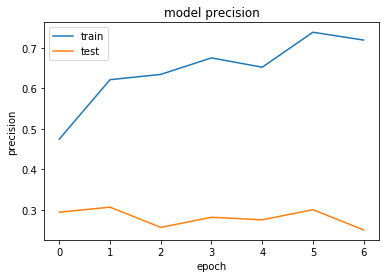


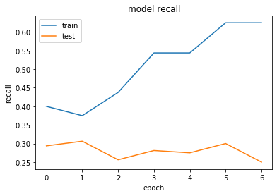


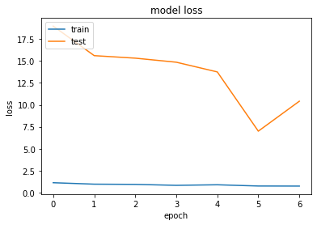


```python
#também não conseguimos uma boa precisão com o classificador NASNetMobile
#iremos então testar com o ResNet50V2
```


```python
from keras.applications import ResNet50V2
```


```python
conv_base = ResNet50V2(include_top=False)
for layer in conv_base.layers:
    layer.trainable = False
```


```python
x = conv_base.output
x = layers.GlobalAveragePooling2D()(x)
x = layers.Dense(128, activation='relu')(x) 
predictions = layers.Dense(qtde_classes, activation='softmax')(x)
model = Model(conv_base.input, predictions)
model.summary()
```

    Model: "model_4"
    __________________________________________________________________________________________________
    Layer (type)                    Output Shape         Param #     Connected to                     
    ==================================================================================================
    input_4 (InputLayer)            (None, None, None, 3 0                                            
    __________________________________________________________________________________________________
    conv1_pad (ZeroPadding2D)       (None, None, None, 3 0           input_4[0][0]                    
    __________________________________________________________________________________________________
    conv1_conv (Conv2D)             (None, None, None, 6 9472        conv1_pad[0][0]                  
    __________________________________________________________________________________________________
    pool1_pad (ZeroPadding2D)       (None, None, None, 6 0           conv1_conv[0][0]                 
    __________________________________________________________________________________________________
    pool1_pool (MaxPooling2D)       (None, None, None, 6 0           pool1_pad[0][0]                  
    __________________________________________________________________________________________________
    conv2_block1_preact_bn (BatchNo (None, None, None, 6 256         pool1_pool[0][0]                 
    __________________________________________________________________________________________________
    conv2_block1_preact_relu (Activ (None, None, None, 6 0           conv2_block1_preact_bn[0][0]     
    __________________________________________________________________________________________________
    conv2_block1_1_conv (Conv2D)    (None, None, None, 6 4096        conv2_block1_preact_relu[0][0]   
    __________________________________________________________________________________________________
    conv2_block1_1_bn (BatchNormali (None, None, None, 6 256         conv2_block1_1_conv[0][0]        
    __________________________________________________________________________________________________
    conv2_block1_1_relu (Activation (None, None, None, 6 0           conv2_block1_1_bn[0][0]          
    __________________________________________________________________________________________________
    conv2_block1_2_pad (ZeroPadding (None, None, None, 6 0           conv2_block1_1_relu[0][0]        
    __________________________________________________________________________________________________
    conv2_block1_2_conv (Conv2D)    (None, None, None, 6 36864       conv2_block1_2_pad[0][0]         
    __________________________________________________________________________________________________
    conv2_block1_2_bn (BatchNormali (None, None, None, 6 256         conv2_block1_2_conv[0][0]        
    __________________________________________________________________________________________________
    conv2_block1_2_relu (Activation (None, None, None, 6 0           conv2_block1_2_bn[0][0]          
    __________________________________________________________________________________________________
    conv2_block1_0_conv (Conv2D)    (None, None, None, 2 16640       conv2_block1_preact_relu[0][0]   
    __________________________________________________________________________________________________
    conv2_block1_3_conv (Conv2D)    (None, None, None, 2 16640       conv2_block1_2_relu[0][0]        
    __________________________________________________________________________________________________
    conv2_block1_out (Add)          (None, None, None, 2 0           conv2_block1_0_conv[0][0]        
                                                                     conv2_block1_3_conv[0][0]        
    __________________________________________________________________________________________________
    conv2_block2_preact_bn (BatchNo (None, None, None, 2 1024        conv2_block1_out[0][0]           
    __________________________________________________________________________________________________
    conv2_block2_preact_relu (Activ (None, None, None, 2 0           conv2_block2_preact_bn[0][0]     
    __________________________________________________________________________________________________
    conv2_block2_1_conv (Conv2D)    (None, None, None, 6 16384       conv2_block2_preact_relu[0][0]   
    __________________________________________________________________________________________________
    conv2_block2_1_bn (BatchNormali (None, None, None, 6 256         conv2_block2_1_conv[0][0]        
    __________________________________________________________________________________________________
    conv2_block2_1_relu (Activation (None, None, None, 6 0           conv2_block2_1_bn[0][0]          
    __________________________________________________________________________________________________
    conv2_block2_2_pad (ZeroPadding (None, None, None, 6 0           conv2_block2_1_relu[0][0]        
    __________________________________________________________________________________________________
    conv2_block2_2_conv (Conv2D)    (None, None, None, 6 36864       conv2_block2_2_pad[0][0]         
    __________________________________________________________________________________________________
    conv2_block2_2_bn (BatchNormali (None, None, None, 6 256         conv2_block2_2_conv[0][0]        
    __________________________________________________________________________________________________
    conv2_block2_2_relu (Activation (None, None, None, 6 0           conv2_block2_2_bn[0][0]          
    __________________________________________________________________________________________________
    conv2_block2_3_conv (Conv2D)    (None, None, None, 2 16640       conv2_block2_2_relu[0][0]        
    __________________________________________________________________________________________________
    conv2_block2_out (Add)          (None, None, None, 2 0           conv2_block1_out[0][0]           
                                                                     conv2_block2_3_conv[0][0]        
    __________________________________________________________________________________________________
    conv2_block3_preact_bn (BatchNo (None, None, None, 2 1024        conv2_block2_out[0][0]           
    __________________________________________________________________________________________________
    conv2_block3_preact_relu (Activ (None, None, None, 2 0           conv2_block3_preact_bn[0][0]     
    __________________________________________________________________________________________________
    conv2_block3_1_conv (Conv2D)    (None, None, None, 6 16384       conv2_block3_preact_relu[0][0]   
    __________________________________________________________________________________________________
    conv2_block3_1_bn (BatchNormali (None, None, None, 6 256         conv2_block3_1_conv[0][0]        
    __________________________________________________________________________________________________
    conv2_block3_1_relu (Activation (None, None, None, 6 0           conv2_block3_1_bn[0][0]          
    __________________________________________________________________________________________________
    conv2_block3_2_pad (ZeroPadding (None, None, None, 6 0           conv2_block3_1_relu[0][0]        
    __________________________________________________________________________________________________
    conv2_block3_2_conv (Conv2D)    (None, None, None, 6 36864       conv2_block3_2_pad[0][0]         
    __________________________________________________________________________________________________
    conv2_block3_2_bn (BatchNormali (None, None, None, 6 256         conv2_block3_2_conv[0][0]        
    __________________________________________________________________________________________________
    conv2_block3_2_relu (Activation (None, None, None, 6 0           conv2_block3_2_bn[0][0]          
    __________________________________________________________________________________________________
    max_pooling2d_4 (MaxPooling2D)  (None, None, None, 2 0           conv2_block2_out[0][0]           
    __________________________________________________________________________________________________
    conv2_block3_3_conv (Conv2D)    (None, None, None, 2 16640       conv2_block3_2_relu[0][0]        
    __________________________________________________________________________________________________
    conv2_block3_out (Add)          (None, None, None, 2 0           max_pooling2d_4[0][0]            
                                                                     conv2_block3_3_conv[0][0]        
    __________________________________________________________________________________________________
    conv3_block1_preact_bn (BatchNo (None, None, None, 2 1024        conv2_block3_out[0][0]           
    __________________________________________________________________________________________________
    conv3_block1_preact_relu (Activ (None, None, None, 2 0           conv3_block1_preact_bn[0][0]     
    __________________________________________________________________________________________________
    conv3_block1_1_conv (Conv2D)    (None, None, None, 1 32768       conv3_block1_preact_relu[0][0]   
    __________________________________________________________________________________________________
    conv3_block1_1_bn (BatchNormali (None, None, None, 1 512         conv3_block1_1_conv[0][0]        
    __________________________________________________________________________________________________
    conv3_block1_1_relu (Activation (None, None, None, 1 0           conv3_block1_1_bn[0][0]          
    __________________________________________________________________________________________________
    conv3_block1_2_pad (ZeroPadding (None, None, None, 1 0           conv3_block1_1_relu[0][0]        
    __________________________________________________________________________________________________
    conv3_block1_2_conv (Conv2D)    (None, None, None, 1 147456      conv3_block1_2_pad[0][0]         
    __________________________________________________________________________________________________
    conv3_block1_2_bn (BatchNormali (None, None, None, 1 512         conv3_block1_2_conv[0][0]        
    __________________________________________________________________________________________________
    conv3_block1_2_relu (Activation (None, None, None, 1 0           conv3_block1_2_bn[0][0]          
    __________________________________________________________________________________________________
    conv3_block1_0_conv (Conv2D)    (None, None, None, 5 131584      conv3_block1_preact_relu[0][0]   
    __________________________________________________________________________________________________
    conv3_block1_3_conv (Conv2D)    (None, None, None, 5 66048       conv3_block1_2_relu[0][0]        
    __________________________________________________________________________________________________
    conv3_block1_out (Add)          (None, None, None, 5 0           conv3_block1_0_conv[0][0]        
                                                                     conv3_block1_3_conv[0][0]        
    __________________________________________________________________________________________________
    conv3_block2_preact_bn (BatchNo (None, None, None, 5 2048        conv3_block1_out[0][0]           
    __________________________________________________________________________________________________
    conv3_block2_preact_relu (Activ (None, None, None, 5 0           conv3_block2_preact_bn[0][0]     
    __________________________________________________________________________________________________
    conv3_block2_1_conv (Conv2D)    (None, None, None, 1 65536       conv3_block2_preact_relu[0][0]   
    __________________________________________________________________________________________________
    conv3_block2_1_bn (BatchNormali (None, None, None, 1 512         conv3_block2_1_conv[0][0]        
    __________________________________________________________________________________________________
    conv3_block2_1_relu (Activation (None, None, None, 1 0           conv3_block2_1_bn[0][0]          
    __________________________________________________________________________________________________
    conv3_block2_2_pad (ZeroPadding (None, None, None, 1 0           conv3_block2_1_relu[0][0]        
    __________________________________________________________________________________________________
    conv3_block2_2_conv (Conv2D)    (None, None, None, 1 147456      conv3_block2_2_pad[0][0]         
    __________________________________________________________________________________________________
    conv3_block2_2_bn (BatchNormali (None, None, None, 1 512         conv3_block2_2_conv[0][0]        
    __________________________________________________________________________________________________
    conv3_block2_2_relu (Activation (None, None, None, 1 0           conv3_block2_2_bn[0][0]          
    __________________________________________________________________________________________________
    conv3_block2_3_conv (Conv2D)    (None, None, None, 5 66048       conv3_block2_2_relu[0][0]        
    __________________________________________________________________________________________________
    conv3_block2_out (Add)          (None, None, None, 5 0           conv3_block1_out[0][0]           
                                                                     conv3_block2_3_conv[0][0]        
    __________________________________________________________________________________________________
    conv3_block3_preact_bn (BatchNo (None, None, None, 5 2048        conv3_block2_out[0][0]           
    __________________________________________________________________________________________________
    conv3_block3_preact_relu (Activ (None, None, None, 5 0           conv3_block3_preact_bn[0][0]     
    __________________________________________________________________________________________________
    conv3_block3_1_conv (Conv2D)    (None, None, None, 1 65536       conv3_block3_preact_relu[0][0]   
    __________________________________________________________________________________________________
    conv3_block3_1_bn (BatchNormali (None, None, None, 1 512         conv3_block3_1_conv[0][0]        
    __________________________________________________________________________________________________
    conv3_block3_1_relu (Activation (None, None, None, 1 0           conv3_block3_1_bn[0][0]          
    __________________________________________________________________________________________________
    conv3_block3_2_pad (ZeroPadding (None, None, None, 1 0           conv3_block3_1_relu[0][0]        
    __________________________________________________________________________________________________
    conv3_block3_2_conv (Conv2D)    (None, None, None, 1 147456      conv3_block3_2_pad[0][0]         
    __________________________________________________________________________________________________
    conv3_block3_2_bn (BatchNormali (None, None, None, 1 512         conv3_block3_2_conv[0][0]        
    __________________________________________________________________________________________________
    conv3_block3_2_relu (Activation (None, None, None, 1 0           conv3_block3_2_bn[0][0]          
    __________________________________________________________________________________________________
    conv3_block3_3_conv (Conv2D)    (None, None, None, 5 66048       conv3_block3_2_relu[0][0]        
    __________________________________________________________________________________________________
    conv3_block3_out (Add)          (None, None, None, 5 0           conv3_block2_out[0][0]           
                                                                     conv3_block3_3_conv[0][0]        
    __________________________________________________________________________________________________
    conv3_block4_preact_bn (BatchNo (None, None, None, 5 2048        conv3_block3_out[0][0]           
    __________________________________________________________________________________________________
    conv3_block4_preact_relu (Activ (None, None, None, 5 0           conv3_block4_preact_bn[0][0]     
    __________________________________________________________________________________________________
    conv3_block4_1_conv (Conv2D)    (None, None, None, 1 65536       conv3_block4_preact_relu[0][0]   
    __________________________________________________________________________________________________
    conv3_block4_1_bn (BatchNormali (None, None, None, 1 512         conv3_block4_1_conv[0][0]        
    __________________________________________________________________________________________________
    conv3_block4_1_relu (Activation (None, None, None, 1 0           conv3_block4_1_bn[0][0]          
    __________________________________________________________________________________________________
    conv3_block4_2_pad (ZeroPadding (None, None, None, 1 0           conv3_block4_1_relu[0][0]        
    __________________________________________________________________________________________________
    conv3_block4_2_conv (Conv2D)    (None, None, None, 1 147456      conv3_block4_2_pad[0][0]         
    __________________________________________________________________________________________________
    conv3_block4_2_bn (BatchNormali (None, None, None, 1 512         conv3_block4_2_conv[0][0]        
    __________________________________________________________________________________________________
    conv3_block4_2_relu (Activation (None, None, None, 1 0           conv3_block4_2_bn[0][0]          
    __________________________________________________________________________________________________
    max_pooling2d_5 (MaxPooling2D)  (None, None, None, 5 0           conv3_block3_out[0][0]           
    __________________________________________________________________________________________________
    conv3_block4_3_conv (Conv2D)    (None, None, None, 5 66048       conv3_block4_2_relu[0][0]        
    __________________________________________________________________________________________________
    conv3_block4_out (Add)          (None, None, None, 5 0           max_pooling2d_5[0][0]            
                                                                     conv3_block4_3_conv[0][0]        
    __________________________________________________________________________________________________
    conv4_block1_preact_bn (BatchNo (None, None, None, 5 2048        conv3_block4_out[0][0]           
    __________________________________________________________________________________________________
    conv4_block1_preact_relu (Activ (None, None, None, 5 0           conv4_block1_preact_bn[0][0]     
    __________________________________________________________________________________________________
    conv4_block1_1_conv (Conv2D)    (None, None, None, 2 131072      conv4_block1_preact_relu[0][0]   
    __________________________________________________________________________________________________
    conv4_block1_1_bn (BatchNormali (None, None, None, 2 1024        conv4_block1_1_conv[0][0]        
    __________________________________________________________________________________________________
    conv4_block1_1_relu (Activation (None, None, None, 2 0           conv4_block1_1_bn[0][0]          
    __________________________________________________________________________________________________
    conv4_block1_2_pad (ZeroPadding (None, None, None, 2 0           conv4_block1_1_relu[0][0]        
    __________________________________________________________________________________________________
    conv4_block1_2_conv (Conv2D)    (None, None, None, 2 589824      conv4_block1_2_pad[0][0]         
    __________________________________________________________________________________________________
    conv4_block1_2_bn (BatchNormali (None, None, None, 2 1024        conv4_block1_2_conv[0][0]        
    __________________________________________________________________________________________________
    conv4_block1_2_relu (Activation (None, None, None, 2 0           conv4_block1_2_bn[0][0]          
    __________________________________________________________________________________________________
    conv4_block1_0_conv (Conv2D)    (None, None, None, 1 525312      conv4_block1_preact_relu[0][0]   
    __________________________________________________________________________________________________
    conv4_block1_3_conv (Conv2D)    (None, None, None, 1 263168      conv4_block1_2_relu[0][0]        
    __________________________________________________________________________________________________
    conv4_block1_out (Add)          (None, None, None, 1 0           conv4_block1_0_conv[0][0]        
                                                                     conv4_block1_3_conv[0][0]        
    __________________________________________________________________________________________________
    conv4_block2_preact_bn (BatchNo (None, None, None, 1 4096        conv4_block1_out[0][0]           
    __________________________________________________________________________________________________
    conv4_block2_preact_relu (Activ (None, None, None, 1 0           conv4_block2_preact_bn[0][0]     
    __________________________________________________________________________________________________
    conv4_block2_1_conv (Conv2D)    (None, None, None, 2 262144      conv4_block2_preact_relu[0][0]   
    __________________________________________________________________________________________________
    conv4_block2_1_bn (BatchNormali (None, None, None, 2 1024        conv4_block2_1_conv[0][0]        
    __________________________________________________________________________________________________
    conv4_block2_1_relu (Activation (None, None, None, 2 0           conv4_block2_1_bn[0][0]          
    __________________________________________________________________________________________________
    conv4_block2_2_pad (ZeroPadding (None, None, None, 2 0           conv4_block2_1_relu[0][0]        
    __________________________________________________________________________________________________
    conv4_block2_2_conv (Conv2D)    (None, None, None, 2 589824      conv4_block2_2_pad[0][0]         
    __________________________________________________________________________________________________
    conv4_block2_2_bn (BatchNormali (None, None, None, 2 1024        conv4_block2_2_conv[0][0]        
    __________________________________________________________________________________________________
    conv4_block2_2_relu (Activation (None, None, None, 2 0           conv4_block2_2_bn[0][0]          
    __________________________________________________________________________________________________
    conv4_block2_3_conv (Conv2D)    (None, None, None, 1 263168      conv4_block2_2_relu[0][0]        
    __________________________________________________________________________________________________
    conv4_block2_out (Add)          (None, None, None, 1 0           conv4_block1_out[0][0]           
                                                                     conv4_block2_3_conv[0][0]        
    __________________________________________________________________________________________________
    conv4_block3_preact_bn (BatchNo (None, None, None, 1 4096        conv4_block2_out[0][0]           
    __________________________________________________________________________________________________
    conv4_block3_preact_relu (Activ (None, None, None, 1 0           conv4_block3_preact_bn[0][0]     
    __________________________________________________________________________________________________
    conv4_block3_1_conv (Conv2D)    (None, None, None, 2 262144      conv4_block3_preact_relu[0][0]   
    __________________________________________________________________________________________________
    conv4_block3_1_bn (BatchNormali (None, None, None, 2 1024        conv4_block3_1_conv[0][0]        
    __________________________________________________________________________________________________
    conv4_block3_1_relu (Activation (None, None, None, 2 0           conv4_block3_1_bn[0][0]          
    __________________________________________________________________________________________________
    conv4_block3_2_pad (ZeroPadding (None, None, None, 2 0           conv4_block3_1_relu[0][0]        
    __________________________________________________________________________________________________
    conv4_block3_2_conv (Conv2D)    (None, None, None, 2 589824      conv4_block3_2_pad[0][0]         
    __________________________________________________________________________________________________
    conv4_block3_2_bn (BatchNormali (None, None, None, 2 1024        conv4_block3_2_conv[0][0]        
    __________________________________________________________________________________________________
    conv4_block3_2_relu (Activation (None, None, None, 2 0           conv4_block3_2_bn[0][0]          
    __________________________________________________________________________________________________
    conv4_block3_3_conv (Conv2D)    (None, None, None, 1 263168      conv4_block3_2_relu[0][0]        
    __________________________________________________________________________________________________
    conv4_block3_out (Add)          (None, None, None, 1 0           conv4_block2_out[0][0]           
                                                                     conv4_block3_3_conv[0][0]        
    __________________________________________________________________________________________________
    conv4_block4_preact_bn (BatchNo (None, None, None, 1 4096        conv4_block3_out[0][0]           
    __________________________________________________________________________________________________
    conv4_block4_preact_relu (Activ (None, None, None, 1 0           conv4_block4_preact_bn[0][0]     
    __________________________________________________________________________________________________
    conv4_block4_1_conv (Conv2D)    (None, None, None, 2 262144      conv4_block4_preact_relu[0][0]   
    __________________________________________________________________________________________________
    conv4_block4_1_bn (BatchNormali (None, None, None, 2 1024        conv4_block4_1_conv[0][0]        
    __________________________________________________________________________________________________
    conv4_block4_1_relu (Activation (None, None, None, 2 0           conv4_block4_1_bn[0][0]          
    __________________________________________________________________________________________________
    conv4_block4_2_pad (ZeroPadding (None, None, None, 2 0           conv4_block4_1_relu[0][0]        
    __________________________________________________________________________________________________
    conv4_block4_2_conv (Conv2D)    (None, None, None, 2 589824      conv4_block4_2_pad[0][0]         
    __________________________________________________________________________________________________
    conv4_block4_2_bn (BatchNormali (None, None, None, 2 1024        conv4_block4_2_conv[0][0]        
    __________________________________________________________________________________________________
    conv4_block4_2_relu (Activation (None, None, None, 2 0           conv4_block4_2_bn[0][0]          
    __________________________________________________________________________________________________
    conv4_block4_3_conv (Conv2D)    (None, None, None, 1 263168      conv4_block4_2_relu[0][0]        
    __________________________________________________________________________________________________
    conv4_block4_out (Add)          (None, None, None, 1 0           conv4_block3_out[0][0]           
                                                                     conv4_block4_3_conv[0][0]        
    __________________________________________________________________________________________________
    conv4_block5_preact_bn (BatchNo (None, None, None, 1 4096        conv4_block4_out[0][0]           
    __________________________________________________________________________________________________
    conv4_block5_preact_relu (Activ (None, None, None, 1 0           conv4_block5_preact_bn[0][0]     
    __________________________________________________________________________________________________
    conv4_block5_1_conv (Conv2D)    (None, None, None, 2 262144      conv4_block5_preact_relu[0][0]   
    __________________________________________________________________________________________________
    conv4_block5_1_bn (BatchNormali (None, None, None, 2 1024        conv4_block5_1_conv[0][0]        
    __________________________________________________________________________________________________
    conv4_block5_1_relu (Activation (None, None, None, 2 0           conv4_block5_1_bn[0][0]          
    __________________________________________________________________________________________________
    conv4_block5_2_pad (ZeroPadding (None, None, None, 2 0           conv4_block5_1_relu[0][0]        
    __________________________________________________________________________________________________
    conv4_block5_2_conv (Conv2D)    (None, None, None, 2 589824      conv4_block5_2_pad[0][0]         
    __________________________________________________________________________________________________
    conv4_block5_2_bn (BatchNormali (None, None, None, 2 1024        conv4_block5_2_conv[0][0]        
    __________________________________________________________________________________________________
    conv4_block5_2_relu (Activation (None, None, None, 2 0           conv4_block5_2_bn[0][0]          
    __________________________________________________________________________________________________
    conv4_block5_3_conv (Conv2D)    (None, None, None, 1 263168      conv4_block5_2_relu[0][0]        
    __________________________________________________________________________________________________
    conv4_block5_out (Add)          (None, None, None, 1 0           conv4_block4_out[0][0]           
                                                                     conv4_block5_3_conv[0][0]        
    __________________________________________________________________________________________________
    conv4_block6_preact_bn (BatchNo (None, None, None, 1 4096        conv4_block5_out[0][0]           
    __________________________________________________________________________________________________
    conv4_block6_preact_relu (Activ (None, None, None, 1 0           conv4_block6_preact_bn[0][0]     
    __________________________________________________________________________________________________
    conv4_block6_1_conv (Conv2D)    (None, None, None, 2 262144      conv4_block6_preact_relu[0][0]   
    __________________________________________________________________________________________________
    conv4_block6_1_bn (BatchNormali (None, None, None, 2 1024        conv4_block6_1_conv[0][0]        
    __________________________________________________________________________________________________
    conv4_block6_1_relu (Activation (None, None, None, 2 0           conv4_block6_1_bn[0][0]          
    __________________________________________________________________________________________________
    conv4_block6_2_pad (ZeroPadding (None, None, None, 2 0           conv4_block6_1_relu[0][0]        
    __________________________________________________________________________________________________
    conv4_block6_2_conv (Conv2D)    (None, None, None, 2 589824      conv4_block6_2_pad[0][0]         
    __________________________________________________________________________________________________
    conv4_block6_2_bn (BatchNormali (None, None, None, 2 1024        conv4_block6_2_conv[0][0]        
    __________________________________________________________________________________________________
    conv4_block6_2_relu (Activation (None, None, None, 2 0           conv4_block6_2_bn[0][0]          
    __________________________________________________________________________________________________
    max_pooling2d_6 (MaxPooling2D)  (None, None, None, 1 0           conv4_block5_out[0][0]           
    __________________________________________________________________________________________________
    conv4_block6_3_conv (Conv2D)    (None, None, None, 1 263168      conv4_block6_2_relu[0][0]        
    __________________________________________________________________________________________________
    conv4_block6_out (Add)          (None, None, None, 1 0           max_pooling2d_6[0][0]            
                                                                     conv4_block6_3_conv[0][0]        
    __________________________________________________________________________________________________
    conv5_block1_preact_bn (BatchNo (None, None, None, 1 4096        conv4_block6_out[0][0]           
    __________________________________________________________________________________________________
    conv5_block1_preact_relu (Activ (None, None, None, 1 0           conv5_block1_preact_bn[0][0]     
    __________________________________________________________________________________________________
    conv5_block1_1_conv (Conv2D)    (None, None, None, 5 524288      conv5_block1_preact_relu[0][0]   
    __________________________________________________________________________________________________
    conv5_block1_1_bn (BatchNormali (None, None, None, 5 2048        conv5_block1_1_conv[0][0]        
    __________________________________________________________________________________________________
    conv5_block1_1_relu (Activation (None, None, None, 5 0           conv5_block1_1_bn[0][0]          
    __________________________________________________________________________________________________
    conv5_block1_2_pad (ZeroPadding (None, None, None, 5 0           conv5_block1_1_relu[0][0]        
    __________________________________________________________________________________________________
    conv5_block1_2_conv (Conv2D)    (None, None, None, 5 2359296     conv5_block1_2_pad[0][0]         
    __________________________________________________________________________________________________
    conv5_block1_2_bn (BatchNormali (None, None, None, 5 2048        conv5_block1_2_conv[0][0]        
    __________________________________________________________________________________________________
    conv5_block1_2_relu (Activation (None, None, None, 5 0           conv5_block1_2_bn[0][0]          
    __________________________________________________________________________________________________
    conv5_block1_0_conv (Conv2D)    (None, None, None, 2 2099200     conv5_block1_preact_relu[0][0]   
    __________________________________________________________________________________________________
    conv5_block1_3_conv (Conv2D)    (None, None, None, 2 1050624     conv5_block1_2_relu[0][0]        
    __________________________________________________________________________________________________
    conv5_block1_out (Add)          (None, None, None, 2 0           conv5_block1_0_conv[0][0]        
                                                                     conv5_block1_3_conv[0][0]        
    __________________________________________________________________________________________________
    conv5_block2_preact_bn (BatchNo (None, None, None, 2 8192        conv5_block1_out[0][0]           
    __________________________________________________________________________________________________
    conv5_block2_preact_relu (Activ (None, None, None, 2 0           conv5_block2_preact_bn[0][0]     
    __________________________________________________________________________________________________
    conv5_block2_1_conv (Conv2D)    (None, None, None, 5 1048576     conv5_block2_preact_relu[0][0]   
    __________________________________________________________________________________________________
    conv5_block2_1_bn (BatchNormali (None, None, None, 5 2048        conv5_block2_1_conv[0][0]        
    __________________________________________________________________________________________________
    conv5_block2_1_relu (Activation (None, None, None, 5 0           conv5_block2_1_bn[0][0]          
    __________________________________________________________________________________________________
    conv5_block2_2_pad (ZeroPadding (None, None, None, 5 0           conv5_block2_1_relu[0][0]        
    __________________________________________________________________________________________________
    conv5_block2_2_conv (Conv2D)    (None, None, None, 5 2359296     conv5_block2_2_pad[0][0]         
    __________________________________________________________________________________________________
    conv5_block2_2_bn (BatchNormali (None, None, None, 5 2048        conv5_block2_2_conv[0][0]        
    __________________________________________________________________________________________________
    conv5_block2_2_relu (Activation (None, None, None, 5 0           conv5_block2_2_bn[0][0]          
    __________________________________________________________________________________________________
    conv5_block2_3_conv (Conv2D)    (None, None, None, 2 1050624     conv5_block2_2_relu[0][0]        
    __________________________________________________________________________________________________
    conv5_block2_out (Add)          (None, None, None, 2 0           conv5_block1_out[0][0]           
                                                                     conv5_block2_3_conv[0][0]        
    __________________________________________________________________________________________________
    conv5_block3_preact_bn (BatchNo (None, None, None, 2 8192        conv5_block2_out[0][0]           
    __________________________________________________________________________________________________
    conv5_block3_preact_relu (Activ (None, None, None, 2 0           conv5_block3_preact_bn[0][0]     
    __________________________________________________________________________________________________
    conv5_block3_1_conv (Conv2D)    (None, None, None, 5 1048576     conv5_block3_preact_relu[0][0]   
    __________________________________________________________________________________________________
    conv5_block3_1_bn (BatchNormali (None, None, None, 5 2048        conv5_block3_1_conv[0][0]        
    __________________________________________________________________________________________________
    conv5_block3_1_relu (Activation (None, None, None, 5 0           conv5_block3_1_bn[0][0]          
    __________________________________________________________________________________________________
    conv5_block3_2_pad (ZeroPadding (None, None, None, 5 0           conv5_block3_1_relu[0][0]        
    __________________________________________________________________________________________________
    conv5_block3_2_conv (Conv2D)    (None, None, None, 5 2359296     conv5_block3_2_pad[0][0]         
    __________________________________________________________________________________________________
    conv5_block3_2_bn (BatchNormali (None, None, None, 5 2048        conv5_block3_2_conv[0][0]        
    __________________________________________________________________________________________________
    conv5_block3_2_relu (Activation (None, None, None, 5 0           conv5_block3_2_bn[0][0]          
    __________________________________________________________________________________________________
    conv5_block3_3_conv (Conv2D)    (None, None, None, 2 1050624     conv5_block3_2_relu[0][0]        
    __________________________________________________________________________________________________
    conv5_block3_out (Add)          (None, None, None, 2 0           conv5_block2_out[0][0]           
                                                                     conv5_block3_3_conv[0][0]        
    __________________________________________________________________________________________________
    post_bn (BatchNormalization)    (None, None, None, 2 8192        conv5_block3_out[0][0]           
    __________________________________________________________________________________________________
    post_relu (Activation)          (None, None, None, 2 0           post_bn[0][0]                    
    __________________________________________________________________________________________________
    global_average_pooling2d_4 (Glo (None, 2048)         0           post_relu[0][0]                  
    __________________________________________________________________________________________________
    dense_7 (Dense)                 (None, 128)          262272      global_average_pooling2d_4[0][0] 
    __________________________________________________________________________________________________
    dense_8 (Dense)                 (None, 3)            387         dense_7[0][0]                    
    ==================================================================================================
    Total params: 23,827,459
    Trainable params: 262,659
    Non-trainable params: 23,564,800
    __________________________________________________________________________________________________
    


```python
optimizer = keras.optimizers.Adam()
model.compile(loss='categorical_crossentropy', optimizer=optimizer, metrics=[precision_score, recall_score, f1_score])

history = model.fit_generator(generator=train_generator, 
                              epochs=qtde_epocas, 
                              validation_steps=5, 
                              steps_per_epoch=5, 
                              validation_data=val_generator)
```

    Epoch 1/7
    5/5 [==============================] - 157s 31s/step - loss: 1.0130 - precision_score: 0.5180 - recall_score: 0.3125 - f1_score: 0.3892 - val_loss: 95.2435 - val_precision_score: 0.2937 - val_recall_score: 0.2937 - val_f1_score: 0.2937
    Epoch 2/7
    5/5 [==============================] - 141s 28s/step - loss: 0.7721 - precision_score: 0.7286 - recall_score: 0.5500 - f1_score: 0.6238 - val_loss: 151.6173 - val_precision_score: 0.1688 - val_recall_score: 0.1688 - val_f1_score: 0.1687
    Epoch 3/7
    5/5 [==============================] - 140s 28s/step - loss: 0.6354 - precision_score: 0.7821 - recall_score: 0.6750 - f1_score: 0.7240 - val_loss: 159.3261 - val_precision_score: 0.2750 - val_recall_score: 0.2750 - val_f1_score: 0.2750
    Epoch 4/7
    5/5 [==============================] - 150s 30s/step - loss: 0.5965 - precision_score: 0.7993 - recall_score: 0.7375 - f1_score: 0.7667 - val_loss: 209.5939 - val_precision_score: 0.2375 - val_recall_score: 0.2375 - val_f1_score: 0.2375
    Epoch 5/7
    5/5 [==============================] - 159s 32s/step - loss: 0.6633 - precision_score: 0.7624 - recall_score: 0.7063 - f1_score: 0.7327 - val_loss: 173.2886 - val_precision_score: 0.2438 - val_recall_score: 0.2438 - val_f1_score: 0.2437
    Epoch 6/7
    5/5 [==============================] - 153s 31s/step - loss: 0.5837 - precision_score: 0.7653 - recall_score: 0.7375 - f1_score: 0.7510 - val_loss: 164.0870 - val_precision_score: 0.2875 - val_recall_score: 0.2875 - val_f1_score: 0.2875
    Epoch 7/7
    5/5 [==============================] - 150s 30s/step - loss: 0.6837 - precision_score: 0.7409 - recall_score: 0.7188 - f1_score: 0.7295 - val_loss: 148.1173 - val_precision_score: 0.3187 - val_recall_score: 0.3187 - val_f1_score: 0.3187
    


```python
# Exibindo dados de Precisão
plt.plot(history.history['precision_score'])
plt.plot(history.history['val_precision_score'])
plt.title('model precision')
plt.ylabel('precision')
plt.xlabel('epoch')
plt.legend(['train', 'test'], loc='upper left')
plt.show()

# Exibindo dados de Sensibilidade
plt.plot(history.history['recall_score'])
plt.plot(history.history['val_recall_score'])
plt.title('model recall')
plt.ylabel('recall')
plt.xlabel('epoch')
plt.legend(['train', 'test'], loc='upper left')
plt.show()

# Exibindo dados de F1 Score
plt.plot(history.history['f1_score'])
plt.plot(history.history['val_f1_score'])
plt.title('model f1_score')
plt.ylabel('f1_score')
plt.xlabel('epoch')
plt.legend(['train', 'test'], loc='upper left')
plt.show()

# Exibindo dados de Perda
plt.plot(history.history['loss'])
plt.plot(history.history['val_loss'])
plt.title('model loss')
plt.ylabel('loss')
plt.xlabel('epoch')
plt.legend(['train', 'test'], loc='upper left')
plt.show()
```


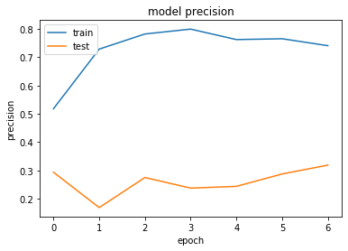


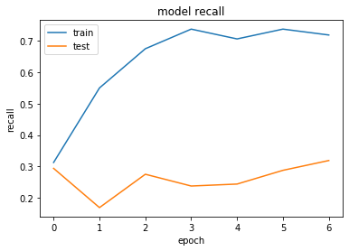


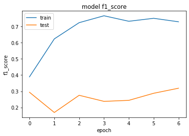


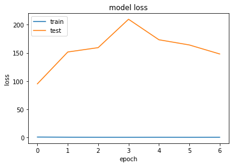


```python
#também não conseguimos uma boa precisão com o classificador ResNet50V2
```

### 4.8.1 Conclusões sobre a abordagem extra

Como seu modelo performou em comparação com os demais modelos anteriores? Justifique sua resposta levando em consideração a arquitetura respectiva.

**Resposta**: Fizemos testes com 6 diferentes arquiteturas. Os resultados encontrados foram valores bem abaixo das 3 arquiteturas anteriormente utilizadas. Pela documentação do Keras, reparamos que tanto a VGG16, como a VGG19 tem uma quantidade de parâmetros bem maiores do que as outras, porém, a ResNet50 até que tem uma quantidade de parâmetros próximas às outras arquiteturas, assim como valores de acurácias semelhantes, mas mesmo assim, os resultados ficaram bem aquém do obtidos anteriormente. A conclusão que tiramos de tudo isso é que ou fizemos algo errado ou então, estas outras arquiteturas não são especialistas em trabalhar com imagens, tanto quanto as 3 anteriores.

| Modelo           | Precisão (*Precision*) | Sensibilidade (*Recall*) | F1-Score |
|------------------|----------|---------------|----------|
| ResNet50         | 78,70 %  | 61,87 %       | 69,28 %  |
| VGG16            | 82,96 %  | 80,62 %       | 81,78 %  |
| VGG19            | 79,52 %  | 78,12 %       | 78,81 %  |
| Xception         | 41,25 %  | 41,25 %       | 41,25 %  |
| InceptionV3      | 40,62 %  | 40,62 %       | 40,62 %  |
| InceptionResNetV2| 40,62 %  | 40,62 %       | 40,62 %  |
| MobileNet        | 37,71 %  | 24,38 %       | 29,58 %  |
| DenseNet121      | 21,51 %  | 21,25 %       | 21,38 %  |
| NASNetMobile     | 25,00 %  | 25,00 %       | 25,00 %  |
| ResNet50V2       | 31,87 %  | 31,87 %       | 31,87 %  |


```python
#Professor Michel, muito obrigado pelas suas aulas, pelas suas excelentes explicações e por todo aprendizado 
#que nos proporcionou.
```


```python

```
